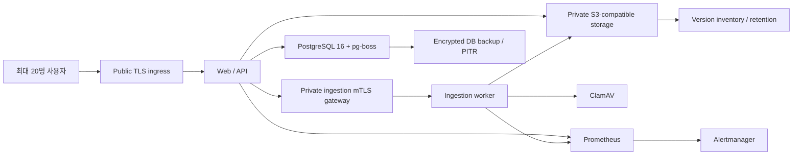

# AMIC Vault 소규모 로펌(최대 20명) OSS 조정 실행계획

상태: **Canonical SF20 execution profile — `PACK-SF20-00` 등록**

기준일: 2026-07-23

코드 기준: `origin/main@287c9e3f52b2b8fbc0b6ade8bab5d56d47cf80e9`
상위 계획:

- `docs/architecture/enterprise-dms-oss-terra-tuw-execution-plan-main-2026-07-21.md`
- `docs/architecture/enterprise-dms-oss-uplift-plan-main-2026-07-21.md`

이 문서는 상위 30개 sub-PACK·111개 TUW의 Constitution, 권한, 감사, 원본 불변,
보안 Gate를 약화하지 않는다. 최대 20명 규모에 맞춰 **앞으로 구현할 순서와 운영
복잡도만 축소**한다. 기존 TUW를 삭제하거나 완료로 간주하지 않고, 즉시 실행,
조건부 실행, 장기 보류로 재분류한다.

`docs/package/**`는 수정하지 않는다. 이 문서의 `PROPOSED-SF20-*` 표기는 원
계획 결과를 추적하기 위해 유지한다. 실행 canonical ID는
`security/small-firm-20-profile.yml`의 7개 PACK·33개 TUW이며, 첫 PACK은
충돌 검사를 거쳐 `docs/execution/TUW_SF20_SMALL_FIRM_PROFILE.md`에
등록되었다. 후속 PACK은 직전 PACK의 exact-head merge 뒤 순차 등록한다.

---

## 1. 달성 목표

최대 20명의 변호사·직원이 사용하는 단일 로펌 tenant를 기본 운영 단위로 삼아
다음 상태를 달성한다.

1. Matter 권한, ethical wall, RLS, fail-closed, audit append-only,
   immutable original은 현재 수준을 유지한다.
2. API와 ingestion worker 사이에는 private gateway mTLS를 실제 배포하고,
   worker 직접 접근과 production loopback identity를 네트워크와 애플리케이션
   양쪽에서 차단한다.
3. 악성·손상 문서가 parser 또는 호스트 전체를 고갈시키지 못하도록 ingestion
   container의 자원·파일시스템·권한·egress를 제한한다.
4. 운영자가 한 명이어도 백업 상태, queue 적체, scanner freshness, 감사 실패를
   발견하고 4시간 안에 복구를 시작할 수 있게 한다.
5. 한 대의 애플리케이션 노드와 managed PostgreSQL/S3 조합으로 시작하되,
   backup/restore와 on-prem 이식성은 유지한다.
6. 사용량으로 필요성이 증명되지 않은 OpenSearch, WOPI, PgBouncer, Keycloak,
   Kubernetes, service mesh, Presidio, full tracing/SIEM은 배포하지 않는다.

### 완료 후 기대하는 운영 결과

| 영역 | 목표 |
|---|---|
| 사용자 | 최대 20 named users, 12 simultaneous active sessions |
| 요청 burst | 25 concurrent API requests, 8 simultaneous preview/downloads |
| ingestion | 최대 4 concurrent parser jobs; queue로 초과분 흡수 |
| 기준 데이터량 | 500,000 document versions, 2 TiB object storage |
| 일반 API | p95 1초 이하 |
| 권한 결합 검색 | p95 2초 이하 |
| preview first byte | p95 3초 이하 |
| availability | 월 99.5%, 계획된 유지보수 제외 |
| DB RPO/RTO | RPO 1시간, RTO 4시간 |
| 원본 파일 | object versioning + retention/Object Lock + hash readback |

수치는 제품 보증치가 아니라 SF20 검증 fixture의 기본 부하다. 실제 측정 결과가
초과하면 conditional PACK의 trigger로 사용한다.

---

## 2. 아키텍처 결정

### 2.1 유지할 것과 단순화할 것

| 구분 | 결정 | 이유 |
|---|---|---|
| 권한·감사 | 현재 Constitution 그대로 유지 | 사용자 수와 무관한 법률문서 핵심 통제 |
| DB | PostgreSQL 16 shared DB + RLS 유지 | 이미 authority이며 20명 규모에 충분 |
| Queue | pg-boss 유지 | Redis/Kafka 운영 불필요 |
| 검색 | PostgreSQL FTS/ngram 유지 | 현재 규모에서 OpenSearch 운영비가 더 큼 |
| Object storage | managed S3-compatible private endpoint 우선 | 직접 MinIO 운영보다 장애면 감소 |
| 배포 | 1 application node + managed DB/S3 | 소규모 기본 profile |
| 실행 | Docker Compose production profile + 얇은 Ansible | Kubernetes 불필요, on-prem 이식성 유지 |
| ingestion gateway | NGINX OSS 등 검증된 mTLS reverse proxy 1개 | service mesh 없이 peer identity 강제 |
| parser | 기존 LibreOffice/Tesseract/내장 parser 유지 | 후보 3종 동시 도입 금지 |
| monitoring | 기존 metrics + Prometheus + Alertmanager | full OTel/Jaeger/SIEM보다 운영 부담이 낮음 |
| 인증 | 자체 session + TOTP MFA가 기본 | 20명 운영에 별도 broker 불필요 |
| SSO | 필요 시 direct Entra OIDC만 조건부 | Keycloak 운영 주체가 없으면 도입 금지 |
| 백업 | provider PITR + portable logical backup + object inventory | HA cluster보다 복구 가능성을 우선 |

### 2.2 기본 production topology



고정 경계:

- ingestion worker port는 host/public network에 publish하지 않는다.
- API/API-worker만 client certificate로 gateway에 접속한다.
- gateway는 caller-provided identity headers를 제거한 뒤, 검증한
  `amic-vault-api` subject와 `amic-vault-ingestion` audience만 주입한다.
- worker는 gateway network에서 온 요청만 받으며 application-level expiry,
  nonce, replay 검증을 추가로 수행한다.
- managed PostgreSQL과 object storage는 private endpoint 또는 명시된
  egress allowlist로만 접근한다.
- monitoring endpoint와 dashboard는 public ingress에 연결하지 않는다.

### 2.3 소규모라고 줄이지 않는 통제

- Permission-before-search와 Permission-before-AI
- ethical wall deny precedence
- `tenant_id NOT NULL`, RLS, FORCE RLS, runtime-role 검증
- audit insert 실패 시 본 행위 rollback
- 원본 덮어쓰기 금지와 object version/hash 결합
- quarantine-before-promotion과 malware fail-closed
- production loopback identity 거부
- backup restore readback과 정기 drill
- 로그·metric·evidence에 문서 본문, 파일명, token, object key, 자격증명 미기록

---

## 3. 남은 49개 TUW의 SF20 재분류

현재 main에서 계획의 Done 기준이 남은 49개 결과를 다음처럼 조정한다.

### 3.1 즉시 실행: 19개 원 계획 결과

| 원 계획 | SF20 결정 | 조정 내용 |
|---|---|---|
| OSS05-SBX-001~004 | 즉시 | 기존 parser를 sandbox하고 후보 parser는 adopt/reject 결정만 수행 |
| OSS07-LCM-002~003 | 즉시 | SSO와 분리해 local login rate/lockout 및 offboarding revoke 구현 |
| OSS08-DLP-001~002 | 즉시 | `UNSCANNABLE`과 한국어 synthetic PII 품질 Gate |
| OSS09-OPS-001~002, 004 | 즉시 | metrics/SLO/alert drill; SIEM 없이 수행 |
| OSS10-IAC-001~004 | 즉시·축소 | Kubernetes/HA 대신 Compose+Ansible+managed DB/S3 profile |
| OSS10-DR-001~004 | 즉시 | backup set, isolated restore, residency, rollback drill |

기존 OSS05-ING-001~004의 애플리케이션 계약은 main에 있으나, 실제 gateway
mTLS/네트워크/certificate/replay-store 배포 증명은 즉시 트랙에 추가한다.

### 3.2 조건부 실행: 21개

| 원 계획 | Trigger | 기본 상태 |
|---|---|---|
| OSS06-UPI/RES-001~007 | 100 MiB 이상 업로드가 월 20건 이상, 실패율 2% 초과, 또는 resume 요구 | `DEFERRED_BY_PROFILE` |
| OSS07-IDP-002~004, LCM-001/004 | 고객이 SSO를 요구하고 실제 Entra staging owner가 존재 | `BLOCKED_EXTERNAL_DECISION` |
| OSS08-DLP-003 | synthetic corpus에서 기존 detector가 승인 recall/precision 미달 | `DEFERRED_BY_PROFILE` |
| OSS08-EXT-001~004 | R11 외부공유 governance 승인 + 실제 외부 전달 요구 | `BLOCKED_GOVERNANCE` |
| OSS09-TEL-002~004 | 단일 correlation ID로 원인 추적이 안 되는 사건이 반복되거나 다중 노드 전환 | `DEFERRED_BY_PROFILE` |
| OSS09-OPS-003 | 고객·보험·규제 계약에서 SIEM 전달을 요구 | `BLOCKED_EXTERNAL_SINK` |

### 3.3 장기 보류: 9개

| 원 계획 | 여는 조건 |
|---|---|
| OSS11-OS-001~003 | 500k 버전 부하에서 PG 검색 p95 2초 초과 또는 승인 평가셋 recall 미달 |
| OSS11-WOP-001~003 | 브라우저 공동편집이 실제 계약 요구이며 hosting/license owner가 존재 |
| OSS11-PGB-001~003 | DB connection 사용률 70%가 15분 이상 지속되거나 connection 오류 발생 |

추가로 Kubernetes/CloudNativePG/OpenBao/Keycloak은 사용자 수가 50명을
초과하거나, 99.9% 이상 availability 계약 또는 multi-protocol identity 요구가
생기기 전에는 기본 후보가 아니다.

---

## 4. 공통 실행 규칙

모든 TUW는 다음을 지킨다.

1. 구현 전 `origin/main` exact SHA와 dirty worktree를 분리한다.
2. 기존 helper, 표준 라이브러리, 현재 dependency, 공식 image 순으로 재사용한다.
3. OSS는 source-lab에 exact URL/tag/commit/tree/license/source/test path를
   기록하고, core에 source를 복사하거나 fork하지 않는다.
4. 공식 image/package를 digest/lockfile로 고정한다.
5. 권한·보안 TUW는 positive와 가장 가까운 unauthorized negative를 함께 둔다.
6. 감사 대상 TUW는 audit success와 audit-insert-failure rollback을 함께 둔다.
7. DB 변경은 up→down→up, RLS/FORCE RLS, runtime grants, cross-tenant deny를
   모두 검증한다.
8. evidence는
   `artifacts/enterprise-dms-oss/<source-sha>/<PACK>/<TUW>/` 아래 synthetic
   결과만 허용한다.
9. local green은 deployment, release, go-live 증명이 아니다.
10. external cloud/IdP/certificate/실데이터가 없으면 `EXTERNAL_BLOCKED_*`로
    기록하고 개발용 대체값을 production 증명으로 사용하지 않는다.

공통 회귀 명령:

```bash
pnpm lint
pnpm typecheck
pnpm test
pnpm build
uv run --extra test pytest
pnpm test:integration
```

DB 또는 production profile을 변경한 PACK은 별도로 migration up→down→up,
production compose config, image build, runtime security inspect를 수행한다.

---

## 5. 상세 실행 순서

## `PROPOSED-PACK-SF20-00` — Profile freeze와 OSS provenance

목적: 20명 profile의 성능·가용성·운영 경계를 기계적으로 고정하고 이후 구현이
다시 대규모 enterprise topology로 팽창하지 않게 한다.

### `PROPOSED-SF20-BASE-TUW-001` — exact-main baseline manifest

- **Risk/Size:** M/M
- **Depends_on:** 없음
- **Objective:** 현재 main의 source SHA, 기존 OSS PACK 매핑, 구현/미구현 파일,
  허용·보류 component를 하나의 machine-readable manifest로 고정한다.
- **Files create:** `security/small-firm-20-profile.yml`,
  `tools/quality/check-small-firm-profile.mjs`와 spec.
- **Files NOT-modify:** `docs/package/**`, 권한·감사·문서 상태머신.
- **Verification:** manifest schema, duplicate component/pack 0, SHA format,
  mandatory invariant 누락 negative.
- **Done:** checker가 profile에서 permission/audit/immutable-original/
  gateway-mTLS/restore 중 하나를 제거하면 실패한다.

### `PROPOSED-SF20-CAP-TUW-002` — capacity/SLO fixture

- **Risk/Size:** M/M
- **Depends_on:** BASE-001
- **Objective:** 20 users, 500k versions, 2 TiB, 25-request burst의 benchmark
  fixture와 pass/fail threshold를 정의한다.
- **Files create:** `tools/bench/small-firm-20-profile.ts`와 spec,
  synthetic manifest fixture.
- **Files modify:** 기존 search/API load runner는 재사용 가능한 option만 추가.
- **Verification:** deterministic seed, tenant 2개, permission/wall negative,
  결과에 raw content/filename 0.
- **Done:** 동일 source SHA에서 두 번 실행한 manifest hash와 threshold 판정이
  동일하다.

### `PROPOSED-SF20-OSS-TUW-003` — 최소 OSS source-lock

- **Risk/Size:** H/M
- **Depends_on:** BASE-001
- **Objective:** gateway, monitoring, backup 후보의 exact source/license/
  official artifact/test 경로와 L0~L4 reuse mode를 등록한다.
- **후보:** NGINX OSS, Prometheus, Alertmanager, pgBackRest 또는 PostgreSQL
  native backup tooling, Ansible.
- **Files modify:** 기존 OSS source map/lock의 허용된 architecture 영역.
- **Verification:** URL/tag/commit/tree/license hash, upstream source/test paths,
  official artifact digest, incompatible license boundary.
- **Done:** source pin이 없는 image/config/dependency를 다음 PACK이 사용할 수 없다.

### `PROPOSED-SF20-GATE-TUW-004` — profile expansion Gate

- **Risk/Size:** M/S
- **Depends_on:** BASE-001~OSS-003
- **Objective:** 기본 profile에 Kubernetes, Redis, Kafka, OpenSearch, WOPI,
  PgBouncer, Keycloak, Presidio, public worker port가 들어오면 CI가 실패한다.
- **Files modify:** `tools/quality/check-small-firm-profile.mjs`,
  관련 quality workflow.
- **Verification:** prohibited component canary 각각 실패, conditional trigger와
  승인 reference가 있으면 명시적으로만 통과.
- **Done:** 운영 복잡도 확대가 silent dependency 추가로 발생하지 않는다.

### PACK Gate

- baseline manifest exact-head
- source/license/reuse evidence complete
- capacity fixture deterministic
- profile expansion negative matrix green

---

## `PROPOSED-PACK-SF20-01` — 실제 private gateway mTLS 경계

목적: 현재 코드에 선언된 `private-gateway-mtls` profile을 실제 transport,
gateway, network, replay-store로 완성한다.

### `PROPOSED-SF20-GW-TUW-001` — API mTLS client transport

- **Risk/Size:** C/L
- **Depends_on:** SF20-00
- **Objective:** API/API-worker가 standard Node HTTPS transport로 client
  certificate를 제시해 private gateway에만 ingestion request를 보낸다.
- **Files create:** 필요 시
  `apps/api/src/modules/document/extraction/private-gateway.transport.ts`와 spec.
- **Files modify:** `extraction-dispatcher.ts`, identity adapter wiring,
  `.env.example`.
- **Files NOT-modify:** request-selected endpoint, body storage URL, custom crypto,
  certificate/key logging.
- **Verification:** valid client cert, absent/wrong/expired cert, HTTP/loopback URL,
  timeout, rotation reload, key path/body/log canary.
- **Done:** production profile에서 plain fetch/HTTP/loopback transport가 생성되지
  않는다.

### `PROPOSED-SF20-GW-TUW-002` — gateway mTLS와 header sanitation

- **Risk/Size:** C/L
- **Depends_on:** GW-001
- **Objective:** gateway가 approved CA와 exact API certificate subject만 허용하고,
  외부 identity header를 제거한 뒤 고정 subject/audience를 주입한다.
- **Files create:** `infra/ingestion-gateway/nginx.conf`,
  certificate mapping fixture, config tests.
- **Files modify:** production compose profile.
- **Files NOT-modify:** private key fixture, public listener, wildcard subject allow.
- **Verification:** valid cert 2xx, no-cert/wrong-subject/expired cert deny,
  caller-supplied verified/subject/audience header overwrite, TLS minimum policy.
- **Done:** worker가 보는 identity header는 검증된 gateway만 만들 수 있다.

### `PROPOSED-SF20-GW-TUW-003` — direct-worker network deny

- **Risk/Size:** C/M
- **Depends_on:** GW-002
- **Objective:** ingestion worker는 internal network에서 gateway만 접근 가능하고
  host/public/API network에서는 직접 연결할 수 없게 한다.
- **Files create:** `infra/policies/ingestion-network-policy.yml`,
  `tools/security/check-ingestion-network.mjs`와 spec.
- **Files modify:** production compose networks; dev loopback profile은 그대로
  development-only.
- **Verification:** gateway→worker success, API→worker direct deny,
  host/public probe deny, health endpoint도 public 미노출, production port
  publication canary fail.
- **Done:** 애플리케이션 header spoof만으로 worker에 도달하는 경로가 없다.

### `PROPOSED-SF20-GW-TUW-004` — single-node durable nonce store

- **Risk/Size:** H/M
- **Depends_on:** GW-003
- **Objective:** 1-worker profile에서 restart 후에도 5분 이내 replay를 거부하는
  bounded durable nonce store를 구현한다.
- **기본 선택:** Python standard-library SQLite + 전용 작은 volume. 문서본문,
  tenant/document/object key는 저장하지 않고 nonce hash와 expiry만 저장한다.
- **Files create:** `workers/ingestion/app/replay_store.py`와 tests.
- **Files modify:** `service_identity.py`, startup wiring, production compose.
- **Files NOT-modify:** Redis 도입, fail-open fallback, nonce 원문 로그/증적.
- **Verification:** duplicate atomic consume, process restart, concurrent consume,
  expiry pruning, locked/corrupt/unwritable store fail-closed.
- **Done:** worker restart 전후 동일 nonce의 성공 횟수가 합계 1이다.
- **Scale trigger:** ingestion replica가 2개 이상이면 이 store를 그대로 확장하지
  않고 PostgreSQL/shared authority로 별도 결정한다.

### `PROPOSED-SF20-GW-TUW-005` — gateway rotation/replay E2E Gate

- **Risk/Size:** C/L
- **Depends_on:** GW-001~004
- **Objective:** API→mTLS gateway→worker 실제 경로에서 identity, nonce, expiry,
  rotation, direct-access contract를 증명한다.
- **Files create:** `tests/integration/document-access/ingestion-gateway.spec.ts`,
  synthetic cert/CA generation harness.
- **Verification:** valid job, wrong subject/audience, header spoof, replay,
  expiry, old/new certificate overlap, direct port deny, production loopback
  boot deny, 다음 clean job 성공.
- **Done:** application test와 runtime network probe가 같은 topology를 증명한다.
- **Stop:** 실제 gateway/network/certificate 없이 unit mock만 있으면 Gate 불통과.

---

## `PROPOSED-PACK-SF20-02` — Parser sandbox와 공격 내성

목적: 기존 parser portfolio를 유지하면서 hostile document의 blast radius를
ingestion container 하나로 제한한다.

### `PROPOSED-SF20-SBX-TUW-001` — 중앙 resource policy

- **Risk/Size:** C/L
- **Maps:** OSS05-SBX-001
- **Objective:** parser profile별 wall time, subprocess time, page count,
  archive depth/ratio, expanded bytes, output text, fallback count를 한 곳에서
  강제한다.
- **Files create:** `workers/ingestion/app/resource_policy.py`와 tests.
- **Files modify:** extract/OCR/zip/convert/email router.
- **Verification:** timeout, oversize, zip bomb, deep nesting, malformed input,
  partial output, temp cleanup, 다음 tenant job 정상.
- **Done:** 실패가 bounded reason code로 끝나고 clean/empty-ready로 변환되지 않는다.

### `PROPOSED-SF20-SBX-TUW-002` — non-root/read-only container

- **Risk/Size:** C/L
- **Maps:** OSS05-SBX-002
- **Objective:** ingestion을 fixed UID/GID, read-only rootfs, tmpfs scratch,
  cap-drop all, no-new-privileges, pids/CPU/memory limit로 실행한다.
- **Files modify:** `workers/ingestion/Dockerfile`, production compose.
- **Files create:** `tools/security/check-container-security.mjs`와 spec.
- **Verification:** UID!=0, rootfs write fail, approved tmpfs success, capabilities
  none, socket/host mount absent, LibreOffice/Tesseract/폰트 cache 회귀.
- **Done:** runtime inspect가 선언된 보안 profile과 일치한다.

### `PROPOSED-SF20-SBX-TUW-003` — egress allowlist

- **Risk/Size:** C/L
- **Maps:** OSS05-SBX-002
- **Objective:** worker가 object storage private endpoint, ClamAV, DNS 등 승인된
  endpoint만 호출하고 metadata/private/public Internet egress를 거부한다.
- **Files modify:** production network/firewall profile.
- **Files create:** egress probe fixture와 checker.
- **Verification:** approved endpoints success, `169.254.169.254`, RFC1918
  비승인 주소, public HTTP/HTTPS, redirect/DNS rebinding simulator deny.
- **Done:** request body가 어떤 값을 갖더라도 새 network destination을 만들 수 없다.
- **Stop:** target cloud/private endpoint가 확정되지 않으면 config를 추측하지 않고
  `EXTERNAL_BLOCKED_NETWORK_PROFILE_REQUIRED`.

### `PROPOSED-SF20-SBX-TUW-004` — parser candidate 최소 결정

- **Risk/Size:** H/M
- **Maps:** OSS05-SBX-003
- **Objective:** Gotenberg/Tika/OCRmyPDF를 모두 설치하지 않고, synthetic
  corpus에서 현재 parser의 실패 형식만 비교해 adopt 필요성을 결정한다.
- **기본 결정:** measurable quality/format gap이 없으면 세 후보 모두
  `REJECT_FOR_SF20_BASELINE`; adapter code와 runtime service를 남기지 않는다.
- **Verification:** format coverage, latency, memory, failure mode, license/TCO,
  disabled-by-default 확인.
- **Done:** 후보별 adopt/reject와 수치가 있고 “OSS이므로 도입” 결과가 없다.

### `PROPOSED-SF20-SBX-TUW-005` — 공격 E2E Gate

- **Risk/Size:** C/L
- **Maps:** OSS05-SBX-004
- **Objective:** 실제 gateway→worker→storage/ClamAV 경로에서 SSRF, bomb,
  crash, replay, tenant mismatch를 차단한다.
- **Files create:** `tests/integration/document-access/ingestion-sandbox.spec.ts`,
  `tests/integration/storage-isolation/ingestion-object-scope.spec.ts`.
- **Verification:** focused integration+pytest, cross-tenant, fail-closed,
  content-log canary, worker restart 후 clean job.
- **Done:** arbitrary host request, sandbox escape, raw content log, 다른 tenant
  영향이 각각 0이다.

---

## `PROPOSED-PACK-SF20-03` — 단일 노드 production profile과 복구

목적: HA cluster 대신 재현 가능한 application node, managed state services,
sealed backup, isolated restore를 제공한다.

### `PROPOSED-SF20-IAC-TUW-001` — target profile freeze

- **Risk/Size:** H/M
- **Maps:** OSS10-IAC-001
- **Objective:** domestic-region 1 application node + managed PostgreSQL 16 +
  managed S3-compatible storage를 기본 target으로 확정한다.
- **Files create:** `infra/production/profile.yml`,
  `docs/architecture/oss-adoption-decisions/small-firm-production-profile.md`.
- **Verification:** region, private endpoints, DB/object encryption, backup/PITR,
  Object Lock/versioning, certificate/secret ownership 필수값 checker.
- **Done:** provider가 달라도 runtime input contract가 하나이며 Kubernetes,
  self-hosted DB cluster, public DB/storage가 없다.

### `PROPOSED-SF20-IAC-TUW-002` — production Compose/Ansible

- **Risk/Size:** H/L
- **Maps:** OSS10-IAC-002
- **Objective:** application node에 web/API/API-worker/gateway/ingestion/ClamAV/
  monitoring만 재현 가능하게 배치한다.
- **Files create:** `infra/production/compose.yml`,
  `infra/ansible/playbooks/vault-host.yml`, config checker/tests.
- **Files NOT-modify:** development compose semantics, secret values, provider
  resource creation을 흉내 낸 가짜 IaC.
- **Verification:** compose config, pinned images, restart policy, health order,
  private networks, no latest tags, no privileged/socket mounts.
- **Done:** 빈 approved host에서 같은 image digest와 config hash가 생성된다.

### `PROPOSED-SF20-IAC-TUW-003` — secrets/certificate/runtime identity contract

- **Risk/Size:** C/M
- **Maps:** OSS10-IAC-003
- **Objective:** DB/S3/certificate/session secrets를 파일 경로 또는 provider
  secret reference로만 주입하고 env/default/image/layer에 남기지 않는다.
- **Files create:** production secret manifest schema와 static checker.
- **Verification:** missing secret boot deny, dev default production deny,
  image history/env/process/log scan, rotation overlap.
- **Done:** repo와 evidence에 secret 값이 0이고 모든 runtime secret owner/rotation
  주기가 정의된다.

### `PROPOSED-SF20-DR-TUW-001` — sealed backup-set manifest

- **Risk/Size:** C/L
- **Maps:** OSS10-DR-001
- **Objective:** provider PITR receipt, portable PostgreSQL backup, object-version
  inventory를 하나의 backup set ID/time boundary/hash manifest로 결합한다.
- **Files create:** `tools/release/build-backup-set-manifest.mjs`와 spec.
- **Files modify:** `docs/release/backup-dr-runbook.md`.
- **Verification:** missing/stale receipt, hash mismatch, unsigned/unsealed manifest,
  cross-region/residency mismatch negative.
- **Done:** DB와 object 어느 한쪽만 있는 backup을 complete로 표시하지 않는다.

### `PROPOSED-SF20-DR-TUW-002` — isolated restore/readback

- **Risk/Size:** C/L
- **Maps:** OSS10-DR-002
- **Objective:** 빈 격리 환경에서 DB와 선택 object version을 복원해 schema,
  RLS, audit immutability, row counts, object hash를 직접 확인한다.
- **Files modify:** `tools/release/backup-restore-drill.mjs`와 spec.
- **Verification:** schema/hash/row/object mismatch, missing RLS/FORCE, audit
  update/delete 실패, cross-tenant direct SQL deny.
- **Done:** API health만이 아니라 DB/object 직접 readback이 모두 일치한다.

### `PROPOSED-SF20-DR-TUW-003` — residency와 rollback Gate

- **Risk/Size:** C/L
- **Maps:** OSS10-DR-003~004
- **Objective:** DB/object/backup/telemetry가 승인 region을 벗어나지 않고,
  bad migration/image/key unavailable에서 이전 digest와 data authority로
  rollback할 수 있음을 증명한다.
- **Files create:** residency checker, staging rollback drill.
- **Verification:** wrong region/profile, migration failure, bad image, missing key,
  restore timeout, object mismatch; rollback 후 권한/audit/original 회귀.
- **Done:** RPO 1시간/RTO 4시간 또는 실제 측정값이 evidence에 남고 초과 시
  운영 readiness가 실패한다.

### PACK Gate

- approved production profile receipt
- gateway/sandbox production compose 통합
- backup set 생성
- isolated restore
- residency/rollback drill
- secret scan 0

---

## `PROPOSED-PACK-SF20-04` — 최소 observability와 운영 알림

목적: full distributed tracing 없이도 한 명의 운영자가 장애를 발견하고 runbook을
실행할 수 있게 한다.

### `PROPOSED-SF20-OPS-TUW-001` — critical metrics registry

- **Risk/Size:** H/L
- **Maps:** OSS09-OPS-001
- **Objective:** 기존 metrics에 queue depth/oldest age, scan signature age,
  quarantine age, ingestion failure, audit failure, DB pool, storage/backup
  freshness를 bounded label로 등록한다.
- **Files modify:** `apps/api/src/common/metrics/**`, worker metrics adapter,
  tests.
- **Verification:** label cardinality budget, tenant/document/file/token 0,
  queue registry 누락 0, error class closed enum.
- **Done:** critical 상태마다 metric/owner/runbook이 하나씩 존재한다.

### `PROPOSED-SF20-OPS-TUW-002` — SF20 SLO와 alert rules

- **Risk/Size:** H/M
- **Maps:** OSS09-OPS-002
- **Objective:** 99.5% availability, API/search latency, audit success, queue age,
  scanner freshness, RPO/RTO를 versioned rule로 만든다.
- **Files create:** `infra/monitoring/prometheus.yml`,
  `infra/monitoring/alerts.yml`, `docs/release/small-firm-operations-runbook.md`.
- **Verification:** rule syntax, synthetic pass/fail vectors, alert마다 severity,
  owner, first action, silence 제한.
- **Done:** critical alert가 단순 dashboard 표시가 아니라 운영 행동으로 연결된다.

### `PROPOSED-SF20-OPS-TUW-003` — internal Prometheus/Alertmanager

- **Risk/Size:** H/M
- **Maps:** OSS09의 SF20 대체 profile
- **Objective:** digest-pinned Prometheus와 Alertmanager를 internal-only로
  배치하고 bounded retention/resource limit를 둔다.
- **Files modify:** production compose.
- **Files create:** Alertmanager config template와 checker.
- **Files NOT-modify:** public dashboard, document/audit body export, SIEM sink.
- **Verification:** no public port, retention/disk limit, scrape auth/network,
  alert delivery test, secret/redaction canary.
- **Done:** monitoring 장애가 본 서비스 disk/CPU를 고갈시키지 않는다.
- **Optional:** Grafana는 실제 운영자가 필요하다고 확인한 경우에만 isolated
  profile로 추가하며 baseline Gate에는 필요하지 않다.

### `PROPOSED-SF20-OPS-TUW-004` — bounded structured log operations

- **Risk/Size:** H/M
- **Objective:** 기존 correlation ID를 API→queue→worker에 유지하고 JSON log
  rotation/retention/redaction checker를 추가한다.
- **Verification:** request/job correlation, raw UUID/path/content/filename/token/
  credential canary 0, rotation disk bound.
- **Done:** full tracing 없이 synthetic job의 각 bounded state를 correlation ID로
  재구성할 수 있다.

### `PROPOSED-SF20-OPS-TUW-005` — alert staging drill

- **Risk/Size:** C/L
- **Maps:** OSS09-OPS-004
- **Objective:** DB unavailable, queue old age, ClamAV stale, audit failure,
  backup stale, disk pressure를 실제 staging에서 fire→ack→resolve한다.
- **Files create:** `tools/release/small-firm-alert-drill.mjs`와 spec.
- **Verification:** 각 alert 발생, 전달, ack, runbook action, recovery,
  sensitive canary 0.
- **Done:** alert 이름만 존재하는 상태가 아니라 실제 운영 receipt가 생성된다.

---

## `PROPOSED-PACK-SF20-05` — DLP safe-state 최소선

목적: 대형·암호화·parser 실패 파일을 “PII 없음”으로 잘못 처리하지 않고
소규모 조직이 설명 가능한 manual review 경로를 갖게 한다.

### `PROPOSED-SF20-DLP-TUW-001` — explicit `UNSCANNABLE`

- **Risk/Size:** C/L
- **Maps:** OSS08-DLP-001
- **Objective:** no text, parser failure, password protection, scan limit,
  oversize를 explicit `UNSCANNABLE`/review-required 상태로 만든다.
- **Files modify:** existing DLP contract/service/shared DTO and tests.
- **Verification:** findingCount=0 clean과 unscannable 분리, upload/email/bulk
  route fail-closed, audit metadata whitelist.
- **Done:** scanner/parser가 보지 못한 파일이 자동 clean/promotion/external
  delivery되지 않는다.

### `PROPOSED-SF20-DLP-TUW-002` — 한국어 synthetic PII corpus

- **Risk/Size:** H/L
- **Maps:** OSS08-DLP-002
- **Objective:** 주민/여권/외국인등록/계좌/카드/전화/이메일 positive,
  negative, hard-negative corpus와 confusion matrix를 만든다.
- **Files create:** synthetic-only fixtures와 deterministic runner.
- **Verification:** 실제 고객 값 0, seeded generation, precision/recall/F1,
  false-positive 사례 hash-only evidence.
- **Done:** detector 변경 PR이 baseline보다 악화되면 실패한다.

### `PROPOSED-SF20-DLP-TUW-003` — manual review gate

- **Risk/Size:** C/M
- **Objective:** `UNSCANNABLE` 또는 threshold 초과 파일은 승인된 reviewer의
  명시적 결정 전 download/export/external delivery가 차단된다.
- **Files modify:** existing DLP/security orchestration과 audit tests.
- **Files NOT-modify:** 새로운 external portal, silent override, raw finding log.
- **Verification:** reviewer/비reviewer, same/cross-tenant, wall, approval expiry,
  audit-insert failure rollback.
- **Done:** review 없는 우회 route가 0이고 override마다 actor/reason/reference
  audit가 있다.

### `PROPOSED-SF20-DLP-TUW-004` — Presidio trigger decision

- **Risk/Size:** H/M
- **Maps:** OSS08-DLP-003
- **Objective:** DLP-002 결과가 승인 threshold에 미달할 때만 Presidio shadow
  후보를 연다.
- **기본 결과:** threshold 충족 시 `DEFERRED_BY_PROFILE`; dependency/service
  추가 없음.
- **Verification:** trigger 수치, license/source pin, 운영비, expected improvement.
- **Done:** Presidio가 필요성 측정 없이 상시 service로 추가되지 않는다.

---

## `PROPOSED-PACK-SF20-06` — Local identity lifecycle

목적: 별도 IdP 없이 운영하더라도 20개 계정의 공격·퇴사·휴직 위험을 통제한다.

### `PROPOSED-SF20-AUTH-TUW-001` — local MFA production policy

- **Risk/Size:** C/M
- **Objective:** Firm Admin/Security Admin은 TOTP 등록과 step-up 없이는
  production admin action을 수행하지 못한다.
- **Files modify:** existing MFA policy/service and tests; 필요한 production
  config checker.
- **Verification:** enrolled/not-enrolled, invalid/replayed code, clock boundary,
  recovery path, admin route negative.
- **Done:** production에서 MFA flag만 있고 실제 challenge가 없는 admin session 0.

### `PROPOSED-SF20-AUTH-TUW-002` — rate/lockout

- **Risk/Size:** C/L
- **Maps:** OSS07-LCM-002
- **Objective:** login/password reset/MFA challenge에 bounded rate, exponential
  backoff, lockout, safe error를 적용한다.
- **Verification:** account enumeration 0, tenant/user/IP-safe bounded keys,
  successful reset, audit coverage, clock/race tests.
- **Done:** brute force가 session 또는 user existence signal을 얻지 못한다.

### `PROPOSED-SF20-AUTH-TUW-003` — offboarding cascade revoke

- **Risk/Size:** C/L
- **Maps:** OSS07-LCM-003
- **Objective:** local user deactivate 시 active sessions, preview sessions,
  upload intents가 같은 lifecycle contract에서 revoke되고 새 queue/job
  authority가 발급되지 않는다.
- **Files modify:** user/auth/preview/upload lifecycle services and tests.
- **Verification:** deactivate success, audit failure rollback, concurrent request,
  worker queue race, cross-tenant deny, reactivation requires explicit action.
- **Done:** deactivated user의 기존 token/session으로 protected action 0.

### `PROPOSED-SF20-AUTH-TUW-004` — 20-user access review Gate

- **Risk/Size:** H/M
- **Objective:** 월 1회 20개 이하 계정의 active/MFA/admin/matter membership/
  last-login/offboarding 상태를 hash-bound review manifest로 출력한다.
- **Files create:** `tools/release/small-firm-access-review.mjs`와 spec,
  runbook.
- **Verification:** disabled-but-session-active, admin-without-MFA, orphan mapping,
  stale account canary; raw contact/document data 0.
- **Done:** 운영자가 한 화면 또는 한 manifest로 전체 계정 통제를 검토할 수 있다.

---

## 6. Conditional PACK

다음 PACK은 trigger receipt 없이는 canonical 등록이나 dependency 추가를 하지 않는다.

### `PROPOSED-PACK-SF20-C01` — resumable upload

Trigger 중 하나:

- 100 MiB 이상 파일 월 20건 이상
- 실제 업로드 실패율 2% 초과
- 재개 업로드가 고객 계약 요구
- 500 MiB 파일을 브라우저에서 안정적으로 받아야 함

Trigger 후 원 계획 OSS06-UPI-001~003 → OSS06-RES-001~004를 그대로 실행한다.
공식 tusd artifact/S3 store를 사용하고 fork하지 않는다. Vault가 intent,
permission, quarantine, scan, promotion, audit authority를 계속 보유한다.

### `PROPOSED-PACK-SF20-C02` — direct Entra OIDC

진입조건:

- 실제 Microsoft 365/Entra tenant owner와 staging app registration 존재
- issuer/tenant/client/redirect/certificate ownership 결정
- local role/permission/wall은 Vault만 부여한다는 계약 승인

실행:

1. OSS07-IDP-002 provider와 `(issuer, subject)` mapping
2. OSS07-IDP-003 pinned `openid-client` adapter
3. OSS07-IDP-004 state/nonce/PKCE one-use callback
4. OSS07-LCM-001 local session mapping
5. OSS07-LCM-004 actual staging login/offboarding E2E

Keycloak은 SAML/multi-issuer/broker 요구와 전담 운영자가 동시에 존재할 때만 별도
결정한다.

### `PROPOSED-PACK-SF20-C03` — 외부 derivative delivery

R11 governance 승인과 실제 external sharing 요구가 모두 있어야 한다.
OSS08-EXT-001~004를 원 계획 그대로 실행하며 original 직접 전달은 허용하지 않는다.

### `PROPOSED-PACK-SF20-C04` — full telemetry/SIEM

다중 application node, cross-process 원인 추적 실패, 고객 SIEM 계약 중 하나가
있을 때 OSS09-TEL-002~004 및 OSS09-OPS-003을 연다. 단일 노드 baseline에서는
Prometheus/Alertmanager와 correlation ID를 유지한다.

---

## 7. 장기 보류 trigger

### OpenSearch

다음 전부가 있어야 한다.

- approved Korean legal corpus/load benchmark
- PostgreSQL tuning 후에도 search p95 2초 초과 또는 recall 기준 미달
- permission parity/shadow index 운영자
- ADR-006 갱신 승인

### WOPI

다음 전부가 있어야 한다.

- browser collaborative editing의 실제 고객 요구
- Collabora/ONLYOFFICE hosting/license/TCO owner
- immutable version, lock, callback, offboarding security model
- 현재 desktop/local editing으로 해결 불가한 근거

### PgBouncer

다음 전부가 있어야 한다.

- DB connection 70% 이상 15분 지속 또는 connection exhaustion 재현
- transaction/session mode의 RLS `SET LOCAL` 검증
- pg-boss, migration, audit transaction parity
- direct DB rollback profile

---

## 8. 실행 순서와 예상 범위

| 순서 | PACK | 예상 작업일 | 선행 | 결과 |
|---:|---|---:|---|---|
| 1 | SF20-00 | 2~3일 | 없음 | profile/capacity/source freeze |
| 2 | SF20-01 | 4~6일 | SF20-00 | 실제 gateway mTLS/identity Gate |
| 3 | SF20-02 | 4~6일 | SF20-01 | parser sandbox/attack Gate |
| 4 | SF20-03 | 5~8일 | SF20-01~02 | production profile/backup/restore |
| 5 | SF20-04 | 3~5일 | SF20-03 | metrics/alerts/operations drill |
| 6 | SF20-05 | 3~5일 | SF20-02 | DLP unscannable/manual review |
| 7 | SF20-06 | 3~5일 | SF20-03 | local MFA/offboarding/access review |

총 예상량은 24~38 agent working days다. 외부 cloud/certificate/staging receipt
대기시간은 포함하지 않는다. 한 PACK씩 serial로 구현하며, Risk=C Gate를 통과하지
않은 상태에서 다음 PACK의 release/deployment claim을 하지 않는다.

---

## 9. 최종 acceptance matrix

| Capability | 필수 증거 | 실패 시 |
|---|---|---|
| Permission/tenant | cross-tenant/wall/fail-closed negative | release 차단 |
| Audit | required event + insert-failure rollback | release 차단 |
| mTLS gateway | cert subject, header sanitation, direct port deny | production 차단 |
| Replay | same nonce restart 전후 합계 1회 | production 차단 |
| Sandbox | UID/rootfs/cap/resource/egress runtime inspect | ingestion 차단 |
| Malware/DLP | quarantine, scanner failure, `UNSCANNABLE` | promotion 차단 |
| Backup | DB/object same set ID + hash seal | production 차단 |
| Restore | isolated direct readback + RLS/audit/hash | go-live 차단 |
| Operations | critical alert fire→ack→resolve | go-live 차단 |
| Identity | admin MFA, brute-force deny, offboarding revoke | go-live 차단 |
| Capacity | SF20 fixture thresholds | conditional scale decision |

---

## 10. 이 profile이 의도적으로 달성하지 않는 것

- 99.99% multi-zone active-active
- Kubernetes/operator 기반 자동복구
- self-hosted multi-protocol IdP
- full distributed tracing과 external SIEM
- 브라우저 공동편집
- OpenSearch cluster
- 대규모 connection proxy
- 외부 portal/VDR의 신규 확장
- 모든 parser 후보의 동시 운영

이는 기능 포기가 아니라 **20명 규모에서 검증되지 않은 운영 복잡도를 열지 않는
조건부 보류**다. 데이터량, 사용자 수, 계약 요구, 실제 장애 지표가 trigger를
충족하면 해당 원 계획 TUW를 다시 연다.
