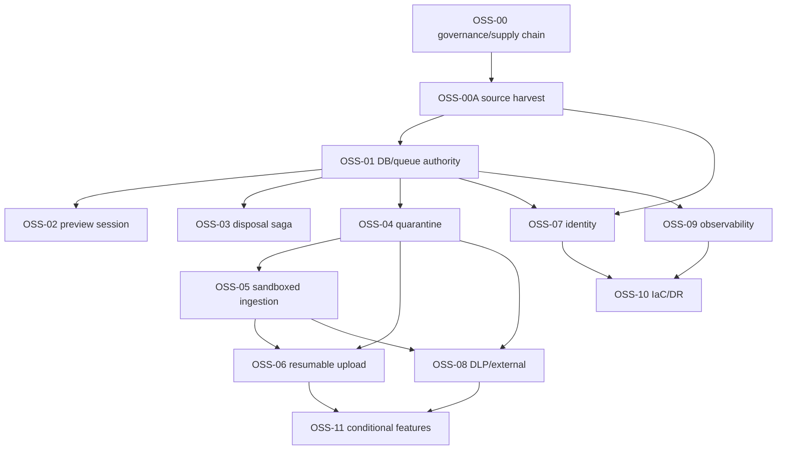

# AMIC Vault 엔터프라이즈 DMS OSS Source-First 실행계획 — GPT-5.6 Terra용 TUW 분해

**상태:** Active execution plan — proposed ID는 just-in-time canonical 등록 전까지
proposal이며, 등록·구현은
[OSS Terra 자율 순차 실행 권한](../execution/OSS_TERRA_AUTONOMOUS_EXECUTION_AUTHORITY.md)을
따른다.

**작성일:** 2026-07-21

**제품 기준선:** `origin/main` @ `91ac55a59b538cb57ecacecea4e69c92dc7c4cfd`

**대상 실행자:** GPT-5.6 Terra 또는 동등한 구현 에이전트

**상위 계획:** [AMIC Vault 엔터프라이즈 DMS OSS 활용 상세 계획](./enterprise-dms-oss-uplift-plan-main-2026-07-21.md)

**필수 방법론:** [상당히 개발된 제품에 오픈소스 코드를 반영하는 Source-First 방법론](./oss-source-adoption-methodology-for-mature-products-2026-07-21.md)

**문서 성격:** 구현 지시를 만들기 위한 제안 실행 명세다. 완료 원장, canonical backlog, 승인 기록, CI 증명, staging 또는 production 증명이 아니다.

## 0. 결론과 사용 경계

상위 계획의 `PROPOSED-OSS-00~11`은 여러 주가 걸리는 portfolio 수준이므로 한 브랜치·한 PR의 PACK으로 실행하기에 너무 크다. 이 문서는 이를 **30개 proposed sub-PACK, 111개 TUW**로 분해한다. 각 sub-PACK은 3~5개 TUW이고, 각 TUW는 한 명의 Terra 실행자가 최대 2일 안에 구현·검증·증적화할 수 있는 크기를 목표로 한다.

다만 이 ID들은 모두 계획용이다. 실제 실행 전 다음 절차가 선행돼야 한다.

1. 자율 실행 권한 아래에서 frozen `docs/package/codex/60_Execution_Packs.md`를
   변경하지 않고 live execution registry와 해당 backlog에 canonical PACK/TUW를 등록한다.
2. 등록 과정에서 ID, release, branch, dependency, `Files create / modify / NOT-modify`, 검증 명령을 다시 확정한다.
3. `docs/package/**`는 현재 문서 작업에서 수정하지 않는다. 등록은 별도 사람 승인
   작업이 아니지만 live registry 검증을 통과해야 한다.
4. canonical 등록 전에는 이 문서를 근거로 application code, migration, dependency, infrastructure를 변경하지 않는다.

이 계획의 OSS 활용 의미는 “README 참고”가 아니다. OSS-00A에서 모든 후보를 제품 repository 밖의 승인된 source lab에 exact SHA로 clone하고 upstream build/test와 file-level source map을 만든다. 후속 TUW는 그 map이 승인한 L0~L4 입력만 사용한다. 전체 repository를 제품 tree에 복사하거나 DMS core를 교체하는 계획은 아니다.

## 1. Terra 실행 계약

### 1.1 한 번에 실행할 범위

- 에이전트는 다음 dependency-ready **canonical TUW 1개만** 구현한다. sub-PACK 전체를
  한 번에 추정 구현하지 않는다.
- 같은 sub-PACK의 앞 TUW는 atomic commit과 local technical evidence가 있어야 한다.
  자율 실행 권한에서는 merge를 다음 TUW 시작의 선행조건으로 삼지 않는다.
- TUW마다 focused test를 green으로 만들고 한 개의 atomic commit 후보를 남긴다.
- sub-PACK 마지막 TUW에서만 PACK 전체 회귀, evidence manifest, PR 준비를 수행한다.
- 현재 checkout이 dirty이면 먼저 변경 소유권과 겹침을 분류한다. 관련 없는 사용자 변경을 stage, reset, reformat, revert하지 않는다.

### 1.2 모든 TUW의 시작 전 체크

Terra는 아래를 실행하고 결과를 작업 로그에 남긴다.

```bash
git status --short --branch
git rev-parse HEAD
git rev-parse HEAD^{tree}
git rev-parse origin/main
```

그 다음 아래를 확인한다.

1. 해당 proposed ID가 canonical ID로 등록됐고 지정 branch가 존재하는가.
2. `Depends_on`의 모든 PACK/TUW가 canonical 등록됐고 local technical evidence와
   required Gate가 있는가. 이 계획의 반복 사람 승인은 자율 실행 권한으로 대체된다.
3. 상위 계획, 본 TUW, `security/oss-source-map.yml`, 해당 `docs/architecture/oss-adoption-decisions/<component>.md`가 같은 adoption mode와 pin을 가리키는가.
4. 신규 migration이면 시작 직전 `db/migrations/`의 실제 다음 번호를 다시 계산했는가. 계획의 `<next>`를 숫자로 추측하지 않는다.
5. 신규 dependency 또는 service가 TUW에 명시됐는가. 명시되지 않았으면 추가하지 않는다.
6. `Files NOT-modify`를 바꿔야만 구현할 수 있으면 코드를 쓰지 않고 stop/escalation 한다.

### 1.3 구현 순서

각 TUW는 다음 순서로 실행한다.

1. 관련 source와 test를 읽고 현재 흐름을 호출점→권한→DB transaction→storage/queue→audit 순으로 추적한다.
2. source map의 upstream exact path/test를 source lab에서 재생한다. L0 TUW는 `no-applicable-upstream` 근거와 재사용할 local helper/test를 확인한다.
3. 먼저 acceptance를 재현하는 focused test 또는 정적 checker의 failing case를 추가한다.
4. 기존 helper/native platform/installed dependency로 해결 가능한지 다시 판정한다.
5. 가장 작은 production delta를 구현한다.
6. focused 기능 test, negative permission/security test, audit test, 회귀 test를 해당되는 것 모두 AND로 실행한다.
7. artifact와 manifest를 만들고 source SHA/tree, upstream pin, command, 결과 hash, truth state를 기록한다.

### 1.4 공통 불변 원칙

- Permission-before-search와 Permission-before-AI를 query/retrieval 단계에서 유지한다.
- 권한 판단은 `PermissionService`를 우회하지 않고, 오류·미해석·timeout은 fail-closed 한다.
- 행위와 audit insert는 같은 transaction이어야 하며 audit 실패 시 행위도 실패한다.
- 원본 FileObject를 덮어쓰지 않는다. derived/save 결과는 새 FileObject/version이다.
- legal hold 대상 또는 승인되지 않은 disposal은 삭제하지 않는다.
- 문서 본문, filename, query, prompt, token, raw identity assertion을 log/audit/telemetry에 남기지 않는다.
- 외부 공유는 R11 governance 승인 전 활성화하지 않는다.
- integration test의 새 최상위 suite 디렉터리를 만들지 않는다. `docs/package/codex/50_Verification_Security_Gates.md`의 canonical 10개 디렉터리 아래에 둔다.

### 1.5 크기와 Risk

| Size | 최대 예상 | 사용 기준 |
|---|---:|---|
| S | 0.5일 | 한 파일 또는 기계적 checker/fixture/문서 계약 |
| M | 1일 | 한 모듈의 작은 기능과 focused tests |
| L | 2일 | migration+service 또는 cross-process contract와 integration tests |

Risk=C TUW가 하나라도 있는 sub-PACK은 독립 검토자가 모든 변경과 negative test를 검토하기 전 merge하지 않는다. 작성 에이전트는 자기 PR을 merge하지 않는다.

### 1.6 TUW 공통 완료 정의

각 TUW의 개별 `Done`에 더해 다음이 모두 필요하다.

- Objective의 문장마다 최소 하나의 test/assert 또는 정적 checker 결과가 대응한다.
- 권한·보안 영향이면 positive와 가장 가까운 비인가자 negative case가 모두 있다.
- 행위 기록 대상이면 audit success와 audit-insert-failure rollback case가 있다.
- DB 변경이면 up→down→up, RLS/FORCE RLS, runtime role grant, cross-tenant case가 있다.
- OSS 입력이면 exact URL/SHA/tree/license hash/source path/test path와 L0~L4가 evidence에 있다.
- focused test만 통과한 상태는 `LOCAL_FOCUSED_VERIFIED`이지 PACK 완료가 아니다.
- sub-PACK 마지막 TUW가 공통 PACK 검증과 exact-head evidence manifest를 통과해야 `LOCAL_VERIFIED` 후보가 된다.

### 1.7 sub-PACK 공통 검증

모든 sub-PACK 마지막 TUW는 아래를 실행한다. bootstrap 또는 외부 승인 때문에 실행 불가한 명령은 성공으로 간주하지 않고 `EXTERNAL_BLOCKED` 또는 `ENVIRONMENT_BLOCKED`로 분리한다.

```bash
pnpm install --frozen-lockfile
pnpm lint
pnpm typecheck
pnpm test
pnpm build
docker compose -f infra/docker-compose.dev.yml up -d --wait
pnpm db:migrate
pnpm db:rollback
pnpm db:migrate
pnpm db:seed
pnpm test:integration
uv sync --frozen --project workers/ingestion --extra test
uv run --project workers/ingestion pytest workers/ingestion/tests
```

OSS-00 이후에는 승인된 supply-chain 명령을, OSS-00A 이후에는 source-first 검증을 추가한다.

```bash
pnpm audit --prod --audit-level high
gitleaks git --redact
semgrep scan --config .semgrep.yml
trivy fs --scanners vuln,misconfig,secret .
node tools/oss/verify-upstream-lock.mjs security/oss-source-map.yml
node tools/oss/verify-source-map.mjs security/oss-source-map.yml
node tools/oss/check-reuse-first.mjs docs/architecture/enterprise-dms-oss-uplift-plan-main-2026-07-21.md
node tools/security/check-source-provenance.mjs
```

### 1.8 Evidence 규칙

각 TUW의 machine artifact root는 다음 형식이다.

```text
artifacts/enterprise-dms-oss/<source-sha>/<canonical-pack>/<canonical-tuw>/
```

최소 manifest 필드는 다음과 같다.

```json
{
  "pack": "canonical-pack-id",
  "tuw": "canonical-tuw-id",
  "sourceSha": "40-hex",
  "sourceTree": "40-hex",
  "upstreamInputs": [],
  "commands": [],
  "artifacts": [],
  "truthState": "SOURCE_IMPLEMENTED|LOCAL_FOCUSED_VERIFIED|LOCAL_VERIFIED|CI_VERIFIED|EXTERNAL_BLOCKED",
  "syntheticOnly": true,
  "externalEvidence": []
}
```

external IdP, SIEM sink, cloud account, alert acknowledgement, backup restore, customer traffic을 local fixture로 대체하지 않는다.

## 2. Proposed sub-PACK registry

| Proposed sub-PACK | Portfolio | TUW 수 | 직렬 선행 | Risk | 목적 |
|---|---|---:|---|---|---|
| `PROPOSED-PACK-OSS00-01` | OSS-00 | 4 | 없음 | H | governance/provenance contract |
| `PROPOSED-PACK-OSS00-02` | OSS-00 | 3 | OSS00-01 | H/C | dependency와 Python lock hardening |
| `PROPOSED-PACK-OSS00-03` | OSS-00 | 3 | OSS00-02 | H | SBOM/scan/attestation identity |
| `PROPOSED-PACK-OSS00A-01` | OSS-00A | 4 | OSS00-03 + source-lab 승인 | H | clone lock와 upstream baseline |
| `PROPOSED-PACK-OSS00A-02` | OSS-00A | 3 | OSS00A-01 | H | authority와 product-facing source/test map |
| `PROPOSED-PACK-OSS00A-03` | OSS-00A | 3 | OSS00A-02 | H/C | ops source map과 L0~L4 decision gate |
| `PROPOSED-PACK-OSS01-01` | OSS-01 | 4 | OSS00A-03 | C | runtime role와 central DB contract |
| `PROPOSED-PACK-OSS01-02` | OSS-01 | 4 | OSS01-01 | C | authority-critical direct pool migration |
| `PROPOSED-PACK-OSS01-03` | OSS-01 | 4 | OSS01-02 | C | remaining direct pool migration/checker |
| `PROPOSED-PACK-OSS01-04` | OSS-01 | 4 | OSS01-03 | C | PgBoss registry와 connection budget |
| `PROPOSED-PACK-OSS02-01` | OSS-02 | 5 | OSS01-04 | H | audited preview session |
| `PROPOSED-PACK-OSS03-01` | OSS-03 | 4 | OSS01-04 | C | sealed disposal inventory/saga |
| `PROPOSED-PACK-OSS03-02` | OSS-03 | 3 | OSS03-01 | C | reconcile/certificate/fault proof |
| `PROPOSED-PACK-OSS04-01` | OSS-04 | 4 | OSS01-04 | C | quarantine와 scan authority |
| `PROPOSED-PACK-OSS04-02` | OSS-04 | 4 | OSS04-01 | C | promotion guard/reconcile/proof |
| `PROPOSED-PACK-OSS05-01` | OSS-05 | 4 | OSS04-02 | C | bounded ingestion identity/storage contract |
| `PROPOSED-PACK-OSS05-02` | OSS-05 | 4 | OSS05-01 | C | sandbox/resource/pilot/attack proof |
| `PROPOSED-PACK-OSS06-01` | OSS-06 | 3 | OSS04-02 + OSS05-02 | H | upload intent와 tusd hook authority |
| `PROPOSED-PACK-OSS06-02` | OSS-06 | 4 | OSS06-01 | H | finalize/reconcile/resume proof |
| `PROPOSED-PACK-OSS07-01` | OSS-07 | 4 | OSS01-04 | C | IdP topology와 OIDC callback |
| `PROPOSED-PACK-OSS07-02` | OSS-07 | 4 | OSS07-01 | C | local authority/deprovision/staging proof |
| `PROPOSED-PACK-OSS08-01` | OSS-08 | 3 | OSS04-02 + OSS05-02 + R11 승인 | C | unscannable DLP와 evaluation |
| `PROPOSED-PACK-OSS08-02` | OSS-08 | 4 | OSS08-01 | C | immutable derivative와 external ticket |
| `PROPOSED-PACK-OSS09-01` | OSS-09 | 4 | OSS01-04 | H | telemetry policy와 trace continuity |
| `PROPOSED-PACK-OSS09-02` | OSS-09 | 4 | OSS09-01 | H | metrics/SLO/SIEM/alert proof |
| `PROPOSED-PACK-OSS10-01` | OSS-10 | 4 | OSS07-02 + OSS09-02 + cloud/region 승인 | C | reproducible IaC composition |
| `PROPOSED-PACK-OSS10-02` | OSS-10 | 4 | OSS10-01 | C | backup/restore/residency/rollback proof |
| `PROPOSED-PACK-OSS11-OS` | OSS-11 | 3 | 측정 trigger + ADR-006 승인 | C | OpenSearch shadow projection |
| `PROPOSED-PACK-OSS11-WOP` | OSS-11 | 3 | ADR-018 + license/R11 승인 | C | WOPI/co-editor pilot |
| `PROPOSED-PACK-OSS11-PGB` | OSS-11 | 3 | OSS01 budget 초과 trigger | C | PgBouncer pilot |

합계: **30 sub-PACK / 111 TUW**. registry의 Risk는 포함 TUW 중 최댓값이다.

## 3. 의존성·병렬화



허용 병렬화는 동일 파일 충돌이 없고 모든 선행 merge가 끝난 경우에만 다음과 같다.

- OSS-02, OSS-03, OSS-04는 OSS-01 이후 최대 2개 sub-PACK만 병렬.
- OSS-07과 OSS-09는 OSS-01 이후 병렬 가능.
- OSS-08은 R11 governance 승인 전 코드 TUW를 시작하지 않는다.
- OSS-11의 세 sub-PACK은 서로 독립 trigger다. trigger가 없는 sub-PACK은 `NOT_STARTED`, 다른 trigger의 완료로 승격되지 않는다.

## 4. TUW 상세 명세

아래의 `Create` 경로는 canonical 등록 후 생성할 후보 경로다. 실행 시 같은 책임의 기존 파일이 발견되면 L0 재사용을 우선하고, 파일 범위를 바꾸기 전에 scope amendment를 승인받는다.

경로 표기는 repository root 기준이다. 카드 안의 축약은 다음과 같이만 해석한다: `modules/...`와 `common/...`는 각각 `apps/api/src/modules/...`, `apps/api/src/common/...`이고, `document/...`, `audit/...`, `preview/...`처럼 API module 이름으로 시작하는 경로도 `apps/api/src/modules/...`다. bare filename(예: `preview.module.ts`)은 같은 카드의 `Inputs`/`Files`에 명시된 유일한 module directory 안의 파일을 뜻한다. canonical 등록 시에는 모든 축약을 실제 full repository-relative path로 확장해 Files allowlist에 저장해야 하며, 두 후보가 생기면 추측하지 않고 stop한다.

## 4.1 `PROPOSED-PACK-OSS00-01` — Governance/provenance contract

### PROPOSED-OSS00-GOV-TUW-001 — exact-head inventory와 evidence schema

**Release:** Enterprise Uplift (Proposed; canonical TBD) | **Module:** OSS governance | **Risk:** M | **Size:** M | **Depends_on:** 없음

**Objective:** 제품 source, dependency, container image, vendored source/fixture가 동일 source SHA/tree에 결합되는 최소 machine schema와 inventory를 만든다.

**Inputs:** `package.json`, `pnpm-lock.yaml`, `apps/*/Dockerfile`, `workers/ingestion/pyproject.toml`, `.github/workflows/ci.yml`, 현재 `origin/main` SHA/tree.

**Files — Create:** `security/oss-provenance.yml`, `security/oss-evidence-schema.json`, `tools/security/check-evidence-manifest.mjs`, `tools/security/check-evidence-manifest.spec.mjs`.

**Files — Modify:** 없음.

**Files — NOT-modify:** `docs/package/**`, lockfile, application/runtime source, workflow.

**Implementation sequence:** (1) `security/*.yml`을 YAML 1.2의 JSON subset으로 제한해 Node 표준 `JSON.parse`로 검증 가능하게 한다. (2) source SHA/tree, artifact digest, upstream URL/SHA/tree/license hash, file-level inclusion, modifier, evidence state를 required field로 둔다. (3) 현재 direct dependency와 세 image build definition의 inventory seed를 채운다. (4) 7/40자 SHA 혼용, mutable tag-only image, 빈 license를 실패시키는 fixture를 만든다.

**Verification (AND):** `node --test tools/security/check-evidence-manifest.spec.mjs` AND 실제 `security/oss-provenance.yml` 검증 exit 0 AND malformed fixtures exit non-zero AND `git diff -- docs/package` empty.

**Done:** current main의 direct package/image/build input 100%가 source SHA/tree와 연결되고 unknown 값은 빈 문자열이 아니라 명시적 `unresolved` 상태·owner를 가진다.

**Edge cases:** multi-stage Dockerfile, workspace dependency, generated artifact, tag+digest 동시 표기, source 없이 binary만 제공되는 tool.

**Stop / escalation:** schema를 만족하려면 secret, signed URL, customer data를 저장해야 하거나 artifact를 현재 SHA와 결합할 수 없으면 중단한다.

**Evidence:** `inventory.json`, `schema-negative-results.json`, `source-identity.txt`.

### PROPOSED-OSS00-GOV-TUW-002 — license/NOTICE/delivery-profile policy

**Release:** Enterprise Uplift (Proposed; canonical TBD) | **Module:** OSS governance | **Risk:** H | **Size:** L | **Depends_on:** GOV-001

**Objective:** SaaS-only, on-prem distribution, modified network service별 허용·검토·차단 license 규칙과 NOTICE/source-offer 요구를 기계 검증한다.

**Inputs:** GOV-001 schema, 상위 계획의 L0~L4, 각 direct dependency license metadata, Legal의 D-OSS-04/12/13 결정.

**Files — Create:** `security/oss-allowlist.yml`, `security/oss-license-policy.yml`, `tools/security/check-oss-license-policy.mjs`, `tools/security/check-oss-license-policy.spec.mjs`, `third_party/NOTICE.md`.

**Files — Modify:** `security/oss-provenance.yml`의 license/delivery fields.

**Files — NOT-modify:** product source, dependency versions, upstream source copy, `docs/package/**`.

**Implementation sequence:** (1) SPDX expression, source type, adoption mode, SaaS/on-prem/modified-service profile을 분리한다. (2) GPL/AGPL/LGPL/unknown/custom을 자동 허용하지 않고 review-required 또는 deny로 둔다. (3) L2/L3에는 file-level provenance, patch, source offer, owner, exit가 없으면 실패시킨다. (4) NOTICE는 실제 inclusion만 생성하고 조사-only L4 후보를 shipped component로 오표기하지 않는다.

**Verification (AND):** allow/pass, unknown-license, AGPL-on-prem-no-source-offer, L2-no-file-map, expired approval fixtures를 `node --test`로 검증 AND current manifest report 생성.

**Done:** shipped/linked/sidecar/behavior-only가 구분되고 strong-copyleft 또는 unknown row는 사람 승인 없이는 green이 되지 않는다.

**Edge cases:** dual license, license exception, font/model/data license, fixture만 복사, unmodified external service.

**Stop / escalation:** sidecar/API 분리를 license 면책으로 전제해야 하거나 Legal 승인 주체가 없으면 해당 component를 `blocked`로 둔다.

**Evidence:** `license-policy-report.json`, `notice-coverage.json`, 승인되지 않은 항목 목록.

### PROPOSED-OSS00-GOV-TUW-003 — vulnerability/VEX exception contract

**Release:** Enterprise Uplift (Proposed; canonical TBD) | **Module:** Supply-chain security | **Risk:** H | **Size:** M | **Depends_on:** GOV-001

**Objective:** 취약점 결과를 package/advisory/reachability/remediation owner/expiry로 분류하고 무기한 ignore를 차단한다.

**Inputs:** `pnpm audit --prod --json`, 향후 Trivy/Syft output schema, Security risk acceptance policy.

**Files — Create:** `security/oss-vulnerability-exceptions.yml`, `tools/security/check-vulnerability-policy.mjs`, `tools/security/check-vulnerability-policy.spec.mjs`.

**Files — Modify:** `security/oss-evidence-schema.json`에 vulnerability decision reference 추가.

**Files — NOT-modify:** dependency versions, `.trivyignore`, tests를 약화하는 config.

**Implementation sequence:** (1) advisory ID, affected artifact, production reachability, decision, owner, issued/expiry, compensating control, evidence hash를 강제한다. (2) High/Critical production-reachable는 `fixed` 또는 유효한 승인 VEX만 통과한다. (3) unknown severity/reachability는 fail-closed 한다. (4) expiry와 source SHA 불일치를 negative fixture로 만든다.

**Verification (AND):** current audit JSON parser test AND expired/ownerless/wrong-SHA VEX rejection AND malformed tool output rejection.

**Done:** “scanner green”과 “승인된 risk acceptance”가 분리되고 미분류 High/Critical이 report에 0건이다.

**Edge cases:** withdrawn advisory, duplicate CVE across packages, dev-only package, transitive package without fixed version.

**Stop / escalation:** 취약점 ignore가 기능/permission/audit test 약화를 요구하거나 production reachability를 판정할 owner가 없으면 중단한다.

**Evidence:** `vulnerability-inventory.json`, `vex-validation.json`, `unresolved.json`.

### PROPOSED-OSS00-GOV-TUW-004 — governance check를 CI에 연결

**Release:** Enterprise Uplift (Proposed; canonical TBD) | **Module:** CI governance | **Risk:** H | **Size:** M | **Depends_on:** GOV-001~003

**Objective:** provenance/license/VEX/evidence schema 검증을 PR에서 결정적으로 실행하되 아직 도입되지 않은 scanner 성공을 가장하지 않는다.

**Inputs:** GOV checker 세트, `.github/workflows/ci.yml`, existing `verify`/`docker-build` job.

**Files — Create:** `.github/workflows/supply-chain.yml`의 governance-only job.

**Files — Modify:** `.github/workflows/ci.yml`은 duplicate install 없이 reusable 결과를 연결하는 최소 변경만 허용.

**Files — NOT-modify:** application source, existing test commands 제거/skip, branch protections의 외부 상태.

**Implementation sequence:** (1) Node 22/corepack/pnpm frozen install version을 existing CI와 일치시킨다. (2) checker를 network-independent job으로 실행한다. (3) artifact에 SHA/tree와 report hash를 넣는다. (4) scanner/SBOM/signature job은 다음 sub-PACK 전까지 `not_yet_implemented`를 명시하고 pass stub를 만들지 않는다.

**Verification (AND):** action syntax 검사 AND local checker 전부 green AND intentionally invalid manifest branch fixture가 job-equivalent command에서 non-zero AND 기존 CI command 목록 보존.

**Done:** governance failure가 PR required check 후보로 분리되고 artifact provenance가 workflow SHA에 결합된다.

**Edge cases:** fork PR의 read-only token, artifact upload failure, workflow path filter로 checker가 누락되는 경우.

**Stop / escalation:** GitHub secret/permission을 확대해야 하거나 기존 required check를 제거해야만 연결 가능하면 중단한다.

**Evidence:** `governance-ci-local.json`, workflow command inventory, artifact hash list.

## 4.2 `PROPOSED-PACK-OSS00-02` — Dependency/Python hardening

### PROPOSED-OSS00-DEP-TUW-001 — current dependency advisory triage

**Release:** Enterprise Uplift (Proposed; canonical TBD) | **Module:** Dependency security | **Risk:** H | **Size:** M | **Depends_on:** GOV-004

**Objective:** 현재 exact lockfile의 production advisory를 재수집해 direct/transitive/reachable/fixable로 분류하고 upgrade TUW 범위를 확정한다.

**Inputs:** `pnpm-lock.yaml`, workspace manifests, `pnpm audit --prod --json`, GOV-003 VEX schema.

**Files — Create:** `docs/architecture/oss-adoption-decisions/dependency-advisory-baseline.md`.

**Files — Modify:** `security/oss-vulnerability-exceptions.yml`은 승인된 row만, `security/oss-provenance.yml`의 audit hash.

**Files — NOT-modify:** package manifests/lockfile, application source.

**Implementation sequence:** (1) exact-head audit를 저장한다. (2) advisory별 import/call/build/runtime reachability 근거를 코드 path에 연결한다. (3) patched version과 breaking-major 여부를 기록한다. (4) Multer/Next 외 새 remediation이 필요하면 임의 수정하지 말고 별도 canonical TUW를 제안한다.

**Verification (AND):** audit parser/checker green AND report row 수가 raw advisory unique set과 일치 AND 미분류 High/Critical 0.

**Done:** DEP-002/003 또는 별도 TUW로 이어지는 bounded remediation queue와 owner/expiry가 있다.

**Edge cases:** audit registry outage, no-fix advisory, optional dependency, platform-specific binary.

**Stop / escalation:** raw audit를 재현할 수 없거나 reachability를 근거 없이 `not affected`로 처리해야 하면 중단한다.

**Evidence:** redacted raw audit, normalized triage JSON, report hash.

### PROPOSED-OSS00-DEP-TUW-002 — Multer/upload parser security regression

**Release:** Enterprise Uplift (Proposed; canonical TBD) | **Module:** Upload transport | **Risk:** H | **Size:** L | **Depends_on:** DEP-001

**Objective:** 현재 resolved Multer/Nest multipart line이 관련 advisory에 안전한지 재검증하고 필요한 최소 compatible upgrade와 resource-exhaustion regression을 적용한다.

**Inputs:** DEP-001 decision, `apps/api/src/modules/document/multipart.config.ts`, document controller/upload tests, resolved Multer package source/tests의 exact pin.

**Files — Create:** 필요 시 `apps/api/src/modules/document/multipart-security.spec.ts`.

**Files — Modify:** `apps/api/package.json` 또는 root manifest와 `pnpm-lock.yaml`은 patched line이 필요할 때만; `multipart.config.ts`는 bounded limits 보완만.

**Files — NOT-modify:** PermissionService, storage authority, upload audit semantics, file size policy 완화.

**Implementation sequence:** (1) upstream patched source/test와 current resolved `multer@2.0.2`를 비교한다. (2) nested field/field count/header pair/oversize/aborted stream fixture를 red로 만든다. (3) already safe이면 dependency 변경 없이 regression만 채택한다. (4) upgrade면 request DTO와 existing upload behavior parity를 검증한다.

**Verification (AND):** focused multipart/unit tests AND `tests/integration/document-access/upload-permission.spec.ts` AND `tests/integration/storage-isolation` AND audit coverage document tests.

**Done:** malformed multipart는 bounded `VALIDATION_FAILED`, temp file/object/DB row 잔여 0, authorized normal upload 회귀 없음.

**Edge cases:** zero-byte, duplicated field names, Unicode filename, client disconnect, chunked transfer without content-length.

**Stop / escalation:** patched line이 Nest adapter와 비호환이거나 제한 적용이 정상 대용량 upload를 근거 없이 깨면 별도 spike로 중단한다.

**Evidence:** `multipart-negative-results.json`, upstream source/test map, lockfile diff reason.

### PROPOSED-OSS00-DEP-TUW-003 — Python uv lock와 frozen CI

**Release:** Enterprise Uplift (Proposed; canonical TBD) | **Module:** Ingestion dependency supply chain | **Risk:** H | **Size:** M | **Depends_on:** DEP-001

**Objective:** `workers/ingestion`의 Python dependency와 test extra를 exact lock으로 고정하고 두 번의 clean sync가 동일 package set을 만든다.

**Inputs:** `workers/ingestion/pyproject.toml`, Dockerfile, python-worker CI job, uv official release/source pin.

**Files — Create:** `workers/ingestion/uv.lock`.

**Files — Modify:** `workers/ingestion/Dockerfile`, `.github/workflows/ci.yml`, provenance inventory.

**Files — NOT-modify:** parser behavior, fixture semantics, Python version range without separate approval.

**Implementation sequence:** (1) approved uv version/digest를 pin한다. (2) base+test extra lock을 생성한다. (3) CI와 Docker build를 `uv sync --frozen` 또는 export된 hash-locked install로 일치시킨다. (4) clean temp venv 두 개의 package/version/hash 목록을 비교한다.

**Verification (AND):** 두 frozen sync exit 0와 normalized inventory hash 동일 AND `uv run ... pytest workers/ingestion/tests` green AND container imports/health green.

**Done:** unbounded pip resolver가 CI/image path에서 0개이며 lock/pyproject drift가 non-zero로 차단된다.

**Edge cases:** platform wheel 차이, LibreOffice system package, optional test extra, sdist-only dependency.

**Stop / escalation:** package가 reproducible hash/wheel을 제공하지 않거나 lock이 supported platform을 깨면 dependency 교체/exception을 별도 승인한다.

**Evidence:** `uv-sync-a.json`, `uv-sync-b.json`, inventory hash, worker test report.

## 4.3 `PROPOSED-PACK-OSS00-03` — SBOM/scanning/attestation

### PROPOSED-OSS00-ATT-TUW-001 — 세 image와 source SBOM

**Release:** Enterprise Uplift (Proposed; canonical TBD) | **Module:** SBOM | **Risk:** H | **Size:** L | **Depends_on:** DEP-002~003

**Objective:** API/web/ingestion image와 repository dependency를 CycloneDX SBOM으로 생성하고 source SHA와 image digest에 결합한다.

**Inputs:** three Dockerfiles, frozen locks, Syft official image/binary checksum/source pin.

**Files — Create:** `tools/security/generate-sbom.mjs`, `tools/security/generate-sbom.spec.mjs`.

**Files — Modify:** `.github/workflows/supply-chain.yml`, provenance schema/manifest.

**Files — NOT-modify:** application source, image base major, generated SBOM commit to repository.

**Implementation sequence:** (1) Syft tool digest/version을 pin한다. (2) image를 exact source SHA tag로 build한다. (3) source 및 각 digest에서 SBOM을 만든다. (4) package count, duplicate purl, source/image mismatch를 검사한다. (5) SBOM은 CI artifact로만 보관하고 hash를 manifest에 둔다.

**Verification (AND):** 세 image digest 존재 AND 세 SBOM parse/schema green AND SHA/digest mismatch fixture failure AND two same-input generation의 normalized component set 동일.

**Done:** API/web/worker 각각 고유 digest와 SBOM hash가 있고 어느 SBOM도 mutable tag만 가리키지 않는다.

**Edge cases:** OS package without purl, multi-arch digest, workspace package, generated Next standalone tree.

**Stop / escalation:** SBOM tool이 private path/secret을 artifact에 포함하거나 image digest를 얻을 수 없으면 publish하지 않는다.

**Evidence:** SBOM files, normalized diff, `sbom-manifest.json`.

### PROPOSED-OSS00-ATT-TUW-002 — source/image/IaC/secret scanners

**Release:** Enterprise Uplift (Proposed; canonical TBD) | **Module:** Security scanning | **Risk:** H | **Size:** L | **Depends_on:** ATT-001 + GOV-003

**Objective:** Gitleaks, Semgrep CE, Trivy의 official pinned artifact를 사용해 source, history/diff, lock, image, IaC를 스캔하고 exception contract를 강제한다.

**Inputs:** tool official sources/releases/checksums, GOV VEX schema, current workflows.

**Files — Create:** `.gitleaks.toml`, `.semgrep.yml`; `.trivyignore`는 승인된 exception이 실제로 필요할 때만 생성.

**Files — Modify:** `.github/workflows/supply-chain.yml`, provenance manifest.

**Files — NOT-modify:** scanner rule을 광범위 exclude, test fixture 삭제, customer/secret data 추가.

**Implementation sequence:** (1) full-history Gitleaks와 PR-diff scan을 분리한다. (2) Semgrep은 local/approved-license rules만 pin한다. (3) Trivy fs/image/config scan을 digest에 결합한다. (4) finding normalizer가 severity, path, rule/advisory, reachability, VEX를 연결한다. (5) intentional synthetic secret/EICAR-like security fixture는 exact narrow allow rule만 사용한다.

**Verification (AND):** clean current scan policy 결과 AND injected secret/insecure Docker/malformed IaC fixture detection AND ownerless/expired ignore rejection.

**Done:** 미분류 production-reachable High/Critical 0, secret finding 0, exception 100% owner/expiry/evidence 보유.

**Edge cases:** git history의 이미 회수된 secret, binary fixture false positive, generated build output, tool database outage.

**Stop / escalation:** history rewrite나 security test 제거가 필요하면 중단하고 credential rotation/history-remediation 별도 절차로 보낸다.

**Evidence:** redacted scan reports, exception validation, tool pin inventory.

### PROPOSED-OSS00-ATT-TUW-003 — Cosign attestation과 Supply-chain Gate

**Release:** Enterprise Uplift (Proposed; canonical TBD) | **Module:** Artifact identity | **Risk:** H | **Size:** L | **Depends_on:** ATT-001~002

**Objective:** image digest, SBOM, provenance, scan 결과를 같은 source SHA/tree에 attest하고 Supply-chain Gate receipt를 만든다.

**Inputs:** ATT artifacts, Cosign official pinned artifact, approved signing mode/keyless OIDC policy.

**Files — Create:** `tools/security/verify-release-identity.mjs`, `tools/security/verify-release-identity.spec.mjs`, `docs/execution/evidence/enterprise-dms-oss/OSS-00/README.md`.

**Files — Modify:** `.github/workflows/supply-chain.yml`, evidence/provenance schema.

**Files — NOT-modify:** production registry, deployment manifest, branch protection without human approval.

**Implementation sequence:** (1) PR에서는 sign 없이 deterministic bundle 검증, protected main/release에서 승인된 identity만 sign하게 분리한다. (2) SLSA-style provenance subject에 세 digest와 SHA/tree를 둔다. (3) SBOM/scan hash를 predicate에 연결한다. (4) wrong digest/wrong SHA/missing predicate/replayed bundle을 verifier가 차단하게 한다.

**Verification (AND):** local unsigned verification bundle green AND negative fixtures red AND 승인된 CI context에서 signature verification receipt; 외부 signing 권한이 없으면 `EXTERNAL_BLOCKED`로 기록.

**Done:** 세 image/SBOM/scan/provenance가 같은 SHA/tree/digest graph를 이루고 unresolved High/License block이 Gate를 차단한다.

**Edge cases:** keyless issuer/subject mismatch, re-run same SHA, multi-arch manifest, expired Fulcio/Rekor availability.

**Stop / escalation:** signing credential을 repository secret로 커밋하거나 PR fork에 write 권한을 부여해야 하면 중단한다.

**Evidence:** `release-identity.json`, verification bundle, supply-chain gate summary.

## 4.4 `PROPOSED-PACK-OSS00A-01` — Source lab와 upstream baseline

### PROPOSED-OSS00A-LAB-TUW-001 — source-lab 경계와 lock schema

**Release:** Enterprise Uplift (Proposed; canonical TBD) | **Module:** Source harvest | **Risk:** H | **Size:** M | **Depends_on:** ATT-003 + D-OSS-11 승인

**Objective:** 제품 repository/build context/customer data와 분리된 `OSS_RESEARCH_ROOT` 경계, 접근/보존 정책, upstream lock schema를 확정한다.

**Inputs:** 승인된 외부 local path, source-first S0~S2, shortlist, GOV schema.

**Files — Create:** `security/oss-source-map.yml`의 lock/header skeleton, `tools/oss/verify-upstream-lock.mjs`, `tools/oss/verify-upstream-lock.spec.mjs`, `docs/architecture/oss-adoption-decisions/source-lab.md`.

**Files — Modify:** `.gitignore`에 source lab을 repo 내부에 둘 수 없음을 방어하는 narrow pattern이 필요할 때만.

**Files — NOT-modify:** product runtime, Docker build context에 upstream clone 포함, `.env`/credentials.

**Implementation sequence:** (1) root realpath가 repo/parent secret/customer 영역 밖인지 검증한다. (2) official URL, full commit/tree, release/tag, license path/hash, submodule/LFS/vendor/generated status를 schema화한다. (3) detached clean baseline과 experimental worktree를 구분한다. (4) path traversal/symlink/repo-inside-root negative fixture를 만든다.

**Verification (AND):** source-root boundary tests AND 40-hex commit/tree/license hash validation AND dirty baseline rejection AND product build context에 clone path 0건.

**Done:** source lab owner, retention, access, export path가 승인됐고 lock row 없이 후속 source adoption을 시작할 수 없다.

**Edge cases:** worktree `.git` file, submodule, Git LFS pointer, Windows/macOS case sensitivity, symlink.

**Stop / escalation:** approved external root가 없거나 clone에 customer credential이 필요하면 source harvest를 시작하지 않는다.

**Evidence:** boundary report, source-root approval ref, schema negative results.

### PROPOSED-OSS00A-LAB-TUW-002 — shortlist exact-SHA clone verifier

**Release:** Enterprise Uplift (Proposed; canonical TBD) | **Module:** Source harvest | **Risk:** H | **Size:** L | **Depends_on:** LAB-001

**Objective:** shortlist 전부를 official remote의 full SHA로 clone/fetch하고 detached read-only baseline의 HEAD/tree/clean/license hash를 lock에 기록한다.

**Inputs:** 상위 계획 shortlist와 seed pins; seed는 실행 pin이 아니므로 official remote에서 재확인한다.

**Files — Create:** `tools/oss/clone-upstream.mjs`, `tools/oss/clone-upstream.spec.mjs`.

**Files — Modify:** `security/oss-source-map.yml` lock rows.

**Files — NOT-modify:** upstream source, product source, `third_party/` inclusion.

**Implementation sequence:** (1) official repository allowlist만 fetch한다. (2) tag가 가리키는 commit과 tree를 별도 기록한다. (3) Paperless/Mayan/Alfresco/Docspell/Teedy, ClamAV/Tika/Gotenberg/OCRmyPDF/tusd, openid-client/Keycloak/Presidio/SPIRE, OTel/OpenTofu/CloudNativePG/pgBackRest/OpenBao/OpenSearch와 조건부 editor row를 만든다. (4) baseline chmod/read-only 또는 운영상 동등 통제를 적용한다. (5) dirty/submodule/LFS 상태를 분류한다.

**Verification (AND):** 각 row에 `git rev-parse HEAD`, `HEAD^{tree}`, `status --short` 재검증 AND official remote match AND license file hash match; 한 row라도 unresolved면 전체 Gate red.

**Done:** shortlist 100%가 pinned 또는 명시적 `blocked`와 owner를 가지며 repository root 링크만 있는 row가 0개다.

**Edge cases:** tag force-move, archived repo, mirror만 존재, submodule inaccessible, multiple license files.

**Stop / escalation:** official source를 확인할 수 없거나 full SHA/tree/license hash를 고정할 수 없으면 해당 component를 채택 후보에서 제외한다.

**Evidence:** `upstream-lock.json`, clean-clone report, remote/license hashes.

### PROPOSED-OSS00A-LAB-TUW-003 — upstream baseline runner와 결과 분류

**Release:** Enterprise Uplift (Proposed; canonical TBD) | **Module:** Upstream baseline | **Risk:** H | **Size:** L | **Depends_on:** LAB-002

**Objective:** 각 exact clone의 공식 build/test 명령을 수정 없이 실행하고 환경·service·network·secret 의존성과 pass/fail/skip을 component별로 보존한다.

**Inputs:** lock rows, upstream official contributor/build docs, source tree scripts.

**Files — Create:** `tools/oss/run-upstream-baseline.mjs`, component별 `docs/architecture/oss-adoption-decisions/<component>.md` baseline section skeleton.

**Files — Modify:** source map의 baseline command/artifact fields.

**Files — NOT-modify:** upstream baseline source/test, test skip patch, product code.

**Implementation sequence:** (1) command는 component 문서에 그대로 pin하고 공통 가짜 명령으로 추상화하지 않는다. (2) clean worktree에서 timeout/resource limit을 두고 실행한다. (3) failure를 code/test/environment/external-service/license/unsupported-platform으로 분류한다. (4) stdout/stderr는 secret redaction 후 hash와 bounded summary만 export한다. (5) baseline 실패를 product parity 성공으로 덮지 않는다.

**Verification (AND):** runner unit tests AND 모든 adoptable row에 command/environment/result/artifact hash AND skip에는 upstream-defined reason과 owner가 존재.

**Done:** L1~L4 후보 100%에 재현 가능한 baseline 결과가 있고 실행하지 못한 row는 green이 아니라 blocked다.

**Edge cases:** multi-hour suite, flaky upstream test, network download, Docker-only build, architecture-specific test.

**Stop / escalation:** upstream test를 수정하거나 secret/customer data를 사용해야만 baseline을 만들 수 있으면 중단한다.

**Evidence:** `upstream-baselines/<component>/manifest.json`, redacted logs, environment fingerprint.

### PROPOSED-OSS00A-LAB-TUW-004 — baseline reproducibility와 source lock Gate

**Release:** Enterprise Uplift (Proposed; canonical TBD) | **Module:** Source harvest Gate | **Risk:** H | **Size:** M | **Depends_on:** LAB-001~003

**Objective:** source lock과 baseline artifact가 서로 다른 clone/path에서도 같은 commit/tree와 허용 가능한 결과를 재현하는지 검증한다.

**Inputs:** lock, baseline manifests, approved second temp clone location.

**Files — Create:** `tools/oss/verify-upstream-baseline.mjs`, `tools/oss/verify-upstream-baseline.spec.mjs`.

**Files — Modify:** `.github/workflows/supply-chain.yml`에 network-controlled scheduled/manual source-lock verification; PR에서 무조건 외부 clone하지 않는다.

**Files — NOT-modify:** upstream source, product runtime.

**Implementation sequence:** (1) 두 번째 shallow가 아닌 exact commit clone으로 tree/license를 확인한다. (2) deterministic output은 hash 비교, non-deterministic test는 normalized case/result 비교를 사용한다. (3) upstream remote/tag drift와 baseline artifact tamper를 차단한다. (4) 결과를 `UPSTREAM_SOURCE_PINNED`와 `UPSTREAM_BASELINE_REPRODUCED`로 별도 표기한다.

**Verification (AND):** verifier positive/negative fixtures AND selected representative components의 second-clone replay AND 모든 row 상태 누락 0.

**Done:** source-lock Gate report가 component별 pinned/reproduced/blocked를 정확히 구분한다.

**Edge cases:** timestamp-bearing artifacts, generated files, git archive differences, unavailable upstream.

**Stop / escalation:** tag만 재현되고 commit/tree를 재현할 수 없거나 baseline artifact가 원 source와 결합되지 않으면 Gate를 통과시키지 않는다.

**Evidence:** `source-lock-gate.json`, second-clone hashes, drift report.

## 4.5 `PROPOSED-PACK-OSS00A-02` — Authority와 product-facing source map

### PROPOSED-OSS00A-MAP-TUW-001 — Vault authority/gap map

**Release:** Enterprise Uplift (Proposed; canonical TBD) | **Module:** Adoption architecture | **Risk:** H | **Size:** L | **Depends_on:** LAB-004

**Objective:** main의 permission/audit/tenant/document/storage/search/records/identity/ingestion authority를 `KEEP|AUGMENT|REPLACE_CANDIDATE|GAP|UNKNOWN`으로 파일·test 단위 고정한다.

**Inputs:** current main modules/tests/migrations, 상위 gap 진단, source-first S0.

**Files — Create:** `docs/architecture/oss-adoption-decisions/vault-authority-map.md`.

**Files — Modify:** `security/oss-source-map.yml`의 target rows.

**Files — NOT-modify:** application code, migrations, canonical docs.

**Implementation sequence:** (1) 실제 entry point와 persistence/audit/test path를 `rg`로 전수 수집한다. (2) PermissionService/RLS/AuditService/immutable FileObject/PG FTS/pg-boss/S3 adapter를 KEEP로 명시한다. (3) preview audit gap, direct pools, disposal atomicity, quarantine, worker URL trust, enterprise IdP/DR 등을 GAP/AUGMENT로 연결한다. (4) UNKNOWN에는 owner와 질문을 둔다.

**Verification (AND):** 모든 OSS-01~11에 최소 하나의 target row AND 모든 `Create` 제안에 reuse-first target AND stale/nonexistent local path checker 0건.

**Done:** DMS core wholesale replacement가 없음이 명시되고 새 코드가 소유할 authority boundary가 bounded하다.

**Edge cases:** 같은 파일의 mixed authority, conditional feature, existing code가 receipt만 있고 runtime path가 아닌 경우.

**Stop / escalation:** 권한·audit authority를 어느 모듈이 소유하는지 결정할 수 없으면 downstream 구현을 막는다.

**Evidence:** authority-map report, path validation, gap-to-portfolio matrix.

### PROPOSED-OSS00A-MAP-TUW-002 — DMS/pipeline/security/identity source-test map

**Release:** Enterprise Uplift (Proposed; canonical TBD) | **Module:** Source mapping | **Risk:** H | **Size:** L | **Depends_on:** MAP-001

**Objective:** Alfresco/Mayan/Paperless/Docspell/Teedy, ClamAV/Tika/Gotenberg/OCRmyPDF/tusd, openid-client/Keycloak/Presidio/SPIRE의 exact source/test/fixture를 OSS-03~08 acceptance에 연결한다.

**Inputs:** source lab clones/baselines, portfolio contracts.

**Files — Create:** 해당 component adoption decision 문서의 source-map sections.

**Files — Modify:** `security/oss-source-map.yml` source/test/fixture rows.

**Files — NOT-modify:** upstream/product code, fixture copy.

**Implementation sequence:** component별 public entry, persistence/state, retry/idempotency, permission/auth, audit/log, parser/network, error/remediation, unit/integration/negative/fault path를 exact relative path와 blob URL로 기록한다. 각 scenario를 product TUW ID, expected reuse type, prohibited authority와 연결한다.

**Verification (AND):** verifier가 clone 내 path/blob SHA 존재 확인 AND test path 없는 L1~L4 row rejection AND 각 OSS-03~08에 upstream input 또는 명시적 L0/no-candidate 존재.

**Done:** repository root만 가리키는 row 0, unlicensed fixture copy 0, upstream보다 Vault가 강화하는 차이 명시.

**Edge cases:** generated test, vendored submodule, fixture license가 source license와 다른 경우, examples가 security contract가 아닌 경우.

**Stop / escalation:** source/test path나 license를 확인할 수 없으면 그 입력은 reject하고 downstream에서 사용하지 않는다.

**Evidence:** `source-map-dms-pipeline.json`, path verification report, rejected inputs.

### PROPOSED-OSS00A-MAP-TUW-003 — test/fixture 재사용 분류와 product parity skeleton

**Release:** Enterprise Uplift (Proposed; canonical TBD) | **Module:** Test reuse | **Risk:** H | **Size:** L | **Depends_on:** MAP-002

**Objective:** upstream test를 unchanged baseline, approved port, fixture reuse, behavioral scenario, reject로 분류하고 각 downstream TUW의 parity assertion skeleton을 만든다.

**Inputs:** MAP-002 rows, canonical integration suite registry, license policy.

**Files — Create:** `security/oss-test-reuse.yml`, `tools/oss/verify-test-reuse.mjs`, `tools/oss/verify-test-reuse.spec.mjs`.

**Files — Modify:** component decision docs와 source map references.

**Files — NOT-modify:** tests/integration production fixtures, upstream copied fixture, new top-level integration suite.

**Implementation sequence:** (1) test case ID/source path/assertion/expected adaptation/license/hash를 기록한다. (2) copied fixture는 L2 승인과 provenance 없이는 reject한다. (3) behavior-only는 source wording/code를 복사하지 않고 Vault fixture/test name을 독립 작성하도록 한다. (4) product parity artifact schema를 정의한다.

**Verification (AND):** malformed/missing-license/wrong-hash test rows rejection AND each downstream security-critical portfolio에 negative/fault scenario 최소 1개 AND canonical suite target validation.

**Done:** “코드 재사용”과 “테스트 아이디어 재사용”이 구분되고 copied-source 오분류가 checker에서 차단된다.

**Edge cases:** tiny data fixture, protocol conformance suite, screenshot/golden binary, test with real network dependency.

**Stop / escalation:** fixture license/PII를 확인할 수 없거나 test port가 permission/audit assertion을 제거하면 reject한다.

**Evidence:** `upstream-test-reuse.json`, parity skeletons, rejected fixture list.

## 4.6 `PROPOSED-PACK-OSS00A-03` — Ops source map과 adoption Gate

### PROPOSED-OSS00A-MAP-TUW-004 — observability/infra/search/editor source-test map

**Release:** Enterprise Uplift (Proposed; canonical TBD) | **Module:** Source mapping | **Risk:** H | **Size:** L | **Depends_on:** MAP-003

**Objective:** OTel Collector/OpenTofu/CloudNativePG/pgBackRest/OpenBao/OpenSearch와 조건부 co-editor/PgBouncer의 official source/config/test를 OSS-09~11에 연결한다.

**Inputs:** source lab clones/baselines, ADR-006/018 status, infrastructure decisions.

**Files — Create:** 해당 component adoption decision source-map sections.

**Files — Modify:** `security/oss-source-map.yml`, `security/oss-test-reuse.yml`.

**Files — NOT-modify:** infra runtime, search/editor code, ADR 승인 상태.

**Implementation sequence:** redaction/retry/backpressure, module/example/state compatibility, backup/restore/key loss, permission/DLS/index drift, callback/lock/save/version, transaction pooling/GUC tests의 exact paths를 map한다. Trigger가 없는 후보는 `conditional-not-authorized`로 둔다.

**Verification (AND):** exact path/blob verification AND OSS-09~11 acceptance link coverage AND trigger/ADR 없는 candidate가 adoption-ready로 표시되지 않음.

**Done:** operational source input도 product parity와 external proof를 분리하며 conditional feature는 clone 완료만으로 승인되지 않는다.

**Edge cases:** Helm/chart와 application license 차이, cloud-specific examples, enterprise-only plugin, archived test path.

**Stop / escalation:** OSS/enterprise 기능 경계 또는 hosting license를 확인하지 못하면 해당 profile을 reject한다.

**Evidence:** `source-map-ops-infra-scale.json`, conditional-candidate report.

### PROPOSED-OSS00A-MAP-TUW-005 — L0~L4/TCO/license adoption decisions

**Release:** Enterprise Uplift (Proposed; canonical TBD) | **Module:** Adoption decision | **Risk:** C | **Size:** L | **Depends_on:** MAP-001~004

**Objective:** 모든 source/test/fixture target에 L0~L4 또는 reject를 부여하고 기능·architecture·authority·security·license·maintenance·code-deletion TCO를 승인 가능하게 만든다.

**Inputs:** authority map, source/test maps, baseline results, license policy, fork budget D-OSS-14.

**Files — Create:** `security/oss-adoption-decisions.yml`.

**Files — Modify:** component decision docs를 최종 decision template로 채움.

**Files — NOT-modify:** product/upstream code, dependency/install config.

**Implementation sequence:** (1) `L0→L1→L2→L3→L4→reject` 순으로 앞 단계 부적합 근거를 강제한다. (2) L2는 file map/update/rollback, L3는 remote/owner 2명/security SLA/monthly sync/HA/backup/source offer/exit를 요구한다. (3) SaaS/on-prem/modified service를 별도 판정한다. (4) 점수만으로 authority 침해를 상쇄하지 못하게 hard veto를 둔다.

**Verification (AND):** 100% row decision coverage AND L2/L3 missing obligations negative test AND Permission/Audit core `REPLACE` decision 0 AND independent Risk=C review receipt.

**Done:** downstream TUW가 사용할 exact input과 의도적으로 거부할 input이 하나씩 결정되며 fork owner 없는 L3가 0개다.

**Edge cases:** multi-mode adoption, official binary but test transplant, fork에서 upstream 재합류, on-prem만 배포.

**Stop / escalation:** Legal/Security/owner 결정을 받지 못한 L2/L3는 blocked로 유지하고 구현하지 않는다.

**Evidence:** `adoption-decisions.json`, TCO scorecards, independent review ref.

### PROPOSED-OSS00A-MAP-TUW-006 — source-map/reuse-first CI Gate

**Release:** Enterprise Uplift (Proposed; canonical TBD) | **Module:** Source-first Gate | **Risk:** H | **Size:** L | **Depends_on:** MAP-005

**Objective:** downstream product change가 승인 source map/adoption decision 없이 새 파일·copied code·fixture·dependency를 추가하지 못하게 CI Gate를 완성한다.

**Inputs:** source/adoption/test-reuse manifests, upper plan의 proposed create paths, Git diff.

**Files — Create:** `tools/oss/verify-source-map.mjs`, `tools/oss/check-reuse-first.mjs`와 각 `*.spec.mjs`.

**Files — Modify:** `.github/workflows/supply-chain.yml`, evidence schema.

**Files — NOT-modify:** product code, canonical docs, tests skip config.

**Implementation sequence:** (1) full SHA/tree/license/path/owner/refresh 누락을 차단한다. (2) plan/changed-file의 new source에 L0 부적합 또는 approved L1~L4 row를 요구한다. (3) copied text/hash heuristic은 hard proof가 아니라 review signal로 보고 provenance 누락만 hard fail한다. (4) source clone path가 build context에 들어가면 fail한다. (5) downstream portfolio별 coverage report를 만든다.

**Verification (AND):** valid manifests green AND missing path/fake SHA/dirty clone/copied fixture/no-decision/new dependency fixtures red AND upper plan의 모든 Create 후보 coverage.

**Done:** `SOURCE_MAP_APPROVED` Gate가 OSS-01~11 product-code PACK의 명시적 선행 check가 된다.

**Edge cases:** generated code, standard protocol constants, tiny snippets, renamed files, deleted upstream path.

**Stop / escalation:** checker false positive를 해결하려고 광범위 disable이 필요하면 rule을 승인 전 merge하지 않는다.

**Evidence:** `source-map-report.json`, `reuse-first-report.json`, `gate-negative-results.json`.

## 4.7 `PROPOSED-PACK-OSS01-01` — Runtime DB role와 central contract

### PROPOSED-OSS01-DBA-TUW-001 — direct Pool/PgBoss inventory와 migration batches

**Release:** Enterprise Uplift (Proposed; canonical TBD) | **Module:** Runtime DB/queue authority | **Risk:** H | **Size:** M | **Depends_on:** MAP-006

**Objective:** current main의 직접 `new Pool()` 43개와 `new PgBoss()` 19개를 runtime/CLI, tenant-scoped/auth-bootstrap/health, API/worker로 분류하고 후속 batch의 완전한 입력을 만든다.

**Inputs:** `apps/api/src/**`, `apps/api/src/tools/**`, `tools/db/**`, current process-role helpers, pg-boss source/test map.

**Files — Create:** `tools/quality/check-database-authority.mjs`, `tools/quality/check-database-authority.spec.mjs`, `docs/architecture/oss-adoption-decisions/runtime-db-queue-inventory.md`.

**Files — Modify:** `security/oss-source-map.yml`의 OSS-01 L0 rows.

**Files — NOT-modify:** runtime source, env, migrations, lockfile.

**Implementation sequence:** AST 없이 comment/string false positive를 피할 수 있는 bounded lexer 또는 existing parser가 있으면 재사용한다. 각 construction site에 owner module, connection env, tenant GUC 방식, transaction/audit coupling, shutdown, process role, migration batch를 기록한다. CLI owner path는 runtime violation과 분리한다.

**Verification (AND):** inventory count가 current grep baseline `Pool=43`, `PgBoss=19`와 일치하거나 drift 이유가 명시됨 AND synthetic alias/import/string fixtures 분류 green AND unclassified site 0.

**Done:** DBA/DBM/DBR/QUE 각 TUW가 수정할 exact file list가 artifact에 고정되고 새 direct constructor가 checker에서 차단된다.

**Edge cases:** lazy module-level pool, test-only constructor, dynamic import, pg-boss type-only import, CLI runner.

**Stop / escalation:** site의 runtime role 또는 transaction semantics를 판정할 수 없으면 그 batch를 시작하지 않는다.

**Evidence:** `direct-connection-inventory.json`, `migration-batches.json`, checker fixture report.

### PROPOSED-OSS01-DBA-TUW-002 — migration/runtime URL 분리와 role assertion

**Release:** Enterprise Uplift (Proposed; canonical TBD) | **Module:** Runtime DB security | **Risk:** C | **Size:** L | **Depends_on:** DBA-001

**Objective:** migration owner와 API/worker `vault_app` URL을 분리하고 production runtime이 superuser, BYPASSRLS, table owner로 기동하지 못하게 한다.

**Inputs:** `.env.example`, `tools/db/config.mjs`, `infra/docker-compose.dev.yml`, `db/migrations/0001_initial_schema.sql`, runtime role grants.

**Files — Create:** `apps/api/src/common/db/runtime-role.assertion.ts`, `apps/api/src/common/db/runtime-role.assertion.spec.ts`.

**Files — Modify:** `.env.example`, `infra/docker-compose.dev.yml`, `tools/db/config.mjs`, `apps/api/src/main.ts`, `apps/api/src/worker-main.ts`.

**Files — NOT-modify:** existing migration ownership/grants unless an independently registered migration is required; RLS policies; `docs/package/**`.

**Implementation sequence:** (1) canonical names을 `DATABASE_MIGRATION_URL`과 `DATABASE_RUNTIME_URL`로 정하고 backward compatibility 기간을 명시한다. (2) production runtime에서 `DATABASE_URL` fallback을 거부한다. (3) startup query로 `current_user`, `rolsuper`, `rolbypassrls`, protected table ownership을 확인한다. (4) dev compose에는 owner와 `vault_app` credential을 분리한다. (5) error/log에는 URL/password를 출력하지 않는다.

**Verification (AND):** safe runtime role boots AND owner/superuser/BYPASSRLS/table-owner fixtures fail before listen/worker start AND migration tool은 owner URL로 up/down/up 성공 AND credential swap negative test.

**Done:** API와 worker process는 runtime URL만 사용하고 owner credential production boot가 구조적으로 차단된다.

**Edge cases:** PostgreSQL managed-service pseudo-superuser, table ownership view permission 부족, local legacy env, percent-encoded password.

**Stop / escalation:** role 속성을 확인할 권한조차 없거나 현재 schema가 runtime role 소유여야만 동작하면 Platform/DBA 결정 전 중단한다.

**Evidence:** `runtime-role-report.json`, redacted env contract, negative boot results.

### PROPOSED-OSS01-DBA-TUW-003 — existing `common/db`를 확장한 singleton DatabaseModule

**Release:** Enterprise Uplift (Proposed; canonical TBD) | **Module:** Runtime DB lifecycle | **Risk:** C | **Size:** L | **Depends_on:** DBA-002

**Objective:** 새 parallel abstraction을 만들지 않고 `apps/api/src/common/db/`의 `TenantAwareDataSource`를 중심으로 singleton Pool, tenant transaction, bounded auth-bootstrap query를 제공한다.

**Inputs:** `tenant-aware-datasource.ts`, `tenant-query.ts`, `AuditService.transaction`, session SECURITY DEFINER functions, pg Pool lifecycle docs/source.

**Files — Create:** `apps/api/src/common/db/database.module.ts`, `apps/api/src/common/db/database.tokens.ts`, `apps/api/src/common/db/database.service.ts`, colocated specs.

**Files — Modify:** `apps/api/src/common/db/tenant-aware-datasource.ts`, its spec, `apps/api/src/app.module.ts`.

**Files — NOT-modify:** PermissionService decisions, audit schema, RLS policy, migration runner.

**Implementation sequence:** (1) one Pool provider owns connect/error/end lifecycle. (2) `tenantTransaction(tenantId, fn)`은 BEGIN→`set_config(..., true)`→work→COMMIT/ROLLBACK→release를 단일 구현한다. (3) tenant-less auth lookup은 allowlisted stored-function adapter만 노출하고 generic raw pool을 export하지 않는다. (4) nested transaction은 명시적으로 reject하거나 existing client 전달을 요구한다. (5) graceful close는 idempotent하다.

**Verification (AND):** transaction commit/rollback/GUC isolation/release unit tests AND 50 module create/close loop에서 connection 원복 AND missing tenant/nested misuse fail-closed AND AuditService compatibility test.

**Done:** new module이 runtime DB 연결의 유일한 provider 후보이고 existing helper duplication이 제거·통합된다.

**Edge cases:** callback throw plus rollback failure, shutdown during query, Pool error event, empty tenant ID, concurrent tenants.

**Stop / escalation:** audit transaction 원자성 또는 tenant-local GUC가 보존되지 않으면 downstream migration을 시작하지 않는다.

**Evidence:** lifecycle test report, connection delta, transaction fault matrix.

### PROPOSED-OSS01-DBA-TUW-004 — runtime-role AppModule integration harness

**Release:** Enterprise Uplift (Proposed; canonical TBD) | **Module:** DB integration test harness | **Risk:** C | **Size:** L | **Depends_on:** DBA-003

**Objective:** HTTP integration의 AppModule/API/worker는 runtime role로, migration/seed만 owner로 실행되게 CI와 helper를 분리한다.

**Inputs:** `tools/integration/run.mjs`, `tests/integration/helpers/db.ts`, `.github/workflows/ci.yml`, compose credentials.

**Files — Create:** `tests/integration/fail-closed/runtime-role-startup.spec.ts`, `tests/integration/cross-tenant/runtime-role-rls.spec.ts`.

**Files — Modify:** integration runner/helpers, `.github/workflows/ci.yml`, compose env wiring.

**Files — NOT-modify:** canonical suite directory registry, test skips, RLS expected outcomes.

**Implementation sequence:** split owner bootstrap env from child API env; ensure spawned AppModule cannot inherit owner URL; add current_user assertion endpoint/helper available only in test process; inject DB unavailable/missing GUC/wrong role cases without logging URL.

**Verification (AND):** up/down/up owner path AND runtime AppModule full smoke AND owner credential negative boot AND cross-tenant + fail-closed + audit-immutability suites.

**Done:** a passing integration run proves runtime-role execution rather than merely having `vault_app` credentials in `.env.example`.

**Edge cases:** test runner same process as migration, environment leakage, parallel workers, CI service hostname.

**Stop / escalation:** runner cannot isolate environment/process boundaries or tests only pass under owner role.

**Evidence:** `runtime-integration-identity.json`, spawned env key inventory without values, suite results.

## 4.8 `PROPOSED-PACK-OSS01-02` — Authority-critical direct Pool migration

### PROPOSED-OSS01-DBM-TUW-001 — Audit/Tenant/Permission core migration

**Release:** Enterprise Uplift (Proposed; canonical TBD) | **Module:** DB authority core | **Risk:** C | **Size:** L | **Depends_on:** DBA-004

**Objective:** permission/audit/tenant authority가 사용하는 직접 Pool을 DatabaseModule로 이전하면서 fail-closed와 same-transaction audit를 보존한다.

**Inputs:** DBA inventory batch, current specs/integration matrices.

**Files — Modify:** `modules/audit/audit.service.ts`, `modules/audit/audit-anchor-job.service.ts`, `modules/tenant/tenant.store.ts`, `modules/permission/permission.service.ts`, `modules/permission/document-permission.service.ts`, `modules/permission/wall-membership.reader.ts`, `common/guards/require-roles.guard.ts`, owning modules와 colocated specs.

**Files — Create:** 없음. existing DB interfaces/tokens 재사용.

**Files — NOT-modify:** permission evaluation rules, audit metadata/action schema, RLS migrations.

**Implementation sequence:** constructor injection으로 module-level pool/getPool을 제거하고 every tenant query를 tenant transaction/client path로 이동한다. AuditService public transaction signature compatibility를 유지하거나 한 TUW 안에서 모든 direct caller를 compile-safe하게 바꾼다. auth-less guard lookup이 있으면 approved stored-function adapter만 사용한다.

**Verification (AND):** affected unit specs AND `permission-matrix`, `cross-tenant`, `fail-closed`, `audit-immutability`, `audit-coverage` full suites AND audit insert failure rollback.

**Done:** listed files의 `new Pool` 0, permission decision parity 100%, audit row/transaction parity 유지.

**Edge cases:** condition_json parse failure, wall bidirectional deny, tenant context absent, anchor job system actor.

**Stop / escalation:** PermissionService를 우회하거나 audit를 별도 transaction으로 분리해야 하면 즉시 중단한다.

**Evidence:** batch diff inventory, permission parity, audit atomicity report.

### PROPOSED-OSS01-DBM-TUW-002 — Auth/User session migration

**Release:** Enterprise Uplift (Proposed; canonical TBD) | **Module:** Auth DB access | **Risk:** C | **Size:** L | **Depends_on:** DBM-001

**Objective:** session/MFA/password-reset/user의 direct Pool을 중앙 provider와 bounded auth stored-function adapter로 이전한다.

**Files — Modify:** `modules/auth/session.repository.ts`, `modules/auth/mfa.service.ts`, `modules/auth/password-reset.service.ts`, `modules/user/user.service.ts`, `modules/auth/auth.module.ts`, `modules/user/user.module.ts`, colocated specs.

**Files — Create:** 필요 시 `apps/api/src/common/db/auth-runtime-query.service.ts`와 spec; generic query를 노출하지 않는다.

**Files — NOT-modify:** password/MFA algorithms, cookie/token format, role issuance policy, SECURITY DEFINER SQL body.

**Implementation sequence:** token-hash lookup/revoke/consume는 explicit method adapter로 캡슐화하고 tenant-known mutations는 tenant transaction을 사용한다. raw token과 DB URL은 log하지 않는다. SessionRepository optional client contract를 보존한다.

**Verification (AND):** auth/session/MFA/password reset unit tests AND `tests/integration/auth-session.spec.ts`, `auth-mfa.spec.ts`, `fail-closed`, `cross-tenant` AND disabled user/token replay negative.

**Done:** listed direct Pool 0, active-session lookup은 runtime role function만, offboarding/revoke behavior 변화 없음.

**Edge cases:** tenant를 알기 전 email/token lookup, expired token, concurrent revoke, MFA challenge lockout.

**Stop / escalation:** tenant-less generic table scan 또는 owner role이 필요하면 stored-function security review 전 중단한다.

**Evidence:** auth query allowlist, negative results, direct-pool delta.

### PROPOSED-OSS01-DBM-TUW-003 — Matter/Client/Party/Wall/Break-glass migration

**Release:** Enterprise Uplift (Proposed; canonical TBD) | **Module:** Matter DB access | **Risk:** C | **Size:** L | **Depends_on:** DBM-002

**Objective:** Matter-centric authority와 ethical wall 관련 direct Pool을 tenant transaction으로 이전한다.

**Files — Modify:** `modules/matter/matter.service.ts`, `matter-member.service.ts`, `matter-conflict-check.service.ts`, `matter-dashboard.service.ts`, `matter-issue.service.ts`, `modules/client/client.service.ts`, `modules/party/party.service.ts`, `modules/ethical-wall/ethical-wall.service.ts`, `modules/break-glass/break-glass-override.reader.ts`, owning modules/specs.

**Files — Create:** 없음.

**Files — NOT-modify:** Matter state machine, role matrix, wall deny-overrides, break-glass approval semantics.

**Implementation sequence:** module-level pool 제거; list/read도 tenant GUC가 설정된 path만 사용; service 내 explicit `tenant_id` predicate는 defense-in-depth로 유지; transaction client를 audit/related writes에 전달; no-result safe denial parity 확인.

**Verification (AND):** affected unit tests AND matter core/access/lifecycle, permission-matrix wall, ethical-wall, break-glass, cross-tenant, audit-coverage matter suites.

**Done:** listed files direct Pool 0, wall A→B/B→A and nearest unauthorized member 차단, audit parity.

**Edge cases:** firm admin wall-excluded, closed matter former member, conflict check cross-matter search, break-glass expiry.

**Stop / escalation:** broader connection abstraction 때문에 query-stage permission filter가 사후 필터로 변하면 중단한다.

**Evidence:** matter permission matrix diff, cross-tenant rows, pool inventory delta.

### PROPOSED-OSS01-DBM-TUW-004 — Document/Storage/Search critical migration

**Release:** Enterprise Uplift (Proposed; canonical TBD) | **Module:** Document/search DB access | **Risk:** C | **Size:** L | **Depends_on:** DBM-003

**Objective:** document/storage/search에서 직접 Pool을 중앙 tenant transaction으로 옮기며 immutable file와 permission-before-search를 보존한다.

**Files — Modify:** `modules/document/bulk-upload-batch.service.ts`, `document/edit-session-sweeper.service.ts`, `document/integrity/duplicate-detector.service.ts`, `document/zip-child-document.service.ts`, `modules/storage/file-object.service.ts`, `modules/search/permission/search-permission-scope.provider.ts`, owning modules/specs.

**Files — Create:** 없음.

**Files — NOT-modify:** storage adapter object semantics, immutable trigger, search scope SQL meaning, result post-filter 추가.

**Implementation sequence:** every query를 tenant transaction/client로 이동하고 bulk enqueue와 DB state를 동일 client로 유지한다. Search scope provider는 SQL predicate를 query build 전에 반환하며 central DB가 results를 직접 가져와 post-filter하지 않는다.

**Verification (AND):** affected unit tests AND document-access, storage-isolation, search-permission, metadata-leakage, cross-tenant, audit-coverage suites.

**Done:** listed files direct Pool 0, upload/version/search result parity, unauthorized title/snippet/metadata leakage 0.

**Edge cases:** duplicate detector safe candidate, expired edit session, zip child, empty scope, stale search index.

**Stop / escalation:** transaction migration이 storage rollback 또는 queue atomicity를 깨거나 search post-filter가 필요하면 중단한다.

**Evidence:** document/search parity, metadata leakage report, pool delta.

## 4.9 `PROPOSED-PACK-OSS01-03` — Remaining direct Pool migration/checker

### PROPOSED-OSS01-DBR-TUW-001 — Records/DLP/External/Enterprise/Scale migration

**Release:** Enterprise Uplift (Proposed; canonical TBD) | **Module:** Enterprise modules DB access | **Risk:** C | **Size:** L | **Depends_on:** DBM-004

**Objective:** records, external, DLP, enterprise control-plane, scale/metrics direct Pool을 central runtime role로 이전한다.

**Files — Modify:** `modules/records/retention-scheduler.service.ts`, `modules/dlp/bulk-download-monitor.service.ts`, `modules/external/external.service.ts`, `modules/enterprise/enterprise.service.ts`, `modules/scale/scale.service.ts`, `common/metrics/queue-metrics.service.ts`, owning modules/specs.

**Files — Create:** 없음.

**Files — NOT-modify:** external feature flags/governance, legal hold/disposal decisions, DLP thresholds, telemetry label policy.

**Implementation sequence:** tenant-known control-plane queries는 tenant transaction으로, global health/queue metrics는 bounded read-only adapter로 분리한다. external public token lookup이 있다면 approved security-definer method만 사용한다.

**Verification (AND):** records-governance, legal-hold, DLP audit/cross-tenant, external portal gate, enterprise-hardening, scale-learning, fail-closed.

**Done:** listed direct Pool 0, R11-disabled surfaces disabled 유지, records/DLP audit atomicity 유지.

**Edge cases:** scheduler system actor, external token before tenant resolution, metrics DB outage, legal hold concurrent apply.

**Stop / escalation:** public token flow가 tenant isolation을 우회하거나 records action이 audit와 분리되면 중단한다.

**Evidence:** enterprise batch parity, external negative tests, pool delta.

### PROPOSED-OSS01-DBR-TUW-002 — AI-policy/session services direct Pool migration

**Release:** Enterprise Uplift (Proposed; canonical TBD) | **Module:** AI data access | **Risk:** C | **Size:** L | **Depends_on:** DBR-001

**Objective:** 현재 존재하는 AI policy/feedback/session/gate DB access를 central runtime role로 이전하되 Permission-before-AI와 local-only 정책을 유지한다.

**Files — Modify:** `modules/ai-policy/ai-policy.service.ts`, `modules/ai/features/ai-summary-generation-gate.service.ts`, `modules/ai/feedback/ai-feedback.service.ts`, `modules/ai/session/ai-session-log.service.ts`, owning modules/specs.

**Files — Create:** 없음.

**Files — NOT-modify:** external model enablement, retrieval scope, aiAllowed default, prompt/content logging.

**Implementation sequence:** tenant transaction injection, permission/ai policy precheck 순서 보존, session/audit writes same client 유지, raw prompt/body를 DB/log adapter에 전달하지 않는 interface 검사.

**Verification (AND):** affected unit tests AND ai-policy/ai-session/ai-feedback/ai-retrieval permission tests AND cross-tenant/fail-closed/audit coverage applicable cases.

**Done:** listed direct Pool 0, denied material이 AI session/chunk/query에 들어가지 않음, local-only route 변화 없음.

**Edge cases:** policy row missing, invalid condition, hidden chunk, audit failure.

**Stop / escalation:** external AI SDK/call 추가 또는 permission 후처리가 필요하면 즉시 중단한다.

**Evidence:** AI permission parity, content-log canary, pool delta.

### PROPOSED-OSS01-DBR-TUW-003 — Integration/scheduler direct Pool migration

**Release:** Enterprise Uplift (Proposed; canonical TBD) | **Module:** Integration schedulers DB access | **Risk:** H | **Size:** L | **Depends_on:** DBR-002

**Objective:** law-data/matter-app/notification scheduler와 matter-source policy의 direct Pool을 process-role aware central provider로 이전한다.

**Files — Modify:** `modules/integrations/law-data/law-amendment-refresh-scheduler.service.ts`, `modules/integrations/matter-app/matter-app-runtime.service.ts`, `modules/integrations/matter-app/matter-source-policy.ts`, `modules/notifications/dd-rfi-notification-scheduler.service.ts`, `modules/notifications/litigation-deadline-notification-scheduler.service.ts`, owning modules/specs.

**Files — Create:** 없음.

**Files — NOT-modify:** external API scope/credentials, canonical matter authority, notification delivery policy.

**Implementation sequence:** API vs worker role enablement 보존, tenant iteration은 configured tenant IDs 또는 approved system adapter를 사용하고 unbounded cross-tenant query를 만들지 않는다. job enqueue/DB update audit client 전달을 유지한다.

**Verification (AND):** affected specs, matter-app-sync/law-data/notifications integration, cross-tenant, fail-closed, audit coverage.

**Done:** listed direct Pool 0, scheduler가 API role에서 의도치 않게 실행되지 않고 tenant leakage 0.

**Edge cases:** empty tenant list, partial tenant failure, duplicate tick, external API timeout.

**Stop / escalation:** service가 owner-wide tenant scan을 요구하거나 process role 경계가 불명확하면 중단한다.

**Evidence:** scheduler role matrix, tenant isolation results, pool delta.

### PROPOSED-OSS01-DBR-TUW-004 — CLI exceptions와 database-authority hard Gate

**Release:** Enterprise Uplift (Proposed; canonical TBD) | **Module:** DB authority Gate | **Risk:** C | **Size:** L | **Depends_on:** DBR-001~003

**Objective:** 남은 two application tools의 Pool을 명시적 runtime/owner adapter로 이전하고 허용 디렉터리 밖 direct constructor/ambiguous URL을 CI에서 0으로 만든다.

**Files — Modify:** `apps/api/src/tools/gemma-customer-wide-real-output-runner.ts`, `apps/api/src/tools/onedrive-full-closeout-remediation-runner.ts`, respective specs, `tools/quality/check-database-authority.mjs`, `.github/workflows/ci.yml`.

**Files — Create:** 필요 시 `tools/db/runtime-client.mjs`가 아니라 existing TypeScript DatabaseModule-compatible runner factory; owner-only tools는 explicit allowlist와 reason을 사용.

**Files — NOT-modify:** `tools/db/migrate.mjs` owner semantics, production execution claims, application permissions.

**Implementation sequence:** runner role을 선언하고 production application tool은 runtime URL만, migration/maintenance만 owner allowlist를 사용한다. checker가 `new Pool`, `DATABASE_URL` fallback, direct connection string default, unclosed Pool을 차단한다.

**Verification (AND):** current source checker green with runtime application `new Pool=0` AND intentional violation fixtures red AND 50 AppModule/tool create-close loop connection 원복 AND full DB/integration regression.

**Done:** only canonical DB provider와 explicitly allowlisted migration/maintenance CLI가 connection을 생성한다.

**Edge cases:** test fixtures, dynamic `pg` require, generated dist, one-shot CLI process exit.

**Stop / escalation:** allowlist를 application service까지 넓혀야 하면 migration 미완료로 판정한다.

**Evidence:** `database-authority-report.json`, final inventory diff, connection lifecycle report.

## 4.10 `PROPOSED-PACK-OSS01-04` — PgBoss registry와 connection budget

### PROPOSED-OSS01-QUE-TUW-001 — singleton QueueModule/registry contract

**Release:** Enterprise Uplift (Proposed; canonical TBD) | **Module:** Queue runtime | **Risk:** C | **Size:** L | **Depends_on:** DBR-004

**Objective:** existing `pg-boss-runtime-options.ts`와 process-role helper를 재사용해 process당 bounded PgBoss instances, queue registry, lifecycle, migration ownership을 중앙화한다.

**Inputs:** 19-site inventory, pg-boss exact source/tests, existing queue options/process role.

**Files — Create:** `apps/api/src/common/queue/queue.module.ts`, `queue.registry.ts`, `queue.tokens.ts`, colocated specs.

**Files — Modify:** `common/db/pg-boss-runtime-options.ts`, `common/process-role.ts`는 필요한 최소 contract 보완만; `app.module.ts`.

**Files — NOT-modify:** queue names/payload schemas/retry semantics, pg-boss schema migration from runtime production.

**Implementation sequence:** one connection/config owner, named queue registration, producer/worker handles, API producer-only vs worker consumer role, onModuleDestroy idempotent stop; `migrate/createSchema=false` production runtime default를 assertion한다.

**Verification (AND):** producer/worker role unit tests, duplicate registration rejection, start/stop idempotency, pg-boss unavailable fail-closed for required enqueue, existing runtime-options tests.

**Done:** 후속 services는 `new PgBoss` 없이 registry handle을 inject할 수 있고 queue definitions의 owner가 한 곳이다.

**Edge cases:** same queue producer+consumer, delayed schedule, dead-letter queue, module init partial failure.

**Stop / escalation:** queue transaction이 business DB transaction과 원자성을 잃거나 runtime schema migration이 필요하면 중단한다.

**Evidence:** registry inventory, lifecycle/failure tests, source parity map.

### PROPOSED-OSS01-QUE-TUW-002 — document/search/preview/email queue migration

**Release:** Enterprise Uplift (Proposed; canonical TBD) | **Module:** Core queues | **Risk:** C | **Size:** L | **Depends_on:** QUE-001

**Objective:** document/upload/extraction/OCR/comparison/edit-sweeper/search/preview/email queues를 central registry로 이전한다.

**Files — Modify:** `document/bulk-upload-queue.service.ts`, `document/comparison/document-comparison.service.ts`, `document/edit-session-sweeper.service.ts`, `document/extraction/extraction-queue.service.ts`, `document/extraction/ocr-queue.service.ts`, `email/email-reparse.service.ts`, `preview/preview-precreate-queue.service.ts`, `search/index/indexing.service.ts`, owning modules/specs.

**Files — Create:** 없음.

**Files — NOT-modify:** queue names, payload Zod contracts, retry/dead-letter/retention values without separate evidence.

**Implementation sequence:** per-service boss lifecycle 제거, injected queue handle 사용, transaction client enqueue pattern 유지, worker registration은 PROCESS_ROLE=worker에서만, legacy env override compatibility를 명시한다.

**Verification (AND):** all affected specs, document upload/extraction/preview/search integration, duplicate job/idempotency, API role consumer 0, worker graceful stop.

**Done:** listed `new PgBoss` 0, job behavior parity, business+enqueue atomicity 유지.

**Edge cases:** delayed retry, DLQ, queue missing, duplicate post-start, worker shutdown mid-job.

**Stop / escalation:** queue registry가 service-specific transactional enqueue를 지원하지 못하면 generic workaround 대신 contract를 재승인한다.

**Evidence:** core queue parity, process-role matrix, connection delta.

### PROPOSED-OSS01-QUE-TUW-003 — audit/DLP/notification/AI/contract/DD queue migration

**Release:** Enterprise Uplift (Proposed; canonical TBD) | **Module:** Enterprise queues | **Risk:** C | **Size:** L | **Depends_on:** QUE-002

**Objective:** 나머지 PgBoss construction sites를 central registry로 이전한다.

**Files — Modify:** `audit/audit-anchor-job.service.ts`, `dlp/bulk-download-monitor.service.ts`, `integrations/law-data/law-amendment-refresh-scheduler.service.ts`, `notifications/dd-rfi-notification-scheduler.service.ts`, `notifications/litigation-deadline-notification-scheduler.service.ts`, `records/retention-scheduler.service.ts`, `ai/features/contract-ai-review-worker.service.ts`, `ai/prep/ai-prep-queue.service.ts`, `contract-intel/contract-ai-review-queue.service.ts`, `dd/dd-export-queue.service.ts`, `apps/api/src/tools/prepare-ai-prep-queue.ts`, owning modules/specs.

**Files — Create:** 없음.

**Files — NOT-modify:** audit anchor immutability, DLP/action policies, AI local-only gate, export permissions.

**Implementation sequence:** queue definitions를 registry에 명시적으로 등록하고 producer/worker role을 분리한다. periodic schedules는 duplicate-safe singleton key를 유지하고 audit failure를 queue success로 숨기지 않는다.

**Verification (AND):** affected specs AND audit/DLP/AI/contract/DD integration relevant cases AND duplicate schedule/start test AND worker-only consumption.

**Done:** all 19 original construction sites direct PgBoss 0, queue name/option snapshot parity.

**Edge cases:** schedule race between replicas, producer-only tool, disabled feature, dead-letter retention.

**Stop / escalation:** consolidation이 queue retry/retention semantics를 암묵 변경하거나 disabled AI를 켜면 중단한다.

**Evidence:** enterprise queue parity, schedule duplicate test, site inventory delta.

### PROPOSED-OSS01-QUE-TUW-004 — queue/DB connection budget와 OSS-01 Gate

**Release:** Enterprise Uplift (Proposed; canonical TBD) | **Module:** Runtime authority Gate | **Risk:** C | **Size:** L | **Depends_on:** QUE-001~003

**Objective:** API+worker replicas와 전체 queue registry의 connection ceiling, shutdown, DB outage behavior를 측정하고 direct constructors 0 Gate를 확정한다.

**Files — Create:** `tools/quality/check-queue-authority.mjs`, `tools/quality/check-queue-authority.spec.mjs`, `tests/integration/fail-closed/db-queue-outage.spec.ts`.

**Files — Modify:** metrics/health가 existing registry의 bounded counts를 노출하도록 최소 변경; CI checker 연결.

**Files — NOT-modify:** PgBouncer 도입, pool size를 근거 없이 축소, test skip.

**Implementation sequence:** configured replica/queue count로 예상 budget을 계산하고 real compose에서 idle/peak/shutdown connections를 측정한다. DB unavailable, job duplicate, shutdown mid-poll을 주입한다. PgBouncer trigger threshold를 기록하되 초과하지 않으면 도입하지 않는다.

**Verification (AND):** direct Pool/PgBoss authority check green AND 50 create/close connection 원복 AND permission/cross-tenant/search/audit 전체 regression AND budget ceiling within approved value.

**Done:** OSS-01 runtime-role-report, connection inventory/budget/RLS negative artifacts가 exact head에 결합된다.

**Edge cases:** Postgres reserved connections, monitoring connection, CI parallelism, worker autoscale.

**Stop / escalation:** budget 초과를 감추기 위해 Permission/Audit transaction을 공유·완화하거나 session GUC를 transaction 밖에 두면 중단한다.

**Evidence:** `runtime-role-report.json`, `connection-budget.json`, `rls-negative-results.json`, authority reports.

## 4.11 `PROPOSED-PACK-OSS02-01` — Audited preview session

### PROPOSED-OSS02-PRV-TUW-001 — preview session schema/DTO contract

**Release:** Enterprise Uplift (Proposed; canonical TBD) | **Module:** Preview access | **Risk:** H | **Size:** L | **Depends_on:** QUE-004

**Objective:** tenant/user/document/version에 결합된 5분 이하 one-purpose preview session의 hashed-token schema와 shared request/response contract를 만든다.

**Inputs:** existing preview route/service/tests, session token hashing pattern, L0 source decision.

**Files — Create:** `db/migrations/<next>_create_preview_access_sessions.sql`, `packages/shared/src/dto/document/preview-session.dto.ts`와 spec.

**Files — Modify:** `packages/shared/src/index.ts`.

**Files — NOT-modify:** existing document/file immutability, permission model, audit append-only schema.

**Implementation sequence:** table에 tenant_id/RLS/FORCE, user/document/version/token_hash, expires/revoked/created timestamps만 둔다; raw token/range/filename 없음; runtime grants 최소화; down migration은 data-loss warning/approved path를 따른다.

**Verification (AND):** DTO schema tests AND migration up/down/up AND RLS absence checker AND cross-tenant direct SQL deny AND raw token column/name 0.

**Done:** schema가 replay binding/expiry/revocation을 표현하고 unauthorized tenant가 row 존재를 추론할 수 없다.

**Edge cases:** expired at boundary, version superseded, user deactivated, duplicate token hash.

**Stop / escalation:** migration 번호 충돌, tenant RLS 누락, raw token 저장 요구.

**Evidence:** migration receipt, schema hash, RLS negative result.

### PROPOSED-OSS02-PRV-TUW-002 — session issue와 DOCUMENT_VIEWED atomic audit

**Release:** Enterprise Uplift (Proposed; canonical TBD) | **Module:** Preview session service | **Risk:** H | **Size:** L | **Depends_on:** PRV-001

**Objective:** permission 판정 후 session row와 `DOCUMENT_VIEWED` audit를 같은 transaction에서 만들고 audit 실패 시 token을 발급하지 않는다.

**Files — Create:** `apps/api/src/modules/preview/preview-session.service.ts`, spec.

**Files — Modify:** `preview.module.ts`, `preview.controller.ts`, shared DTO imports.

**Files — NOT-modify:** PermissionService evaluator, audit action meaning, storage read path.

**Implementation sequence:** `POST /v1/documents/:documentId/preview-sessions`; TenantContext/session user를 사용; current version lookup+PermissionService allow 후 random token 생성/hash 저장+audit insert; commit 뒤 raw token 1회 반환; fail-closed safe response.

**Verification (AND):** allow success, non-member/wall/cross-tenant/permission exception deny, audit insert failure token/row 0, raw token log/audit 0.

**Done:** issued session마다 정확히 one view audit가 있고 audit 없는 session이 0개다.

**Edge cases:** concurrent issue, deleted document, conversion unavailable, user offboarding race.

**Stop / escalation:** PermissionService와 transaction을 우회하거나 audit 후 token issuance race를 해결할 수 없으면 중단한다.

**Evidence:** issue negative matrix, audit rollback report.

### PROPOSED-OSS02-PRV-TUW-003 — full/range stream session gate와 first-byte guarantee

**Release:** Enterprise Uplift (Proposed; canonical TBD) | **Module:** Preview streaming | **Risk:** H | **Size:** L | **Depends_on:** PRV-002

**Objective:** existing full/range preview 모두 valid session reference를 요구하고 range-only `206`도 audit 완료 뒤에만 첫 byte를 반환한다.

**Files — Modify:** `preview.controller.ts`, `preview.service.ts`, related unit specs, `storage.service.ts`는 signature 변화가 꼭 필요할 때만.

**Files — Create:** 없음.

**Files — NOT-modify:** response body buffering으로 대용량 전체 메모리화, per-chunk audit 증식, storage key exposure.

**Implementation sequence:** session header 또는 body-safe reference 전달 방식을 선택해 URL/query/access log에 raw token을 넣지 않는다. service가 session hash/bind/expiry/revocation을 확인한 뒤 기존 get/getRange를 호출한다. PRV-002에서 이미 audit됐으므로 chunks에는 bounded metrics만 기록한다. legacy unaudited GET는 deny한다.

**Verification (AND):** 200/206 positive, no-session/expired/revoked/wrong user/tenant/document/version/replay negative, audit failure byte 0, Range invalid behavior parity.

**Done:** `206`만 요청한 viewer에도 one `DOCUMENT_VIEWED`; unauthorized response에 length/hash/title 존재 단서 0.

**Edge cases:** multiple range requests, browser retry, suffix range, expired mid-stream, converted artifact.

**Stop / escalation:** viewer가 raw token URL을 요구하거나 unaudited legacy route를 유지해야 하면 중단한다.

**Evidence:** `range-view-audit.json`, zero-byte failure receipt, token-log canary.

### PROPOSED-OSS02-PRV-TUW-004 — web preview caller session handshake

**Release:** Enterprise Uplift (Proposed; canonical TBD) | **Module:** Web preview client | **Risk:** M | **Size:** M | **Depends_on:** PRV-003

**Objective:** web viewer가 먼저 preview session을 발급받고 raw token을 persistent storage/URL/telemetry에 남기지 않은 채 range requests에 사용한다.

**Files — Modify:** `apps/web/src/lib/api-client.ts`, its spec, `apps/web/src/components/document/document-action-center.tsx`와 test 또는 실제 preview caller로 inventory가 확정한 파일.

**Files — Create:** 필요 시 `apps/web/src/lib/preview-session.ts`와 test; existing API helper가 충분하면 만들지 않는다.

**Files — NOT-modify:** UI redesign, localStorage/sessionStorage persistence, service worker cache of preview token/body.

**Implementation sequence:** open action마다 one session issue, in-memory token, range fetch header, expiry 시 one controlled reissue, close/unmount 시 revoke 가능하면 호출; error message는 safe generic. PWA cache policy에 preview session/bytes no-store를 확인한다.

**Verification (AND):** client/component tests for issue→range, expired reissue, no infinite retry, token absent URL/storage/rendered HTML/log mocks AND existing preview UI tests.

**Done:** viewer는 unaudited route를 호출하지 않고 token persistence/URL exposure 0.

**Edge cases:** multiple tabs, rapid open/close, network retry, server 401/403/404 normalization.

**Stop / escalation:** third-party viewer가 header 전달을 지원하지 않으면 approved same-origin proxy/alternative before implementation.

**Evidence:** web flow trace, token persistence scan, focused test results.

### PROPOSED-OSS02-PRV-TUW-005 — preview permission/audit/fault integration Gate

**Release:** Enterprise Uplift (Proposed; canonical TBD) | **Module:** Preview Gate | **Risk:** H | **Size:** L | **Depends_on:** PRV-001~004

**Objective:** real Nest+PostgreSQL+MinIO에서 session issuance부터 range byte까지 권한·audit·fault contract를 증명한다.

**Files — Create:** `tests/integration/document-access/preview-session.spec.ts`, `tests/integration/audit-coverage/preview-session-audit.spec.ts`, `tests/integration/metadata-leakage/preview-session-token.spec.ts`.

**Files — Modify:** existing `tests/integration/document-access/preview.spec.ts`의 legacy expectations를 새 contract로 이관; fixture helper 최소 변경.

**Files — NOT-modify:** canonical suite registry, skip/quarantine, unrelated preview conversion.

**Implementation sequence:** deterministic tenants/users/docs/versions로 positive와 nearest unauthorized cases; DB audit insert fault, storage failure, revoke/expire, session replay, full/range를 실행; byte counter로 failure before first byte를 assert한다.

**Verification (AND):** focused three specs AND full document-access/audit-coverage/metadata-leakage/cross-tenant suites AND sub-PACK common validation.

**Done:** upper plan OSS-02 completion conditions 전부 evidence에 1:1 대응하고 exact-head manifest가 생성된다.

**Edge cases:** storage opens stream before auth, audit commit delay, multiple chunks, version changes after session issue.

**Stop / escalation:** audit fault를 실제 DB path에서 재현할 수 없거나 byte-count assertion이 불가능하면 Gate를 통과시키지 않는다.

**Evidence:** `preview-session-negative-results.json`, `audit-failure-zero-byte.json`, `range-view-audit.json`.

## 4.12 `PROPOSED-PACK-OSS03-01` — Sealed disposal inventory/saga

### PROPOSED-OSS03-DSP-TUW-001 — exact object-version capability contract/probe

**Release:** Enterprise Uplift (Proposed; canonical TBD) | **Module:** Records/storage | **Risk:** C | **Size:** L | **Depends_on:** QUE-004

**Objective:** irreversible disposal 전에 configured storage가 exact object version inventory, delete, HEAD/readback을 제공하는지 adapter contract와 real MinIO/S3 probe로 판정한다.

**Inputs:** `storage-adapter.interface.ts`, `s3-storage.adapter.ts`, current bucket versioning/Object Lock profile, Alfresco/Docspell/Teedy L4 scenarios.

**Files — Create:** `apps/api/src/modules/storage/versioned-storage-capability.ts`와 spec, `tools/storage/probe-versioned-disposal.mjs`와 spec.

**Files — Modify:** `storage-adapter.interface.ts`, `s3-storage.adapter.ts`, respective specs; no delete caller migration yet.

**Files — NOT-modify:** `records.service.ts`, disposal state, bucket policy, production object.

**Implementation sequence:** define opaque `objectVersion`, `headVersion`, `deleteVersion`, `listKnownVersions` 또는 backend capability rejection; S3 `versionId`를 caller가 만들지 못하게 opaque type로 둔다; versioning disabled/delete marker/403/404/ambiguous 5xx를 probe한다; existing unversioned `delete(key)`는 disposal용으로 금지 표시한다.

**Verification (AND):** adapter contract tests AND disposable synthetic bucket probe AND wrong version/cross-tenant key/ambiguous response negative AND existing storage tests.

**Done:** configured enterprise profile가 exact version round-trip을 증명하거나 OSS-03 전체를 명시적으로 blocked 한다.

**Edge cases:** delete marker, object with multiple versions, null version, eventual list consistency, Object Lock retention.

**Stop / escalation:** exact version을 inventory/delete/readback할 수 없거나 production-like profile 승인 없음.

**Evidence:** `storage-capability.json`, probe transcript without credentials/keys, source parity map.

### PROPOSED-OSS03-DSP-TUW-002 — disposal outbox/inventory/receipt schema

**Release:** Enterprise Uplift (Proposed; canonical TBD) | **Module:** Records disposal schema | **Risk:** C | **Size:** L | **Depends_on:** DSP-001 capability=pass

**Objective:** approval transaction이 sealed inventory와 restartable outbox를 만들고 object별 결과를 append-like receipt로 보존할 tenant-scoped schema를 추가한다.

**Inputs:** `0143_create_graph_sync_outbox.sql` retry/RLS pattern, `0060_records_governance.sql`, storage capability.

**Files — Create:** `db/migrations/<next>_create_records_disposal_outbox.sql`, `apps/api/src/modules/records/disposal-receipt.types.ts`와 spec.

**Files — Modify:** shared records/audit action types와 specs는 신규 bounded actions가 필요할 때 같은 migration 계약에 맞춤.

**Files — NOT-modify:** existing disposal approval rows 삭제/재작성, audit mutability, legal hold tables.

**Implementation sequence:** outbox status `pending|processing|completed|dead_letter|blocked`; sealed inventory에는 tenant/document/version/file-object/storage-key-hash/object-version/sha256만; receipt result `deleted|already_absent|blocked|retryable_error`; raw key는 execution용 별도 encrypted/bounded reference 또는 canonical resolver로 재생하며 certificate에는 hash만; RLS/FORCE/grants/checks/index/down path 포함.

**Verification (AND):** migration up/down/up AND RLS/cross-tenant AND invalid transition/inventory mutation rejection AND audit immutability regression.

**Done:** inventory seal 이후 target set 변경 불가, object마다 deterministic receipt identity, no content/filename/raw error.

**Edge cases:** zero objects, duplicate file object, preview derivatives, same storage object referenced twice, migration rollback with rows.

**Stop / escalation:** complete inventory를 seal할 수 없거나 rollback이 evidence를 silently drop하면 forward-only plan 승인 전 중단.

**Evidence:** schema hash, RLS/constraint tests, migration roundtrip.

### PROPOSED-OSS03-DSP-TUW-003 — approval transaction에서 inventory seal/outbox enqueue

**Release:** Enterprise Uplift (Proposed; canonical TBD) | **Module:** Records service | **Risk:** C | **Size:** L | **Depends_on:** DSP-002

**Objective:** disposal approval/execute 요청은 object를 삭제하지 않고 current versions, originals, preview/derived objects를 inventory로 seal한 뒤 outbox와 audit를 같은 transaction에 만든다.

**Inputs:** `records.service.ts` execution path, `records-governance.spec.ts`, preview/file-object schema.

**Files — Modify:** `apps/api/src/modules/records/records.service.ts`, `records.service.spec.ts`, `records.module.ts`, shared response DTO if pending-saga status must be exposed.

**Files — Create:** 필요 시 `records-disposal-inventory.service.ts`와 spec; generic workflow framework는 만들지 않는다.

**Files — NOT-modify:** storage adapter delete call, PermissionService, approval rules, legal hold semantics.

**Implementation sequence:** permission/approval/legal hold 확인→repeatable transaction snapshot→all referenced object versions resolve→canonical sort→inventory hash→outbox insert→audit; existing synchronous destructive segment는 호출하지 않는다; same request는 same outbox/inventory를 반환한다.

**Verification (AND):** unit tests for complete inventory/hash/idempotency AND non-admin/non-member/hold/concurrent approval negative AND audit failure leaves no inventory/outbox/status change.

**Done:** approval response는 pending execution ref를 주고 이 TUW에서 storage delete 호출 0.

**Edge cases:** document changes during snapshot, missing preview row, already pending request, shared object reference.

**Stop / escalation:** inventory와 approval/audit를 one transaction snapshot에 묶지 못하거나 current code가 먼저 delete하면 중단.

**Evidence:** sealed-inventory samples, transaction rollback results, permission matrix.

### PROPOSED-OSS03-DSP-TUW-004 — outbox claim/hold recheck/idempotent delete worker

**Release:** Enterprise Uplift (Proposed; canonical TBD) | **Module:** Records disposal worker | **Risk:** C | **Size:** L | **Depends_on:** DSP-003

**Objective:** `FOR UPDATE SKIP LOCKED`로 pending row를 claim하고 실행 직전 approval/legal hold/Object Lock을 재확인한 뒤 exact version별 idempotent delete receipt를 기록한다.

**Inputs:** `GraphSyncOutboxWorker`, retention scheduler process-role, DSP schema/storage version contract.

**Files — Create:** `apps/api/src/modules/records/records-disposal.worker.ts`, spec.

**Files — Modify:** `records.module.ts`, Queue registry only for scheduling/trigger; object loop 자체 authority는 Postgres outbox.

**Files — NOT-modify:** generic Temporal/Kafka, unversioned delete fallback, automatic dead-letter replay.

**Implementation sequence:** stale claim recovery→claim→fresh hold/approval query→each exact version delete→HEAD/version reconciliation→bounded receipt; 404는 sealed inventory와 HEAD proof가 있을 때 `already_absent`, 403/5xx/timeout은 success 아님; result별 retry/dead-letter.

**Verification (AND):** worker unit fault matrix for before/partial/all delete, duplicate run×10, hold applied after approval, 404/403/timeout/5xx, process-role disabled in API.

**Done:** worker가 DB final status/certificate를 직접 완료하지 않고 object receipts까지만 책임지며 ambiguous response를 success로 만들지 않는다.

**Edge cases:** crash after delete before receipt, lock timeout, Object Lock expires mid-run, concurrent worker.

**Stop / escalation:** delete 후 HEAD/readback으로 결과를 판정할 수 없거나 legal hold race를 닫지 못하면 실행을 blocked한다.

**Evidence:** worker fault report, duplicate-run hash, hold race results.

## 4.13 `PROPOSED-PACK-OSS03-02` — Reconcile/certificate/fault Gate

### PROPOSED-OSS03-RCN-TUW-001 — crash reconciler와 dead-letter review

**Release:** Enterprise Uplift (Proposed; canonical TBD) | **Module:** Disposal reconciliation | **Risk:** C | **Size:** L | **Depends_on:** DSP-004

**Objective:** object 삭제 뒤 receipt transaction 전 crash와 stale processing을 exact version HEAD로 재구성하고 dead-letter를 관리자 review 전 자동 재실행하지 않는다.

**Files — Create:** `apps/api/src/modules/records/records-disposal-reconciler.service.ts`, spec.

**Files — Modify:** `records.module.ts`, `records.controller.ts`와 shared DTO는 admin review/read-only retry authorization endpoint가 필요할 때만.

**Files — NOT-modify:** receipt/inventory overwrite, automatic dead-letter retry, hardcoded tenant scan.

**Implementation sequence:** configured tenant iteration→stale claim recovery→missing receipt별 exact HEAD→deleted/already_absent 또는 retryable/blocked 기록; dead-letter review에는 reason code/attempt/inventory hash만; retry action은 permission+reason+audit transaction.

**Verification (AND):** crash permutations, stale claim, repeated reconciliation, cross-tenant/admin negative, audit failure retry authorization rollback.

**Done:** active DB row와 missing object 사이에 recovery 정보 없는 상태 0; dead-letter is operator-gated.

**Edge cases:** HEAD 403, storage outage, inventory tamper, operator double-click.

**Stop / escalation:** reconciliation이 raw error/content를 저장하거나 exact object identity 없이 추측해야 하면 중단.

**Evidence:** reconciliation matrix, dead-letter permission/audit results.

### PROPOSED-OSS03-RCN-TUW-002 — finalization/tombstone/certificate transaction

**Release:** Enterprise Uplift (Proposed; canonical TBD) | **Module:** Disposal finalization | **Risk:** C | **Size:** L | **Depends_on:** RCN-001

**Objective:** 모든 sealed object 결과가 확인된 경우에만 DB tombstone/status, disposal certificate, executed audit를 one transaction에서 완료한다.

**Files — Create:** 필요 시 `records-disposal-finalizer.service.ts`와 spec.

**Files — Modify:** `records.service.ts`, shared records DTO/types, records module.

**Files — NOT-modify:** audit rows, sealed inventory/receipts, original historical metadata needed by retention law.

**Implementation sequence:** complete receipt set+hash 검증→fresh hold/approval recheck→allowed tombstone/status transitions→certificate with inventory hash/result hash/approval+audit refs→audit→commit; audit event ID circularity는 pre-allocated IDs 또는 transaction-safe two-row contract로 명시적으로 해결.

**Verification (AND):** incomplete/blocked receipt deny, hold-race deny, audit rollback, finalization duplicate×10 same result, certificate recalculation exact.

**Done:** `DISPOSED`이면 all object versions proven absent와 certificate/audit가 있고 certificate hash 재계산 가능.

**Edge cases:** audit ID/hash ordering, finalization rollback, already finalized request, legal hold immediately before commit.

**Stop / escalation:** certificate/audit/DB state를 atomic하게 결합하지 못하거나 active content metadata를 무근거 삭제해야 하면 중단.

**Evidence:** certificate recalculation, atomic rollback results, final state invariant report.

### PROPOSED-OSS03-RCN-TUW-003 — real storage disposal fault Gate

**Release:** Enterprise Uplift (Proposed; canonical TBD) | **Module:** Disposal Gate | **Risk:** C | **Size:** L | **Depends_on:** RCN-001~002

**Objective:** real Nest+Postgres+versioned MinIO/S3 fixture에서 상위 계획의 모든 disposal failure를 증명한다.

**Files — Create:** `tests/integration/legal-hold/records-disposal-faults.spec.ts`, `tests/integration/storage-isolation/disposal-object-versions.spec.ts`, `tests/integration/audit-coverage/disposal-saga-audit.spec.ts`.

**Files — Modify:** `tests/integration/records-governance.spec.ts`의 synchronous assumptions와 helpers.

**Files — NOT-modify:** new integration top-level suite, flaky skips, real customer objects.

**Implementation sequence:** before-first/partial/all-delete-before-receipt/finalization rollback, duplicate, lock timeout, new hold, 404/403/timeout/5xx/audit failure; object/version inventory와 DB invariant를 각 step에서 assert한다.

**Verification (AND):** focused fault specs AND legal-hold/storage-isolation/audit-coverage/cross-tenant full suites AND sub-PACK common validation AND independent C review.

**Done:** “DB disposed+object remains” 및 “active+object missing without recovery” 0; receipts/certificate exact-head artifacts 생성.

**Edge cases:** preview derivatives, multiple versions, delete marker, reconciliation during outage.

**Stop / escalation:** real versioned storage failure injection이 없으면 unit green만으로 Gate 통과 금지.

**Evidence:** `disposal-fault-matrix.json`, `object-inventory-receipt.json`, `certificate-recalculation.json`.

## 4.14 `PROPOSED-PACK-OSS04-01` — Quarantine와 scan authority

### PROPOSED-OSS04-QRT-TUW-001 — file-security state/audit schema

**Release:** Enterprise Uplift (Proposed; canonical TBD) | **Module:** File security schema | **Risk:** C | **Size:** L | **Depends_on:** QUE-004

**Objective:** upload object의 quarantine→scan→hold/clean→promotion 상태와 engine/signature/hash 결과를 tenant-scoped DB authority로 만든다.

**Inputs:** current upload/file-object schema, ClamAV/Mayan/Paperless source-test taxonomy.

**Files — Create:** `db/migrations/<next>_create_file_security_scans.sql`, `packages/shared/src/file-security/file-security.types.ts`와 spec.

**Files — Modify:** shared index/audit actions, migration grants/checks.

**Files — NOT-modify:** document lifecycle enum을 security 상태로 대체, file_objects immutability, audit mutability.

**Implementation sequence:** registry+scan attempts with states `quarantined|scanning|clean|infected|error|security_hold|promoted`; engine/version/signature_at/result_code/pre/post sha만; filename/signature text/body 없음; tenant_id/RLS/FORCE/min grants; legal operator actions separate.

**Verification (AND):** up/down/up, RLS cross-tenant, invalid transition/result/signature age/hash constraints, audit action constraints, sensitive-column static scan.

**Done:** clean과 scanner-error가 구분되고 no scan/unknown/stale는 promoted로 전이할 수 없다.

**Edge cases:** repeated scan, same hash multiple tenants, 0-byte, signature timestamp missing.

**Stop / escalation:** error를 clean으로 표현하거나 raw malware name/filename 저장이 필요하면 중단.

**Evidence:** schema/RLS report, state transition matrix.

### PROPOSED-OSS04-QRT-TUW-002 — pinned ClamAV sidecar/client conformance

**Release:** Enterprise Uplift (Proposed; canonical TBD) | **Module:** Malware scanner | **Risk:** C | **Size:** L | **Depends_on:** QRT-001 + ClamAV L1 decision

**Objective:** pinned `clamd`/`freshclam` official artifact와 승인된 official CLI 또는 maintained client를 사용해 streaming scan adapter를 만들고 임의 protocol 구현을 피한다.

**Inputs:** ClamAV exact source/config/tests, adoption decision, worker topology.

**Files — Create:** `workers/ingestion/app/security/clamav_client.py`, `workers/ingestion/app/security/__init__.py`, `workers/ingestion/tests/test_clamav_client.py`.

**Files — Modify:** `workers/ingestion/pyproject.toml`/`uv.lock` only if approved client dependency, `infra/docker-compose.dev.yml` with digest-pinned clamd/freshclam, worker config.

**Files — NOT-modify:** bucket mount into scanner, scanner public port, custom wire protocol without source-map approval.

**Implementation sequence:** QRT decision에서 CLI vs library를 확정; bytes/stream only, bounded size/timeout; normalized `clean|infected|error|stale_signature`; health exposes version/signature age only; credentials/content/filename log 없음.

**Verification (AND):** upstream conformance cases, EICAR/clean/error/timeout/stale fixtures, sidecar unavailable, response parsing malformed, worker tests/frozen lock.

**Done:** scanner error/unknown/stale가 fail-closed result이고 sidecar는 object store를 직접 읽지 않는다.

**Edge cases:** chunk boundary, clamd restart, max stream exceeded, Unicode malware label.

**Stop / escalation:** approved supported client/CLI가 없거나 scanner가 bucket/full filesystem mount를 요구하면 중단.

**Evidence:** client conformance, tool/image pin, signature freshness sample.

### PROPOSED-OSS04-QRT-TUW-003 — scan queue/service와 idempotent attempts

**Release:** Enterprise Uplift (Proposed; canonical TBD) | **Module:** File scan orchestration | **Risk:** C | **Size:** L | **Depends_on:** QRT-002

**Objective:** quarantine registry row를 scan job으로 enqueue하고 duplicate/retry에도 one authoritative result transition과 audit를 만든다.

**Files — Create:** `apps/api/src/modules/file-security/file-security.module.ts`, `file-security.service.ts`, `file-scan-queue.service.ts`, specs; worker scan route/handler only if current ingestion service owns adapter call.

**Files — Modify:** `apps/api/src/app.module.ts`, Queue registry, worker main router.

**Files — NOT-modify:** document/version finalization, primary storage promotion, search/extraction dispatch.

**Implementation sequence:** schema-validated job with opaque quarantine ref+expected hash; worker streams via authorized storage adapter, calls ClamAV, returns bounded result; API transaction records attempt/state/audit; duplicate job keyed by scan ref; stale signature→security_hold.

**Verification (AND):** queue/service unit tests, duplicate×10, worker error/invalid response/timeout, hash mismatch, audit failure leaves non-clean state, process-role boundary.

**Done:** scan result without matching object/hash/signature cannot move to clean and every attempt has bounded audit/metrics.

**Edge cases:** delayed result after newer attempt, job retry, worker crash, object missing.

**Stop / escalation:** worker can choose arbitrary storage URL/key or clean transition occurs outside audit transaction.

**Evidence:** scan queue parity, idempotency matrix, audit rollback.

### PROPOSED-OSS04-QRT-TUW-004 — quarantine-first upload intake

**Release:** Enterprise Uplift (Proposed; canonical TBD) | **Module:** Upload quarantine | **Risk:** C | **Size:** L | **Depends_on:** QRT-003

**Objective:** 모든 direct/bulk/email/migration intake가 primary FileObject 대신 tenant-scoped quarantine object+registry+scan job을 만들게 expand path를 구현한다.

**Inputs:** `document-upload.service.ts`, bulk queue/job, email attachment intake, storage path resolver, shared upload DTO.

**Files — Modify:** upload/storage path services, document module, bulk upload service/job, email attachment route identified by inventory, shared response DTO/web client only for pending intake contract.

**Files — Create:** `apps/api/src/modules/file-security/quarantine-intake.service.ts`와 spec.

**Files — NOT-modify:** primary document/version finalization semantics, legacy path removal before PRM Gate, client-controlled key/bucket.

**Implementation sequence:** permission/preflight/file validation→server canonical quarantine key→stream put→hash→DB registry+enqueue+audit; 202 pending ref expand response; feature flag default-off until PRM completion; every ingress route inventory with checker.

**Verification (AND):** direct/bulk/email/migration positive intake, non-member/wall/cross-tenant/quota/hash negative, DB/enqueue/audit failure orphan cleanup, primary prefix write count 0 under enabled flag.

**Done:** enabled path에서 unscanned bytes가 primary/document/version/search surface에 존재하지 않는다.

**Edge cases:** client disconnect, duplicate hash, bulk partial, temp-file cleanup, 0-byte.

**Stop / escalation:** ingress 하나라도 quarantine을 우회하거나 client metadata가 key/bucket/tenant를 정할 수 있으면 중단.

**Evidence:** ingress inventory, quarantine write audit, orphan fault results.

## 4.15 `PROPOSED-PACK-OSS04-02` — Promotion guards/reconciliation/Gate

### PROPOSED-OSS04-PRM-TUW-001 — clean promotion와 document/version finalization

**Release:** Enterprise Uplift (Proposed; canonical TBD) | **Module:** File promotion | **Risk:** C | **Size:** L | **Depends_on:** QRT-004

**Objective:** clean+fresh signature+matching hash인 object만 server-side copy/promote하고 document/version/FileObject/audit를 transactionally finalize한다.

**Files — Create:** `apps/api/src/modules/file-security/file-promotion.service.ts`, spec.

**Files — Modify:** storage adapter/service for server-derived copy/readback, document upload finalization helpers, file-security module.

**Files — NOT-modify:** original overwrite, infected/error release, audit success after failure.

**Implementation sequence:** lock scan row→freshness/result/hash recheck→quarantine read/copy primary immutable key→primary HEAD/hash→DB document/version/file object + scan promoted + upload/promotion audits same transaction; DB rollback leaves primary orphan marked for reconciliation and surface closed.

**Verification (AND):** clean success, stale/infected/error/hash mismatch deny, duplicate promotion×10, copy failure, audit/DB rollback, primary hash equality.

**Done:** promoted row마다 immutable primary object, matching sha, document/version, audit가 있고 partial result is not readable.

**Edge cases:** copy succeeds DB fails, retry sees existing primary, version add vs new document, legal hold set during finalization.

**Stop / escalation:** server-side copy/readback hash 검증 또는 idempotent finalization이 불가능하면 중단.

**Evidence:** promotion hash/audit matrix, rollback/orphan cases.

### PROPOSED-OSS04-PRM-TUW-002 — shared `PROMOTED` guard across all surfaces

**Release:** Enterprise Uplift (Proposed; canonical TBD) | **Module:** File security guard | **Risk:** C | **Size:** L | **Depends_on:** PRM-001

**Objective:** download, preview, extraction, search indexing, AI retrieval, external/Outlook delivery가 공통 promoted-state assertion을 거쳐 미검사/hold file을 fail-closed 한다.

**Files — Create:** `apps/api/src/modules/file-security/promoted-file.guard.ts`, spec.

**Files — Modify:** document download service/controller, preview service, extraction dispatcher/queue, search indexing processor/service, AI retrieval gate, external/outlook file delivery call sites confirmed by inventory.

**Files — NOT-modify:** PermissionService replacement, post-search filtering, security state default allow.

**Implementation sequence:** permission check와 promoted check 둘 다 필요하고 어느 하나 오류면 safe deny; search/AI는 indexing/retrieval input 단계에서 exclude; surface inventory checker로 raw StorageService read call이 guard 없이 fileObject를 여는 path를 탐지한다.

**Verification (AND):** each surface positive promoted and negative quarantined/scanning/infected/error/stale/unknown; cross-tenant; permission error; no metadata/title/snippet leakage; denied audit where contract applies.

**Done:** unpromoted file의 byte/search hit/AI chunk/external byte 0.

**Edge cases:** legacy rows without scan state, preview derived file, email raw object, migration object.

**Stop / escalation:** legacy default allow가 요구되면 backfill/cutover 별도 TUW 없이 진행하지 않는다.

**Evidence:** `promotion-gate-matrix.json`, surface inventory/checker report.

### PROPOSED-OSS04-PRM-TUW-003 — quarantine/primary orphan reconciler와 operator review

**Release:** Enterprise Uplift (Proposed; canonical TBD) | **Module:** File security operations | **Risk:** C | **Size:** L | **Depends_on:** PRM-002

**Objective:** DB/object/scan/promotion orphan을 안전하게 분류하고 infected/error/security-hold release/delete를 사람 승인·audit 없이는 수행하지 않는다.

**Files — Create:** `apps/api/src/modules/file-security/file-security-reconciler.service.ts`, optional admin read/retry controller, specs.

**Files — Modify:** file-security module, queue registry schedule, bounded metrics/health.

**Files — NOT-modify:** automatic infected release/delete, hard delete of held content, raw malware/filename display.

**Implementation sequence:** quarantine object no row, row no object, clean no promotion, primary orphan, scan stale를 classify; retry/review actions permission+reason+audit; retention expiry도 legal hold and records policy check; signature age readiness metric.

**Verification (AND):** orphan classes, duplicate reconciliation, non-admin/cross-tenant, legal hold, audit failure, scanner unavailable, stale signature readiness fail.

**Done:** orphan count/age/owner가 관측되고 자동 action은 non-destructive retry만; destructive/release는 approved flow.

**Edge cases:** storage list eventual consistency, very old legacy object, missing version ID, clock skew.

**Stop / escalation:** orphan resolution이 object content/filename logging 또는 unapproved delete를 요구하면 중단.

**Evidence:** `quarantine-reconciliation.json`, operator negative tests, signature freshness.

### PROPOSED-OSS04-PRM-TUW-004 — EICAR/clean/fault integration Gate와 cutover

**Release:** Enterprise Uplift (Proposed; canonical TBD) | **Module:** Malware Gate | **Risk:** C | **Size:** L | **Depends_on:** PRM-001~003

**Objective:** real Postgres+object store+clamd에서 EICAR와 clean fixture, scanner faults, every ingress/surface guard를 증명한 뒤 quarantine flag를 default-on 후보로 만든다.

**Files — Create:** `tests/integration/storage-isolation/file-quarantine.spec.ts`, `tests/integration/document-access/file-promotion.spec.ts`, `tests/integration/search-permission/unpromoted-file.spec.ts`, `tests/integration/audit-coverage/file-security-audit.spec.ts`.

**Files — Modify:** compose health/readiness, existing upload/extraction/search tests for pending→promoted handshake, cutover config docs/evidence.

**Files — NOT-modify:** EICAR outside test fixture, public scanner port, skip flaky faults.

**Implementation sequence:** scan clean/infected/unavailable/timeout/stale/hash mismatch/cross-tenant/duplicate/audit failure; verify byte/search/AI/external zero before promotion; ingress inventory; enabled flag fallback is fail-closed, not legacy direct path.

**Verification (AND):** focused specs AND document/storage/search/metadata/audit/cross-tenant full suites AND worker pytest AND common validation/independent review.

**Done:** all OSS-04 completion conditions mapped; enabled environment has direct-primary ingress 0 and exact-head EICAR/clean receipt.

**Edge cases:** signature update during scan, multi-file bulk, clean promotion DB rollback, scanner restart.

**Stop / escalation:** any ingress/surface bypass or scanner error promotes; quarantine operator owner not approved.

**Evidence:** `eicar-and-clean-results.json`, `promotion-gate-matrix.json`, `quarantine-reconciliation.json`, `signature-freshness.json`.

## 4.16 `PROPOSED-PACK-OSS05-01` — Bounded ingestion identity/storage contract

### PROPOSED-OSS05-ING-TUW-001 — cross-language bounded ingestion envelope

**Release:** Enterprise Uplift (Proposed; canonical TBD) | **Module:** Ingestion contract | **Risk:** C | **Size:** L | **Depends_on:** PRM-004

**Objective:** client-controlled `storage_url`을 제거하고 tenant/document/version/fileObject/storageAlias/objectKey/objectVersion/hash/size/parserProfile/requestId/expiry만 허용하는 TS/Python 동등 contract를 만든다.

**Inputs:** `extraction.types.ts`, `extraction-dispatcher.ts`, worker routers, Paperless/Mayan source/test map.

**Files — Create:** `packages/shared/src/ingestion/ingestion-job.ts`와 spec, `workers/ingestion/app/contracts.py`, `workers/ingestion/tests/test_contracts.py`, cross-language golden fixtures under `tests/fixtures/documents/`.

**Files — Modify:** shared index; no runtime dispatch yet.

**Files — NOT-modify:** parser code, storage endpoint config, current route behavior.

**Implementation sequence:** closed enum/strict unknown rejection; UUID/hex/size/expiry bounds; no scheme/host/url; parser profile allowlist; JSON golden valid/invalid corpus consumed by TS Zod와 Python Pydantic/FastAPI model; normalized error code only.

**Verification (AND):** TS and Python accept/reject sets byte-for-byte same AND URL/host/private IP/extra field/expired/oversize/bad hash negative AND fixture contains no customer data.

**Done:** contract drift checker가 양쪽 validator 불일치를 차단하고 request가 network destination을 표현할 수 없다.

**Edge cases:** unknown parser profile, objectVersion opaque chars, clock skew, max safe integer, Unicode key.

**Stop / escalation:** Python/TS validator parity를 결정할 수 없거나 host/URL field를 유지해야 하면 중단.

**Evidence:** contract parity JSON, fixture hashes, rejection matrix.

### PROPOSED-OSS05-ING-TUW-002 — workload identity/nonce/replay profile

**Release:** Enterprise Uplift (Proposed; canonical TBD) | **Module:** Service identity | **Risk:** C | **Size:** L | **Depends_on:** ING-001 + platform identity decision

**Objective:** API→worker 요청을 approved mTLS/SPIFFE 또는 gateway-verified workload identity, audience, expiry, nonce에 결합하고 dev-only identity와 production을 혼합하지 않는다.

**Inputs:** SPIRE source/security tests, approved deployment profile, current HTTP worker call.

**Files — Create:** `apps/api/src/modules/document/extraction/worker-identity.interface.ts`, production/dev adapters와 specs; `workers/ingestion/app/service_identity.py`와 tests.

**Files — Modify:** env/example and deployment config only for selected profile.

**Files — NOT-modify:** custom crypto protocol invented without approval, static secret default in production, public worker route.

**Implementation sequence:** stable workload subject→audience `amic-vault-ingestion`→short expiry→single-use nonce store; proxy header는 direct network에서 spoof 불가한 topology일 때만; dev loopback profile refuses `NODE_ENV=production`; key/cert/token never logged.

**Verification (AND):** valid identity, wrong subject/audience, expired, replay, rotated credential, spoofed header/direct port, production dev-profile boot negative.

**Done:** worker가 body tenant ID만 신뢰하지 않고 authenticated workload identity+request binding을 모두 확인한다.

**Edge cases:** clock skew, cert rotation mid-request, nonce store outage, proxy restart.

**Stop / escalation:** platform/network가 peer identity를 강제하지 못하거나 dev shared secret을 production에 써야 하면 중단.

**Evidence:** identity topology, rotation/replay results, secret-log scan.

### PROPOSED-OSS05-ING-TUW-003 — API dispatcher에서 signed URL 제거

**Release:** Enterprise Uplift (Proposed; canonical TBD) | **Module:** Extraction dispatcher | **Risk:** C | **Size:** L | **Depends_on:** ING-001~002

**Objective:** `ExtractionDispatcher`가 storage read URL 대신 canonical bounded envelope을 만들고 identity adapter를 통해 worker에 전송한다.

**Files — Modify:** `apps/api/src/modules/document/extraction/extraction-dispatcher.ts`, `extraction.types.ts`, `extraction-dispatcher.spec.ts`, document module wiring.

**Files — Create:** 필요 시 `ingestion-request.factory.ts`와 spec; existing path resolver를 우선 재사용.

**Files — NOT-modify:** worker endpoint를 request body로 전달, response body limit 완화, search/audit downstream ordering.

**Implementation sequence:** file-security promoted assertion→DB target lookup→StoragePathResolver로 alias/key/version 재생→hash/size→nonce/expiry/identity metadata→bounded fetch timeout; `createReadUrlByStorageUri` extraction use 제거; response content-length와 JSON/body hard limit.

**Verification (AND):** unit tests assert no `storage_url`, server-derived key, identity/expiry/nonce, invalid worker response fail, timeout, response oversize, promoted guard.

**Done:** extraction dispatch payload/URL/log에 storage credential/presigned URL/host가 0개다.

**Edge cases:** missing object version, legacy storage URI, worker retry after expiry, conversion route.

**Stop / escalation:** current storage metadata로 canonical object ref를 재구성할 수 없으면 backfill/adapter TUW 없이는 진행하지 않는다.

**Evidence:** dispatcher payload snapshots, URL/secret scan, focused results.

### PROPOSED-OSS05-ING-TUW-004 — worker fixed storage adapter와 tenant-prefix verification

**Release:** Enterprise Uplift (Proposed; canonical TBD) | **Module:** Ingestion worker storage | **Risk:** C | **Size:** L | **Depends_on:** ING-003

**Objective:** worker는 startup-configured object store endpoint와 least-privilege credential만 사용하고 request object key를 tenant/storageAlias canonical prefix로 재검증한다.

**Files — Create:** `workers/ingestion/app/storage_client.py`, `workers/ingestion/tests/test_storage_client.py`.

**Files — Modify:** `extract_router.py`, `ocr_router.py`, `convert_router.py`, relevant tests, `pyproject.toml`/`uv.lock` only for approved official S3 client.

**Files — NOT-modify:** arbitrary URL fetch, bucket-wide write/delete, request-selected endpoint/bucket.

**Implementation sequence:** fixed endpoint/bucket/profile at boot; key parser rejects `..`, encoded separators, wrong tenant/alias; exact version+size/hash read verification; worker scratch stream; read-only credentials except explicitly isolated derivative writer; bounded failure codes.

**Verification (AND):** correct object read, wrong tenant/prefix/version/hash/size, traversal/encoded path, endpoint injection, 403/404/timeout, credential rotation.

**Done:** worker route has no HTTP fetch of customer-provided URL and cannot read another tenant key.

**Edge cases:** S3 key Unicode, version null, chunked stream, object changes between HEAD/GET.

**Stop / escalation:** least-privilege prefix/version access cannot be enforced or worker needs arbitrary network access.

**Evidence:** storage isolation matrix, IAM/profile summary without secrets, worker test report.

## 4.17 `PROPOSED-PACK-OSS05-02` — Sandbox/resource/pilot/attack Gate

### PROPOSED-OSS05-SBX-TUW-001 — parser resource policy/timeout wrapper

**Release:** Enterprise Uplift (Proposed; canonical TBD) | **Module:** Parser sandbox | **Risk:** C | **Size:** L | **Depends_on:** ING-004

**Objective:** parser profile별 CPU/time/memory/page/archive-depth/expanded-byte/output-text 한도를 한 곳에서 강제하고 crash를 bounded failure로 변환한다.

**Inputs:** worker parser/router inventory, Paperless sanity tests, malformed fixtures.

**Files — Create:** `workers/ingestion/app/resource_policy.py`, `workers/ingestion/tests/test_resource_policy.py`.

**Files — Modify:** extract/ocr/zip/convert/email routers and tests to call wrapper.

**Files — NOT-modify:** unlimited fallback loop, raw exception/content logging, silently empty success.

**Implementation sequence:** closed parser profiles with limits; wall-clock timeout and subprocess/container exit mapping; zip nesting/expanded ratio; PDF pages; response text/revision/annotation counts; unsupported only tries approved finite chain; temp cleanup in finally.

**Verification (AND):** timeout/OOM/segfault simulation, zip bomb/deep nesting, oversized response, malformed PDF/Office/HWP, fallback max count, subsequent tenant job healthy.

**Done:** hostile job cannot exhaust worker indefinitely and parser failure는 `failed`+reason, never clean/empty-ready.

**Edge cases:** partial output, timeout during cleanup, multi-file email/zip, zero page.

**Stop / escalation:** in-process library cannot be bounded by deployment profile; isolate subprocess/service before enabling.

**Evidence:** `parser-resource-matrix.json`, cleanup/crash results.

### PROPOSED-OSS05-SBX-TUW-002 — non-root/read-only/egress-deny deployment

**Release:** Enterprise Uplift (Proposed; canonical TBD) | **Module:** Worker container security | **Risk:** C | **Size:** L | **Depends_on:** SBX-001

**Objective:** ingestion and converter processes를 non-root, read-only rootfs, tmpfs scratch, dropped capabilities, no-new-privileges, bounded resources와 egress allowlist로 실행한다.

**Inputs:** worker Dockerfile, compose, target platform decision, approved object/ClamAV/converter endpoints.

**Files — Modify:** `workers/ingestion/Dockerfile`, `infra/docker-compose.dev.yml`, deployment manifests after target approval.

**Files — Create:** `infra/policies/ingestion-sandbox-policy.*`, `tools/security/check-container-security.mjs`와 spec.

**Files — NOT-modify:** public worker exposure in production, privileged/container socket, host filesystem mount.

**Implementation sequence:** fixed UID/GID, writable dirs only tmpfs, cap-drop all, seccomp/default, CPU/memory/pids, internal network; egress only object store/clamd/approved converter/DNS; readiness without external fetch; static policy checker+runtime inspect.

**Verification (AND):** image build/health/parser tests AND runtime UID!=0/rootfs write fail/capabilities none/resource limits present AND metadata/private IP/public internet egress denial and approved endpoints success.

**Done:** container inspection과 network probe가 policy를 증명하고 raw content/log canary 0.

**Edge cases:** LibreOffice writes HOME/cache, font cache, DNS, CA cert refresh.

**Stop / escalation:** target platform에서 egress/resource/non-root/read-only를 강제할 수 없으면 deployment profile blocked.

**Evidence:** `container-security-inspect.json`, egress matrix, content-log scan.

### PROPOSED-OSS05-SBX-TUW-003 — Gotenberg/Tika/OCRmyPDF isolated pilot decision

**Release:** Enterprise Uplift (Proposed; canonical TBD) | **Module:** Parser portfolio | **Risk:** H | **Size:** L | **Depends_on:** SBX-002 + each L1 decision

**Objective:** 세 후보를 각각 isolated optional adapter로 upstream conformance/cost/quality/security 평가하고 current parsers보다 유리한 것만 default-off pilot로 남긴다.

**Inputs:** exact sources/tests, current LibreOffice/Tesseract parsers, synthetic corpus.

**Files — Create:** selected candidate adapter(s) and colocated tests only after decision; `docs/architecture/oss-adoption-decisions/{gotenberg,tika,ocrmypdf}.md` pilot result sections.

**Files — Modify:** worker router/profile registry and compose optional profiles; no default enable.

**Files — NOT-modify:** sanitizer/malware-clean claim, unlimited public route, three candidates 모두 의무 도입.

**Implementation sequence:** candidate별 official artifact unmodified L1; request/response/timeout/hash conformance; quality/latency/resource/error 비교; Tika/OCRmyPDF를 security boundary로 오표기 금지; reject 시 adapter code를 남기지 않는다.

**Verification (AND):** upstream conformance replay, synthetic format corpus, malformed/timeout/oversize, original/archive hash checks, candidate disabled by default.

**Done:** 각 candidate가 adopt/reject와 수치/근거를 갖고 chosen adapter도 existing bounded contract 밖 authority가 없다.

**Edge cases:** password-protected, unsupported font, macro document, scanned mixed-language PDF.

**Stop / escalation:** license/profile 미승인, public network 필요, resource boundary 초과, quality 이득 없음.

**Evidence:** candidate matrix, conformance/quality results, adoption decision.

### PROPOSED-OSS05-SBX-TUW-004 — SSRF/bomb/crash cross-process Gate

**Release:** Enterprise Uplift (Proposed; canonical TBD) | **Module:** Ingestion security Gate | **Risk:** C | **Size:** L | **Depends_on:** SBX-001~003

**Objective:** real API→worker→object store/clamd/converter 경로에서 SSRF, replay, resource exhaustion, parser crash, tenant mismatch를 end-to-end 차단한다.

**Files — Create:** `tests/integration/document-access/ingestion-sandbox.spec.ts`, `tests/integration/storage-isolation/ingestion-object-scope.spec.ts`, worker attack fixtures/tests.

**Files — Modify:** integration compose profile, extraction integration helpers.

**Files — NOT-modify:** new top-level suite, external real targets/customer docs, skips.

**Implementation sequence:** metadata IP/private IP/redirect/DNS-rebinding simulator, malformed length/oversize, bomb/nesting, malformed docs, timeout/crash, wrong tenant/key, expired/replay/rotated identity; then next clean job success와 log canary 검사.

**Verification (AND):** focused integration+pytest AND document/storage/cross-tenant/fail-closed/audit suites AND common validation/independent review.

**Done:** arbitrary host 요청 0, root/egress escape 0, crash cross-tenant impact 0, raw content logs 0.

**Edge cases:** DNS cache, proxy redirect, worker restart, partial stream.

**Stop / escalation:** network/resource denial을 synthetic unit mock으로만 증명할 수 있으면 Gate 통과 금지.

**Evidence:** `ssrf-negative-results.json`, `parser-resource-matrix.json`, `container-security-inspect.json`, `content-log-canary.json`.

## 4.18 `PROPOSED-PACK-OSS06-01` — Upload intent와 tusd hook authority

### PROPOSED-OSS06-UPI-TUW-001 — tusd exact artifact/hook/S3 conformance profile

**Release:** Enterprise Uplift (Proposed; canonical TBD) | **Module:** Resumable upload sidecar | **Risk:** H | **Size:** L | **Depends_on:** PRM-004 + SBX-004

**Objective:** fork 없이 pinned tusd official artifact, S3 store, pre-create/post-finish hooks가 Vault authority 경계를 만족하는지 재생하고 deployment profile을 만든다.

**Inputs:** tusd exact source `pkg/hooks`/handler/S3 tests, adoption decision, quarantine storage.

**Files — Create:** `infra/tusd/` config/hook schema, `docs/architecture/oss-adoption-decisions/tusd.md` conformance result.

**Files — Modify:** compose optional internal service with digest pin; no public production route.

**Files — NOT-modify:** tusd fork, primary prefix access, document DB credential.

**Implementation sequence:** official artifact baseline; metadata allowlist; hooks synchronous/authenticated; S3 prefix hard-bind to quarantine; body/timeout/retry behavior; health; least-privilege role; delayed/duplicate hook replay. If hooks cannot enforce contract, reject rather than patch.

**Verification (AND):** upstream hook/S3 tests, forged metadata, primary key attempt, missing hook, hook timeout/retry, service no DB access.

**Done:** tusd only stores opaque upload bytes in quarantine and cannot create document/version or decide permission.

**Edge cases:** multipart abort, hook delivery after restart, S3 multipart list permission, tus protocol metadata encoding.

**Stop / escalation:** official hooks insufficient and L3 fork not separately approved, or tusd needs primary/DB authority.

**Evidence:** tusd conformance, image/source pin, IAM/profile summary.

### PROPOSED-OSS06-UPI-TUW-002 — one-upload intent schema/migration

**Release:** Enterprise Uplift (Proposed; canonical TBD) | **Module:** Upload intent schema | **Risk:** H | **Size:** L | **Depends_on:** UPI-001

**Objective:** tenant/user/matter/file constraints, canonical quarantine prefix, expiry, state, expected hash/size에 결합된 one-upload intent를 tenant-scoped schema로 추가한다.

**Files — Create:** `db/migrations/<next>_create_upload_intents.sql`, shared upload-intent DTO/types와 specs.

**Files — Modify:** shared index/audit actions.

**Files — NOT-modify:** existing FileObject/document authority, client-provided bucket/key, raw hook secret/token storage.

**Implementation sequence:** intent states `issued|uploading|finished|scan_pending|finalized|expired|abandoned|failed`; token hash only; expected/max size, optional expected sha, quota reservation, expires, one canonical object ref; RLS/FORCE/grants/transition constraints/idempotency key.

**Verification (AND):** up/down/up, RLS, invalid transition/token raw absence, cross-tenant, expiry/quota constraints.

**Done:** one intent cannot be reused across user/tenant/matter/object and quota reservation is measurable/releasable.

**Edge cases:** no precomputed hash, 0-byte, max±1, duplicate issue, clock skew.

**Stop / escalation:** quota cannot be reserved/released consistently or key comes from client.

**Evidence:** migration/schema/RLS report, transition matrix.

### PROPOSED-OSS06-UPI-TUW-003 — Vault preflight intent API와 authenticated hooks

**Release:** Enterprise Uplift (Proposed; canonical TBD) | **Module:** Upload intent API | **Risk:** C | **Size:** L | **Depends_on:** UPI-002

**Objective:** Vault가 permission/wall/matter lifecycle/quota를 검사해 intent를 발급하고 tusd pre-create/post-finish hooks는 service identity와 intent만 검증한다.

**Files — Create:** `apps/api/src/modules/document/upload-intent.service.ts`, controller, tusd-hook controller, specs.

**Files — Modify:** `document.module.ts`, shared API client contracts, service identity reuse.

**Files — NOT-modify:** tusd가 PermissionService 호출 우회, public hook, IdP user claim 신뢰.

**Implementation sequence:** issue API permission+preflight→quota reserve→token one-time return; pre-create validates hook peer, token hash, expiry/bindings, returns server metadata; post-finish validates size/object ref and records finished+enqueue scan idempotently; safe errors/no resource existence leakage.

**Verification (AND):** authorized issue/precreate/finish, non-member/wall/closed matter/quota, forged service, wrong tenant/user/matter/key, expired/replayed intent, duplicate/delayed finish, audit failure rollback.

**Done:** first byte 전에 permission/quota가 결정되고 hook cannot broaden scope.

**Edge cases:** permission revoked mid-upload, quota changes, hook ordering, partial multipart.

**Stop / escalation:** tusd가 pre-create denial 전에 bytes를 persist하거나 service auth를 검증 못함.

**Evidence:** hook negative matrix, intent/audit transaction results.

## 4.19 `PROPOSED-PACK-OSS06-02` — Finalize/reconcile/resume Gate

### PROPOSED-OSS06-RES-TUW-001 — post-finish scan/promotion/finalization handshake

**Release:** Enterprise Uplift (Proposed; canonical TBD) | **Module:** Upload finalization | **Risk:** C | **Size:** L | **Depends_on:** UPI-003

**Objective:** post-finish는 scan만 enqueue하고 clean promotion 후 Vault만 document/version/FileObject/audit를 최종화한다.

**Files — Modify:** file-security intake/promotion services, upload intent service, document upload finalization helper, Queue registry.

**Files — Create:** `apps/api/src/modules/document/resumable-upload-finalizer.service.ts`와 spec if existing promotion helper cannot own orchestration.

**Files — NOT-modify:** tusd DB/document access, direct primary write, original overwrite.

**Implementation sequence:** finished→hash/size confirm→scan_pending→QRT scan→clean PRM→within transaction create document/version/audits+intent finalized+quota consume; duplicate callback/finalizer returns same IDs; infected/error releases reservation per approved policy but preserves evidence.

**Verification (AND):** duplicate/delayed post-finish, scan fail/infected/hash mismatch, promotion DB/audit rollback, same IDs on retry, unauthorized state changes.

**Done:** tusd completion alone creates no readable document; finalized implies promoted+audited immutable version.

**Edge cases:** version upload vs new document, permission revoked after upload, legal hold/matter close during upload.

**Stop / escalation:** finalization can occur before clean or outside permission/audit transaction.

**Evidence:** lifecycle trace, duplicate finalization, hash parity.

### PROPOSED-OSS06-RES-TUW-002 — abandoned multipart/object/quota reconciler

**Release:** Enterprise Uplift (Proposed; canonical TBD) | **Module:** Upload reconciliation | **Risk:** H | **Size:** L | **Depends_on:** RES-001

**Objective:** expired/unfinished intents, multipart uploads, quarantine objects, quota reservations을 inventory하고 safe cleanup receipt를 만든다.

**Files — Create:** `apps/api/src/modules/document/abandoned-upload-reconciler.service.ts`, spec.

**Files — Modify:** Queue registry schedule, storage adapter multipart inventory/abort only if official S3 contract supports it, metrics.

**Files — NOT-modify:** promoted/held/legal-hold object cleanup, unbounded bucket list, automatic evidence deletion.

**Implementation sequence:** configured tenant/prefix inventory→intent/object/multipart join→expiry+state check→abort/delete quarantine only when no scan/promotion/hold→quota release+audit receipt; ambiguous storage response retry/dead-letter.

**Verification (AND):** all orphan classes, duplicate reconcile, concurrent finish, hold, 403/timeout/5xx, audit failure, cross-tenant.

**Done:** expired object/multipart/reservation has deterministic receipt; active/promoted/held deletion 0.

**Edge cases:** eventual list consistency, clock skew, multipart no object, finish callback in flight.

**Stop / escalation:** incomplete inventory or delete target cannot be proven quarantine-only.

**Evidence:** `orphan-reconciliation.json`, quota/multipart counts, negative results.

### PROPOSED-OSS06-RES-TUW-003 — web resumable client/progress/fallback

**Release:** Enterprise Uplift (Proposed; canonical TBD) | **Module:** Web upload | **Risk:** M | **Size:** L | **Depends_on:** RES-001

**Objective:** web upload는 intent→tus resume→pending scan/promotion status를 표현하고 token/metadata를 persistent unsafe storage에 남기지 않는다.

**Files — Modify:** `apps/web/src/components/document/document-upload-panel.tsx`, test, `apps/web/src/lib/api-client.ts`/spec, bulk upload UI/helper.

**Files — Create:** approved tus client dependency가 adoption decision에 명시된 경우만 thin adapter/test; 아니면 protocol 직접 구현하지 않는다.

**Files — NOT-modify:** generic UI redesign, client-selected key/bucket/tenant, success before finalized.

**Implementation sequence:** issue intent; approved tus client upload/resume; opaque upload URL/token in memory 또는 bounded encrypted browser storage policy approved for resume; status polling; infected/error/pending copy; tus unavailable fallback은 explicit bounded legacy policy이며 quarantine을 우회하지 않는다.

**Verification (AND):** interruption/resume, reload policy, expired intent, duplicate finish, quota error, status transitions, token absent URL logs/rendered HTML/localStorage unless approved encrypted resume store.

**Done:** UI `완료`는 finalized 이후만, pending/failed/retry를 정확히 표시.

**Edge cases:** browser close, multi-tab, offline, 0-byte, max file, batch partial.

**Stop / escalation:** dependency 미승인 또는 resume에 raw authority token 장기 저장이 필요.

**Evidence:** client state trace, token persistence scan, component tests.

### PROPOSED-OSS06-RES-TUW-004 — 500MB interruption/orphan integration Gate

**Release:** Enterprise Uplift (Proposed; canonical TBD) | **Module:** Resumable upload Gate | **Risk:** H | **Size:** L | **Depends_on:** RES-001~003

**Objective:** real tusd+S3+Vault+clamd에서 large upload interruption/resume, hook attacks, crash/orphan recovery를 end-to-end 증명한다.

**Files — Create:** `tests/integration/document-access/resumable-upload.spec.ts`, `tests/integration/storage-isolation/resumable-upload-orphans.spec.ts`, `tests/integration/audit-coverage/resumable-upload-audit.spec.ts`.

**Files — Modify:** compose tusd profile, test runner tagged large scenario; 500MB bytes는 runtime generated sparse/deterministic stream, repo commit 금지.

**Files — NOT-modify:** test skip, primary direct fallback, CI 전체에 무조건 500MB 비용 부과 without scheduled lane.

**Implementation sequence:** network cut at multiple offsets→resume→hash; forged/delayed/duplicate hook; wrong metadata; zero/max±1/quota; crashes between API/tusd/scan/promotion; expiry cleanup; focused small fixture PR lane + scheduled 500MB lane both required before release.

**Verification (AND):** focused canonical suites, scheduled 500MB receipt, document/storage/cross-tenant/audit full regression, common validation.

**Done:** resume hash identical, unauthorized reuse 0, orphan cleanup receipt complete, tusd outage fallback explicit/fail-closed.

**Edge cases:** multipart part boundary, proxy timeout, scan after resume, checksum mismatch last byte.

**Stop / escalation:** large real-network proof 또는 multipart inventory 없이 unit mock만 존재.

**Evidence:** `resume-and-hash-results.json`, `hook-negative-results.json`, `orphan-reconciliation.json`.

## 4.20 `PROPOSED-PACK-OSS07-01` — IdP topology와 OIDC callback

### PROPOSED-OSS07-IDP-TUW-001 — identity topology/conformance decision

**Release:** Enterprise Uplift (Proposed; canonical TBD) | **Module:** Enterprise identity | **Risk:** C | **Size:** L | **Depends_on:** QUE-004 + D-OSS-02 승인

**Objective:** Entra OIDC direct(`openid-client`)와 multi-protocol broker(Keycloak)를 동일 issuer/nonce/PKCE/deprovision negative matrix로 비교해 한 topology만 승인한다.

**Inputs:** openid-client/Keycloak exact source/examples/security tests, existing auth/session/MFA, `enterprise_sso_providers` control-plane.

**Files — Create:** `docs/architecture/oss-adoption-decisions/enterprise-identity-topology.md`, `tests/fixtures/identity/` synthetic provider metadata/claims.

**Files — Modify:** source/adoption/test-reuse maps; product code 없음.

**Files — NOT-modify:** auth runtime, provider DB, role mapping, external IdP.

**Implementation sequence:** requirements table(Entra OIDC/SAML/LDAP/multi-tenant), protocol security/upgrade/backup/HA/license/TCO; source tests replay; choose `openid-client L1` or `Keycloak L1/L3 isolated`; SCIM remains preview/not production authority; reject branch rationale.

**Verification (AND):** decision covers issuer discovery, PKCE/state/nonce/audience, broker realm backup/upgrade, group/role non-authority, deprovision, outage; Security/Product/Platform approval refs.

**Done:** exactly one primary topology is `approved`, alternative는 conditional/reject; product code before decision 0.

**Edge cases:** customer-specific SAML, multiple issuers per tenant, sovereign cloud issuer, IdP outage.

**Stop / escalation:** initial customer protocol/hosting/license가 결정되지 않거나 actual staging IdP owner가 없음.

**Evidence:** conformance matrix, TCO/license decision, approvals.

### PROPOSED-OSS07-IDP-TUW-002 — provider config와 issuer/subject mapping schema

**Release:** Enterprise Uplift (Proposed; canonical TBD) | **Module:** Identity schema | **Risk:** C | **Size:** L | **Depends_on:** IDP-001

**Objective:** existing `enterprise_sso_providers`와 `user_login_identities`를 재사용/확장해 verified issuer→tenant/provider와 `(issuer, subject)`→local user mapping을 tenant-scoped schema로 만든다.

**Inputs:** migrations 0061/0090, EnterpriseService, selected topology.

**Files — Create:** `db/migrations/<next>_add_enterprise_federated_identities.sql`.

**Files — Modify:** shared enterprise/auth types, `enterprise.service.ts`/spec; existing tables를 안전하게 확장할 수 없을 때만 new `federated_identities` table.

**Files — NOT-modify:** account-ledger identity meaning, email-domain tenant trust, raw metadata/cert/token/subject in audit.

**Implementation sequence:** provider protocol/status/issuer/discovery ref/client ref/allowed audiences/claim policy; secret는 DB plaintext 대신 secret reference; globally stable issuer+subject hash/bounded opaque ref; RLS/FORCE/min grants; uniqueness prevents cross-tenant subject collision; JIT default false.

**Verification (AND):** up/down/up, RLS, duplicate issuer/subject/cross-tenant, secret/raw token column scan, provider config permission+audit.

**Done:** tenant 결정은 pre-verified provider config/issuer로만 가능하고 email/claim alone로 정해지지 않는다.

**Edge cases:** issuer trailing slash/case, subject reassignment, provider rotation, multiple audiences.

**Stop / escalation:** secret manager 미승인인데 client secret 저장이 필요하거나 existing schema migration이 identity semantics를 깨면 중단.

**Evidence:** schema/RLS/uniqueness report, provider audit tests.

### PROPOSED-OSS07-IDP-TUW-003 — openid-client OIDC adapter

**Release:** Enterprise Uplift (Proposed; canonical TBD) | **Module:** OIDC protocol | **Risk:** C | **Size:** L | **Depends_on:** IDP-002 + direct-OIDC decision 또는 broker OIDC edge

**Objective:** custom OAuth/OIDC protocol code 없이 pinned `openid-client` official package로 authorization-code+PKCE, discovery/issuer/audience/token validation adapter를 구현한다.

**Inputs:** approved source/package pin and examples/tests, provider config service.

**Files — Create:** `apps/api/src/modules/auth/federation/identity-provider.interface.ts`, `openid-connect.adapter.ts`, specs.

**Files — Modify:** `apps/api/package.json`, `pnpm-lock.yaml` only for approved exact range, auth module wiring.

**Files — NOT-modify:** local session/role/PermissionService authority, implicit/password flow, raw token logging.

**Implementation sequence:** discovery allowlist/pinned issuer; code+PKCE S256; state/nonce; response issuer/aud/azp/time validation; bounded claims `(iss,sub,email_verified?)`; access/id/refresh token not persisted except unavoidable transient encrypted store; normalized safe error.

**Verification (AND):** upstream examples/security tests port, forged issuer/aud/nonce/state/code replay, discovery SSRF/redirect, expired/not-before, algorithm downgrade, token-log canary.

**Done:** protocol validation is delegated to L1 library; adapter returns verified identity only, no role/permission decision.

**Edge cases:** key rotation/JWKS cache, clock skew, multiple audiences, issuer outage.

**Stop / escalation:** unapproved dependency/version, issuer requires insecure validation disable, discovery unrestricted host.

**Evidence:** OIDC conformance/negative report, dependency provenance, token-log scan.

### PROPOSED-OSS07-IDP-TUW-004 — callback transient state store/controller

**Release:** Enterprise Uplift (Proposed; canonical TBD) | **Module:** OIDC callback | **Risk:** C | **Size:** L | **Depends_on:** IDP-003

**Objective:** login start/callback의 state/nonce/PKCE를 one-use short-lived store와 provider/tenant binding으로 관리하고 replay/cross-tenant callback을 차단한다.

**Files — Create:** `apps/api/src/modules/auth/federation/federation-state.repository.ts`, `federation.controller.ts`, specs; migration only if DB transient store is selected and registered.

**Files — Modify:** `auth.module.ts`, `auth.controller.ts`, public-route allowlist, shared auth DTO/web login link minimally.

**Files — NOT-modify:** wildcard redirect, state/nonce raw logs, local session issuance before verified callback.

**Implementation sequence:** start receives approved provider ref not arbitrary issuer; transaction record hash/PKCE verifier encrypted/ref/expiry/return path same-origin; callback atomically consume; adapter verify; pass verified identity to next local-authority TUW; safe cookie/security headers/no cache.

**Verification (AND):** success, wrong tenant/provider/state/nonce, replay, expired, duplicate callback race, open redirect, missing store/DB timeout fail-closed, audit for failures as policy allows.

**Done:** callback replay 0, provider tenant confusion 0, raw protocol material logs/URLs beyond required code/state callback 0.

**Edge cases:** browser back, double callback, SameSite cookie, multiple tabs.

**Stop / escalation:** provider requires wildcard/insecure redirect or transient material cannot be protected.

**Evidence:** callback negative matrix, replay race, header/log scan.

## 4.21 `PROPOSED-PACK-OSS07-02` — Local authority/deprovision/staging Gate

### PROPOSED-OSS07-LCM-TUW-001 — verified identity→local user/session mapping

**Release:** Enterprise Uplift (Proposed; canonical TBD) | **Module:** Federated login authority | **Risk:** C | **Size:** L | **Depends_on:** IDP-004

**Objective:** verified `(issuer,subject)`를 approved local mapping에 연결하고 기존 `SessionRepository`가 session을 발급하며 IdP claim이 local role/ACL을 직접 부여하지 못하게 한다.

**Files — Create:** `apps/api/src/modules/auth/federation/federated-login.service.ts`, spec.

**Files — Modify:** `auth.service.ts`, federation controller, identity repository/service, audit events.

**Files — NOT-modify:** PermissionService/role matrix, JIT default-off, session cookie/token format.

**Implementation sequence:** lookup provider+mapping+active tenant/user; unmapped/JIT off deny; optional approved JIT creates least privilege pending user only in one transaction; ignore admin/group claims except policy input; existing MFA decision; local session+login audit same transaction with method ref only.

**Verification (AND):** mapped success, unmapped/JIT off, disabled tenant/user/provider, subject collision/email change, IdP admin claim no elevation, audit rollback no session.

**Done:** federated request 이후 모든 endpoint는 existing local session/permission flow를 사용한다.

**Edge cases:** email changed, mapping revoked mid-callback, user role update, multiple providers same user.

**Stop / escalation:** claim이 local admin/permission을 직접 결정해야만 고객 요구를 만족하면 중단.

**Evidence:** mapping/role negative matrix, session/audit atomicity.

### PROPOSED-OSS07-LCM-TUW-002 — rate limit/lockout/MFA step-up

**Release:** Enterprise Uplift (Proposed; canonical TBD) | **Module:** Auth abuse controls | **Risk:** H | **Size:** L | **Depends_on:** LCM-001

**Objective:** local/federated login, password reset, MFA challenge에 bounded tenant/provider/IP-safe rate, exponential backoff, lockout와 admin step-up을 적용한다.

**Inputs:** existing MFA policy/service/password reset, provider callback.

**Files — Create:** `apps/api/src/modules/auth/login-rate-limit.service.ts`, spec; migration if durable counters are required and registered.

**Files — Modify:** auth/federation/password-reset/MFA services/controllers, metrics/audit bounded metadata.

**Files — NOT-modify:** account enumeration response, raw IP beyond approved audit policy, MFA bypass.

**Implementation sequence:** normalized opaque subject/provider/IP bucket; fixed windows/backoff/lock; failures same safe response; Firm Admin/tenant admin requires MFA/step-up; successful login bounded reset; store outage fail-closed for high-risk paths.

**Verification (AND):** threshold±1, parallel race, reset, IPv6 normalization, cross-tenant bucket, disabled provider, admin no-MFA deny, audit/log no token/assertion.

**Done:** brute-force rate is bounded and admin role cannot federated-login without required MFA/step-up.

**Edge cases:** shared NAT, clock skew, distributed replicas, IdP retry burst.

**Stop / escalation:** multi-replica consistency owner/storage 미승인 또는 availability 때문에 fail-open 요구.

**Evidence:** rate/lockout matrix, step-up negatives, metadata privacy review.

### PROPOSED-OSS07-LCM-TUW-003 — deactivation/offboarding token/session revocation

**Release:** Enterprise Uplift (Proposed; canonical TBD) | **Module:** Account lifecycle | **Risk:** C | **Size:** L | **Depends_on:** LCM-001~002

**Objective:** user/provider mapping deactivate/offboard 시 local sessions, upload intents, preview sessions, federation transient states를 same lifecycle transaction/queue contract로 revoke한다.

**Inputs:** user-lifecycle service/controller, SessionRepository, preview/upload schemas.

**Files — Modify:** `modules/user/user-lifecycle.service.ts`, auth session repo, preview/upload intent repositories, federation mapping service, audit actions/tests.

**Files — Create:** 필요 시 `account-revocation.service.ts`와 spec; generic IAM framework 금지.

**Files — NOT-modify:** historical audit, document ownership, PermissionService deny semantics.

**Implementation sequence:** assert lifecycle permission→mark user/mapping inactive→revoke active tokens/sessions/intents→audit same transaction where DB-local; external/broker deprovision event is idempotent outbox and local denial is immediate, not callback-dependent.

**Verification (AND):** all token types unusable immediately, duplicate offboard, partial external failure, audit rollback, cross-tenant/admin negative, deprovision latency measurement.

**Done:** offboard commit 후 active local authorities 0; broker/SCIM outage cannot keep local access open.

**Edge cases:** active large upload, preview stream already open, multiple mappings, reactivation policy.

**Stop / escalation:** local revoke가 external IdP success에 종속되거나 one token inventory가 빠짐.

**Evidence:** token/session inventory before/after, latency, failure reconciliation.

### PROPOSED-OSS07-LCM-TUW-004 — selected topology staging E2E와 broker conditional branch

**Release:** Enterprise Uplift (Proposed; canonical TBD) | **Module:** Identity Gate | **Risk:** C | **Size:** L | **Depends_on:** LCM-001~003 + actual staging IdP approval

**Objective:** selected topology를 actual staging tenant/IdP에서 login, negative protocol, MFA, role non-elevation, offboarding까지 증명한다; broker 선택 시 Keycloak backup/upgrade/SAML도 포함한다.

**Files — Create:** `tests/integration/fail-closed/federated-auth.spec.ts`, `tests/integration/cross-tenant/federated-auth-tenant-binding.spec.ts`, `tests/integration/audit-coverage/federated-auth-audit.spec.ts`; external receipt template.

**Files — Modify:** deployment secret/provider config, web login selector only for approved provider; Keycloak manifests only if topology selected.

**Files — NOT-modify:** preview SCIM을 production authority로 승격, actual tokens/assertions receipt 저장.

**Implementation sequence:** synthetic local conformance first; staging actual issuer callback; forged/replay/cross-tenant; admin claim; MFA; IdP outage; offboard sessions=0; broker branch는 realm backup→upgrade canary→restore와 SAML metadata/cert rotation.

**Verification (AND):** canonical auth/cross-tenant/fail-closed/audit suites AND actual staging receipt; no IdP access이면 `EXTERNAL_BLOCKED`, local green으로 대체 금지.

**Done:** `staging-idp-receipt`, negative results, deprovision latency, token-log canary exact-head 결합.

**Edge cases:** cert/JWKS rotation, IdP maintenance, broker restart, multi-tenant provider.

**Stop / escalation:** actual staging approval 없음, raw token/assertion 저장 요구, backup/upgrade owner 없음.

**Evidence:** `oidc-saml-negative-results.json`, `staging-idp-receipt.json`, `deprovision-latency.json`, `token-log-canary.json`.

## 4.22 `PROPOSED-PACK-OSS08-01` — Unscannable DLP와 evaluation

### PROPOSED-OSS08-DLP-TUW-001 — explicit `UNSCANNABLE` DLP contract

**Release:** Enterprise Uplift (Proposed; canonical TBD) | **Module:** DLP authority | **Risk:** C | **Size:** L | **Depends_on:** PRM-004 + SBX-004 + R11 governance approval

**Objective:** text 없음/parser 실패/password-protected/oversize를 `findingCount=0` clean이 아니라 explicit unscannable/block-review 상태로 만든다.

**Inputs:** `dlp.service.ts`, detector, external/outlook egress flows, extraction statuses.

**Files — Modify:** shared DLP types/specs, `dlp.service.ts`/spec, external/outlook DLP callers, audit events.

**Files — Create:** 필요 시 `dlp-scan-decision.ts`와 spec; schema migration only if durable state absent.

**Files — NOT-modify:** unscannable default allow, PermissionService, original content.

**Implementation sequence:** source extraction state+text availability→`scannable|unscannable` reason enum→block/review; empty legitimate text는 separate bounded case; all external egress asks authoritative decision; audit contains reason code/count only.

**Verification (AND):** no-text/parser-failed/password/oversize/empty-clean cases, audit failure byte 0, external/outlook path, cross-tenant/permission negative.

**Done:** no external delivery path interprets missing text as zero findings/allow.

**Edge cases:** image-only PDF before OCR, encrypted Office, whitespace-only, partial extraction.

**Stop / escalation:** business owner가 unscannable auto-allow를 요구하거나 review owner 없음.

**Evidence:** unscannable decision matrix, egress path inventory.

### PROPOSED-OSS08-DLP-TUW-002 — synthetic Korean PII corpus/confusion metrics

**Release:** Enterprise Uplift (Proposed; canonical TBD) | **Module:** DLP evaluation | **Risk:** H | **Size:** L | **Depends_on:** DLP-001

**Objective:** 주민/여권/외국인등록/계좌/카드/전화/이메일의 synthetic positive/negative/hard-negative corpus와 deterministic confusion matrix runner를 만든다.

**Inputs:** current sensitive rules/tests, Legal/Security data policy, Presidio evaluation patterns.

**Files — Create:** `tests/fixtures/dlp/korean-pii-eval.json`, `tools/evalset/run-dlp-eval.ts`, tests.

**Files — Modify:** `tests/fixtures/dlp/README.md`, package script if approved.

**Files — NOT-modify:** real client PII, threshold decision, production blocking behavior.

**Implementation sequence:** generated/checksum-valid-like but non-real values; labels/entity/span; hard negatives 법조문/사건번호/일반 숫자; precision/recall/FN/FP per class; corpus version/hash; detector errors counted as failures.

**Verification (AND):** runner self-tests with known matrix, corpus schema/duplicate/leak scan, current detector baseline recorded, deterministic rerun same metrics.

**Done:** threshold decision에 사용할 versioned corpus와 baseline이 있고 real data 0.

**Edge cases:** separators, masking, OCR spacing, mixed Korean/Latin, overlapping entities.

**Stop / escalation:** Legal/Security가 corpus 유형/measurement를 승인하지 않음.

**Evidence:** corpus hash, baseline confusion matrix, synthetic-data declaration.

### PROPOSED-OSS08-DLP-TUW-003 — Presidio shadow recognizer/threshold decision

**Release:** Enterprise Uplift (Proposed; canonical TBD) | **Module:** DLP shadow engine | **Risk:** C | **Size:** L | **Depends_on:** DLP-002 + Presidio adoption approval

**Objective:** Presidio official artifact/custom Korean recognizers를 isolated shadow engine으로 실행해 current detector와 비교하고 Security/Legal 승인 전 결과를 user action에 반영하지 않는다.

**Inputs:** Presidio source/tests, corpus, adoption/license profile.

**Files — Create:** selected L1 sidecar config/adapter, `docs/architecture/oss-adoption-decisions/presidio.md` evaluation section, specs.

**Files — Modify:** compose optional internal service, DLP service shadow dispatch/metrics; default-off/decision-only.

**Files — NOT-modify:** Presidio 단독 authority, auto-block threshold without approval, raw text telemetry.

**Implementation sequence:** bounded request/internal network; custom recognizer provenance; corpus replay; disagreement/FN/FP/latency/resource; no raw text persistence; threshold recommendation; approve current-only/dual/reject.

**Verification (AND):** upstream/adapter conformance, full corpus both engines, unavailable/timeout/invalid response, shadow cannot alter DLP decision, content-log canary.

**Done:** D-OSS-10 threshold/engine decision이 수치·owner·rollback을 갖거나 feature remains off.

**Edge cases:** overlapping score, language detection, recognizer version drift, service outage.

**Stop / escalation:** threshold/review owner 미승인, content egress/retention 불명확, FN target 미달.

**Evidence:** `dlp-evaluation.json`, disagreement set refs, approval/reject decision.

## 4.23 `PROPOSED-PACK-OSS08-02` — Immutable derivative/external ticket Gate

### PROPOSED-OSS08-EXT-TUW-001 — immutable external derivative schema/service

**Release:** Enterprise Uplift (Proposed; canonical TBD) | **Module:** External derivative | **Risk:** C | **Size:** L | **Depends_on:** DLP-003

**Objective:** 외부 다운로드는 original이 아니라 permission+DLP-approved source version에서 생성한 immutable watermarked derivative FileObject를 사용한다.

**Inputs:** external service, Gotenberg/PDF conformance, file promotion/storage/versioning, legal hold/retention.

**Files — Create:** `db/migrations/<next>_create_external_derivatives.sql`, `apps/api/src/modules/external/external-derivative.service.ts`, specs.

**Files — Modify:** shared external types/audit, external module, storage adapter only for immutable put/readback.

**Files — NOT-modify:** original object, watermark source content, R11 feature enablement before Gate.

**Implementation sequence:** request permission/DLP→bounded watermark refs(user opaque ref/time ref)→isolated converter→output PDF validation/hash→new FileObject+derivative row+audit same transaction after storage; original hash before/after; retention/hold linkage.

**Verification (AND):** success, conversion/hash/audit failure byte 0, original hash unchanged, cross-user/tenant/version, hold/retention, duplicate idempotency.

**Done:** every external byte maps to derivative hash/source version/audit; original never overwritten/delivered by this flow.

**Edge cases:** already PDF, password-protected, multi-page watermark, converter timeout.

**Stop / escalation:** immutable derivative/readback 불가 또는 original direct fallback 요구.

**Evidence:** derivative hash chain, original immutability, fault matrix.

### PROPOSED-OSS08-EXT-TUW-002 — user/device/session/version-bound ticket/rate limit

**Release:** Enterprise Uplift (Proposed; canonical TBD) | **Module:** External delivery token | **Risk:** C | **Size:** L | **Depends_on:** EXT-001

**Objective:** short-lived one-purpose ticket를 user/device/session/document/version/derivative/expiry에 결합하고 replay/brute-force/cross-context를 차단한다.

**Inputs:** existing external secure link schema/service, session hashing/rate controls, R11 governance.

**Files — Modify:** existing `external_secure_links` via migration if necessary, `external.service.ts`, controller/shared types/specs.

**Files — Create:** `external-delivery-ticket.service.ts` only if existing service cannot be safely narrowed.

**Files — NOT-modify:** anonymous broad secure link, raw token DB/log, original storage URL.

**Implementation sequence:** reuse existing token hash/status/expiry; add required binding hashes; issue/read in audit transaction; first successful use/allowed count policy; rate/lock; safe denial indistinguishable; derivative only.

**Verification (AND):** valid, replay, expiry, wrong user/device/session/version/tenant, brute force threshold, revoked/offboarded, audit failure zero byte.

**Done:** ticket cannot be bearer-reused outside bound context and no original/presigned URL leaks.

**Edge cases:** device cookie rotation, download retry/range, multiple tabs, clock skew.

**Stop / escalation:** business requires anonymous/unbound token beyond approved governance.

**Evidence:** ticket negative matrix, brute force/rate receipt, token-log scan.

### PROPOSED-OSS08-EXT-TUW-003 — external route integrated permission/DLP/derivative gate

**Release:** Enterprise Uplift (Proposed; canonical TBD) | **Module:** External delivery | **Risk:** C | **Size:** L | **Depends_on:** EXT-001~002

**Objective:** external/outlook delivery route를 PermissionService→promoted guard→DLP scannable/threshold→derivative→ticket→audit 순서로 단일 orchestration한다.

**Files — Modify:** `external.controller.ts`, `external.service.ts`, relevant Outlook send-file service, module/specs; web external client only behind approved feature flag.

**Files — Create:** orchestration service only if existing ExternalService would otherwise mix authorities.

**Files — NOT-modify:** external route enable before R11 approval, original byte fallback, post-delivery DLP.

**Implementation sequence:** every precondition before byte; fail-closed on any timeout/unknown; no title/filename in denial; audit transaction for ticket/derivative action; storage stream opens after commit/validation.

**Verification (AND):** nearest unauthorized, wall, unpromoted, unscannable, finding threshold, converter/ticket/audit fault, range/replay, external flag off.

**Done:** inventory checker finds external byte path bypass 0; disabled flag returns safe deny/no side effect.

**Edge cases:** pre-existing external workspace, revoked user, derivative expired, concurrent revoke/download.

**Stop / escalation:** R11 approval absent or any path needs original/fail-open.

**Evidence:** external flow trace, bypass inventory, zero-byte faults.

### PROPOSED-OSS08-EXT-TUW-004 — DLP/derivative/external integration Gate

**Release:** Enterprise Uplift (Proposed; canonical TBD) | **Module:** External security Gate | **Risk:** C | **Size:** L | **Depends_on:** EXT-001~003 + Security/Legal thresholds

**Objective:** real services에서 synthetic PII, unscannable cases, immutable derivative, ticket attacks, retention/hold를 end-to-end 증명한다.

**Files — Create:** `tests/integration/document-access/external-derivative.spec.ts`, `tests/integration/cross-tenant/external-ticket.spec.ts`, `tests/integration/audit-coverage/external-dlp-audit.spec.ts`, `tests/integration/legal-hold/external-derivative-hold.spec.ts`.

**Files — Modify:** existing `external-core.spec.ts`/portal gate expectations, compose optional Presidio/converter profile.

**Files — NOT-modify:** feature flag enabled in production, real PII, skipped negatives.

**Implementation sequence:** corpus metrics, no-text/password/parser failure/oversize, ticket context/replay/rate, converter/audit failure, original hash, derivative hold/retention; actual external governance approval ref.

**Verification (AND):** focused specs, document/cross-tenant/audit/legal-hold full suites, common validation/independent review; missing governance=EXTERNAL_BLOCKED.

**Done:** OSS-08 completion conditions and threshold approval mapped; original byte leakage 0.

**Edge cases:** DLP engine disagreement, derivative cleanup, session offboard during download.

**Stop / escalation:** Legal/Security threshold/review owner 또는 R11 approval 없음.

**Evidence:** `dlp-evaluation.json`, `external-ticket-negative-results.json`, `derivative-integrity.json`.

## 4.24 `PROPOSED-PACK-OSS09-01` — Telemetry policy와 trace continuity

### PROPOSED-OSS09-TEL-TUW-001 — telemetry semantic/redaction/cardinality contract

**Release:** Enterprise Uplift (Proposed; canonical TBD) | **Module:** Observability policy | **Risk:** H | **Size:** L | **Depends_on:** QUE-004

**Objective:** API→DB/queue→scanner/worker→storage→audit에서 허용할 trace/metric/log fields, bounded route/queue/error enums, 금지 데이터와 redaction test를 기계화한다.

**Inputs:** existing correlation middleware/logger/metrics, OTel semantic conventions/Collector redaction tests, sensitive-data constitution.

**Files — Create:** `apps/api/src/common/telemetry/telemetry-policy.ts`, spec, `security/telemetry-data-policy.yml`, `tools/quality/check-telemetry-policy.mjs`와 spec.

**Files — Modify:** none initially.

**Files — NOT-modify:** raw tenant/user/document/matter IDs labels, filename/query/snippet/body/prompt/token, audit as telemetry substitute.

**Implementation sequence:** allowlist route template, service/operation, result/error class, queue/parser/security state; IDs는 trace baggage 금지 또는 approved one-way operational hash only; attribute value/length/cardinality cap; canary strings; checker scans logger/span/metric callsites and collector config.

**Verification (AND):** allow/deny field fixtures, raw ID/content/token canary detection, high-cardinality dynamic label rejection, existing logger/metrics tests.

**Done:** instrumentation TUW는 policy 밖 attribute를 compile/test에서 추가할 수 없고 sensitive canary baseline 0.

**Edge cases:** exception message, SQL statement, URL path UUID, user agent, storage key.

**Stop / escalation:** useful SLO가 raw confidential identifier를 요구하면 aggregation design을 재승인한다.

**Evidence:** policy report, current callsite inventory, canary baseline.

### PROPOSED-OSS09-TEL-TUW-002 — pinned OTel Collector/Prometheus/Jaeger stack

**Release:** Enterprise Uplift (Proposed; canonical TBD) | **Module:** Telemetry pipeline | **Risk:** H | **Size:** L | **Depends_on:** TEL-001 + sink/retention approval

**Objective:** official digest-pinned Collector, Prometheus, Jaeger를 internal-only L1 services로 구성하고 redaction/filter/memory-limit/batch/retry/queue/backpressure를 source tests와 대조한다.

**Inputs:** OTel source/config tests, adoption/license decisions, approved retention/egress.

**Files — Create:** `infra/observability/otel-collector.yaml`, optional Prometheus/Jaeger configs, config validation tests.

**Files — Modify:** `infra/docker-compose.dev.yml`, deployment manifests after approval.

**Files — NOT-modify:** public telemetry endpoints, unapproved Grafana, unrestricted exporter, confidential payload capture.

**Implementation sequence:** internal networks; TLS/auth where leaving host; processors order memory→redact/filter→batch; bounded sending queue/retry; drop prohibited attrs; health/readiness; tool/image digests; outage/backpressure policy does not fail-open business permission/audit.

**Verification (AND):** official config validator, startup/health, injected prohibited attributes absent backend, exporter outage bounded queue/drop metric, `/metrics` and OTLP external access denied.

**Done:** telemetry backend has only approved fields and pipeline outage does not bypass or falsely succeed document action.

**Edge cases:** collector restart, queue full, clock skew, TLS cert rotation.

**Stop / escalation:** approved sink/retention 없음, raw payload required, public endpoint only.

**Evidence:** collector config/source map, redaction/backpressure results, network exposure scan.

### PROPOSED-OSS09-TEL-TUW-003 — API/DB/storage/audit instrumentation

**Release:** Enterprise Uplift (Proposed; canonical TBD) | **Module:** API telemetry | **Risk:** H | **Size:** L | **Depends_on:** TEL-002

**Objective:** official OTel Node packages 또는 existing metrics를 reuse해 bounded API spans, DB pool/transaction, storage operation, audit failure metrics를 추가한다.

**Inputs:** central DatabaseModule, metrics middleware, storage/audit services, approved package pins.

**Files — Create:** `apps/api/src/common/telemetry/telemetry.module.ts`, Node SDK/config wrappers and specs only as needed.

**Files — Modify:** main/worker bootstrap, database service, storage service/adapter, AuditService, metrics middleware.

**Files — NOT-modify:** SQL text/body/params capture, storage key, filename/query, behavior failure semantics.

**Implementation sequence:** one SDK lifecycle; route template not raw path; DB pool used/idle/wait and tx duration; storage operation/status/latency; audit insert failure; trace context in request; error normalized class; instrumentation failure swallowed only as telemetry failure, never permission/audit action success change.

**Verification (AND):** span/metric unit exporter tests, raw UUID/key/SQL/content canaries absent, SDK start/stop idempotent, DB/storage/audit fault spans, existing functional tests.

**Done:** one synthetic API request trace covers controller→DB/storage/audit with allowed attributes only.

**Edge cases:** streaming duration, canceled request, DB rollback, SDK exporter unavailable.

**Stop / escalation:** required official dependency 미승인 또는 auto-instrumentation captures confidential SQL/body uncontrollably.

**Evidence:** API trace sample, sensitive scan, lifecycle tests.

### PROPOSED-OSS09-TEL-TUW-004 — cross-process trace propagation to queue/worker/scanner

**Release:** Enterprise Uplift (Proposed; canonical TBD) | **Module:** Distributed trace | **Risk:** H | **Size:** L | **Depends_on:** TEL-003

**Objective:** API→pg-boss→Node worker→Python ingestion→clamd/converter의 trace context를 bounded job metadata로 전달하고 replay/tenant data를 섞지 않는다.

**Inputs:** Queue registry, ingestion envelope, Python OTel official packages/source pin.

**Files — Create:** `workers/ingestion/app/telemetry.py`, tests; queue trace-context helper/spec.

**Files — Modify:** Queue registry enqueue/worker wrapper, ingestion dispatcher/contracts, worker main/routers, Python lock.

**Files — NOT-modify:** raw business IDs as baggage, trace context as auth, unbounded job metadata.

**Implementation sequence:** W3C traceparent/tracestate strict validation; new consumer span linked to producer; correlation/request ref opaque; context is never trusted for tenant/permission; scanner/converter spans bounded; retry shares logical job link but new attempt span.

**Verification (AND):** valid continuity, malformed/spoofed context ignored safely, duplicate/retry attempt structure, API/worker SDK shutdown, canary absence across both backends.

**Done:** one synthetic flow is traceable end-to-end while tenant/user/document raw IDs absent.

**Edge cases:** delayed job after trace expiry, sampling, multiple child jobs, worker language clock skew.

**Stop / escalation:** trace propagation requires body/content or becomes authorization signal.

**Evidence:** `trace-continuity.json`, cross-language span tree, canary scan.

## 4.25 `PROPOSED-PACK-OSS09-02` — Metrics/SLO/SIEM/alert Gate

### PROPOSED-OSS09-OPS-TUW-001 — critical queue/job/security metrics registry

**Release:** Enterprise Uplift (Proposed; canonical TBD) | **Module:** Operational metrics | **Risk:** H | **Size:** L | **Depends_on:** TEL-004

**Objective:** 모든 Queue registry entry와 upload/quarantine/scan/ingestion/preview/disposal/audit/storage 상태의 depth/oldest-age/retry/dead-letter/error/freshness를 bounded metrics로 등록한다.

**Inputs:** central queue registry, current queue metrics, security/records services.

**Files — Modify:** `common/metrics/queue-metrics.service.ts`, metrics registry/controller, health modules, queue/file-security/records metrics hooks and specs.

**Files — Create:** `security/critical-process-registry.yml`, verifier/spec.

**Files — NOT-modify:** dynamic tenant/document labels, public `/metrics`, metric success masking job failure.

**Implementation sequence:** registry is source of truth for queue owner/criticality/SLO; collect depth/age/retry/DLQ; scan signature age, quarantine age, preview issue/deny, disposal pending, audit anchor/failure, storage errors; bounded enum labels only; health readiness semantics separate from liveness.

**Verification (AND):** every critical registry row emits metric and owner, missing queue negative, label/cardinality policy, `/metrics` auth/network deny, fault value changes.

**Done:** critical queue/process inventory coverage 100%, ownerless metric 0.

**Edge cases:** queue disabled by profile, no data, collector outage, stale scrape.

**Stop / escalation:** complete process/queue owner inventory가 없으면 alert Gate 중단.

**Evidence:** `critical-queue-inventory.json`, metric coverage/cardinality report.

### PROPOSED-OSS09-OPS-TUW-002 — versioned SLO/alert definitions

**Release:** Enterprise Uplift (Proposed; canonical TBD) | **Module:** SLO/alerts | **Risk:** H | **Size:** L | **Depends_on:** OPS-001 + D-OSS-07 approval

**Objective:** availability, metadata/search latency, audit success, signature freshness, queue age, RPO/RTO를 queryable SLI와 alert/runbook owner로 정의한다.

**Inputs:** upper initial targets, metrics registry, approved error budget/on-call.

**Files — Create:** `infra/observability/slo/*.yml`, `infra/observability/alerts/*.yml`, `docs/operations/enterprise-dms-alert-runbooks.md`, validation tests.

**Files — Modify:** source provenance/NOTICE if alert tooling distributed.

**Files — NOT-modify:** unmeasured target marked achieved, alert without owner, raw ID annotations.

**Implementation sequence:** each SLO numerator/denominator/exclusions/window/target; alert burn-rate/threshold/for/severity/owner/runbook; audit failure immediate critical; signature >24h; queue >5m; RPO/RTO evidence from DR not self-reported; synthetic test series validates firing/resolution.

**Verification (AND):** rule syntax/unit tests, no-data behavior, target boundary±1, owner/runbook coverage, telemetry policy scan.

**Done:** every stated SLO is either approved/measurable or clearly provisional, not a go-live claim.

**Edge cases:** maintenance windows, low traffic, counter reset, timezone.

**Stop / escalation:** on-call/target/data source 미승인.

**Evidence:** SLO registry, rule tests, approval refs.

### PROPOSED-OSS09-OPS-TUW-003 — SIEM delivery/backpressure/retention

**Release:** Enterprise Uplift (Proposed; canonical TBD) | **Module:** SIEM export | **Risk:** H | **Size:** L | **Depends_on:** OPS-002 + approved SIEM sink

**Objective:** approved OTel exporter 또는 existing `enterprise_siem_exports` outbox를 사용해 bounded security/audit events를 SIEM에 전달하고 outage/retry/dead-letter를 증명한다.

**Inputs:** enterprise SIEM config/service, AuditService, Collector exporters/source tests, retention/egress policy.

**Files — Create:** exporter config or thin SIEM outbox worker/spec only when approved exporter cannot meet contract.

**Files — Modify:** enterprise module/service, collector config, queue registry, audit metadata mapping.

**Files — NOT-modify:** raw document metadata/content/token, audit source deletion/update, unbounded retry memory.

**Implementation sequence:** allowlisted event fields/reference hashes; durable cursor/idempotency; TLS/auth/egress allowlist; retry/backoff/bounded queue/DLQ; SIEM failure does not alter immutable audit but creates operational alert; retention/access owner.

**Verification (AND):** success/duplicate/outage/timeout/4xx/5xx/rotation, backpressure ceiling/DLQ, canary absence, audit source unchanged.

**Done:** actual approved sink receipt or `EXTERNAL_BLOCKED`; local mock는 external verified가 아님.

**Edge cases:** sink partial ack, clock skew, schema version change, replay after outage.

**Stop / escalation:** approved sink/retention 없음 또는 content/raw IDs 요구.

**Evidence:** SIEM delivery/retry receipt, retention config hash, sensitive scan.

### PROPOSED-OSS09-OPS-TUW-004 — trace/canary/alert staging drill Gate

**Release:** Enterprise Uplift (Proposed; canonical TBD) | **Module:** Observability Gate | **Risk:** H | **Size:** L | **Depends_on:** OPS-001~003

**Objective:** synthetic request를 full path로 추적하고 sensitive canary 0, 모든 critical alert의 fire→ack→resolve를 actual staging에서 증명한다.

**Files — Create:** `tests/integration/fail-closed/observability-sensitive-data.spec.ts`, drill runner/receipt schema.

**Files — Modify:** staging deployment/alert test config only in approved environment.

**Files — NOT-modify:** production alert mute, real confidential canary, mock ack as external proof.

**Implementation sequence:** synthetic upload/scan/extract/preview/disposal-safe dry flow; trace continuity; inject DB/queue/scanner/audit/storage faults; search backend/log/trace/metric for canaries; operator ack/resolve; collect timestamps and hashes.

**Verification (AND):** local policy/integration tests AND actual staging receipts; no staging/SIEM access=`EXTERNAL_BLOCKED`; common validation.

**Done:** OSS-09 four evidence files exact-head 결합, `/metrics` public deny, critical inventory complete.

**Edge cases:** alert dedupe, maintenance mute, collector restart, delayed exporter.

**Stop / escalation:** canary 발견, owner/ack 없음, external sink/retention 미승인.

**Evidence:** `trace-continuity.json`, `sensitive-canary-scan.json`, `alert-drill.json`, `critical-queue-inventory.json`.

## 4.26 `PROPOSED-PACK-OSS10-01` — Reproducible IaC composition

### PROPOSED-OSS10-IAC-TUW-001 — target profile/module/state policy decision

**Release:** Enterprise Uplift (Proposed; canonical TBD) | **Module:** Infrastructure architecture | **Risk:** C | **Size:** L | **Depends_on:** LCM-004 + OPS-004 + cloud/region/registry/secret approvals

**Objective:** AWS managed profile 또는 on-prem CloudNativePG/pgBackRest/OpenBao profile 중 하나를 production target으로 승인하고 OpenTofu module interface/state policy를 exact source examples에 결합한다.

**Inputs:** D-OSS-01/05/06/07, official source/examples/tests, current staging deploy.

**Files — Create:** `docs/architecture/oss-adoption-decisions/infrastructure-profile.md`, `infra/opentofu/README.md`, `infra/opentofu/modules/contracts/` variable/output schemas.

**Files — Modify:** source/adoption maps; no resource apply.

**Files — NOT-modify:** two production DB profiles simultaneous, production account/state, secrets.

**Implementation sequence:** requirements/region/residency/HA/WORM/BYOK/RPO/RTO/ops ownership; select target; official module composition vs L2/L3 decision; encrypted remote state/locking/CI identity; state migration/exit; reject unselected profile for current release.

**Verification (AND):** decision and human approvals, module contract static validate, no secret defaults, exact source/test paths, target profile only one.

**Done:** implementation profile/region/state/secret/key/object-lock owners are explicit; otherwise OSS-10 remains blocked.

**Edge cases:** multi-region future, sovereign region, on-prem 24x7 owner, provider service unavailable.

**Stop / escalation:** any required external decision/owner missing.

**Evidence:** profile decision, approvals, source baseline links.

### PROPOSED-OSS10-IAC-TUW-002 — network/IAM/registry/compute modules

**Release:** Enterprise Uplift (Proposed; canonical TBD) | **Module:** OpenTofu platform | **Risk:** C | **Size:** L | **Depends_on:** IAC-001

**Objective:** approved official modules를 composition해 private network, ingress/egress, registry, API/worker/ingestion/scanner/telemetry compute와 least-privilege identities를 만든다.

**Files — Create:** `infra/opentofu/modules/network/**`, `identity/**`, `registry/**`, `compute/**`, tests/examples.

**Files — Modify:** none outside OpenTofu unless module interface requires approved contract update.

**Files — NOT-modify:** production apply, public DB/object/worker/metrics ports, shared API/worker role.

**Implementation sequence:** network zones/SG/firewall, approved egress; registry digest policy; separate runtime identities for API, Node worker, ingestion, scanner, telemetry, migration; resource limits/health; no long-lived access keys when workload identity available; module source pins.

**Verification (AND):** `tofu fmt/validate`, plan against sanitized fixture, Trivy IaC/policy tests, public exposure/role sharing/secret output negatives, second plan deterministic.

**Done:** compute and identities are reproducible and least privilege; no apply claim.

**Edge cases:** NAT/DNS, autoscaling, image pull, break-glass access.

**Stop / escalation:** module fork/vendor unapproved, public exposure required, IAM separation impossible.

**Evidence:** module tests, sanitized plan/security report, source diff.

### PROPOSED-OSS10-IAC-TUW-003 — DB/storage/KMS/secrets modules

**Release:** Enterprise Uplift (Proposed; canonical TBD) | **Module:** Data infrastructure | **Risk:** C | **Size:** L | **Depends_on:** IAC-002

**Objective:** PostgreSQL HA/backup, object storage versioning/Object Lock/encryption/logging, KMS/OpenBao/secrets를 approved profile로 compose한다.

**Files — Create:** `infra/opentofu/modules/database/**`, `storage/**`, `key-management/**`, `secrets/**`, policy tests.

**Files — Modify:** module contracts and staging variables; no plaintext values.

**Files — NOT-modify:** production data, bucket destructive lifecycle, two DB authorities, key material output/state plaintext.

**Implementation sequence:** migration/runtime DB roles/credentials separate; private endpoints/TLS; PITR/WAL; bucket versioning/WORM compatible retention; key rotation/disable/recovery; encrypted state/sensitive outputs; on-prem only uses CNPG/pgBackRest/OpenBao if selected.

**Verification (AND):** validate/plan, Trivy/policy, encryption/versioning/lock/public access/role separation assertions, secret/state plaintext scan, provider module upstream tests.

**Done:** plan proves required controls; Object Lock/retention legal conflict resolved before apply.

**Edge cases:** key deletion window, lock governance/compliance mode, backup bucket region, DB extension support.

**Stop / escalation:** WORM/disposal conflict, key backup/restore 미확정, plaintext state/secret.

**Evidence:** data module plan/policy report, key/storage decisions.

### PROPOSED-OSS10-IAC-TUW-004 — staging environment와 approval-only plan/apply pipeline

**Release:** Enterprise Uplift (Proposed; canonical TBD) | **Module:** Staging provisioning | **Risk:** C | **Size:** L | **Depends_on:** IAC-003

**Objective:** empty approved staging account/cluster를 exact source/image digest에서 생성하고 production apply는 approval environment에서만 허용한다.

**Files — Create:** `infra/opentofu/environments/staging/**`, optional `infra/helm/amic-vault/**`, `infra/policies/**`.

**Files — Modify:** `infra/ci/staging-deploy.yml`, supply-chain provenance link.

**Files — NOT-modify:** production environment/apply, static cloud credentials, mutable image tags.

**Implementation sequence:** backend bootstrap documented separate; PR fmt/validate/plan only; protected branch approved apply; signed digest inputs; migration job separate owner; post-apply health; plan artifact SHA/tree; drift plan; destroy only disposable staging with explicit confirmation.

**Verification (AND):** local/sandbox validate and two plans no drift AND actual empty staging apply+second apply no drift if approved; missing external account=`EXTERNAL_BLOCKED`, not green.

**Done:** same SHA can reproduce staging and state/secrets plaintext 0; production apply path gated.

**Edge cases:** partial apply, provider throttling, state lock, failed migration.

**Stop / escalation:** target account/registry/secret backend 미승인 또는 production mutation requested.

**Evidence:** `tofu-plan-and-drift.json`, apply receipt if external, artifact identity.

## 4.27 `PROPOSED-PACK-OSS10-02` — Backup/restore/residency/rollback Gate

### PROPOSED-OSS10-DR-TUW-001 — encrypted DB/WAL/object inventory backup runner

**Release:** Enterprise Uplift (Proposed; canonical TBD) | **Module:** Backup | **Risk:** C | **Size:** L | **Depends_on:** IAC-004

**Objective:** actual encrypted DB backup/PITR-WAL과 object version inventory를 same backup set ID/time boundary에 결합하고 restore inputs를 seal한다.

**Inputs:** selected managed backup 또는 pgBackRest source/tests, storage versioning, KMS/OpenBao.

**Files — Create:** backup orchestrator/runbook/receipt schema in `tools/backup/**` or platform-native job config.

**Files — Modify:** IaC backup schedules/roles/metrics/alerts.

**Files — NOT-modify:** production retention deletion, plaintext dump, customer data in repo/artifact.

**Implementation sequence:** backup start/end/LSN/timestamp, DB manifest hash, object inventory version/hash, key ref, region; encryption/readback metadata; least-privilege role; failure/incomplete set not restorable-ready; sanitized receipt only.

**Verification (AND):** staging actual backup, encryption/access negative, interrupted backup, missing WAL/object inventory, receipt hash recalculation, alert.

**Done:** one sealed backup set has DB+WAL+object inventory+key refs and no content in receipt.

**Edge cases:** writes during backup, multipart object, key rotation, clock skew.

**Stop / escalation:** actual encrypted backup or consistent object inventory cannot be produced.

**Evidence:** backup set manifest/hash, access/encryption results.

### PROPOSED-OSS10-DR-TUW-002 — isolated restore/direct readback/hash proof

**Release:** Enterprise Uplift (Proposed; canonical TBD) | **Module:** Restore | **Risk:** C | **Size:** L | **Depends_on:** DR-001

**Objective:** sealed backup를 isolated empty environment에 restore하고 DB rows/RLS/audit immutability와 object version/hash를 직접 readback한다.

**Files — Create:** `tools/backup/run-isolated-restore.*`, sanitized restore verifier/tests.

**Files — Modify:** disposable restore IaC environment, runbooks/metrics.

**Files — NOT-modify:** production/staging source, production credentials, restored customer content export.

**Implementation sequence:** isolated network/account; restore DB+PITR target; restore/copy object versions; schema/migration hash; deterministic synthetic tenant docs direct query/read hash; runtime role RLS/audit tests; destroy disposable env after receipt via approved action.

**Verification (AND):** actual restore, expected vs readback hashes, RLS/cross-tenant/audit immutability, wrong/missing key failure, timed RPO/RTO.

**Done:** `restore-readback` proves data not merely job success; RPO/RTO measured.

**Edge cases:** backup key rotation, WAL gap, object version missing, migration version mismatch.

**Stop / escalation:** restore is simulation/metadata-only or direct hash readback unavailable.

**Evidence:** `restore-readback.json`, `rpo-rto.json`, environment isolation proof.

### PROPOSED-OSS10-DR-TUW-003 — tenant residency routing/enforcement

**Release:** Enterprise Uplift (Proposed; canonical TBD) | **Module:** Data residency | **Risk:** C | **Size:** L | **Depends_on:** IAC-004 + DR-002

**Objective:** tenant `region/data_residency/storage_profile`가 request, DB, queue, worker, object, backup/telemetry routing에 강제되고 mismatch는 fail-closed 한다.

**Inputs:** existing tenant fields, runtime DB/queue, storage profiles, infrastructure region map.

**Files — Create:** residency policy resolver/service/spec; migration only for missing bounded profile refs.

**Files — Modify:** tenant config, storage/queue/worker routing, backup/telemetry exporters, IaC outputs; Permission/Tenant context integration.

**Files — NOT-modify:** client-selected region, silent cross-region fallback, raw tenant ID telemetry.

**Implementation sequence:** server-approved tenant→profile map; startup config consistency; each resource request asserts region/profile; queue job carries profile ref authenticated; backup/telemetry destinations allowlisted; mismatch safe deny+audit/alert.

**Verification (AND):** region positive, forged/missing/mismatch, queue worker wrong region, storage/backup/telemetry egress, cross-tenant, config outage fail-closed.

**Done:** synthetic mismatch reaches no out-of-region resource and receipt records only refs.

**Edge cases:** tenant migration, multi-region DR, global control-plane metadata, third-party IdP.

**Stop / escalation:** legal residency policy/region mapping 미승인 또는 global fallback required.

**Evidence:** `residency-negative-results.json`, routing inventory, egress proof.

### PROPOSED-OSS10-DR-TUW-004 — drift/migration/image/key/rollback staging Gate

**Release:** Enterprise Uplift (Proposed; canonical TBD) | **Module:** DR/infra Gate | **Risk:** C | **Size:** L | **Depends_on:** DR-001~003

**Objective:** actual staging에서 plan drift, failed migration, bad image, key unavailable, restore/cutover/rollback을 drill하고 data/audit/original invariants를 확인한다.

**Files — Create:** drill runner/receipt schema and runbook updates.

**Files — Modify:** staging CI approval workflow, alerts/SLO evidence links.

**Files — NOT-modify:** production mutation, destructive broad target, claim without actual receipt.

**Implementation sequence:** inject drift→detect/remediate; migration fail→no partial traffic; bad signed image→previous digest; key unavailable→fail-closed/readiness alert→restore; backup restore/cutover→hash/RLS/audit; rollback respects expand/forward recovery, never original overwrite/audit delete.

**Verification (AND):** actual approved staging drills, all common suites against restored/cutover environment, second plan no drift, independent review; unavailable environment=`EXTERNAL_BLOCKED`.

**Done:** OSS-10 five evidence files exact-head; empty environment reproduce, restore readback, RPO/RTO, residency, rollback proven.

**Edge cases:** state lock during incident, partial rollout, key recovery delay, backup lag.

**Stop / escalation:** external approvals/owner 없음, WORM/legal conflict, rollback requires data loss/audit mutation.

**Evidence:** `tofu-plan-and-drift.json`, `restore-readback.json`, `rpo-rto.json`, `residency-negative-results.json`, `rollback-drill.json`.

## 4.28 `PROPOSED-PACK-OSS11-OS` — Conditional OpenSearch shadow projection

### PROPOSED-OSS11-OS-TUW-001 — measured trigger/ADR-006 decision Gate

**Release:** Enterprise Uplift (Proposed; canonical TBD) | **Module:** Search scale decision | **Risk:** C | **Size:** L | **Depends_on:** OSS-06 Gate + approved benchmark; no code until trigger

**Objective:** current PostgreSQL FTS/ngram search를 approved corpus/load/tenant 규모에서 반복 측정하고 SLO/recall/operations trigger가 실제로 발생한 경우에만 ADR-006 갱신안을 사람 승인받는다.

**Inputs:** `docs/adr/ADR-006.md`, Korean eval corpus/runner, search load bench, search-permission suites, upper trigger criteria.

**Files — Create:** `docs/reports/enterprise-dms-opensearch-trigger-<date>.md`, sanitized benchmark artifact.

**Files — Modify:** `docs/adr/ADR-006.md`는 append-preserving proposal만, `docs/ledger/decision.md`는 승인 절차에 따른 append; protected docs 규칙을 확인한다.

**Files — NOT-modify:** OpenSearch dependency/config/indexer, PG search behavior, canonical package docs without explicit registration.

**Implementation sequence:** fixed source/data/environment; warmup/sample/p50/p95/p99/recall/precision/reindex/connection/ops cost; permission suites baseline; repeat threshold; maintain-PG and shadow-OpenSearch options; Security/Architecture/Product approval. Borderline는 defer.

**Verification (AND):** benchmark reproducible twice, corpus hash, no real data, all PG permission/leakage suites green, trigger criterion explicitly true; false면 sub-PACK `NOT_AUTHORIZED` 종료.

**Done:** approved ADR가 `shadow only, user traffic 0%`를 허용하거나 OpenSearch 작업을 명시적으로 중단한다.

**Edge cases:** noisy load, cache effects, one tenant outlier, quality vs latency disagreement.

**Stop / escalation:** measured trigger 없음, ADR 미승인, permission baseline red.

**Evidence:** `trigger-and-adr.json`, raw benchmark hashes, approval ref.

### PROPOSED-OSS11-OS-TUW-002 — PostgreSQL-authoritative shadow projection/permission query

**Release:** Enterprise Uplift (Proposed; canonical TBD) | **Module:** OpenSearch shadow | **Risk:** C | **Size:** L | **Depends_on:** OS-001 approved + OpenSearch L1 source/license decision

**Objective:** PostgreSQL을 source of truth로 유지하고 official OpenSearch client/config로 user-visible response가 없는 shadow index/query path를 만든다.

**Inputs:** existing search indexing/reindex/scope provider, OpenSearch source/security tests, approved mapping.

**Files — Create:** `apps/api/src/modules/search/opensearch/` adapter/index projection/shadow query services와 specs, internal digest-pinned OpenSearch config.

**Files — Modify:** `search.module.ts`, index sync hook/queue registry for dual projection, package/lock only approved client.

**Files — NOT-modify:** PG source-of-truth writes, PermissionService/scope provider replacement, user traffic/results, DLS-only authorization.

**Implementation sequence:** derived index docs contain tenant/matter/document/wall/status/version refs and bounded display/search fields; query builder requires PermissionService-derived scope before execute; missing/stale scope returns no query/results; dual index outbox/idempotency; no post-filter; shadow diff logs only aggregate/hash.

**Verification (AND):** official client/security tests, index/query unit tests, tenant/matter/document/wall filters injected, missing scope fail-closed, deleted/superseded propagation, no user endpoint uses result.

**Done:** shadow path can compare PG/OS results without exposing data or changing response and every query has query-stage scope.

**Edge cases:** large scope, wall changes, stale index, reindex overlap, partial bulk failure.

**Stop / escalation:** OpenSearch/DLS must replace PermissionService or results require post-filter.

**Evidence:** shadow mapping/query snapshots, source parity, no-traffic proof.

### PROPOSED-OSS11-OS-TUW-003 — permission parity/drift/rollback pilot Gate

**Release:** Enterprise Uplift (Proposed; canonical TBD) | **Module:** OpenSearch Gate | **Risk:** C | **Size:** L | **Depends_on:** OS-002

**Objective:** shadow에서 permission/title/snippet/metadata parity, propagation SLA, source/index checksum/drift reconciliation과 full rollback을 증명한다; traffic cutover는 별도 승인이다.

**Files — Create:** `tests/integration/search-permission/opensearch-shadow-parity.spec.ts`, `metadata-leakage/opensearch-shadow-leakage.spec.ts`, `cross-tenant/opensearch-index-isolation.spec.ts`, drift/rollback runner.

**Files — Modify:** search eval/load tools, observability alerts, ADR evidence section.

**Files — NOT-modify:** default search provider/cutover flag, PG index removal, permission test weakening.

**Implementation sequence:** deterministic matrix all roles/walls/statuses; PG vs OS authorized IDs/snippets; permission change/delete/supersede latency; missing/stale projection fail-closed; tamper/drift reconcile; disable shadow/drop derived index/PG unaffected; user traffic remains 0%.

**Verification (AND):** full search-permission/metadata-leakage/cross-tenant/audit suites on both projections, load/SLA, drift/rollback, independent C review.

**Done:** parity/leakage 100%/0, rollback leaves PG behavior unchanged; otherwise reject OpenSearch.

**Edge cases:** permission revoke during query, bulk partial, alias swap, index version skew.

**Stop / escalation:** any leakage/parity gap, stale permission fail-open, cutover requested without separate approval.

**Evidence:** `shadow-or-pilot-results.json`, `permission-parity.json`, `rollback-drill.json`.

## 4.29 `PROPOSED-PACK-OSS11-WOP` — Conditional WOPI/co-editor pilot

### PROPOSED-OSS11-WOP-TUW-001 — ADR-018 trigger/license/source conformance Gate

**Release:** Enterprise Uplift (Proposed; canonical TBD) | **Module:** Co-editing decision | **Risk:** C | **Size:** L | **Depends_on:** ADR-018 + R11 + delivery license approval

**Objective:** Collabora/ONLYOFFICE 등 후보의 official WOPI/API/callback/lock/version tests, hosting/license/TCO를 현재 immutable edit-session flow와 비교해 하나의 default-off pilot만 승인한다.

**Inputs:** `docs/adr/ADR-018-wopi-evaluation.md`, document editing services/tests, source lab candidates.

**Files — Create:** `docs/architecture/oss-adoption-decisions/co-editor-pilot.md`, conformance matrix.

**Files — Modify:** ADR/decision ledger only via protected approval process.

**Files — NOT-modify:** co-editor dependency/service/code, current edit flow, original file.

**Implementation sequence:** WOPI discovery/check-file/get-file/lock/unlock/put-file/callback auth; save→new FileObject/version; tenant/user/matter permission; license/SaaS/on-prem/source offer; HA/backup/upgrade/exit; choose or reject.

**Verification (AND):** exact source/test paths/baseline, security/license approvals, 3-year owner/exit if fork, no trigger/approval means `NOT_AUTHORIZED`.

**Done:** one pilot candidate and explicit host contract approved; no blanket co-editing claim.

**Edge cases:** format support, Hancom/Office desktop coexistence, guest user, autosave frequency.

**Stop / escalation:** AGPL/commercial terms unresolved, callback auth insufficient, original overwrite required.

**Evidence:** trigger/ADR/license decision, source conformance matrix.

### PROPOSED-OSS11-WOP-TUW-002 — WOPI host permission/lock/save/version adapter

**Release:** Enterprise Uplift (Proposed; canonical TBD) | **Module:** WOPI host | **Risk:** C | **Size:** L | **Depends_on:** WOP-001 approved

**Objective:** existing document edit-session authority를 재사용해 authenticated co-editor callback, WOPI lock, base-file read, save-as-new-subversion/version, audit를 default-off host adapter로 구현한다.

**Inputs:** `document-editing.service/controller`, edit sweeper, storage/file version services, chosen WOPI tests.

**Files — Create:** `apps/api/src/modules/document/coediting/` host/controller/adapter/specs, shared callback schemas.

**Files — Modify:** document module, edit-session service minimal hooks, deployment internal endpoint/secret refs.

**Files — NOT-modify:** original overwrite, anonymous callback, PermissionService bypass, feature default-on.

**Implementation sequence:** session issue permission+wall/lifecycle; WOPI access token hash/bound doc/version/user/expiry; callback peer+token; lock compare/exchange; get base after permission; put writes new immutable FileObject/subversion, hash/readback, audit transaction; check-in promotion existing flow; callback no raw body logs.

**Verification (AND):** official WOPI cases, forged/replayed/expired/cross-tenant callback, lock conflict/expiry, save duplicate, audit/storage failure, original hash unchanged.

**Done:** every save yields new immutable object/version lineage and unauthenticated callback bytes 0.

**Edge cases:** autosave race, lock refresh, editor restart, large file, unsupported format.

**Stop / escalation:** editor demands overwrite/long-lived bearer/public unauthenticated callback.

**Evidence:** WOPI conformance, lock/save lineage, callback negative matrix.

### PROPOSED-OSS11-WOP-TUW-003 — actual editor pilot/rollback Gate

**Release:** Enterprise Uplift (Proposed; canonical TBD) | **Module:** Co-editing Gate | **Risk:** C | **Size:** L | **Depends_on:** WOP-002 + approved staging editor

**Objective:** actual staging editor에서 open/lock/autosave/conflict/check-in/version/audit/permission/offboard/rollback을 증명하고 limited pilot 기준을 수치화한다.

**Files — Create:** `tests/integration/document-access/coediting-wopi.spec.ts`, `audit-coverage/coediting-audit.spec.ts`, external/manual QA receipt template.

**Files — Modify:** staging manifests/feature flag, web launch link only for pilot users.

**Files — NOT-modify:** general availability, production traffic, existing desktop edit fallback 제거.

**Implementation sequence:** synthetic tenant/users/wall; actual DOCX open/save/concurrent conflict; callback attacks; offboard; editor outage; rollback disables flag/routes traffic to existing immutable flow, preserves created versions/audits.

**Verification (AND):** focused/canonical document/audit/permission suites AND actual editor receipt; missing environment=`EXTERNAL_BLOCKED`; independent review.

**Done:** pilot/rollback thresholds and no-overwrite proof; production cutover remains separate decision.

**Edge cases:** browser close, network partition, editor upgrade, callback delay.

**Stop / escalation:** actual pilot/license/ops owner 없음, any permission leak/original overwrite.

**Evidence:** `shadow-or-pilot-results.json`, `permission-parity.json`, `rollback-drill.json`.

## 4.30 `PROPOSED-PACK-OSS11-PGB` — Conditional PgBouncer pilot

### PROPOSED-OSS11-PGB-TUW-001 — connection-budget trigger/source-mode decision

**Release:** Enterprise Uplift (Proposed; canonical TBD) | **Module:** DB pooling decision | **Risk:** C | **Size:** L | **Depends_on:** QUE-004 measured budget exceeds approved ceiling

**Objective:** real replica/load budget 초과를 재현하고 PgBouncer transaction/session mode가 `SET LOCAL app.current_tenant_id`와 audit transaction에 미치는 영향을 source/tests로 판정한다.

**Inputs:** OSS-01 budget, PgBouncer exact source/config/tests, DatabaseModule transaction contract.

**Files — Create:** `docs/architecture/oss-adoption-decisions/pgbouncer.md`, benchmark/mode matrix.

**Files — Modify:** no runtime code/config.

**Files — NOT-modify:** direct PgBouncer deployment, pool size masking, tenant GUC semantics.

**Implementation sequence:** repeat load; source tests for transaction pooling/prepared statements/session vars/cancel; choose transaction mode only if every query is transaction-scoped, otherwise reject/session mode with quantified benefit; security/platform approval.

**Verification (AND):** trigger reproduced twice, current direct budget evidence, mode conformance, permission/audit baseline green; no trigger=`NOT_AUTHORIZED`.

**Done:** approved pilot mode/limits/rollback or explicit rejection.

**Edge cases:** prepared statements, LISTEN/NOTIFY/pg-boss, long transaction, admin console.

**Stop / escalation:** session-level GUC remains, transaction boundary incomplete, benefit unmeasured.

**Evidence:** trigger/ADR, mode compatibility, source baseline.

### PROPOSED-OSS11-PGB-TUW-002 — internal PgBouncer pilot/config and runtime wiring

**Release:** Enterprise Uplift (Proposed; canonical TBD) | **Module:** DB proxy pilot | **Risk:** C | **Size:** L | **Depends_on:** PGB-001 approved

**Objective:** digest-pinned internal PgBouncer를 selected mode로 배치하고 DatabaseModule만 proxy를 사용하도록 하며 migration/pg-boss compatibility를 명시한다.

**Inputs:** selected config, runtime/migration URLs, queue registry.

**Files — Create:** `infra/pgbouncer/pgbouncer.ini`, user/auth config generation without secrets, config policy tests.

**Files — Modify:** compose/staging manifests, runtime DB endpoint, health/metrics; migration remains direct approved path, pg-boss path follows compatibility decision.

**Files — NOT-modify:** public admin port, plaintext credentials, tenant GUC outside transaction, production cutover.

**Implementation sequence:** internal TLS/auth, max_client/default_pool/reserve/timeouts; server reset; admin metrics bounded; API/worker through proxy; role assertion still sees `vault_app`; outage fail-closed; old direct endpoint retained for rollback but inaccessible to app profile during pilot.

**Verification (AND):** config syntax/policy, boot identity, connection ceiling, proxy outage, direct bypass checker, prepared statement/pg-boss compatibility.

**Done:** staging pilot reduces connections without changing runtime role or query semantics.

**Edge cases:** DNS failover, server connection recycle, transaction cancel, queue migrations.

**Stop / escalation:** credentials/log leak, role assertion bypass, unsupported pg-boss behavior.

**Evidence:** pilot config/source pin, connection metrics, bypass scan.

### PROPOSED-OSS11-PGB-TUW-003 — RLS/audit/load/rollback parity Gate

**Release:** Enterprise Uplift (Proposed; canonical TBD) | **Module:** PgBouncer Gate | **Risk:** C | **Size:** L | **Depends_on:** PGB-002

**Objective:** high-concurrency multi-tenant load에서 tenant GUC leakage 0, permission/audit parity, connection ceiling과 direct-endpoint rollback을 증명한다.

**Files — Create:** `tests/integration/cross-tenant/pgbouncer-rls.spec.ts`, `audit-coverage/pgbouncer-audit-transaction.spec.ts`, load/rollback runner.

**Files — Modify:** staging profile/alerts, DatabaseModule connection config only behind pilot flag.

**Files — NOT-modify:** RLS policies, permission tests, production default.

**Implementation sequence:** alternating tenants on recycled server connections; transaction error/cancel/timeout; audit rollback; queues; connection surge; proxy failure; rollback to direct runtime URL and repeat exact suites; compare results/hashes.

**Verification (AND):** all permission/cross-tenant/search/metadata/audit suites through proxy and after rollback, load ceiling, no GUC residue SQL, independent C review.

**Done:** parity 100% and leakage 0; otherwise PgBouncer rejected/rolled back. Production cutover separate approval.

**Edge cases:** nested tx, idle in transaction, connection kill, worker autoscale.

**Stop / escalation:** any cross-tenant leakage/audit split or rollback not clean.

**Evidence:** `shadow-or-pilot-results.json`, `permission-parity.json`, `rollback-drill.json`.

## 5. Terra handoff template

canonical 등록 후 운영자는 한 TUW를 다음 형태로 Terra에 전달한다. `<...>` 값은 등록된 manifest에서 채우고 추측하지 않는다.

```text
Implement exactly <CANONICAL-TUW-ID> from
docs/architecture/enterprise-dms-oss-terra-tuw-execution-plan-main-2026-07-21.md.

Baseline: <SOURCE_SHA> / <SOURCE_TREE>
Branch: <CANONICAL_BRANCH>
Merged dependencies: <LIST>
Approved upstream rows: <LIST WITH SHA/TREE/MODE>
External approvals available: <LIST OR NONE>

Follow the TUW Files create/modify/NOT-modify and ordered sequence exactly.
Do not change docs/package/**, add unlisted dependencies, weaken tests, or expand scope.
Run the focused AND verification, write the specified evidence manifest, and stop on any listed condition.
Do not stage unrelated files, push, open a PR, deploy, or mutate external systems unless this handoff explicitly authorizes that step.
```

Terra의 완료 응답은 최소 다음을 분리한다.

1. source files changed/created
2. tests added and exact commands/results
3. source-first inputs actually reused/rejected
4. artifact paths/hashes and truth state
5. unexecuted external/manual checks
6. stop/escalation or remaining risks

## 6. Canonical 등록 checklist

각 proposed sub-PACK을 실제 PACK으로 등록할 때 아래를 모두 확인한다.

- [ ] 3~8 TUW이고 각 TUW S/M/L이 2일 이내다.
- [ ] 모든 ID가 canonical backlog와 전역 unique다.
- [ ] dependency가 존재하고 release/Gate inversion이 없다.
- [ ] branch 이름, 구현 순서, one PR, reviewers가 지정됐다.
- [ ] 각 TUW에 Objective, Files create/modify/NOT-modify, Verification AND, Edge, Stop, Escalation이 있다.
- [ ] 신규 table은 tenant_id/RLS/FORCE/grant/down/negative test가 있다.
- [ ] permission/security TUW는 nearest unauthorized negative가 있다.
- [ ] auditable TUW는 audit success+failure rollback이 있다.
- [ ] Risk=C sub-PACK은 독립 reviewer와 merge 금지가 있다.
- [ ] OSS input은 source/test path, exact pin, L0~L4/license/TCO가 승인됐다.
- [ ] L2/L3이면 provenance/patch/owner/SLA/upgrade/exit가 있다.
- [ ] canonical 10개 integration suite 밖 새 directory가 없다.
- [ ] external proof가 local/CI proof와 분리됐다.
- [ ] upper plan macro completion condition이 TUW acceptance에 누락 없이 연결됐다.

## 7. Portfolio 종료 Gate와 달성 목표

| Portfolio | 종료 시 증명되는 것 | 아직 자동으로 증명되지 않는 것 |
|---|---|---|
| OSS-00/00A | exact-head supply chain과 local-cloned source/test/adoption map | 제품 통합, license 법률의견 자체 |
| OSS-01/02 | runtime role/central DB·queue authority, audit-first preview | production DB 규모/가용성 |
| OSS-03/04 | restartable disposal, quarantine/scan/promotion invariant | production Object Lock 법률 적합성 |
| OSS-05/06 | bounded sandboxed ingestion과 resumable upload | 모든 실문서 형식 품질 |
| OSS-07/08 | actual approved IdP lifecycle, fail-closed DLP/derivative | 고객별 IdP/PII 정책 일반화 |
| OSS-09/10 | trace/SLO/SIEM과 reproducible staging/restore/residency | production go-live 또는 RPO/RTO 지속 달성 |
| OSS-11 | trigger가 발생한 기능의 shadow/pilot parity/rollback | general availability/cutover |

최종 목표는 AMIC Vault의 Matter-centric permission, ethical wall, audit, immutable original을 OSS로 교체하는 것이 아니다. 그 authority를 보존한 채 검증된 OSS artifact/source/test를 활용해 supply chain, malware quarantine, parser sandbox, resumable upload, enterprise identity, DLP, observability, IaC/DR와 조건부 scale 기능을 **재현 가능하고 rollback 가능한 enterprise SaaS 운영 수준**으로 올리는 것이다.

이 문서의 모든 TUW가 구현돼도 release approval, production deployment, customer traffic, on-call 활성화, go-live는 별도 truth line이다.

## 8. `main` baseline file-expansion map

아래 목록은 기준 SHA에서 카드의 “owning modules/specs”, “ingress”, “surface”, “runner/helper”를 full path로 확장한 출발 allowlist다. 실행 직전 같은 명령으로 drift를 확인한다. 결과가 바뀌면 새 파일을 자동 포함하지 않고 DBA-001 또는 해당 inventory TUW의 scope amendment를 먼저 승인한다.

### 8.1 DB/queue construction inventory

```bash
rg -l --glob '*.ts' 'new Pool\(' apps/api/src | sort
rg -l --glob '*.ts' 'new PgBoss|PgBoss\(' apps/api/src | sort
```

기준 SHA의 예상치는 각각 **43**, **19**다. DBM-001~004와 DBR-001~004가 43개를 빠짐없이 소유한다. QUE-002는 core 8개, QUE-003은 remaining 11개를 소유한다. 허용되는 constructor는 후속 Gate 완료 뒤 central provider와 명시된 migration/maintenance CLI뿐이다.

### 8.2 Module wiring allowlist

DB/queue migration에서 “owning module”은 다음 existing files 중 해당 service를 제공하는 module만 뜻한다.

```text
apps/api/src/app.module.ts
apps/api/src/modules/ai-policy/ai-policy.module.ts
apps/api/src/modules/ai/ai.module.ts
apps/api/src/modules/audit/audit.module.ts
apps/api/src/modules/auth/auth.module.ts
apps/api/src/modules/break-glass/break-glass.module.ts
apps/api/src/modules/client/client.module.ts
apps/api/src/modules/contract-intel/contract-intel.module.ts
apps/api/src/modules/dd/dd.module.ts
apps/api/src/modules/dlp/dlp.module.ts
apps/api/src/modules/document/document.module.ts
apps/api/src/modules/email/email.module.ts
apps/api/src/modules/enterprise/enterprise.module.ts
apps/api/src/modules/ethical-wall/ethical-wall.module.ts
apps/api/src/modules/external/external.module.ts
apps/api/src/modules/matter/matter.module.ts
apps/api/src/modules/notifications/notifications.module.ts
apps/api/src/modules/party/party.module.ts
apps/api/src/modules/permission/permission.module.ts
apps/api/src/modules/preview/preview.module.ts
apps/api/src/modules/records/records.module.ts
apps/api/src/modules/scale/scale.module.ts
apps/api/src/modules/search/search.module.ts
apps/api/src/modules/storage/storage.module.ts
apps/api/src/modules/tenant/tenant.module.ts
apps/api/src/modules/user/user.module.ts
```

colocated spec는 수정 service와 같은 directory의 exact basename `*.spec.ts`만 뜻한다. 존재하지 않는 spec를 임의 생성하기 전에 카드의 `Create` 범위로 등록한다.

### 8.3 Upload ingress baseline

Quarantine/resumable-upload scope의 current ingress/caller 출발점은 다음과 같다.

```text
apps/api/src/modules/document/document.controller.ts
apps/api/src/modules/document/document-upload.service.ts
apps/api/src/modules/document/bulk-upload-batch.controller.ts
apps/api/src/modules/document/bulk-upload-batch.service.ts
apps/api/src/modules/document/bulk-upload-queue.service.ts
apps/api/src/modules/document/bulk-upload.job.ts
apps/api/src/modules/document/zip-child-document.service.ts
apps/api/src/modules/email/email.service.ts
apps/api/src/modules/dd/dd.service.ts
apps/api/src/modules/storage/storage.service.ts
apps/api/src/modules/storage/storage-path.resolver.ts
```

실행 시 `rg -l 'uploadBuffer\(|\.upload\(|DocumentUploadService' apps/api/src/modules` 결과와 대조한다. test/spec 호출은 ingress로 세지 않지만 회귀 allowlist에는 포함한다.

### 8.4 Byte/search/AI/external surface baseline

PROMOTED guard inventory는 최소 다음 existing paths를 추적한다.

```text
apps/api/src/modules/document/document.service.ts
apps/api/src/modules/document/document-editing.service.ts
apps/api/src/modules/document/document-lifecycle.service.ts
apps/api/src/modules/document/extraction/extraction-dispatcher.ts
apps/api/src/modules/document/integrity/integrity-check.service.ts
apps/api/src/modules/preview/preview.service.ts
apps/api/src/modules/search/index/indexing.processor.ts
apps/api/src/modules/search/index/indexing.service.ts
apps/api/src/modules/search/search.service.ts
apps/api/src/modules/ai/ai.module.ts
apps/api/src/modules/external/external.service.ts
apps/api/src/modules/outlook/outlook-send-file.service.ts
apps/api/src/modules/email/email-reparse.service.ts
apps/api/src/modules/email/email.service.ts
```

AI는 `apps/api/src/modules/ai/**`에서 storage/document/chunk retrieval을 다시 전수 검색한다. guard를 결과 사후 필터로 넣지 않고 indexing/retrieval input 전에 적용한다.

### 8.5 Ingestion worker baseline

```text
apps/api/src/modules/document/extraction/extraction-dispatcher.ts
apps/api/src/modules/document/extraction/extraction.types.ts
apps/api/src/modules/document/extraction/extraction-queue.service.ts
apps/api/src/modules/document/extraction/ocr-queue.service.ts
workers/ingestion/app/main.py
workers/ingestion/app/extract_router.py
workers/ingestion/app/ocr_router.py
workers/ingestion/app/convert_router.py
workers/ingestion/app/zip_router.py
workers/ingestion/app/email_router.py
workers/ingestion/app/parsers/**
workers/ingestion/app/converters/**
workers/ingestion/tests/**
workers/ingestion/Dockerfile
workers/ingestion/pyproject.toml
```

ING-003 완료 뒤 `extraction-dispatcher.ts`에서 `storage_url`, `createReadUrlByStorageUri`, arbitrary URL 전달이 0이어야 한다.

### 8.6 Auth/identity baseline

```text
apps/api/src/modules/auth/auth.controller.ts
apps/api/src/modules/auth/auth.module.ts
apps/api/src/modules/auth/auth.service.ts
apps/api/src/modules/auth/session.repository.ts
apps/api/src/modules/auth/mfa.policy.ts
apps/api/src/modules/auth/mfa.service.ts
apps/api/src/modules/auth/password-reset.service.ts
apps/api/src/modules/user/user-lifecycle.controller.ts
apps/api/src/modules/user/user-lifecycle.service.ts
apps/api/src/modules/user/user-login-identity.controller.ts
apps/api/src/modules/user/user-login-identity.service.ts
apps/api/src/modules/enterprise/enterprise.controller.ts
apps/api/src/modules/enterprise/enterprise.service.ts
apps/web/src/app/(auth)/login/login-form.tsx
apps/web/src/lib/auth.ts
```

### 8.7 Observability/infra/search/editor baseline

```text
apps/api/src/common/logging/**
apps/api/src/common/metrics/**
apps/api/src/modules/health/**
apps/api/src/modules/search/index/**
apps/api/src/modules/search/permission/**
apps/api/src/modules/search/query/**
apps/api/src/modules/document/document-editing.controller.ts
apps/api/src/modules/document/document-editing.service.ts
apps/api/src/modules/document/edit-session-sweeper.service.ts
tools/bench/search-load-bench.spec.ts
tools/search-eval/**
infra/docker-compose.dev.yml
infra/ci/staging-deploy.yml
```

OpenSearch/WOPI/PgBouncer path는 trigger 승인 전 create allowlist에 들어가지 않는다.

### 8.8 Test placement map

- DB/runtime/identity/residency: `tests/integration/cross-tenant/`, `fail-closed/`, `permission-matrix/`, `audit-coverage/`, `audit-immutability/`
- preview/upload/ingestion/co-editing/DLP derivative: `tests/integration/document-access/`, `storage-isolation/`, `audit-coverage/`, 필요 시 `legal-hold/`
- search/OpenSearch: `tests/integration/search-permission/`, `metadata-leakage/`, `cross-tenant/`, `audit-coverage/`
- 새 root 또는 열한 번째 top-level suite directory는 만들지 않는다.
