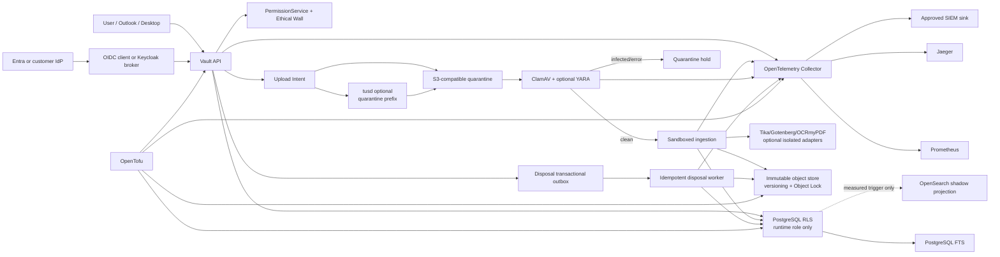
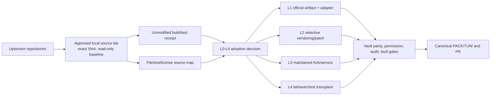
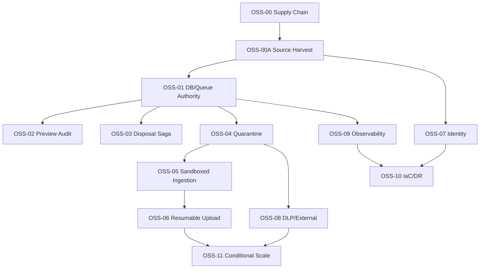

# AMIC Vault 엔터프라이즈 DMS OSS 활용 상세 계획

**상태:** Active execution plan — proposed ID의 just-in-time canonical 등록과 구현은
[OSS Terra 자율 순차 실행 권한](../execution/OSS_TERRA_AUTONOMOUS_EXECUTION_AUTHORITY.md)을
따른다.

**작성일:** 2026-07-21

**유일한 소스 기준선:** `origin/main` @ `91ac55a59b538cb57ecacecea4e69c92dc7c4cfd`

**대상:** 멀티테넌트 로펌용 엔터프라이즈 DMS SaaS

**필수 승인자:** Product Owner, Security, Records/Legal, Platform/Operations
**문서 성격:** 아키텍처 결정 + 실행 계획. 완료 원장, 배포 증명, go-live 승인서가 아니다.

**필수 동반 방법론:** [상당히 개발된 제품에 오픈소스 코드를 반영하는 Source-First 방법론](./oss-source-adoption-methodology-for-mature-products-2026-07-21.md). 이 계획에서 OSS를 조사·clone·채택·vendoring·fork·upgrade하는 모든 작업은 동반 방법론의 S0~S9와 L0~L4 계약을 따른다.

**Terra 구현용 상세 실행계획:** [GPT-5.6 Terra용 111 TUW 실행계획](./enterprise-dms-oss-terra-tuw-execution-plan-main-2026-07-21.md). 아래 `PROPOSED-OSS-00~11` portfolio를 30개 proposed sub-PACK/111개 TUW로 분해하고 실제 main 경로, Files create·modify·NOT-modify, 구현 순서, AND 검증, edge/stop/evidence를 고정한다.

## 0. 이 문서를 읽는 법

이 문서는 최신 `main`의 코드만 제품 사실로 인정한다. 다음 자료는 참고할 수 있지만 현재 구현으로 승격하지 않는다.

- 다른 worktree와 dirty branch의 수정·미추적 파일
- 과거 DMS uplift 계획의 `todo`, `candidate`, `receipt`
- 외부 AWS/Entra/모니터링 상태를 다시 확인하지 않은 문서
- source/CI 성공만으로 추론한 staging, production, cutover 상태

기존 `docs/handoff/dms-uplift-2026-07/`는 9인 단일 로펌 내부용 완화 정책을 전제로 SSO, BYOK, SIEM, 강화된 멀티테넌시 등을 제외했다. 본 계획은 그 원장을 덮어쓰지 않고, 현재 `main`을 엔터프라이즈 SaaS로 올리기 위한 별도 확장 계획이다.

`docs/package/**`는 읽기 전용이다. 본 계획의 제안 ID는 canonical TUW/PACK ID가 아니며,
실제 실행 전 live execution registry, canonical backlog, TUW detail contract와
append-only ledger 절차에 따라 등록해야 한다. 이 과정의 PACK별 사람 승인은 자율 순차
실행 권한으로 대체되며, frozen package는 수정하지 않는다.

이 문서의 “OSS 최대 활용”은 shortlist 저장소를 root URL로만 참고하는 뜻이 아니다. 모든 유력 후보를 제품 repository 밖의 승인된 source lab에 exact commit으로 로컬 clone하고, upstream 원본 build/test와 file-level source map을 만든 뒤, 새 제품 코드를 작성하기 전에 공식 artifact·adapter·selective vendoring·patch/fork·behavioral transplant 가능성을 순서대로 판정하는 것을 뜻한다. clone은 전수 조사 원칙이고 제품 코드 편입은 선택적 승인 사항이다.

## 1. 결론

### 1.1 채택할 아키텍처

AMIC Vault의 코어는 유지한다. shortlist에 오른 OSS는 모두 exact SHA로 로컬 clone해 source와 test를 먼저 조사하며, 제품 반영은 아래 우선순위로 최대한 재사용한다.

1. **L0 로컬 재사용:** 이미 main에 있는 PostgreSQL RLS/FTS, `pg-boss`, Zod, `AuditService.transaction`, `GraphSyncOutboxWorker`, S3 adapter를 먼저 재사용한다.
2. **L1 공식 artifact 소비:** upstream package/image/binary를 수정 없이 pin하고 얇은 adapter만 소유한다. ClamAV, YARA, Tika, OCRmyPDF, Gotenberg, tusd, Keycloak, OpenTelemetry, Syft, Trivy, Cosign, OpenTofu가 기본 대상이다.
3. **L2 선택적 source 채택:** clone한 permissive 또는 Legal 승인 source·schema·fixture 중 작고 안정된 범위만 provenance와 함께 vendor하거나 patch queue로 유지한다.
4. **L3 유지보수 fork/격리 서비스:** upstream 수정이 불가피하고 3년 owner·보안패치 SLA·merge cadence·source 제공·exit plan이 있을 때만 별도 fork/service로 운용한다.
5. **L4 behavioral/test transplant:** Alfresco, Mayan, Paperless-ngx, Docspell, Teedy의 상태·실패모드·테스트를 exact source에 결합해 추출하고 Vault authority에 맞춰 독립 구현한다.

새 제품 파일은 L0~L3가 부적합한 이유 또는 Vault 고유 authority임을 증명해야 한다. 설명 없는 `create_from_scratch`는 허용하지 않는다.

다음 authority는 OSS 제품으로 이전하지 않는다.

- Matter 멤버십과 ethical wall 판정
- document/search/AI permission 판정
- audit event의 규범적 기록
- legal hold와 disposal 승인
- tenant 경계와 data residency 결정
- 외부공유 승인 및 DLP 최종 판정

### 1.2 성공의 정의

다음이 모두 충족되어야 “엔터프라이즈 SaaS 준비 완료” 후보다.

- 권한 없는 사용자는 title, snippet, metadata, object, preview byte를 전혀 발견할 수 없다.
- 앱 런타임은 DB owner/superuser/BYPASSRLS 계정으로 기동할 수 없다.
- object storage와 PostgreSQL 사이의 중간 장애가 데이터 유실이나 거짓 disposal certificate를 만들지 않는다.
- 악성·미검사·스캔 실패 파일은 검색, preview, download, AI로 승격되지 않는다.
- 모든 문서 접근·변경·외부전송·권한변경·disposal은 audit 없이는 완료되지 않는다.
- dependency, image, SBOM, signature, provenance가 exact source SHA와 결합된다.
- 채택 후보의 upstream source가 exact commit으로 로컬 재현되고, 원본 build/test 결과와 source/test path가 기계가독 map에 고정된다.
- 신규 제품 파일마다 reuse-first 판정이 있고, copied source/fixture는 file-level license·변경 내역·NOTICE가 100% 추적된다.
- upstream test/failure scenario가 각 PACK의 acceptance와 연결되고, fork/patch에는 upgrade·rollback·exit owner가 존재한다.
- 실제 staging에서 SSO, restore, rollback, alert, tenant isolation이 재현된다.
- source, CI, staging, production, cutover, go-live는 서로 독립된 증거로 보고된다.

## 2. main 기준선과 현재 격차

### 2.1 확인된 기준선

| 항목 | main 기준 사실 |
|---|---|
| Source SHA | `91ac55a59b538cb57ecacecea4e69c92dc7c4cfd` |
| GitHub CI | exact SHA의 `ci`, `desktop` workflow 성공 |
| API 규모 | 소스 파일 532개, controller 51개, HTTP handler 302개 |
| DB | numbered migration 175개 + `TEMPLATE.sql` |
| Integration | `tests/integration` spec 123개 |
| DB 연결 | `apps/api/src`에서 `new Pool` 사용 파일 43개 |
| DB 환경변수 | `DATABASE_URL` 사용 파일 72개, `APP_DATABASE_URL` 사용 파일 0개 |
| Queue | `new PgBoss` 사용 파일 19개 |
| Python reproducibility | ingestion lockfile 0개 |
| Federation | auth 모듈 OIDC 구현 0개, 실제 SAML ACS route 0개 |
| File security | ClamAV/YARA/malware scan 구현 0개 |
| Telemetry | OpenTelemetry 구현 0개 |
| Supply-chain audit | `pnpm audit --prod`: 25건(High 9, Moderate 13, Low 3) |

### 2.2 P0 — 먼저 해결하지 않으면 안 되는 결손

| ID | 결손 | main 근거 | 실패 결과 |
|---|---|---|---|
| G-01 | disposal의 외부 삭제와 DB transaction 혼합 | `apps/api/src/modules/records/records.service.ts:1125-1274` | S3 삭제 후 DB rollback 시 원본만 소실 |
| G-02 | runtime DB authority 불명확 | `.env.example:7-8`, `infra/docker-compose.dev.yml:93-123`, 43개 개별 pool | RLS가 있어도 owner 실행 시 방어가 약화되고 연결 폭증 가능 |
| G-03 | worker가 `storage_url`을 직접 fetch | `workers/ingestion/app/extract_router.py:122-147` | SSRF, metadata/internal network 접근, 무제한 read |
| G-04 | API↔worker service identity 부족 | `apps/api/src/modules/document/extraction/extraction-dispatcher.ts:369-413` | tenant header 위조, 내부 endpoint 오용 |
| G-05 | ingestion root/egress/parser 격리 부족 | `workers/ingestion/Dockerfile:1-10`, `infra/docker-compose.dev.yml` | parser RCE의 blast radius 확대 |
| G-06 | malware quarantine 없음 | API/worker source 검색 결과 0 | 악성 파일이 preview/search/AI로 승격 |
| G-07 | Range preview 감사 누락 | `apps/api/src/modules/preview/preview.service.ts:159-172` | PDF viewer의 실질적 열람이 audit 없이 완료 |
| G-08 | 공급망 검사가 CI gate가 아님 | `.github/workflows/ci.yml` | High 취약점·image drift·secret 유입을 merge 전에 차단 못함 |

### 2.3 P1 — 엔터프라이즈 계약에 필요한 결손

| ID | 결손 | main 근거 | 필요한 결과 |
|---|---|---|---|
| G-09 | 실제 OIDC/SAML login 부재 | `apps/api/src/modules/auth/**`; enterprise는 provider metadata/control-plane만 보유 | Entra/다중 IdP federation E2E |
| G-10 | auth runtime validation/rate control 불균일 | `apps/api/src/modules/auth/auth.controller.ts`, `apps/api/src/main.ts` | bounded input, rate limit, lockout, 보안 헤더 |
| G-11 | tenant/role MFA 강제정책 부재 | `apps/api/src/modules/auth/mfa.policy.ts:11-14` | admin/tenant policy 기반 challenge |
| G-12 | readiness가 DB `SELECT 1` 중심 | `apps/api/src/modules/health/health.controller.ts:16-34` | DB/S3/queue/worker/KMS/scan dependency readiness |
| G-13 | staging deployment가 비활성 skeleton | `infra/ci/staging-deploy.yml:1-26` | 승인된 target에 반복 가능한 IaC apply |
| G-14 | SIEM/backup/BYOK가 control-plane 중심 | `apps/api/src/modules/enterprise/enterprise.service.ts` | 실제 delivery, restore, key operation 증거 |
| G-15 | upload crash orphan과 resumable upload 부재 | `apps/api/src/modules/document/document-upload.service.ts` | intent 기반 upload, orphan reconciliation, resume |
| G-16 | external DLP가 text 없음에 clean 반환 | `apps/api/src/modules/external/external.service.ts:1181-1193` | unscannable은 block/review로 fail-closed |
| G-17 | tenant provisioning/quota/residency 실행부족 | tenant/scale/enterprise source | region·quota·entitlement가 실행 시 강제됨 |

### 2.4 현재 강점 — 교체하지 말고 지킬 부분

- Permission-before-search와 firm-open membership parity
- Matter 중심 권한, ethical wall, break-glass
- immutable document version과 SHA-256 무결성
- audit transaction 패턴과 append-only 제약
- PostgreSQL FTS와 한국어 보완 검색
- legal hold, retention, disposal approval의 control-plane
- HWP/HWPX/DOCX/PDF/EML/MSG ingestion 코드
- Outlook filing, DLP, AI permission gate
- `graph_sync_outbox`의 RLS, retry, `FOR UPDATE SKIP LOCKED`, dead-letter 패턴

## 3. 선택지와 결정

### Option A — Alfresco/Mayan/Paperless 등으로 코어 교체

| 차원 | 평가 |
|---|---|
| 초기 기능량 | 높음 |
| Matter/ethical-wall 적합성 | 낮음 |
| 기존 migration 비용 | 매우 높음 |
| permission parity 증명 | 매우 어려움 |
| 결정 | 기각 |

범용 DMS의 문서/폴더 모델을 Vault의 Matter 권한 authority에 맞추기 위해 다시 광범위한 custom layer가 필요하다. 기존 감사·권한·migration 자산을 버릴 이유가 없다.

### Option B — 모두 자체 구현

| 차원 | 평가 |
|---|---|
| 제품 authority 통제 | 높음 |
| 보안도구/관측/파일처리 개발비 | 불필요하게 높음 |
| 유지보수 | 높음 |
| 결정 | 기각 |

malware signature, SBOM, tracing, federation protocol, resumable upload까지 직접 만들 필요가 없다.

### Option C — Vault authority + source-first selective OSS adoption

| 차원 | 평가 |
|---|---|
| 권한·감사 보존 | 높음 |
| OSS 재사용량 | 높음 |
| upstream source·test 활용 | 높음 — 전 후보 exact-SHA clone과 source map 의무 |
| 격리 가능성 | 높음 |
| 운영 복잡도 | 중간 |
| 결정 | **채택** |

hostile parser는 sidecar/process boundary에 두고, permissive library도 PermissionService나 AuditService를 우회하지 못하게 한다. 모든 후보는 승인된 source lab에 clone하여 upstream 원본 build/test와 file-level source/test map을 만든다. official artifact를 그대로 소비할 수 있으면 fork보다 우선하고, 직접 source를 가져와야 할 때만 L2/L3 provenance와 patch budget을 적용한다. GPL/AGPL 컴포넌트의 sidecar 분리는 보안·장애 격리 수단이지 라이선스 의무를 없애는 수단이 아니다. 직접 복사, 수정 배포, 네트워크 서비스 제공 여부를 포함한 법률 검토와 source/notice 의무 확인이 선행돼야 한다.

## 4. 목표 아키텍처



runtime과 별도로 source adoption control-plane을 둔다. upstream clone은 제품 build context에 포함하지 않는다.



source lab은 조사 증거이고 제품 authority가 아니다. source clone, upstream baseline, 제품 integration, exact-head CI, staging, production은 각각 별도 truth line으로 보고한다.

### 4.1 저장소 상태 계약

파일은 다음 상태를 갖는다. 기존 Document 11-state enum을 임의 확장하지 않고, 별도 file-security 상태로 관리한다.

```text
UPLOAD_INTENT_CREATED
  -> QUARANTINE_UPLOADING
  -> QUARANTINED
  -> SCAN_PENDING
  -> SCAN_CLEAN
  -> EXTRACTION_PENDING
  -> PROMOTED

SCAN_INFECTED | SCAN_ERROR | HASH_MISMATCH
  -> SECURITY_HOLD
```

`PROMOTED` 전에는 preview, download, search indexing, AI prep, external delivery를 모두 차단한다.

### 4.2 disposal 상태 계약

```text
APPROVED
  -> EXECUTION_PENDING
  -> INVENTORY_SEALED
  -> PURGING
  -> STORAGE_CONFIRMED
  -> DB_FINALIZING
  -> DISPOSED

어느 단계든 legal hold 또는 불명확한 storage 응답
  -> BLOCKED_REVIEW
```

외부 object 삭제는 PostgreSQL transaction 안에서 rollback 가능한 동작처럼 취급하지 않는다. 먼저 삭제 대상 version inventory를 봉인하고, 각 object/version의 결과 receipt를 기록한 뒤 certificate를 최종화한다.

## 5. OSS 포트폴리오

라이선스는 2026-07-21 공식 저장소 메타데이터 기준이다. 실제 도입 시 선택한 release tag의 `LICENSE`, transitive license, image digest를 다시 검증한다.

### 5.1 즉시 채택/재사용

| 컴포넌트 | 라이선스 | 사용 위치 | 채택 방식 | 금지 경계 |
|---|---|---|---|---|
| PostgreSQL RLS/FTS | PostgreSQL | tenant isolation, search | 기존 구현 강화 | RLS를 앱 후처리로 대체 금지 |
| `pg-boss` | MIT | queue/scheduler | 기존 코드 통합·singleton화 | disposal 정합성을 queue 단독 전달에 의존 금지 |
| Zod | MIT | API/worker contract | 기존 shared schema 확대 | type-only DTO를 검증으로 간주 금지 |
| uv | Apache-2.0 | Python lock/sync | `uv.lock`, `uv sync --frozen` | floating dependency 배포 금지 |
| ClamAV | GPL-2.0 | malware scan | `clamd` sidecar + `INSTREAM` | 앱 binary에 결합하거나 scan 실패를 clean 처리 금지 |
| YARA | BSD-3-Clause | macro/suspicious rule 보조 | optional rule worker | AV 대체·본문 로그 기록 금지 |
| OpenTelemetry Collector | Apache-2.0 | traces/metrics/log routing | agent/gateway | 본문, query, filename, token 수집 금지 |
| Prometheus | Apache-2.0 | metrics/SLO | internal-only scrape | public `/metrics` 노출 금지 |
| Jaeger | Apache-2.0 | distributed tracing | internal backend | span attribute에 고객 원문 금지 |
| Syft | Apache-2.0 | SBOM | source/image별 CycloneDX/SPDX | unpinned image 금지 |
| Trivy | Apache-2.0 | dependency/image/IaC/secret scan | merge/release gate | 무기한 ignore 금지 |
| Cosign | Apache-2.0 | image/SBOM attestation | keyless 또는 approved KMS key | 서명 없는 production deploy 금지 |
| Gitleaks | MIT | git secret scan | full history + diff gate | baseline로 신규 secret 은폐 금지 |
| Semgrep CE | LGPL-2.1 | TypeScript/Python SAST | pinned CLI/rules | 라이선스 미확인 community rules 무단 사용 금지 |
| OpenTofu | MPL-2.0 | IaC | encrypted remote state | cloud target 승인 전 실제 resource apply 금지 |

### 5.2 선행조건 충족 후 pilot

| 컴포넌트 | 라이선스 | 목적 | pilot 조건 | 승격 조건 |
|---|---|---|---|---|
| Gotenberg | MIT | LibreOffice/PDF conversion 격리 | secure ingestion 이후 | 한국어 폰트·충실도·timeout benchmark 통과 |
| Apache Tika | Apache-2.0 | 미지원 형식 fallback | scan clean + disposable sandbox | parser coverage 증가가 CVE/운영비보다 큼 |
| OCRmyPDF | MPL-2.0 | scanned PDF deskew/OCR | scan clean + sandbox | 원본 불변, derived PDF hash/audit 검증 |
| Microsoft Presidio | MIT | DLP second engine | 한국형 custom recognizer 평가셋 | recall/precision 승인, 최종정책은 Vault가 유지 |
| tusd | MIT | resumable upload | quarantine authority 완료 | 권한·quota·abandon cleanup·hash 검증 통과 |
| `openid-client` | MIT | 직접 Entra OIDC | 초기 고객이 Entra/OIDC 중심 | issuer/nonce/PKCE/tenant negative E2E |
| Keycloak | Apache-2.0 | OIDC/SAML/LDAP broker | 2개 이상 protocol/IdP 요구 | HA, backup, realm isolation, upgrade rehearsal |
| SPIRE | Apache-2.0 | workload mTLS identity | Kubernetes/VM platform 확정 | 자동 rotation과 outage fallback 검증 |
| OpenBao | MPL-2.0 | cloud-neutral Transit/BYOK | on-prem/sovereign 요구 확정 | HA/unseal/backup/key-loss drill |
| PgBouncer | ISC-style, release 재확인 | DB connection budget | central pool 후에도 budget 초과 | transaction/session mode 호환성 테스트 |

### 5.3 배포 프로필에 따라 조건부 채택

| 프로필 | OSS | 사용 조건 |
|---|---|---|
| AWS managed | OpenTofu + managed RDS/S3/KMS/Secrets | 실제 AWS가 승인된 production target일 때 |
| Sovereign/on-prem | CloudNativePG(Apache-2.0) + pgBackRest(MIT) + OpenBao + 검증된 S3 Object Lock backend | Kubernetes 운영역량과 24x7 owner가 승인될 때 |
| Search scale | OpenSearch(Apache-2.0) | PG FTS SLO 실패와 permission parity shadow proof가 모두 존재할 때 |
| Co-editing | Collabora/ONLYOFFICE | ADR-018 기능·라이선스·WOPI 보안 gate 통과 후 |

### 5.4 유사 DMS/ECM 코드베이스에서 가져올 것

유사 제품은 모두 승인된 source lab에 exact commit으로 로컬 clone하고 upstream 원본 build/test를 먼저 실행한다. 전체를 제품 core로 fork하지는 않으며, 기능·상태·실패모드·테스트 fixture를 file/test 단위로 조사해 Vault의 Matter 중심 authority에 맞춰 재사용한다. 라이선스는 저장소 기본 브랜치의 현재 표시 기준이며, 실제 도입은 반드시 선택 tag/commit의 파일 단위 라이선스를 다시 판정한다.

| 프로젝트 | 현재 소스/라이선스 | Vault와 닮은 부분 | 가져올 코드·패턴 | 채택 방식과 경계 | 연결 PACK |
|---|---|---|---|---|---|
| Alfresco Community Repository | Java, LGPL-3.0 | content model, versioned repository, REST/CMIS, audit/records 개념 | content dictionary, version/association 계약, canned-query와 repository service 분리, destruction/hold/version fixture | L4 기본. Java core를 embed하지 않음. LGPL source 직접 사용은 L2/L3 Legal 승인 필요 | OSS-03, OSS-10, OSS-11 |
| Mayan EDMS | Django/Python, GPL-2.0; 공식 source는 GitLab | capture, OCR, preview, metadata type, workflow, RBAC, antivirus | source→document/version 처리 단계, metadata schema, workflow event, scan failure 상태와 operator remediation 패턴 | L4 기본. GitHub mirror는 근거로 쓰지 않고 공식 GitLab exact SHA를 사용 | OSS-04, OSS-05, OSS-08 |
| Paperless-ngx | Django/Angular, GPL-3.0 | OCR intake, original 보존, PDF/A derivative, mail rules, workflow, integrity checker | consumer/parser registry, Tika/Gotenberg/OCRmyPDF 배치 topology, duplicate/hash 검사, archive sanity-check tests | L4 기본, fixture는 승인 시 L2. enterprise authority로 배포하지 않음 | OSS-00A, OSS-04~06, OSS-09 |
| Docspell | Scala/Elm, AGPL-3.0-or-later | REST server와 heavy job executor 분리, mail ingestion, multi-file item, optional PG/Solr search | REST↔job-executor job contract, idempotent task, integrity 상태, attachment aggregate, search backend 전환 패턴 | L4 기본. AGPL network-use 의무 검토 전 L2/L3 도입 금지 | OSS-05, OSS-09, OSS-11 |
| Teedy | Java, GPL-2.0 | custom/Dublin Core metadata, file versioning, quota, audit, workflow, webhook | typed custom field validation, quota acceptance, version timeline, audit completeness와 async-delete 실패모드 | L4 negative reference. public-link와 permission 코드 및 GPL 직접 복사 금지 | OSS-03, OSS-06, OSS-09 |

2026-07-21 조사에서 확인한 source-harvest seed는 다음과 같다. 이 값은 계획 근거이며 실행 pin이 아니다. OSS-00A는 실행 직전 다시 fetch해 tag, full SHA, tree, license hash, release 상태를 확정한다.

| upstream | 조사 SHA | exact source/test seed | 우선 재사용 결과 |
|---|---|---|---|
| Paperless-ngx | `80210bd3bf545bc68824e7f8960528df3cd326be` | `src/documents/consumer.py`, `sanity_checker.py`, `tests/test_consumer.py`, `tests/test_sanity_check.py` | parser registry, original/archive, version/checksum, orphan·integrity tests |
| Mayan EDMS | `e9a42b3fba8db186eefb65a128484713648ee9ae` | `mayan/apps/file_metadata_clamav/drivers.py`, source/workflow/document-version tests | clean/infected/error 분기, source→version, remediation |
| Alfresco Community | `ab79d6f77fbb7d8a50629d4a3236c70dbba7071f` | records destruction/hold/version actions and tests | capability, inventory, tombstone/metadata, destruction fault contract |
| Docspell | `47f378d8ac53ddfa2515e1044058c296ff04c1fd` | `FileIntegrityCheckTask.scala`, process/housekeeping/job tests | checksum ok/failed/not-found, cancellation, idempotent job |
| Teedy | `17cf68f95a12792031266988f03f9cd861e4aa7a` | `AuditLogDao.java`, `FileSizeService.java`, deletion listener, workflow tests | audit/quota completeness와 unsafe async deletion 비교 |
| tusd | `ad7fb31344e0629cb8a5af67bb1e630f90507890` | `pkg/hooks/**`, handler hook tests, S3 store tests | hook schema, duplicate/delayed finish, storage behavior |
| Gotenberg | `0c8d681c354cefa9c4833edffc16a69ba98d98ba` | `pkg/modules/api/**`, LibreOffice/PDF engine tests, `.bruno` requests | conversion conformance, timeout/error fixture |
| ClamAV | `a93732350bb6be75821f67c6d4423fcf723232de` | clamd protocol/client/config/tests | INSTREAM, result taxonomy, signature freshness |

각 프로젝트별로 다음 산출물을 만든 뒤에만 패턴을 제품 backlog로 옮긴다.

1. exact upstream repository, tag, commit SHA, release date, license hash
2. 조사한 upstream 파일·테스트 경로와 기능 계약
3. Vault 대응 코드와 권한/audit 차이표
4. L0~L4 또는 `reject` 채택 결정과 신규 구현보다 유리한 TCO 근거
5. 보안 advisory, maintainer activity, upgrade/rollback owner
6. 가져온 fixture나 코드가 있다면 원 출처·license·수정 내역·SPDX/NOTICE

### 5.5 코드 재사용 수준과 라이선스 게이트

모든 L1~L4 후보는 먼저 exact-SHA clone, upstream 원본 build/test, file/test source map을 거친다. 아래 레벨은 clone 여부가 아니라 제품이 upstream을 소유·실행하는 방식을 나타낸다.

| 수준 | 의미 | 기본 적용 대상 | 요구사항 |
|---|---|---|---|
| L0 Existing local reuse | main의 검증된 모듈을 그대로 재사용·일원화 | RLS/FTS, PermissionService, AuditService, S3 adapter, `pg-boss`, Zod | 기존 test와 authority 유지, 중복 adapter 생성 금지 |
| L1 Official artifact consumption | 공식 package/image/binary를 수정 없이 pin하고 얇은 adapter로 사용 | ClamAV, Tika, Gotenberg, OCRmyPDF, tusd, Keycloak, OTel, Syft/Trivy/Cosign | version/digest, source↔artifact 대응, SBOM, NOTICE, bounded schema, health/rollback |
| L2 Selective source adoption | clone한 작은 source/schema/fixture를 vendor하거나 patch queue로 사용 | permissive helper, protocol schema, 공식 fixture; 승인된 MPL/file-level source | file-level provenance, license header/hash, local delta, upstream parity test, update owner |
| L3 Maintained fork or isolated modified service | 수정 upstream을 별도 fork/service로 장기 유지 | 제품 필수 patch가 필요한 converter/broker | fork remote, patch/security SLA, merge cadence, source offer/NOTICE, HA/backup, exit plan |
| L4 Behavioral/test transplant | source를 복사하지 않고 동작·상태·실패모드·테스트 계약을 독립 구현 | Alfresco/Mayan/Paperless/Docspell/Teedy DMS 패턴 | exact source/test map, copied-source 판정, behavior parity와 Vault negative tests |

`Core replacement`는 L4가 아니라 별도 `X-Core` 결정이며 현재 기각한다. Matter permission/audit/tenant/data migration parity, 3년 fork owner, rollback/export가 독립적으로 증명되기 전에는 검토하지 않는다.

“최대한 활용”은 후보 clone과 source/test 조사를 빠짐없이 수행하고, 검증된 OSS가 맡을 수 있는 비차별화 영역을 넓히며, 제품이 소유할 delta를 최소화하는 것이다. 다음 규칙을 적용한다.

- 신규 코드를 쓰기 전에 `L0 → L1 → L2 → L3 → L4 → reject` 순서의 판정을 기록한다.
- permissive 코드라도 한 줄 이상 가져오면 source URL, commit, file path, license, modification을 provenance manifest에 기록한다.
- GPL/AGPL/LGPL 코드는 Legal이 승인한 모드 외에는 Vault TypeScript/Python 소스에 복사하지 않는다.
- 컨테이너 경계는 라이선스 면책이 아니다. 배포·수정·상호작용 방식별 의무를 따로 판정한다.
- upstream fixture는 고객자료 없이 재현 가능하고 라이선스가 허용될 때만 vendoring한다.
- fork가 필요하면 upstream tracking, security patch SLA, merge cadence, exit plan을 먼저 지정한다.
- upstream의 permission/search 결과를 그대로 신뢰하지 않고 Vault PermissionService 앞뒤로 negative test를 둔다.
- vendored delta가 원본의 20%를 넘거나 3개 release 연속 충돌하면 L2를 중단하고 L1 adapter, L3 fork, L4 독립 구현을 재판정한다.
- 새 파일은 `implements_upstream_contract`, `ports_approved_source`, `implements_behavioral_spec`, `vault_specific_authority`, `no_upstream_candidate` 중 하나의 근거를 가진다.

### 5.6 Source-first lifecycle과 필수 산출물

모든 OSS 관련 PACK은 동반 방법론의 S0~S9를 따른다.

| 단계 | 이 계획의 필수 결과 | 다음 단계 차단 조건 |
|---|---|---|
| S0 Product baseline | KEEP/AUGMENT/GAP/UNKNOWN authority map | 다른 branch·dirty 파일 혼입 |
| S1 Acquire | URL, tag, full SHA/tree, license hash가 고정된 local clone | moving ref 또는 license 불명확 |
| S2 Reproduce | upstream 무수정 build/test receipt | 원인 미분류 실패 또는 실데이터 필요 |
| S3 Map | exact source/test/fixture path와 Vault target | repository root 링크만 존재 |
| S4 Decide | L0~L4, TCO, SaaS/on-prem license, owner | 배포 profile·의무 미승인 |
| S5 Contract | bounded adapter/behavior/test contract | upstream ACL/ID/audit 직접 신뢰 |
| S6 Spike | 최소 delta, shadow/fault/rollback proof | core 광범위 수정 필요 |
| S7 Integrate | provenance·SBOM·parity·negative suite | scope/patch 폭증 |
| S8 Operate | update/CVE/license/patch cadence | EOL·owner·SLA 부재 |
| S9 Exit/Upgrade | version 승격 또는 철수 rehearsal | export/rollback 불가 |

제안 기계가독 파일:

- `security/oss-source-map.yml`: upstream SHA/tree/path/test/license와 Vault PACK/target/adoption mode
- `security/oss-adoption-decisions.yml`: TCO score, L0~L4, 승인자, SaaS/on-prem 판정
- `security/oss-provenance.yml`: 실제 포함·배포하는 source/binary/image/fixture와 수정 내역
- `third_party/NOTICE.md`: 실제 delivery 의무
- `third_party/patches/<component>/**`: base SHA, patch series, upstream issue/PR, owner, expiry/exit

`security/oss-source-map.yml`의 최소 row는 다음과 같다.

```yaml
id: <component>
upstream_repo: <url>
upstream_commit: <full-sha>
upstream_tree: <tree-sha>
upstream_paths: []
upstream_tests: []
license_spdx: <spdx>
license_sha256: <hex>
adoption_mode: L0|L1|L2|L3|L4|reject
vault_packs: []
vault_targets: []
copied_source: false
reused_behaviors: []
security_deviations: []
update_owner: <role>
refresh_cadence: <cadence>
exit_plan: <reference>
```

repository root URL만 있거나 upstream test path가 비어 있는데 “최대 활용” 완료를 주장할 수 없다. 실제 코드가 필요 없는 L0/reject도 그 이유와 조사 결과를 row에 기록한다.

### 5.7 reference-only 또는 현재 기각

- Alfresco, Mayan EDMS, Paperless-ngx, Docspell, Teedy: 제품 코어로 채택하지 않는다. 위 매트릭스의 패턴만 승인된 수준으로 재사용한다.
- Temporal/Kafka/Redis: 현재 disposal과 scheduler는 PostgreSQL outbox + 기존 `pg-boss`로 충분하다. 측정된 요구가 생기기 전 추가하지 않는다.
- Tika/OCRmyPDF: 공식 문서가 스스로 security boundary가 아니라고 명시한다. malware sanitizer로 사용하지 않는다.
- Presidio: 공식 문서가 모든 PII 탐지를 보장하지 않는다고 명시한다. 단독 DLP authority로 사용하지 않는다.
- Grafana와 ONLYOFFICE 등 AGPL 계열: 내부 운영 가능성은 있으나 배포·수정 형태에 대한 법률 검토 전 채택하지 않는다.
- Keycloak SCIM: 현재 preview 기능이다. production provisioning authority로 바로 사용하지 않는다.

## 6. 제안 실행 PACK

아래 `PROPOSED-OSS-*`는 계획 식별자다. canonical PACK/TUW 등록 전 구현 금지다.

정확히는 아래 항목은 수 주 규모의 **macro portfolio**이며 한 브랜치·한 PR로 실행하는 canonical PACK이 아니다. 실제 구현 단위는 동반 [Terra TUW 실행계획](./enterprise-dms-oss-terra-tuw-execution-plan-main-2026-07-21.md)의 30개 proposed sub-PACK/111개 TUW다. 그 ID도 canonical이 아니므로 live registry·backlog·detail contract 등록 후에만 실행한다. 이 등록과 순차 구현은 자율 실행 권한 아래 PACK별 사람 승인 없이 진행한다.

OSS-00과 OSS-00A를 제외한 모든 PACK은 시작 전에 관련 `security/oss-source-map.yml` row와 adoption decision이 승인돼야 한다. 각 PACK은 source map에 지정된 upstream baseline을 재생하고, 재사용한 code/test/fixture/behavior와 의도적으로 거부한 부분을 evidence에 포함한다.

| PACK | 필수 upstream/source-first input | 최소 재사용 또는 거부 증명 |
|---|---|---|
| OSS-00 | 현재 lockfile/image/workflow와 도입 도구 official source | package/image provenance와 license policy |
| OSS-00A | 전체 shortlist | clone, baseline, source/test map, L0~L4 decision |
| OSS-01 | L0 DB/queue code, `pg-boss`; PgBouncer는 trigger 시 official source | existing pool/transaction code 재사용과 신규 파일별 L0 부적합 근거 |
| OSS-02 | L0 preview/audit/permission code | external source 불필요 근거와 existing contract 재사용 |
| OSS-03 | Alfresco destruction/hold/version, Docspell integrity, Teedy deletion negative case | disposal/integrity fault scenario와 Vault 강화 차이 |
| OSS-04 | ClamAV protocol/tests, Mayan antivirus driver/tests, Paperless integrity | scan result taxonomy, quarantine/promotion tests |
| OSS-05 | Paperless consumer/sanity, Mayan source/workflow, Gotenberg/Tika/OCRmyPDF tests | parser registry, archive sanity, converter conformance |
| OSS-06 | tusd hooks/S3 tests, Paperless orphan patterns | hook schema, duplicate/delayed finish, orphan reconciliation |
| OSS-07 | openid-client/Keycloak source/examples/security tests | issuer/nonce/PKCE/broker/deprovision conformance |
| OSS-08 | Presidio recognizer/evaluation, Gotenberg derivative tests, Teedy metadata patterns | evaluation corpus contract와 derivative integrity |
| OSS-09 | OTel Collector config/tests, Docspell job/housekeeping, Teedy audit patterns | telemetry pipeline와 sensitive-data negative tests |
| OSS-10 | OpenTofu, CloudNativePG, pgBackRest, OpenBao official examples/tests | IaC/backup/restore/key-loss conformance |
| OSS-11 | OpenSearch security/search tests와 선택 co-editor source/tests | permission parity, callback/lock/version/rollback conformance |

공통 PACK evidence에는 `upstream-lock.json`, `upstream-baseline.json`, `source-map-report.json`, `upstream-test-reuse.json`, `provenance-validation.json`, `product-parity-results.json`을 포함한다. 해당 없는 파일은 생략하지 않고 `not_applicable` 사유를 기록한다.

### PROPOSED-OSS-00 — OSS Governance & Supply Chain Baseline

**우선순위:** P0

**예상:** 1~2주

**선행:** 없음

**Risk:** H. Next major upgrade가 필요하면 별도 Risk=C review

**목표:** main의 source, dependency, image, SBOM, signature를 하나의 exact-SHA release identity로 묶는다.

#### 재사용/도입

- 재사용: `pnpm-lock.yaml`, GitHub Actions, 기존 Dockerfiles
- 도입: uv, Syft, Trivy, Cosign, Gitleaks, Semgrep CE

#### 제안 파일 범위

- Modify: `.github/workflows/ci.yml`
- Create: `.github/workflows/supply-chain.yml`
- Create: `workers/ingestion/uv.lock`
- Create: `tools/security/check-vulnerability-policy.mjs`
- Create: `tools/security/check-oss-license-policy.mjs`
- Create: `tools/security/check-source-provenance.mjs`
- Create: `security/oss-allowlist.yml`
- Create: `security/oss-provenance.yml`
- Create: `third_party/NOTICE.md`
- Create only if required: `.gitleaks.toml`, `.semgrep.yml`, `.trivyignore`
- NOT modify: `docs/package/**`, permission/search business code

#### Work items

1. 모든 직접 dependency, image, vendored fixture/snippet에 upstream URL, exact commit/tag, source path, SPDX, license hash, 수정 내역을 기록한다.
2. source clone·vendoring·fork·fixture에 적용할 L0~L4, SaaS/on-prem license, NOTICE/source-offer 정책을 승인한다. 실제 upstream clone과 file/test audit는 OSS-00A에서 수행한다.
3. `pnpm audit --prod` 25건을 package, advisory, reachability, remediation owner로 분류한다.
4. Multer는 호환 가능한 patched line으로 올리고 nested-field/resource-exhaustion 회귀를 추가한다.
5. Next.js는 현재 지원되는 patched major로 upgrade spike를 수행한다. 단순 override로 숨기지 않는다.
6. Python 의존성을 `uv.lock`에 고정하고 `uv sync --frozen`으로 CI 설치를 변경한다.
7. API/web/worker image 각각 Syft SBOM을 생성한다.
8. Trivy로 source, lockfile, image, IaC를 스캔한다.
9. Gitleaks full-history와 PR diff scan을 분리한다.
10. Semgrep은 로컬 rule과 라이선스가 승인된 rule만 사용한다.
11. Cosign으로 image digest와 SBOM/provenance를 attest한다.
12. false positive는 만료일·owner·근거가 있는 VEX/exception만 허용한다.

#### Verification

```bash
pnpm install --frozen-lockfile
pnpm lint
pnpm typecheck
pnpm test
pnpm build
pnpm audit --prod --audit-level high
uv sync --frozen --project workers/ingestion --extra test
uv run --project workers/ingestion pytest workers/ingestion/tests
gitleaks git --redact
semgrep scan --config .semgrep.yml
syft dir:. -o cyclonedx-json
trivy fs --scanners vuln,misconfig,secret .
```

#### 완료 조건

- 미분류 High 0건
- production 도달 High 0건 또는 만료 가능한 승인 VEX 존재
- 세 image의 SBOM·scan·signature가 동일 SHA/digest를 가리킴
- 모든 직접 사용 코드/fixture의 provenance와 NOTICE가 기계 검증됨
- 승인되지 않은 strong-copyleft 코드가 Vault source tree에 0건
- Python lock 재현 설치 2회 hash 동일
- exact-main 표준 검증 green

#### 중단 조건

- patched Next major가 현재 React/Next contract와 양립하지 않음
- license가 불명확하거나 commercial SaaS 조건과 충돌
- 취약점 우회를 위해 test/route/security 기능을 약화해야 함

#### 증적

- CI artifact: `artifacts/enterprise-dms-oss/<sha>/OSS-00/`
- Governance policies: `artifacts/enterprise-dms-oss/<sha>/OSS-00/governance/`
- Human-safe receipt proposal: `docs/execution/evidence/enterprise-dms-oss/OSS-00/`

### PROPOSED-OSS-00A — Upstream Source Harvest & Adoption Map

**우선순위:** P0

**예상:** 2~3주

**선행:** OSS-00

**Risk:** H. L2 vendoring 또는 L3 fork 후보가 생기면 해당 결정은 Risk=C 독립 리뷰

**목표:** 모든 shortlist OSS를 exact commit으로 로컬 재현하고, product code를 작성하기 전에 upstream source/test/fixture와 Vault target의 기계가독 대응표 및 L0~L4 결정을 완성한다.

#### 재사용/도입

- 재사용: Git clone/worktree, upstream 자체 build/test 도구, OSS-00의 license/provenance policy
- 조사 대상: Alfresco, Mayan, Paperless-ngx, Docspell, Teedy, ClamAV, Tika, Gotenberg, OCRmyPDF, tusd, openid-client, Keycloak, Presidio, SPIRE, OpenBao, OTel Collector, OpenTofu, CloudNativePG, pgBackRest, OpenSearch와 조건부 co-editor
- 신규 third-party package를 이 PACK의 verifier 구현 편의를 위해 추가하지 않는다. Node 표준 library와 기존 dependency로 충분하지 않으면 별도 승인한다.

#### Source lab 경계

- 제품 repository 밖의 승인된 `OSS_RESEARCH_ROOT`에 component별 clone을 둔다.
- 기준 clone은 detached full SHA와 read-only baseline으로 유지한다.
- 실험 수정은 별도 worktree/branch 또는 `third_party/patches`의 재현 가능한 patch로만 만든다.
- clone 전체, upstream `.git`, 예제 secret/data는 Vault source tree나 image build context에 포함하지 않는다.
- source lab 접근권한·보존기간·artifact export 위치를 Platform/Security가 승인한다.

#### 제안 파일 범위

- Create: `security/oss-source-map.yml`
- Create: `security/oss-adoption-decisions.yml`
- Create: `tools/oss/verify-upstream-lock.mjs`
- Create: `tools/oss/verify-source-map.mjs`
- Create: `tools/oss/check-reuse-first.mjs`
- Create: `docs/architecture/oss-adoption-decisions/<component>.md`
- Create: `third_party/patches/README.md`
- Modify: `security/oss-provenance.yml`, `third_party/NOTICE.md` only when 실제 inclusion/delivery가 확정됨
- NOT modify: `docs/package/**`, application/runtime code, DB migration, permission/search/audit business code

#### Work items

1. S0: 현재 main의 authority와 gap을 `KEEP`, `AUGMENT`, `REPLACE_CANDIDATE`, `GAP`, `UNKNOWN`으로 고정한다.
2. S1: 각 후보의 official repository, tag, full SHA/tree, release date, license file hash, submodule/LFS/generated/vendor 상태를 기록하고 source lab에 clone한다.
3. S2: upstream 무수정 build/test를 실행하고 command, environment, pass/fail/skip, network/service/secret 의존성, artifact hash를 보존한다.
4. S3: public entry point, state/persistence, queue/retry/idempotency, permission/auth, audit/log, parser/network, error/remediation, unit/integration/negative/fault test path를 exact blob URL로 매핑한다.
5. 각 downstream PACK에 최소 하나의 upstream source/test input 또는 `L0/no-applicable-upstream` 근거를 연결한다.
6. source/test/fixture별 `L0`, `L1`, `L2`, `L3`, `L4`, `reject`를 결정하고 기능·architecture·authority·test·security·license·maintenance·code-deletion TCO를 채점한다.
7. SaaS-only, on-prem distribution, modified network service별 license/NOTICE/source-offer 의무를 분리한다.
8. upstream test를 `unchanged baseline`, `approved port`, `fixture reuse`, `behavioral scenario`, `reject`로 분류한다.
9. 기존 계획의 모든 `Create` 항목에 reuse-first 근거를 부여한다.
10. L2 후보는 file-level provenance와 update path를, L3 후보는 fork remote, patch/security SLA, merge cadence, source 제공, HA/backup, exit plan을 작성한다.
11. source map과 adoption decision을 CI에서 schema·full SHA·path·license·owner 누락 없이 검증한다.
12. 이 PACK에서는 product code를 가져오거나 수정하지 않는다. source adoption은 해당 후속 PACK의 승인된 파일 범위에서만 수행한다.

#### Verification

```bash
node tools/oss/verify-upstream-lock.mjs security/oss-source-map.yml
node tools/oss/verify-source-map.mjs security/oss-source-map.yml
node tools/oss/check-reuse-first.mjs docs/architecture/enterprise-dms-oss-uplift-plan-main-2026-07-21.md
```

각 upstream row는 manifest에 기록된 clone에서 다음을 재확인한다.

```bash
git -C <approved-clone-path> rev-parse HEAD
git -C <approved-clone-path> rev-parse 'HEAD^{tree}'
git -C <approved-clone-path> status --short
```

upstream별 build/test command는 source map이 가리키는 adoption decision 문서에서 실행한다. 서로 다른 build system을 하나의 가짜 공통 명령으로 숨기지 않는다.

#### 완료 조건

- shortlist 100%에 official URL, full SHA/tree, license hash, owner, refresh cadence 존재
- L1~L4 후보 100%에 원본 build/test 결과와 exact source/test path 존재
- 후속 OSS-01~11 각각 upstream input 또는 명시적 L0/no-candidate 근거 존재
- 계획의 모든 `Create` 항목에 reuse-first 분류와 근거 존재
- copied source/fixture 0건. 실제 유입은 후속 PACK에서만 승인
- L2/L3 후보는 update/rollback/exit와 license delivery 의무 승인
- repository root 링크만 있고 file/test path가 없는 adoption row 0건
- product source, upstream source, upstream baseline, product integration evidence가 분리됨

#### 중단 조건

- official source 또는 full SHA/tree/license hash를 고정할 수 없음
- upstream 원본 build/test 실패를 분류할 수 없음
- source lab이 product build context나 secret/customer-data 영역과 분리되지 않음
- sidecar/API 분리를 license 면책으로 전제해야만 채택 가능
- fork owner, security SLA, merge cadence, exit plan이 없음
- downstream PACK이 source map 없이 신규 제품 코드를 먼저 요구함

#### 증적

- `artifacts/enterprise-dms-oss/<sha>/OSS-00A/upstream-lock.json`
- `artifacts/enterprise-dms-oss/<sha>/OSS-00A/upstream-baselines/`
- `artifacts/enterprise-dms-oss/<sha>/OSS-00A/source-map-report.json`
- `artifacts/enterprise-dms-oss/<sha>/OSS-00A/adoption-decisions.json`
- `artifacts/enterprise-dms-oss/<sha>/OSS-00A/upstream-test-reuse.json`
- `artifacts/enterprise-dms-oss/<sha>/OSS-00A/reuse-first-report.json`

### PROPOSED-OSS-01 — Runtime DB & Queue Authority

**우선순위:** P0

**예상:** 2~4주

**선행:** OSS-00A

**Risk:** C

**목표:** 모든 API runtime query가 `vault_app`과 중앙 pool/transaction context를 사용하게 한다.

#### 재사용/도입

- 재사용: PostgreSQL RLS, `AuditService.transaction`, `pg-boss`, existing process-role helpers
- 조건부: PgBouncer는 이 PACK 완료 후 connection budget이 초과될 때만 pilot

#### Source-first 적용

- OSS-00A가 existing `new Pool`/`PgBoss` 경로와 upstream `pg-boss` contract를 매핑하고, 공용 provider로 삭제 가능한 중복 코드를 먼저 식별한다.
- 제안된 database/queue 신규 파일은 L0 코드로 해결할 수 없는 Nest lifecycle·runtime-role 계약만 소유한다.
- PgBouncer는 trigger 발생 전 source adoption 대상이 아니며, 발생 시 exact source/config/tests를 clone해 transaction pooling과 tenant GUC parity를 먼저 재생한다.

#### 제안 파일 범위

- Create: `apps/api/src/common/database/database.module.ts`
- Create: `apps/api/src/common/database/database.tokens.ts`
- Create: `apps/api/src/common/database/runtime-role.assertion.ts`
- Create: `apps/api/src/common/database/tenant-transaction.service.ts`
- Create: `apps/api/src/common/queue/queue.module.ts`
- Create: `tools/quality/check-database-authority.mjs`
- Modify: `.env.example`, `infra/docker-compose.dev.yml`, `apps/api/src/app.module.ts`
- Modify: `new Pool`/`new PgBoss`를 직접 생성하는 application services
- NOT modify: migration runner가 사용하는 owner 권한 계약을 runtime 권한으로 축소하지 않음

#### Work items

1. `DATABASE_MIGRATION_URL`과 `DATABASE_RUNTIME_URL`을 분리한다.
2. production에서 모호한 `DATABASE_URL` fallback을 금지한다.
3. singleton runtime pool을 Nest provider로 등록한다.
4. Permission, Audit, Search, Records, Document 모듈부터 중앙 pool로 이전한다.
5. 나머지 application service 43개 직접 pool을 제거한다. CLI migration/maintenance tool은 별도 owner token을 유지한다.
6. 19개 `PgBoss` 생성부를 queue registry/singleton connection budget으로 통합한다.
7. startup에서 `current_user`, `rolsuper`, `rolbypassrls`, table ownership을 검사한다.
8. CI의 HTTP integration은 runtime role로 AppModule을 기동하고 migration/seed만 owner를 사용한다.
9. 정적 checker가 허용 디렉터리 밖 `new Pool`, owner URL fallback을 차단한다.
10. pool/queue connection budget과 shutdown/disposal contract를 측정한다.

#### Verification

- runtime role로 permission matrix, cross-tenant, search leakage 전체 수행
- owner/runtime credential을 바꿔 끼운 negative test
- `rolsuper=true`, `rolbypassrls=true`, table owner 계정 기동 차단
- 50회 AppModule create/close 후 connection 수 원복
- queue worker 19종 동시 시작 시 connection ceiling 준수
- DB unavailable/tenant GUC missing 시 fail-closed

#### 완료 조건

- application service에서 직접 `new Pool` 0개. 허용된 공용 DB module/CLI만 존재
- application runtime source에서 `APP_DATABASE_URL` 또는 명시적 runtime URL 사용
- API가 owner credential로 production 기동 불가
- 모든 RLS negative test green
- DB connection budget과 graceful shutdown receipt 존재

#### 중단 조건

- RLS session context가 transaction scope 밖으로 누출
- repository가 PermissionService를 우회하도록 변경해야 함
- connection pool migration이 audit transaction 원자성을 깨뜨림

#### 증적

- `artifacts/enterprise-dms-oss/<sha>/OSS-01/runtime-role-report.json`
- `artifacts/enterprise-dms-oss/<sha>/OSS-01/direct-connection-inventory.json`
- `artifacts/enterprise-dms-oss/<sha>/OSS-01/connection-budget.json`
- `artifacts/enterprise-dms-oss/<sha>/OSS-01/rls-negative-results.json`

### PROPOSED-OSS-02 — Audited Preview Session

**우선순위:** P0

**예상:** 3~5일

**선행:** OSS-01의 DB transaction contract

**Risk:** H

**목표:** Range-only PDF viewer도 audit 없는 byte를 받을 수 없게 한다.

#### 재사용

- Zod/UUID validation
- `PermissionService.canReadDocument`
- `AuditService.transaction`
- 기존 `StorageService.getRangeByStorageUri`

#### Source-first 적용

- 이 PACK은 외부 DMS 코드를 도입하지 않는 L0 authority 작업이다. OSS-00A는 external source가 불필요한 이유와 기존 preview/range/audit test 재사용 경로를 source map에 기록한다.
- 신규 session code는 existing permission·storage stream을 대체하지 않고 audit와 first-byte 원자성에 필요한 최소 delta만 소유한다.

#### 제안 파일 범위

- Create: `db/migrations/<next>_create_preview_access_sessions.sql`
- Create: `apps/api/src/modules/preview/preview-session.service.ts`
- Modify: `preview.controller.ts`, `preview.service.ts`, `preview.module.ts`
- Modify: web document preview caller
- Add: unit/integration permission·audit tests

#### Contract

1. `POST /v1/documents/:documentId/preview-sessions`가 permission을 판정한다.
2. tenant/user/document/version에 결합된 짧은 session reference를 생성한다.
3. session 생성과 `DOCUMENT_VIEWED` audit를 같은 DB transaction에 기록한다.
4. audit가 실패하면 session을 발급하지 않는다.
5. 모든 full/range preview 요청은 session reference를 요구한다.
6. session은 5분 이하, raw token은 hash로만 저장한다.
7. range chunk마다 view audit를 증식시키지 않고 metrics만 집계한다.

#### 완료 조건

- `206`만 요청하는 viewer에서 `DOCUMENT_VIEWED` 1건 존재
- audit insert failure 시 byte 0개 반환
- 다른 user/tenant/document/version으로 session 재사용 불가
- expired/revoked session은 safe denied response
- raw token, filename, content-range가 audit metadata에 기록되지 않음

#### 중단 조건

- preview session과 audit를 하나의 transaction으로 묶을 수 없음
- viewer가 session 발급 없이 기존 range route를 계속 호출해야 함
- session token이 URL, access log, telemetry에 원문으로 노출됨

#### 증적

- `artifacts/enterprise-dms-oss/<sha>/OSS-02/preview-session-negative-results.json`
- `artifacts/enterprise-dms-oss/<sha>/OSS-02/audit-failure-zero-byte.json`
- `artifacts/enterprise-dms-oss/<sha>/OSS-02/range-view-audit.json`

### PROPOSED-OSS-03 — Records Disposal Saga

**우선순위:** P0

**예상:** 2~4주

**선행:** OSS-01

**Risk:** C

**목표:** object storage와 DB 사이의 irreversible disposal을 재시작 가능하고 증명 가능한 saga로 만든다.

#### 재사용

- `db/migrations/0143_create_graph_sync_outbox.sql`의 RLS/status/retry/dead-letter 패턴
- `GraphSyncOutboxWorker`의 `FOR UPDATE SKIP LOCKED` claim 패턴
- `AuditService.transaction`
- retention scheduler의 `pg-boss` schedule/dead-letter 설정
- 기존 legal hold와 disposal approval

generic workflow framework나 Temporal을 새로 만들지 않는다.

#### Source-first 적용

- Alfresco destruction/hold/version action과 test에서 capability, inventory, tombstone/metadata 보존 시나리오를 L4로 추출한다.
- Docspell integrity task의 `ok/failed/not-found/cancel` 상태를 receipt/reconciliation test에 반영한다.
- Teedy async deletion은 storage 삭제와 quota/index update 순서의 negative reference로 사용하고 해당 authority 코드는 복사하지 않는다.
- Vault의 legal hold 재확인, approval, audit transaction, exact object-version receipt가 upstream보다 강한 차이로 명시돼야 한다.

#### 제안 파일 범위

- Create: `db/migrations/<next>_create_records_disposal_outbox.sql`
- Create: `apps/api/src/modules/records/records-disposal.worker.ts`
- Create: `apps/api/src/modules/records/records-disposal-reconciler.service.ts`
- Create: `apps/api/src/modules/records/disposal-receipt.types.ts`
- Modify: `records.service.ts`, `records.module.ts`
- Modify: storage adapter에 exact object-version inventory/delete/head 계약 추가
- Add: `tests/integration/records-disposal-faults.spec.ts`

#### Work items

1. 승인 transaction은 삭제하지 않고 sealed inventory와 outbox row만 생성한다.
2. inventory에는 tenant/document/version/file-object/storage-key-hash/object-version/sha256만 둔다.
3. worker claim 직후 legal hold와 approval을 다시 확인한다.
4. exact object version별 삭제를 idempotent하게 수행한다.
5. 각 결과를 `deleted`, `already_absent`, `blocked`, `retryable_error`로 기록한다.
6. 모든 object가 확인된 후 별도 transaction에서 DB row/tombstone/certificate/audit를 최종화한다.
7. stale `processing` claim 회수와 dead-letter review queue를 구현한다.
8. reconciler가 object 삭제 후 receipt 기록 전 crash를 `HEAD/version inventory`로 복구한다.
9. certificate는 inventory hash, result hash, approval/audit refs를 포함하고 본문을 포함하지 않는다.

#### 필수 실패 주입

- 첫 object 삭제 전 crash
- 일부 object 삭제 후 crash
- 모든 object 삭제 후 receipt transaction rollback
- receipt 완료 후 finalization rollback
- job 중복 실행
- processing lock timeout
- 도중 legal hold 적용
- storage `404`, `403`, timeout, ambiguous `5xx`
- audit insert failure

#### 완료 조건

- 어떤 실패에서도 DB가 `DISPOSED`인데 object가 남거나, active인데 복구 정보 없이 object가 사라지는 상태 0건
- 동일 job 10회 실행 결과 동일
- legal hold 대상 version 삭제 0건
- certificate hash를 inventory/receipt로 재계산 가능
- dead-letter는 관리자 review 없이는 재실행되지 않음

#### 중단 조건

- storage backend가 exact object version inventory/delete/readback을 제공하지 않음
- 삭제 대상 object/version inventory를 완전하게 봉인할 수 없음
- 실행 직전 legal hold 재확인과 race를 해결할 계약이 없음
- ambiguous storage 응답을 성공으로 처리해야만 완료 가능

#### 증적

- `artifacts/enterprise-dms-oss/<sha>/OSS-03/disposal-fault-matrix.json`
- `artifacts/enterprise-dms-oss/<sha>/OSS-03/object-inventory-receipt.json`
- `artifacts/enterprise-dms-oss/<sha>/OSS-03/certificate-recalculation.json`

### PROPOSED-OSS-04 — Quarantine Authority & Malware Pipeline

**우선순위:** P0

**예상:** 2~4주

**선행:** OSS-00A, OSS-01

**Risk:** C

**목표:** 모든 신규 파일이 clean 판정 전에는 Vault의 읽기·검색·AI 표면에 진입하지 못하게 한다.

#### OSS

- ClamAV `clamd` + `freshclam`
- optional YARA
- 기존 S3 adapter와 `pg-boss`

#### Source-first 적용

- ClamAV official clamd protocol/client/config/test를 L1 contract 기준으로 사용하고 `clamav_client.py`가 임의 protocol을 새로 만들지 않게 한다.
- Mayan ClamAV driver/test의 clean, virus-found, scanner-error, binary-missing 분기를 Vault result taxonomy와 operator remediation으로 이식한다.
- Paperless integrity/checksum tests를 quarantine→promotion hash parity와 orphan reconciliation에 반영한다.
- EICAR 외에도 upstream failure fixture의 license와 provenance를 확인해 사용할 수 있는 것만 L2로 반영한다.

#### 제안 파일 범위

- Create: `db/migrations/<next>_create_file_security_scans.sql`
- Create: `apps/api/src/modules/file-security/file-security.module.ts`
- Create: `apps/api/src/modules/file-security/file-security.service.ts`
- Create: `apps/api/src/modules/file-security/file-scan-queue.service.ts`
- Create: `apps/api/src/modules/file-security/file-promotion.service.ts`
- Create: `workers/ingestion/app/security/clamav_client.py`
- Optional create: `workers/ingestion/app/security/yara_scanner.py`
- Modify: upload, download, preview, extraction, search-index dispatch gates
- Modify: `infra/docker-compose.dev.yml`

#### Work items

1. upload target을 immutable store가 아니라 tenant-scoped quarantine prefix로 바꾼다.
2. scan record는 engine/version/signature timestamp/result/hash만 저장한다.
3. `clamd INSTREAM`으로 파일을 streaming scan한다. bucket 전체 mount를 피한다.
4. `freshclam` signature freshness를 readiness와 release gate에 포함한다.
5. clean 이후 sha256을 재검증하고 server-side copy/promotion한다.
6. infected/error/stale-signature는 `SECURITY_HOLD`로 이동한다.
7. promotion transaction과 audit가 실패하면 정상 표면을 열지 않는다.
8. download/preview/search/AI/external service가 `PROMOTED`를 공통 guard로 확인한다.
9. optional YARA는 Office macro/suspicious rule ID만 반환한다.
10. quarantine retention과 운영자 release/delete 절차를 별도 승인 flow로 둔다.

#### Verification

- EICAR 파일 차단
- clean fixture promotion
- `clamd` unavailable/timeout/signature stale 시 fail-closed
- hash mismatch 차단
- cross-tenant quarantine key 차단
- duplicate scan/job idempotency
- clean 후 audit 실패 시 promotion 미노출
- infected filename/signature 원문이 로그에 남지 않음

#### 완료 조건

- 미검사 파일의 preview/download/search/AI hit 0건
- signature age monitor와 pager owner 존재
- quarantine object와 DB scan state orphan 0건
- EICAR receipt와 실제 clean fixture receipt가 exact SHA에 결합

#### 중단 조건

- upload 경로 하나라도 quarantine을 우회함
- `clamd` 오류·timeout·stale signature를 clean으로 승격해야 함
- promotion 전후 hash를 동일 object/version으로 검증할 수 없음
- quarantine 운영자 release/delete 절차와 책임자가 미승인

#### 증적

- `artifacts/enterprise-dms-oss/<sha>/OSS-04/eicar-and-clean-results.json`
- `artifacts/enterprise-dms-oss/<sha>/OSS-04/promotion-gate-matrix.json`
- `artifacts/enterprise-dms-oss/<sha>/OSS-04/quarantine-reconciliation.json`
- `artifacts/enterprise-dms-oss/<sha>/OSS-04/signature-freshness.json`

### PROPOSED-OSS-05 — Sandboxed Ingestion & Parser Portfolio

**우선순위:** P0

**예상:** 3~5주

**선행:** OSS-04

**Risk:** C

**목표:** worker가 임의 네트워크를 읽지 못하고 hostile parser가 worker 밖으로 탈출하지 못하게 한다.

#### OSS

- 기존 Python parser, Tesseract, LibreOffice 우선 재사용
- Gotenberg pilot: Office→PDF 격리
- Apache Tika pilot: 현재 미지원 형식 fallback
- OCRmyPDF pilot: scanned PDF 품질 개선
- SPIRE pilot: platform이 지원할 때 workload mTLS

#### Source-first 적용

- Paperless consumer/parser registry와 sanity-check test에서 parser 선택, original/archive checksum, duplicate, cleanup, partial failure 시나리오를 추출한다.
- Mayan source backend/workflow/document-version tests를 source→version 상태와 operator remediation에 매핑한다.
- Gotenberg API/LibreOffice/PDF engine tests와 official request collection을 adapter conformance suite의 기준으로 사용한다.
- Tika/OCRmyPDF/SPIRE는 exact source baseline과 security boundary 문서를 함께 map하고, 공식 artifact를 수정 없이 쓰는 L1을 우선한다.

#### 제안 계약

`storage_url`을 제거하고 다음 bounded request만 허용한다.

```json
{
  "tenantId": "uuid",
  "documentId": "uuid",
  "versionId": "uuid",
  "fileObjectId": "uuid",
  "storageAlias": "quarantine|primary",
  "objectKey": "server-derived-ref",
  "objectVersion": "opaque-ref",
  "sha256": "hex",
  "sizeBytes": 123,
  "parserProfile": "approved-enum",
  "requestId": "uuid",
  "expiresAt": "iso8601"
}
```

object key는 API가 canonical path resolver로 만들고 worker가 tenant prefix를 재검증한다. endpoint, scheme, host를 요청이 정하지 못한다.

#### 제안 파일 범위

- Create: shared ingestion request/response Zod schema
- Create: API service-identity signer/verifier adapter
- Modify: `extraction-dispatcher.ts`
- Modify: `workers/ingestion/app/extract_router.py`와 관련 router
- Modify: worker Dockerfile, compose/deployment security context
- Create: parser resource policy와 timeout wrapper
- Optional create: Gotenberg/Tika adapter

#### Work items

1. API↔worker request를 schema, expiry, nonce, audience에 결합한다.
2. Kubernetes/VM platform이 확정되면 SPIFFE X.509-SVID를 우선 검토한다. 그 전에는 승인된 mTLS gateway를 사용한다.
3. worker storage endpoint는 startup config로 고정한다.
4. outbound egress를 object store, ClamAV, approved converter로 제한한다.
5. non-root UID, read-only rootfs, tmpfs scratch, dropped capabilities, no-new-privileges를 적용한다.
6. parser별 CPU/memory/time/page/archive-depth/expanded-byte 한도를 둔다.
7. response body text와 revision/annotation count에 server-side hard limit을 둔다.
8. Tika/Gotenberg/OCRmyPDF는 각각 별도 sandbox에서 실행하고 public route를 노출하지 않는다.
9. parser crash는 bounded failure code만 기록한다.
10. unsupported file은 자동으로 다른 parser를 무제한 순회하지 않는다.

#### 필수 공격 테스트

- `http://169.254.169.254`와 private IP 입력
- redirect chain, DNS rebinding simulation
- oversized response와 잘못된 Content-Length
- decompression bomb와 깊은 nested archive
- malformed PDF/Office/HWP fixture
- parser timeout/OOM/segfault
- tenant header/object key 불일치
- expired/replayed request
- worker service credential rotation

#### 완료 조건

- request가 임의 URL/host를 지정할 수 없음
- worker root UID 0이 아님
- parser 컨테이너 outbound deny 증명
- crash 후 다른 job/tenant 영향 없음
- raw content가 API/worker/OTel 로그에 남지 않음

#### 중단 조건

- parser가 임의 URL 또는 customer-controlled host 접근을 필요로 함
- 배포 profile에서 egress deny/resource limit/non-root를 강제할 수 없음
- worker identity의 tenant/audience/replay 계약이 불명확함
- unsupported fixture를 처리하기 위해 무제한 parser fallback이 필요함

#### 증적

- `artifacts/enterprise-dms-oss/<sha>/OSS-05/ssrf-negative-results.json`
- `artifacts/enterprise-dms-oss/<sha>/OSS-05/parser-resource-matrix.json`
- `artifacts/enterprise-dms-oss/<sha>/OSS-05/container-security-inspect.json`
- `artifacts/enterprise-dms-oss/<sha>/OSS-05/content-log-canary.json`

### PROPOSED-OSS-06 — Resumable Upload & Orphan Reconciliation

**우선순위:** P1

**예상:** 2~4주

**선행:** OSS-04, OSS-05

**Risk:** H

**목표:** 대용량 업로드를 재개 가능하게 하되 tusd가 Vault 권한이나 document authority를 갖지 못하게 한다.

#### OSS

- tusd + S3 storage backend/hooks
- 기존 upload preflight, PermissionService, StoragePathResolver, bulk job

#### Source-first 적용

- tusd `pkg/hooks`, handler hook tests, S3 store tests의 request schema, retry, duplicate/delayed callback behavior를 L1/L2 contract로 재사용한다.
- Paperless consumer/orphan pattern은 abandoned upload와 hash mismatch test의 L4 reference로 사용한다.
- tusd fork는 금지 기본값이며 official hook으로 계약을 만족하지 못할 때만 L3 decision을 새로 승인한다.

#### Flow

1. Vault API가 permission, ethical wall, matter lifecycle, file/tenant quota를 검사한다.
2. API가 one-upload intent와 bounded signed metadata를 발급한다.
3. tusd `pre-create` hook이 Vault internal endpoint에서 intent를 검증한다.
4. tusd는 quarantine prefix에만 업로드한다.
5. `post-finish`는 scan job만 enqueue한다. document/version row를 직접 만들지 않는다.
6. clean promotion 후 Vault API가 document/version transaction과 audit를 완결한다.
7. abandoned upload reconciler가 expiry 후 quarantine object를 정리한다.

#### 제안 파일 범위

- Create: upload-intent migration/service/controller
- Create: tusd hook controller with service authentication
- Create: abandoned-upload reconciler
- Modify: web upload client와 progress/retry UI
- Modify: bulk upload aggregate quota
- Add: 500MB resume integration test와 network interruption test

#### 완료 조건

- 다른 user/tenant/matter intent 재사용 불가
- client metadata로 object key 변경 불가
- 중단 후 재개 결과 hash 동일
- quota 초과는 첫 byte 전에 차단
- unfinished/expired object cleanup receipt 존재
- tusd unavailable 시 기존 bounded upload fallback 정책이 명확함

#### Verification

- 실제 network interruption 후 동일 upload intent 재개
- duplicate `post-finish`와 delayed hook idempotency
- forged hook/service identity, expired intent, cross-tenant metadata 차단
- 0-byte, max-size±1, quota-boundary, hash mismatch fixture
- API/tusd/scan 사이 crash별 orphan reconciliation

#### 중단 조건

- tusd hook이 Vault permission 결과 없이 upload를 시작함
- tusd가 primary immutable prefix 또는 document/version DB row를 직접 소유해야 함
- client metadata가 tenant, bucket, object key를 바꿀 수 있음
- abandoned multipart/object inventory를 회수할 수 없음

#### 증적

- `artifacts/enterprise-dms-oss/<sha>/OSS-06/resume-and-hash-results.json`
- `artifacts/enterprise-dms-oss/<sha>/OSS-06/hook-negative-results.json`
- `artifacts/enterprise-dms-oss/<sha>/OSS-06/orphan-reconciliation.json`

### PROPOSED-OSS-07 — Enterprise Identity & Account Lifecycle

**우선순위:** P1

**예상:** 4~6주

**선행:** OSS-00A, OSS-01

**Risk:** C

**목표:** 실제 OIDC/SAML login과 즉시 deprovision을 구현하되 Vault가 local session/role/permission authority를 유지한다.

#### OSS 결정 게이트

| 조건 | 선택 |
|---|---|
| 초기 고객이 Entra OIDC 중심, SAML 요구 없음 | `openid-client` 직접 연동 권장 |
| 고객별 OIDC/SAML/LDAP broker 필요 | Keycloak 권장 |
| SCIM | Keycloak preview를 production authority로 사용하지 않음. 별도 conformance/승격 결정 필요 |

#### Source-first 적용

- 선택 전 openid-client와 Keycloak exact source, examples, security tests, release/upgrade notes를 clone하고 동일 negative matrix로 비교한다.
- Entra-only면 official openid-client package를 L1로 사용하고 custom OIDC protocol code를 만들지 않는다.
- broker가 필요하면 Keycloak을 L1 또는 승인된 L3 isolated service로 사용하되 realm data, backup, upgrade, source/NOTICE 의무를 source map에 둔다.
- IdP group/role/ACL 코드는 Vault PermissionService로 이식하지 않고 issuer/subject mapping과 protocol conformance만 재사용한다.

#### 제안 파일 범위

- Create: OIDC/SAML federation adapter와 provider interface
- Create: callback state/nonce/PKCE store
- Create: external-identity mapping migration
- Modify: auth controller/service/session repository
- Modify: enterprise SSO provider control-plane을 실제 adapter와 연결
- Create: login rate/lockout service
- Add: security headers와 runtime Zod validation
- Create: identity integration test suites

#### Work items

1. issuer와 tenant를 verified provider config로 결정한다. email domain만으로 tenant를 신뢰하지 않는다.
2. authorization code + PKCE, state, nonce, issuer, audience를 검증한다.
3. stable identity는 `(issuer, subject)`로 매핑한다.
4. IdP role/group claim은 local role을 직접 부여하지 않고 승인된 mapping policy를 거친다.
5. local session은 기존 SessionRepository가 발급하고 모든 request는 기존 permission flow를 사용한다.
6. tenant/admin 역할은 MFA/step-up을 강제한다.
7. login/password-reset/MFA에 rate limit, exponential backoff, lockout을 적용한다.
8. user deactivate/offboard 시 모든 active session과 upload/preview token을 revoke한다.
9. JIT provisioning은 default-off다. 승인된 tenant만 제한적으로 사용한다.
10. SCIM은 RFC 7643/7644 conformance, Entra validator, deprovision latency test를 통과하기 전 pilot에 머문다.

#### 필수 negative tests

- forged issuer/audience/nonce/state
- 다른 tenant의 provider callback
- email 변경과 subject collision
- disabled user와 deleted group
- IdP admin claim의 local admin 자동승격 시도
- replayed authorization code
- MFA required role의 bypass
- offboarding 직후 기존 session 사용

#### 완료 조건

- Entra OIDC와 선택한 SAML broker의 실제 staging E2E
- provider 장애 시 local permission이 fail-open하지 않음
- deprovision 후 합의 SLA 내 session 0개
- raw token/assertion/claim 전체가 로그·audit에 남지 않음

#### 중단 조건

- issuer/subject와 Vault tenant mapping이 하나로 결정되지 않음
- IdP role/group claim이 local admin/permission을 직접 결정해야 함
- 실제 staging IdP와 test tenant 승인이 없어 E2E를 수행할 수 없음
- preview SCIM을 production provisioning authority로 요구함

#### 증적

- `artifacts/enterprise-dms-oss/<sha>/OSS-07/oidc-saml-negative-results.json`
- `artifacts/enterprise-dms-oss/<sha>/OSS-07/staging-idp-receipt.json`
- `artifacts/enterprise-dms-oss/<sha>/OSS-07/deprovision-latency.json`
- `artifacts/enterprise-dms-oss/<sha>/OSS-07/token-log-canary.json`

### PROPOSED-OSS-08 — DLP, Redaction & External Delivery Hardening

**우선순위:** P1

**예상:** 3~5주

**선행:** OSS-04, OSS-05, R11/외부공유 governance 승인

**Risk:** C

**목표:** unscannable 문서와 derived content가 외부로 나가는 fail-open 경로를 제거한다.

#### OSS

- 기존 한국형 DLP detector 우선
- Presidio custom Korean recognizers pilot
- Gotenberg/QPDF 기반 watermarked derivative pilot

#### Source-first 적용

- Presidio recognizer/evaluation source와 tests를 clone해 entity schema, score, false-positive/negative 측정법을 재사용하되 최종 DLP authority는 Vault가 유지한다.
- Gotenberg/PDF engine request와 failure tests를 derived-object conformance에 반영한다.
- Teedy typed metadata validation은 L4 reference로만 사용하며 public-link와 permission code는 가져오지 않는다.

#### Work items

1. extracted text가 없으면 `findingCount=0`이 아니라 `UNSCANNABLE`로 block/review한다.
2. 주민/여권/외국인등록/계좌/카드/전화/이메일의 synthetic 평가셋을 만든다.
3. Presidio custom recognizer를 second engine으로 실행하고 현행 detector와 결과를 비교한다.
4. 자동 block/review threshold는 Security/Legal 승인 후 결정한다.
5. 외부 download는 원본이 아니라 immutable derived object를 생성한다.
6. watermark에는 허용된 사용자/시간 reference만 넣고 원본을 변경하지 않는다.
7. ticket은 user/device/session/document/version/expiry에 결합한다.
8. brute force/rate limit/replay 방지를 적용한다.

#### 완료 조건

- no-text, parser-failed, password-protected 문서 외부전송 차단
- false negative/positive 평가 receipt
- 원본 hash 불변
- watermarked derivative hash/audit/version 추적 가능
- R11 승인 없이는 route/feature flag가 활성화되지 않음

#### Verification

- synthetic 한국형 PII corpus의 detector별 confusion matrix
- no-text/password-protected/parser-failed/oversized 문서 negative suite
- 외부 ticket replay, cross-user/device/session/version, expiry, brute-force 차단
- watermark 생성 실패와 audit 실패 시 byte 0개
- derived object 삭제/retention/hold 정책 회귀

#### 중단 조건

- R11/외부공유 governance가 승인되지 않음
- unscannable 상태를 clean으로 취급해야 함
- Legal/Security가 false-negative threshold와 review owner를 승인하지 않음
- 원본 overwrite 없이 watermark를 제공할 수 없음

#### 증적

- `artifacts/enterprise-dms-oss/<sha>/OSS-08/dlp-evaluation.json`
- `artifacts/enterprise-dms-oss/<sha>/OSS-08/external-ticket-negative-results.json`
- `artifacts/enterprise-dms-oss/<sha>/OSS-08/derivative-integrity.json`

### PROPOSED-OSS-09 — Observability, SLO & SIEM Delivery

**우선순위:** P1

**예상:** 3~5주

**선행:** OSS-00A, OSS-01

**Risk:** H

**목표:** API→DB/queue→scan→worker→storage→audit의 실패를 하나의 correlation/trace로 진단한다.

#### OSS

- OpenTelemetry SDK/Collector
- Prometheus
- Jaeger
- Grafana는 AGPL 법률 검토 후 optional UI

#### Source-first 적용

- OTel Collector official config, processor/exporter source와 tests에서 redaction, retry, queue, backpressure behavior를 map한다.
- Docspell job/housekeeping와 Teedy audit pattern은 long-running job과 audit completeness 관측 항목의 L4 reference다.
- Collector/Prometheus/Jaeger는 L1 official image가 기본이며 custom fork 없이 config와 얇은 instrumentation만 제품이 소유한다.

#### 제안 파일 범위

- Create: `infra/observability/otel-collector.yaml`
- Create: `apps/api/src/common/telemetry/**`
- Create: `workers/ingestion/app/telemetry.py`
- Modify: metrics/queue/health modules
- Modify: API/worker Docker and deployment manifests
- Create: SLO/alert definitions
- Create: SIEM exporter worker 또는 OTel approved exporter config

#### 필수 metrics/traces

- API latency/error by bounded route template
- DB pool used/idle/wait and transaction duration
- pg-boss queue depth/age/retry/dead-letter 전체 registry
- upload intent/abandon/quarantine count
- ClamAV signature age/scan duration/result class
- ingestion parser duration/timeout/failure code
- preview session issue/deny
- disposal pending age/retry/dead-letter
- audit insert failure와 anchor lag
- S3 error/latency, KMS/OpenBao operation health

#### 민감정보 정책

- tenant/user/document/matter UUID는 raw span label로 금지
- filename, search query, snippet, document body, prompt, token 금지
- cardinality가 필요한 경우 bounded opaque class나 one-way operational hash만 사용
- Collector에서 redaction/filter processor를 적용하고 egress allowlist를 둔다

#### 초기 제안 SLO — 승인 필요

| SLO | 초기 목표 |
|---|---|
| Authorized API availability | 월 99.9% |
| 일반 metadata API p95 | 500ms 이하 |
| permission-bound search p95 | 1.5s 이하 |
| audit write success | 100%; 실패 시 행위 실패 |
| malware signature freshness | 24시간 이내 |
| critical queue oldest age | 5분 이하 |
| RPO | 15분 이하 |
| RTO | 4시간 이하 |

#### 완료 조건

- synthetic request 하나를 API부터 storage/worker/audit까지 추적 가능
- 민감정보 canary가 telemetry backend에서 0건
- 모든 critical queue가 dashboard/alert에 포함
- alert firing/ack/resolve 실제 staging drill
- `/metrics`가 public network에서 접근 불가

#### 중단 조건

- filename, query, content, token 또는 raw tenant/user/document ID가 필요 label로 요구됨
- critical queue/process inventory와 owner가 확정되지 않음
- 승인된 telemetry/SIEM sink 또는 retention policy가 없음
- observability outage가 document action을 fail-open하게 만듦

#### 증적

- `artifacts/enterprise-dms-oss/<sha>/OSS-09/trace-continuity.json`
- `artifacts/enterprise-dms-oss/<sha>/OSS-09/sensitive-canary-scan.json`
- `artifacts/enterprise-dms-oss/<sha>/OSS-09/alert-drill.json`
- `artifacts/enterprise-dms-oss/<sha>/OSS-09/critical-queue-inventory.json`

### PROPOSED-OSS-10 — Reproducible Infrastructure, DR & Data Residency

**우선순위:** P1

**예상:** 4~8주

**선행:** OSS-00A, OSS-01, cloud/region 승인

**Risk:** C

**목표:** 승인된 환경을 OpenTofu로 반복 생성하고 실제 restore/cutover를 증명한다.

#### OSS/프로필

- 공통: OpenTofu, encrypted remote state, Trivy IaC
- AWS profile: managed RDS/S3/KMS/Secrets를 사용
- on-prem profile: CloudNativePG + pgBackRest + OpenBao + Object Lock 검증 storage

#### Source-first 적용

- OpenTofu, CloudNativePG, pgBackRest, OpenBao의 official module/example/test를 exact source에 고정하고 그대로 실행한 baseline과 Vault adaptation diff를 보존한다.
- official module을 복사해 독자 module로 만드는 대신 composition과 input policy adapter를 우선한다.
- fork/module vendoring이 필요하면 state compatibility, security update, license, upgrade/exit owner를 L2/L3 decision으로 승인한다.

두 production database profile을 동시에 운영하지 않는다. 결정 전에는 shared module contract와 test fixture만 작성한다.

#### 제안 파일 범위

- Create after target approval: `infra/opentofu/modules/**`
- Create: `infra/opentofu/environments/staging/**`
- Optional create: `infra/helm/amic-vault/**`
- Create: `infra/policies/**` for Conftest/Trivy-compatible checks
- Modify: `infra/ci/staging-deploy.yml`
- Create: automated restore/DR runner and sanitized receipt schema

#### Work items

1. VPC/network, DB, storage, KMS/secrets, registry, compute, telemetry를 module로 분리한다.
2. OpenTofu state/plan encryption과 locking을 강제한다.
3. production apply는 CI의 approval environment에서만 가능하게 한다.
4. DB migration role, API runtime role, worker storage role을 IAM/credential로 분리한다.
5. bucket versioning, encryption, Object Lock/retention, access log를 검증한다.
6. tenant에 `region`, `residency_policy`, `storage_profile`, `quota_profile`을 결합한다.
7. request/queue/worker가 tenant region 밖 resource로 라우팅되지 않게 한다.
8. 실제 encrypted backup, WAL/PITR, object inventory를 만든다.
9. isolated restore environment에서 DB와 object hash를 readback한다.
10. plan drift, failed migration, image rollback, key unavailable drill을 수행한다.

#### 완료 조건

- 빈 staging account/cluster에서 동일 SHA 환경 생성 가능
- second apply no-drift
- secrets/state plaintext 0건
- 실제 backup에서 DB+object restore와 hash 검증 성공
- RPO/RTO 목표 충족
- production/staging credential과 IAM role 공유 0건
- region mismatch synthetic request 차단

#### 중단 조건

- cloud provider/region/registry/secret backend 미승인
- Object Lock/WORM 정책과 disposal 법률정책 충돌
- on-prem 24x7 운영 owner 부재
- key backup/restore 절차 미확정

#### 증적

- `artifacts/enterprise-dms-oss/<sha>/OSS-10/tofu-plan-and-drift.json`
- `artifacts/enterprise-dms-oss/<sha>/OSS-10/restore-readback.json`
- `artifacts/enterprise-dms-oss/<sha>/OSS-10/rpo-rto.json`
- `artifacts/enterprise-dms-oss/<sha>/OSS-10/residency-negative-results.json`
- `artifacts/enterprise-dms-oss/<sha>/OSS-10/rollback-drill.json`

### PROPOSED-OSS-11 — Conditional Scale & Collaboration

**우선순위:** P2

**예상:** trigger 발생 후 별도 산정

**선행:** OSS-00A와 OSS-01~10의 해당 기능 gate

**Risk:** C

**목표:** 측정으로 필요성이 확인된 기능만 shadow/pilot로 추가한다.

#### Source-first 적용

- trigger가 발생한 후보만 source lab에 최신 supported exact SHA로 갱신하고 upstream security/search/callback/lock/version tests를 재생한다.
- OpenSearch는 official client/plugin/config를 L1로 사용하고 PermissionService·query-stage filter를 대체하는 source는 reject한다.
- co-editor는 official WOPI/API test와 callback authentication source를 map하며, product-specific fork는 3년 owner와 source delivery/exit 승인 전 금지한다.
- Alfresco CMIS fixture는 interoperability reference일 뿐 Vault document authority 도입 근거로 사용하지 않는다.

#### OpenSearch trigger

아래 중 하나가 승인된 benchmark에서 반복 재현될 때만 ADR-006을 갱신한다.

- permission-bound PG FTS p95가 합의 SLO를 지속 초과
- 한국어 legal recall이 승인 threshold 미달
- reindex/tenant 규모가 PostgreSQL 운영 budget 초과

OpenSearch는 derived projection이다. PostgreSQL이 source of truth다. DLS plugin은 defense-in-depth일 뿐 Permission-before-search를 대체하지 않는다.

필수 shadow proof:

- tenant/matter/document/wall filter query-stage 주입
- title/snippet/metadata leakage 0건
- permission 변경과 delete/supersede propagation SLA
- source/index checksum 및 drift reconciler
- fail-closed on stale/missing permission projection
- 사용자 traffic 0%에서 shadow diff 먼저 수행

#### Co-editing trigger

Collabora/ONLYOFFICE는 ADR-018의 WOPI host proof, lock/save/version/audit, callback authentication, license review를 모두 통과한 뒤 pilot한다. 원본 overwrite는 금지하고 모든 save는 신규 FileObject/version을 만든다.

#### PgBouncer trigger

OSS-01 이후에도 실제 connection budget을 초과할 때만 도입한다. transaction pooling과 session-level tenant GUC가 충돌할 수 있으므로 RLS context test가 선행돼야 한다.

#### 완료 조건

- 선택 기능마다 측정 trigger와 승인된 ADR 존재
- OpenSearch는 shadow permission parity와 drift reconciliation green
- co-editing은 WOPI callback/lock/save/version/audit negative suite green
- PgBouncer는 모든 RLS tenant context와 audit transaction 회귀 green
- 사용자 traffic 전환·중단·rollback 기준이 수치로 정의됨

#### 중단 조건

- 측정된 trigger 없이 기능 선도입을 요구함
- OpenSearch가 PermissionService 또는 query-stage filter를 대체함
- co-editor가 원본을 overwrite하거나 unauthenticated callback을 요구함
- pool mode가 tenant GUC를 다른 transaction에 누출함
- license/hosting 의무가 미승인

#### 증적

- `artifacts/enterprise-dms-oss/<sha>/OSS-11/trigger-and-adr.json`
- `artifacts/enterprise-dms-oss/<sha>/OSS-11/shadow-or-pilot-results.json`
- `artifacts/enterprise-dms-oss/<sha>/OSS-11/permission-parity.json`
- `artifacts/enterprise-dms-oss/<sha>/OSS-11/rollback-drill.json`

## 7. 실행 순서와 병렬화



### 권장 wave

| Wave | 범위 | 예상 | 진입 조건 | 종료 gate |
|---|---|---:|---|---|
| W0 | OSS-00 | 1~2주 | main SHA 고정 | Supply-chain Gate |
| W0A | OSS-00A | 2~3주 | W0 green, source lab 승인 | Source Harvest & Adoption Gate |
| W1 | OSS-01, OSS-02 | 2~4주 | W0A green | Runtime Authority Gate |
| W2 | OSS-03, OSS-04 | 3~6주 | W1 green | Data Safety Gate |
| W3 | OSS-05, OSS-06 | 4~7주 | quarantine green | Secure Intake Gate |
| W4 | OSS-07, OSS-09 | 4~7주 | W0A/W1 green | Identity & Operations Gate |
| W5 | OSS-08, OSS-10 | 4~8주 | governance/cloud 승인 | Enterprise Staging Gate |
| W6 | OSS-11 | 조건부 | 측정 trigger | Feature-specific Gate |

동일 파일 충돌을 피하면 OSS-03/04, OSS-07/09는 병렬 가능하다. 그러나 각 PACK은 독립 exact-head CI와 Risk=C 독립 리뷰를 가져야 한다.

## 8. 통합 Verification Contract

모든 PACK은 해당 TUW acceptance에 더해 아래 공통 검증을 통과해야 한다.

```bash
pnpm install --frozen-lockfile
pnpm lint
pnpm typecheck
pnpm test
pnpm build
docker compose -f infra/docker-compose.dev.yml up -d --wait
pnpm db:migrate
pnpm db:rollback
pnpm db:migrate
pnpm db:seed
pnpm test:integration
uv sync --frozen --project workers/ingestion --extra test
uv run --project workers/ingestion pytest workers/ingestion/tests
```

보안/공급망 도입 이후에는 다음도 필수다.

```bash
pnpm audit --prod --audit-level high
gitleaks git --redact
semgrep scan --config .semgrep.yml
trivy fs --scanners vuln,misconfig,secret .
syft dir:. -o cyclonedx-json
```

OSS-00A 이후 모든 OSS 관련 PACK은 source-first contract도 검증한다.

```bash
node tools/oss/verify-upstream-lock.mjs security/oss-source-map.yml
node tools/oss/verify-source-map.mjs security/oss-source-map.yml
node tools/oss/check-reuse-first.mjs docs/architecture/enterprise-dms-oss-uplift-plan-main-2026-07-21.md
node tools/security/check-source-provenance.mjs
```

각 component의 upstream 무수정 build/test와 제품 parity command는 `oss-adoption-decisions/<component>.md`에 고정한다. 서로 다른 upstream을 하나의 공통 mock으로 대체하지 않는다.

### 8.1 필수 테스트 계층

1. **Unit:** state machine, schema, bounded metadata, error normalization
2. **Integration:** real NestJS + PostgreSQL RLS + MinIO/S3-compatible store
3. **Negative permission:** cross-tenant, non-member, ethical wall, expired session
4. **Audit:** success/failure 모두 event와 필수 필드 검증
5. **Fault injection:** DB commit, storage timeout, queue duplicate, worker crash
6. **Security fixture:** EICAR, malformed archives, SSRF targets, token replay
7. **Load:** large upload, high-cardinality matter scope, queue backlog
8. **DR:** real backup→isolated restore→direct DB/object readback
9. **Supply chain:** SBOM/image/license/signature/provenance
10. **Upstream baseline:** exact clone에서 upstream 무수정 build/test
11. **Source/test reuse:** source map의 path·scenario·fixture가 제품 acceptance와 연결됨
12. **Adoption parity:** official artifact/vendor/fork/behavior와 Vault adapter 결과 비교
13. **Upgrade/exit:** patch replay, 새 pin canary, 이전 pin 또는 대체재 rollback
14. **External evidence:** actual IdP, staging network, alert, restore는 source test와 별도

### 8.2 금지된 green 만들기

- flaky test skip/quarantine
- `audit` 또는 PermissionService mock만으로 integration 통과 주장
- vulnerability ignore에 owner/expiry/근거 누락
- parser error를 empty/clean으로 변환
- external proof placeholder를 실제 receipt로 주장
- dirty worktree artifact를 main SHA에 재결합
- repository root 링크만으로 source audit 완료 주장
- upstream 원본 baseline 실패를 제품 test green으로 덮기
- copied code/fixture를 provenance 없이 자체 코드로 분류
- source clone 또는 package install 성공을 product parity로 주장
- fork owner·patch SLA·exit 없이 local patch를 release에 포함

## 9. Evidence와 truth boundary

각 PACK artifact manifest는 최소 다음을 포함한다.

```json
{
  "pack": "PROPOSED-OSS-XX",
  "sourceSha": "full-sha",
  "sourceTree": "tree-sha",
  "upstreamSources": [
    {
      "id": "component",
      "commit": "full-sha",
      "tree": "tree-sha",
      "adoptionMode": "L0|L1|L2|L3|L4",
      "baselineArtifact": "opaque-path",
      "sourceMapArtifact": "opaque-path"
    }
  ],
  "workflowRun": "opaque-ref",
  "commands": [],
  "artifacts": [{ "path": "opaque-path", "sha256": "hex" }],
  "syntheticOnly": true,
  "externalEvidence": [],
  "generatedAt": "iso8601"
}
```

증거 상태는 다음을 혼합하지 않는다.

| 상태 | 의미 |
|---|---|
| UPSTREAM_SOURCE_PINNED | official URL, commit/tree, license hash 고정 |
| UPSTREAM_BASELINE_REPRODUCED | clone에서 upstream 무수정 build/test 결과 존재 |
| SOURCE_MAP_APPROVED | file/test/fixture와 L0~L4 결정 승인 |
| SOURCE_IMPLEMENTED | 코드가 존재함 |
| LOCAL_VERIFIED | 동일 SHA local suite green |
| CI_VERIFIED | exact-head CI green |
| STAGING_VERIFIED | 승인된 staging에서 실제 실행 |
| EXTERNAL_VERIFIED | IdP/SIEM/backup 등 외부 system receipt 존재 |
| RELEASE_APPROVED | owner들이 release 승인 |
| PRODUCTION_DEPLOYED | exact artifact가 production에 배포됨 |
| GO_LIVE | 고객 traffic과 운영 on-call이 활성화됨 |

## 10. Rollout와 rollback 원칙

- 신규 외부/고위험 기능은 default-off feature flag로 시작한다.
- DB schema는 expand→dual-read/compatibility→contract 순서로 변경한다.
- quarantine, disposal, identity는 synthetic tenant→internal canary→approved pilot 순서로 승격한다.
- OpenSearch와 Presidio는 사용자 결과를 바꾸기 전에 shadow diff를 수행한다.
- 새 upstream pin은 old/new baseline과 product parity를 모두 재생한 뒤 canary한다.
- L2 vendored source와 L3 fork patch는 release마다 base SHA에 재적용하고 patch drift를 측정한다.
- upstream rollback은 DB/object/audit schema를 되돌릴 수 있다는 뜻이 아니므로 expand/compatibility/forward-recovery 계약을 별도로 둔다.
- upstream EOL, maintainer 공백, Critical CVE SLA 실패, patch budget 초과 시 신규 기능을 중단하고 upgrade 또는 exit만 수행한다.
- rollback은 audit/object 원본을 삭제하거나 과거 version으로 덮어쓰지 않는다.
- migration rollback이 데이터 유실을 유발하면 down migration 대신 forward recovery를 사용하고 사전에 명시한다.
- release 중 Permission, tenant isolation, audit failure가 한 건이라도 관측되면 즉시 traffic을 이전 stable artifact로 돌린다.

## 11. 승인해야 할 결정

| Decision | 권장 기본값 | 승인 시점 | 미승인 시 처리 |
|---|---|---|---|
| D-OSS-01 production cloud/region | 국내 승인 region, managed DB/storage 우선 | OSS-10 전 | IaC apply 중단 |
| D-OSS-02 identity topology | Entra-only면 `openid-client`; multi-protocol이면 Keycloak | OSS-07 전 | password/session만 유지, enterprise SSO 미완료 |
| D-OSS-03 SCIM | production 미채택, preview pilot만 | OSS-07 후 | manual/admin lifecycle + explicit gap |
| D-OSS-04 GPL/AGPL policy | sidecar 우선, 법률 검토 | OSS-00 | 해당 컴포넌트 보류 |
| D-OSS-05 storage WORM | versioning + Object Lock | OSS-04/10 전 | enterprise records gate 불통과 |
| D-OSS-06 BYOK | AWS KMS 우선; on-prem은 OpenBao | OSS-10 전 | provider-managed encryption만 표시 |
| D-OSS-07 RPO/RTO | RPO 15분, RTO 4시간 | OSS-09/10 전 | provisional SLO 표시 |
| D-OSS-08 OpenSearch | 현재 미도입 | OSS-11 trigger 발생 시 | PG FTS 유지 |
| D-OSS-09 co-editing | 현재 미도입 | ADR-018 gate 이후 | immutable upload/version flow 유지 |
| D-OSS-10 Presidio threshold | shadow evaluation 후 결정 | OSS-08 중 | 기존 DLP authority 유지 |
| D-OSS-11 source lab | 제품 repo 밖의 승인 경로, exact-SHA read-only baseline | OSS-00A 전 | clone/source harvest 중단 |
| D-OSS-12 L2/L3 policy | L1 official artifact 우선, vendoring/fork는 Risk=C | 각 adoption 전 | L4 또는 reject |
| D-OSS-13 delivery license profile | SaaS-only와 on-prem을 분리 판정 | OSS-00A와 각 release | 해당 component delivery 중단 |
| D-OSS-14 fork patch budget | owner 2명, monthly sync, Critical SLA, 2 minor lag/3 release conflict 한계 | 최초 L3 전 | 신규 patch 중단, upgrade/exit |

## 12. 공통 Stop condition

다음 중 하나라도 발생하면 해당 PACK을 중단하고 ledger/PR에 escalation한다.

- PermissionService 또는 tenant RLS를 우회해야 구현 가능
- audit 저장 실패 후 행위를 성공시키도록 요구됨
- 원본 overwrite 또는 legal-hold 대상 delete가 필요
- 문서 원문·filename·query·token이 로그/telemetry에 유출
- OSS release/license/security status가 불명확
- official repository, full commit/tree, license hash 또는 upstream test path를 고정할 수 없음
- upstream 무수정 build/test 실패를 분류하지 못함
- source map이나 L0~L4 decision 없이 신규 제품 코드를 먼저 작성해야 함
- copied code/fixture의 file-level provenance와 NOTICE/source-offer 의무가 불명확
- source lab이 product build context, secret 또는 customer-data 영역과 분리되지 않음
- L3 fork에 owner, security SLA, merge cadence, backup, exit plan이 없음
- 필요한 dependency가 TUW에 승인되지 않음
- canonical docs의 NOT-modify 파일 변경 필요
- real customer data 없이 재현할 synthetic fixture가 없음
- 동일 실패 3회 반복
- cloud/IdP/region/registry/secret owner 승인이 없음
- SCIM preview, OpenSearch, external portal, co-editing을 gate 없이 production으로 승격하려 함

## 13. 명시적 범위 제외

이 계획은 다음을 즉시 구현 대상으로 포함하지 않는다.

- Vault 코어를 Alfresco/Mayan/Paperless로 교체
- upstream 전체 clone, `.git`, example secret/data를 Vault source tree나 production image에 포함
- official artifact로 충족되는 기능을 이유 없이 private fork 또는 source copy로 대체
- owner·upgrade·exit 없는 장기 fork와 provenance 없는 snippet/fixture 유입
- permission 판정을 Keycloak/OpenSearch/OPA로 이전
- 외부 AI SDK나 외부 모델 추가
- OpenSearch 선도입
- Kafka/Redis/Temporal 추가
- hard delete gate 완화
- R11 승인 없는 외부공유 확대
- production cloud resource 생성 또는 credential 변경
- 과금/결제 구현. 단, quota/entitlement enforcement는 SaaS 운영 범위에 포함
- 99.99% 또는 multi-region active-active. 먼저 99.9%, tested DR, single-region HA를 증명

## 14. 공식 근거

### 현재 main

- Exact source: `91ac55a59b538cb57ecacecea4e69c92dc7c4cfd`
- CI: <https://github.com/Gonyak-cell/amic-vault/actions/runs/29796977980>
- Search phasing: `docs/adr/ADR-006.md`
- Historical internal-only uplift: `docs/handoff/dms-uplift-2026-07/00_README.md`

### OSS 공식 문서/저장소

- Alfresco Community Repository: <https://github.com/Alfresco/alfresco-community-repo>
- Mayan EDMS official source: <https://gitlab.com/mayan-edms/mayan-edms>
- Mayan EDMS documentation: <https://docs.mayan-edms.com/>
- Paperless-ngx source: <https://github.com/paperless-ngx/paperless-ngx>
- Paperless-ngx documentation: <https://docs.paperless-ngx.com/>
- Docspell source: <https://github.com/eikek/docspell>
- Docspell architecture documentation: <https://docspell.org/docs/>
- Teedy source: <https://github.com/sismics/docs>

### 2026-07-21 exact source-harvest seed

- Paperless consumer: <https://github.com/paperless-ngx/paperless-ngx/blob/80210bd3bf545bc68824e7f8960528df3cd326be/src/documents/consumer.py>
- Paperless sanity checker: <https://github.com/paperless-ngx/paperless-ngx/blob/80210bd3bf545bc68824e7f8960528df3cd326be/src/documents/sanity_checker.py>
- Paperless consumer tests: <https://github.com/paperless-ngx/paperless-ngx/blob/80210bd3bf545bc68824e7f8960528df3cd326be/src/documents/tests/test_consumer.py>
- Paperless sanity tests: <https://github.com/paperless-ngx/paperless-ngx/blob/80210bd3bf545bc68824e7f8960528df3cd326be/src/documents/tests/test_sanity_check.py>
- Mayan ClamAV driver: <https://gitlab.com/mayan-edms/mayan-edms/-/blob/e9a42b3fba8db186eefb65a128484713648ee9ae/mayan/apps/file_metadata_clamav/drivers.py>
- Alfresco destroy action: <https://github.com/Alfresco/alfresco-community-repo/blob/ab79d6f77fbb7d8a50629d4a3236c70dbba7071f/amps/ags/rm-community/rm-community-repo/source/java/org/alfresco/module/org_alfresco_module_rm/action/impl/DestroyAction.java>
- Alfresco destruction design: <https://github.com/Alfresco/alfresco-community-repo/blob/ab79d6f77fbb7d8a50629d4a3236c70dbba7071f/amps/ags/rm-community/documentation/destruction/README.md>
- Docspell integrity task: <https://github.com/eikek/docspell/blob/47f378d8ac53ddfa2515e1044058c296ff04c1fd/modules/joex/src/main/scala/docspell/joex/filecopy/FileIntegrityCheckTask.scala>
- Teedy audit DAO: <https://github.com/sismics/docs/blob/17cf68f95a12792031266988f03f9cd861e4aa7a/docs-core/src/main/java/com/sismics/docs/core/dao/AuditLogDao.java>
- Teedy file-size service: <https://github.com/sismics/docs/blob/17cf68f95a12792031266988f03f9cd861e4aa7a/docs-core/src/main/java/com/sismics/docs/core/service/FileSizeService.java>
- tusd hooks source: <https://github.com/tus/tusd/tree/ad7fb31344e0629cb8a5af67bb1e630f90507890/pkg/hooks>
- Gotenberg API modules: <https://github.com/gotenberg/gotenberg/tree/0c8d681c354cefa9c4833edffc16a69ba98d98ba/pkg/modules/api>
- ClamAV source: <https://github.com/Cisco-Talos/clamav-devel/tree/a93732350bb6be75821f67c6d4423fcf723232de>

이 seed는 실행 시 재검증할 조사 기준이며 자동 승인 pin이 아니다. OSS-00A의 source map이 선택 release와 full SHA/tree/license hash를 다시 결합한다.

### 기타 OSS 공식 근거

- ClamAV scanning: <https://docs.clamav.net/manual/Usage/Scanning.html>
- ClamAV daemon protocol: <https://docs.clamav.net/manual/Usage/ClamdProtocol.html>
- YARA: <https://github.com/VirusTotal/yara>
- Apache Tika security model: <https://tika.apache.org/security-model.html>
- Gotenberg configuration: <https://gotenberg.dev/docs/configuration>
- OCRmyPDF PDF security: <https://ocrmypdf.readthedocs.io/en/stable/pdfsecurity.html>
- tusd hooks: <https://tus.github.io/tusd/advanced-topics/hooks/>
- Keycloak identity brokering/SCIM: <https://www.keycloak.org/docs/latest/server_admin/>
- openid-client: <https://github.com/panva/openid-client>
- Presidio: <https://microsoft.github.io/presidio/>
- SPIRE workload identity: <https://spiffe.io/docs/latest/spire-about/use-cases/>
- OpenTelemetry security: <https://opentelemetry.io/docs/security/>
- Syft: <https://github.com/anchore/syft>
- Trivy: <https://trivy.dev/docs/latest/guide/>
- Cosign: <https://docs.sigstore.dev/cosign/signing/signing_with_containers/>
- Gitleaks: <https://github.com/gitleaks/gitleaks>
- Semgrep CE: <https://github.com/semgrep/semgrep>
- OpenTofu state encryption: <https://opentofu.org/docs/language/state/encryption/>
- OpenBao Transit: <https://openbao.org/docs/secrets/transit/>
- pgBackRest: <https://pgbackrest.org/>
- CloudNativePG: <https://cloudnative-pg.io/>
- OpenSearch DLS: <https://docs.opensearch.org/latest/security/access-control/document-level-security>
- S3 Object Lock: <https://docs.aws.amazon.com/AmazonS3/latest/userguide/object-lock.html>

## 15. 실행 착수 체크리스트

- [ ] 현재 main SHA/tree 재확인
- [x] `USER-UMBRELLA-AUTONOMY-20260721`에 따른 이 Proposed 계획의 canonical
  PACK/TUW just-in-time 등록 권한
- [ ] 각 TUW의 Files create/modify/NOT-modify 확정
- [ ] Risk=C independent reviewer 지정
- [ ] Source-First 방법론 S0~S9와 L0~L4 승인
- [ ] 제품 repository 밖 source lab 경로·접근·보존 정책 승인
- [ ] 모든 shortlist의 official URL, tag, full SHA/tree, license hash 재검증
- [ ] upstream 무수정 build/test baseline과 exact file/test/fixture map 생성
- [ ] SaaS-only/on-prem/modified-network-service license profile 분리 승인
- [ ] `security/oss-source-map.yml`과 `oss-adoption-decisions.yml` 검증 green
- [ ] 계획의 모든 신규 파일에 reuse-first 근거 존재
- [ ] L2/L3 후보의 provenance, NOTICE/source-offer, patch owner, upgrade/exit 승인
- [ ] synthetic fixtures와 fault injection 환경 준비
- [ ] cloud/IdP/region/registry/secret 승인 상태 분리 기록
- [ ] W0 기준선 전체 검증 green
- [ ] PACK별 exact-head artifact 경로와 rollback owner 지정
- [ ] source/CI/staging/external/release/go-live truth line 분리

## 16. Source-First 방법론 추적성과 성공 지표

동반 방법론의 요구가 선언에만 머물지 않도록 다음 계획 위치와 검증한다.

| 방법론 요구 | 이 계획의 집행 위치 | 완료 증거 |
|---|---|---|
| Clone-all, import-selectively | §0, §1.1, OSS-00A Source lab | upstream lock와 clean clone report |
| 제품 authority map | §2.4, §3, OSS-00A S0 | KEEP/AUGMENT/GAP decision |
| S0~S9 lifecycle | §5.6, OSS-00A, §10 | source map, spike, upgrade/exit receipt |
| L0~L4 adoption | §5.5와 각 PACK `Source-first 적용` | adoption decision과 TCO score |
| Upstream code/test/fixture harvest | §5.4, §6 PACK input, §8.1 | exact path와 reused scenario report |
| 신규 코드 reuse-first | §1.1, OSS-00A work item 9, §8.2 | `check-reuse-first` green |
| License·NOTICE·source offer | §5.5~5.6, OSS-00/00A, §11~12 | Legal decision과 provenance validation |
| Fork/patch budget | §5.5, §10, D-OSS-12/14 | patch drift와 upgrade/exit report |
| Security/supply chain | OSS-00, §8 | SBOM, scan, signature, source↔artifact identity |
| Evidence truth boundary | §8~9 | upstream/source/local/CI/staging 상태 분리 |
| Rollback·upgrade·exit | §10, 각 PACK 중단/증적 | old/new parity와 rollback/exit drill |

LOC 복사량이 아니라 다음 지표로 “OSS 최대 활용”을 판정한다.

| 지표 | 목표 |
|---|---:|
| shortlist source pin·license coverage | 100% |
| L1~L4 upstream baseline 재현 | 100% |
| 채택 row의 exact source/test path coverage | 100% |
| 신규 파일 reuse-first 분류 | 100% |
| included code/fixture provenance | 100% |
| upstream behavior/fault scenario의 PACK 연결 | 채택 component별 1개 이상, 실제 가치는 scenario 수로 추가 측정 |
| product-specific delta·patch carry | release마다 측정하고 감소 방향 |
| supported upstream 대비 upgrade lag | 합의한 release window 이내 |
| Critical CVE remediation latency | component SLA 이내 |
| Permission/audit/tenant authority violation | 0 |
| 이전 pin 또는 대체재 rollback/exit rehearsal | release 전 100% |

각 PACK은 회피한 설계·구현·테스트 추정, 삭제한 중복 제품 코드, 추가된 adapter/vendor/fork delta, upstream에서 재사용한 test scenario, 남은 patch burden을 evidence에 기록한다. 이 지표 없이 LOC 또는 기능 수만으로 OSS 활용률을 주장하지 않는다.

---

이 문서는 upstream clone, source adoption, 구현, CI, staging, production, go-live를
동일한 하나의 권한으로 취급하지 않는다. `USER-UMBRELLA-AUTONOMY-20260721`은
source-lab의 read-only exact-SHA clone, canonical 등록, local 구현·검증·증적을
PACK별 별도 사람 승인 없이 허용한다. dependency 변경, product-tree vendoring/fork,
CI/PR/push/merge, staging, production, 외부 시스템 변경은 여전히 자동 승인되지
않는다. `PROPOSED-PACK-OSS00A-01~03` Source Harvest/Adoption Gate 완료 전에는 어떤
product-code PACK도 시작하지 않는다.
