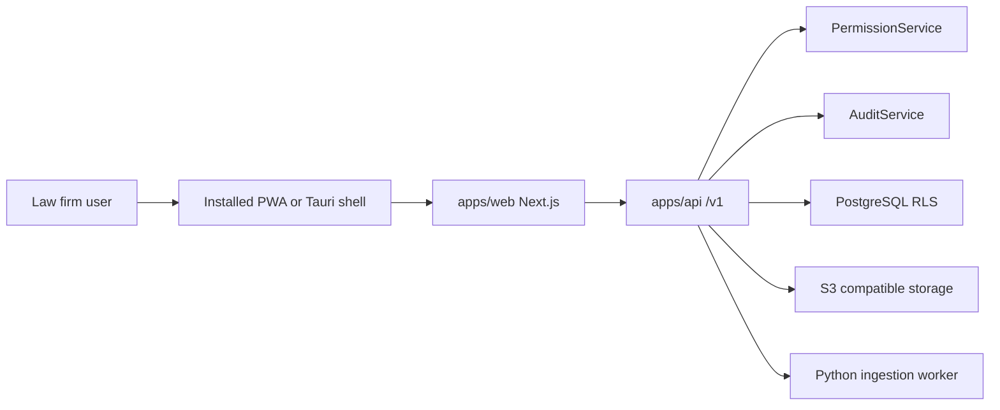

# AMIC Vault Desktop App Plan

Status: Phase 2 implemented
Date: 2026-06-14
Owner: Codex implementation branches `codex/desktop-pwa-phase1`, `codex/desktop-pwa-phase2`
Related ADR: `docs/adr/ADR-014-desktop-client-strategy.md`

## Position

AMIC Vault should become desktop-installable without becoming a desktop-hosted vault. The product stays server-authoritative: NestJS owns authentication, PermissionService, AuditService, tenant context, document lifecycle, search, AI policy enforcement, and records controls.

The desktop plan has two layers:

1. PWA desktop installability from the existing Next.js app.
2. Optional Tauri v2 thin shell for signed installer distribution.

Electron and fully native rewrites are fallback paths, not the recommended implementation.

## Current Baseline

- `apps/web` is the UI source of truth.
- `apps/api` is the server authority for permissions, audit, tenant context, document/search/AI/records behavior.
- AWS staging evidence, smoke, and synthetic UAT evidence exist in the release lane.
- Production deployment is still governed by the production runbook and disabled gate.
- Current launch scope does not approve real customer documents in this repository.

## Phase 1 Implementation Evidence

- PWA manifest, icons, production-only service worker registration, and safe offline shell are implemented.
- Service worker caching is limited to static shell assets; `/v1`, authenticated app surfaces, external portal, and login routes are denied before cache lookup.
- Web middleware applies `no-store` to matched sensitive surfaces and redirects.
- API bootstrap applies no-store globally and guards downstream `Cache-Control` overrides.
- Document view/download desktop regression confirms server-side `DOCUMENT_VIEWED`/`DOCUMENT_DOWNLOADED` audit events plus no-store response headers.
- Claude Code `ultrareview` could not launch because free ultrareviews were exhausted. Claude Code `opus` xhigh read-only review was run twice; the first Medium finding about direct `fetch()` no-store gaps was fixed, and the second review returned no findings.

## Phase 2 Implementation Evidence

- Launch evidence register records `EV-DESKTOP-001` through `EV-DESKTOP-004`
  for desktop implementation, smoke, UAT addendum, and rollback readiness.
- Staging smoke automation includes SMOKE-012 through SMOKE-015 for manifest,
  service worker cache policy, safe offline shell, and installability metadata.
- Synthetic UAT scenarios include DESKTOP-UAT-001 through DESKTOP-UAT-005
  without expanding the synthetic-only launch data scope.
- Rollback runbook includes a PWA rollback path for disabling registration,
  unregistering service workers, deleting desktop shell caches, and returning
  users to browser-only access.

## Non-Negotiable Desktop Invariants

| Invariant                    | Desktop Interpretation                                                                                                                                              |
| ---------------------------- | ------------------------------------------------------------------------------------------------------------------------------------------------------------------- |
| Permission-before-search     | Desktop never builds a local searchable corpus; all search stays server-scoped.                                                                                     |
| Permission-before-AI         | Desktop never sends local document content to AI; AI calls stay server-gated.                                                                                       |
| Audit-by-default             | View/download/native-open paths must retain server audit events.                                                                                                    |
| Fail-closed                  | Missing origin, session, update, policy, or capability config blocks access.                                                                                        |
| Immutable original           | Desktop cannot overwrite or mutate stored originals locally.                                                                                                        |
| No silent external sharing   | Desktop cannot expose share sheets, native mail compose, public links, or external handoff without the server-approved R11+ path.                                   |
| Sensitive data is not logged | Desktop logs contain only app version, approved origin ref, OS, release channel, and correlation refs, not document text, names, snippets, tokens, or private URLs. |

## Recommended Architecture

The desktop layer owns:

- app installation identity,
- update channel presentation,
- window chrome and deep link handling,
- safe redirect to the approved Vault origin,
- minimal telemetry about app version and health.

The desktop layer does not own:

- tenant data,
- matter/document records,
- document bytes,
- search indexes,
- AI context,
- audit event generation,
- retention/disposal decisions.

## Phase 0 - Decision And Threat Model

Goal: freeze the desktop strategy before code changes.

Tasks:

| ID               | Task                                                                                                                   | Files                                         |
| ---------------- | ---------------------------------------------------------------------------------------------------------------------- | --------------------------------------------- |
| DESKTOP-PLAN-001 | Accept or revise ADR-014 with operator review.                                                                         | `docs/adr/ADR-014-desktop-client-strategy.md` |
| DESKTOP-PLAN-002 | Create desktop threat model covering browser PWA, Tauri webview, update server, deep links, local logs, and downloads. | `docs/security/desktop-threat-model.md`       |
| DESKTOP-PLAN-003 | Define approved origins and environment names for local, staging, production.                                          | `docs/release/desktop-origin-policy.md`       |
| DESKTOP-PLAN-004 | Define cache classification for every web/API route.                                                                   | `docs/security/desktop-cache-policy.md`       |

Exit criteria:

- Threat model reviewed.
- Origin policy has no private endpoint values.
- Cache policy marks all sensitive API/document/search/AI/audit routes `no-store`.
- `docs/package/` unchanged.

## Phase 1 - PWA Installability

Goal: make the existing web app desktop-installable without sensitive offline data.

Tasks:

| ID              | Task                                                                                                                                                                      | Files                                                                                                                                                                                                                                                      |
| --------------- | ------------------------------------------------------------------------------------------------------------------------------------------------------------------------- | ---------------------------------------------------------------------------------------------------------------------------------------------------------------------------------------------------------------------------------------------------------- |
| DESKTOP-PWA-001 | Add web app manifest with AMIC Vault app identity, icons, theme colors, and standalone display.                                                                           | `apps/web/public/manifest.webmanifest`, `apps/web/src/app/layout.tsx`                                                                                                                                                                                      |
| DESKTOP-PWA-002 | Add icon set for macOS/Windows/browser install surfaces.                                                                                                                  | `apps/web/public/icons/*`                                                                                                                                                                                                                                  |
| DESKTOP-PWA-003 | Add minimal service worker that caches only static build assets and app-shell fonts.                                                                                      | `apps/web/public/sw.js`, `apps/web/src/app/pwa-registration.tsx`                                                                                                                                                                                           |
| DESKTOP-PWA-004 | Enforce `no-store` for sensitive routes and API responses in web middleware/config.                                                                                       | `apps/web/src/middleware.ts`, `apps/web/next.config.mjs`                                                                                                                                                                                                   |
| DESKTOP-PWA-005 | Add install/offline UX that never displays cached matter/document/search content.                                                                                         | `apps/web/src/components/pwa/*`                                                                                                                                                                                                                            |
| DESKTOP-PWA-006 | Add tests for manifest validity, cache allow-list, offline behavior, and no sensitive cache keys. Route integration specs into existing canonical suite directories only. | `apps/web/src/**/*.test.tsx`, `tests/integration/metadata-leakage/desktop-offline-leakage.int.spec.ts`, `tests/integration/document-access/desktop-document-cache.int.spec.ts`, `tests/integration/audit-coverage/desktop-view-download-audit.int.spec.ts` |

Cache allow-list:

- static JavaScript and CSS build assets,
- approved local fonts,
- app icons,
- manifest,
- a small offline shell that contains no tenant/matter/document data.

Cache deny-list:

- `/v1/*`,
- `/dashboard` after authenticated render if it contains tenant data,
- `/search` responses and page data,
- `/documents/*`,
- `/audit`,
- `/records`,
- `/ai*`,
- preview/download URLs,
- any response with `Set-Cookie` or authorization-bearing headers.

Exit criteria:

- `pnpm lint`
- `pnpm typecheck`
- `pnpm test`
- `pnpm build`
- targeted integration keywords under existing canonical suite directories only, such as `pnpm test:integration -- desktop-offline-leakage`, `pnpm test:integration -- desktop-document-cache`, and `pnpm test:integration -- desktop-view-download-audit`
- Browser install smoke on Chrome and Edge
- Offline smoke proves no sensitive tenant/document content renders from cache
- `pnpm launch:readiness`
- `pnpm docs:frozen`

## Phase 2 - Desktop Release Evidence

Goal: connect PWA desktop behavior to launch evidence.

Tasks:

| ID               | Task                                                                                                                              | Files                                                                        |
| ---------------- | --------------------------------------------------------------------------------------------------------------------------------- | ---------------------------------------------------------------------------- |
| DESKTOP-EVID-001 | Add desktop/PWA rows to launch readiness and evidence register.                                                                   | `docs/release/launch-readiness-pack.md`, `docs/release/evidence-register.md` |
| DESKTOP-EVID-002 | Add smoke checks for manifest, service worker, offline safe screen, and desktop installability.                                   | `tools/release/staging-smoke.mjs`                                            |
| DESKTOP-EVID-003 | Add staging UAT scenarios for installed app launch, login redirect, document view audit, denied search, and offline safe failure. | `docs/release/synthetic-uat-scenarios.md`                                    |
| DESKTOP-EVID-004 | Add incident and rollback notes for disabling service worker registrations.                                                       | `docs/release/rollback-runbook.md`                                           |

Exit criteria:

- `pnpm release:smoke -- --local` includes desktop-safe checks.
- Synthetic UAT maps desktop-specific checks to evidence refs.
- Rollback plan can invalidate service workers and return users to browser-only mode.

## Phase 3 - Tauri Thin Shell Feasibility

Goal: prove a native installer can wrap the approved Vault origin without expanding data authority.

Tasks:

| ID                | Task                                                                                                                        | Files                                                 |
| ----------------- | --------------------------------------------------------------------------------------------------------------------------- | ----------------------------------------------------- |
| DESKTOP-TAURI-001 | Create `apps/desktop` package scaffold with Tauri v2, configured as a thin shell.                                           | `apps/desktop/*`, `pnpm-workspace.yaml`, `turbo.json` |
| DESKTOP-TAURI-002 | Load only allow-listed Vault origins from signed config.                                                                    | `apps/desktop/src-tauri/*`                            |
| DESKTOP-TAURI-003 | Disable native capabilities by default; add explicit capability tests.                                                      | `apps/desktop/src-tauri/capabilities/*`               |
| DESKTOP-TAURI-004 | Add macOS and Windows signing/notarization planning docs without committing secrets.                                        | `docs/release/desktop-signing-plan.md`                |
| DESKTOP-TAURI-005 | Add updater policy requiring signed artifacts and approved update channel.                                                  | `docs/release/desktop-update-policy.md`               |
| DESKTOP-TAURI-006 | Add shell QA: origin allow-list, blocked unapproved origin, no local document persistence, update signature failure blocks. | `apps/desktop/tests/*`                                |

Tauri shell rules:

- default origin is not hard-coded to a private endpoint in git,
- origin refs come from approved environment configuration,
- webview cannot navigate to arbitrary origins,
- file system APIs are disabled unless a later ADR opens a specific path,
- clipboard/share/dialog APIs are disabled unless a later ADR opens them,
- updater refuses unsigned or wrong-channel artifacts,
- logs use the same allow-list as the desktop invariant: app version, approved origin ref, OS, release channel, and correlation refs only.

Exit criteria:

- Tauri build works locally for macOS.
- Unsigned update is rejected.
- Unapproved origin is blocked.
- No local document/search/AI/audit storage exists in the shell.
- Existing web/API test suite remains green.

## Phase 4 - Enterprise Packaging

Goal: prepare real IT deployment without weakening security controls.

Tasks:

| ID              | Task                                                                                              | Files                                             |
| --------------- | ------------------------------------------------------------------------------------------------- | ------------------------------------------------- |
| DESKTOP-PKG-001 | Create macOS notarization procedure.                                                              | `docs/release/desktop-macos-distribution.md`      |
| DESKTOP-PKG-002 | Create Windows signing/MSIX or installer procedure.                                               | `docs/release/desktop-windows-distribution.md`    |
| DESKTOP-PKG-003 | Define release channels: local, staging, pilot, production.                                       | `docs/release/desktop-release-channels.md`        |
| DESKTOP-PKG-004 | Define customer IT handoff pack: hashes, signer identity, update URL refs, rollback instructions. | `docs/release/desktop-it-handoff.md`              |
| DESKTOP-PKG-005 | Add production gate rows for desktop artifact signing and update-channel approval.                | `infra/ci/PROD_GATE.md`, `infra/ci/prod-gate.yml` |

Exit criteria:

- No signing secrets in repo.
- Release artifacts are digest-pinned.
- Desktop artifact approval is distinct from server production approval.
- Rollback can pin users to browser/PWA if native shell is blocked.

## Phase 5 - Deferred Native Integrations

These features are explicitly out of scope until a separate ADR and threat model are approved:

- offline document access,
- local folder watch,
- scanner import,
- file association upload,
- native share/export/send,
- local OCR or local AI execution,
- local encrypted vault cache,
- OS keychain token storage beyond browser/webview session behavior,
- DMS or Office add-in bridge.

Each item requires:

- new ADR,
- threat model delta,
- negative permission tests,
- audit evidence,
- rollback plan,
- production gate update.

## Validation Matrix

| Risk                                  | Required Test                                                                 |
| ------------------------------------- | ----------------------------------------------------------------------------- |
| Sensitive route cached                | Static cache manifest and runtime cache deny-list tests                       |
| Search leakage offline                | Offline `/search` shows safe unavailable state only                           |
| Document body persisted               | Browser storage and service worker cache inspection                           |
| Session/token leaked in logs          | log fixture scan for token/cookie/private URL patterns                        |
| Native origin spoofing                | Tauri origin allow-list tests                                                 |
| Native capability bypass              | Tauri capability deny-by-default tests                                        |
| Audit missing on native open/download | API integration test proves server audit event before response                |
| Production auto-deploy by accident    | `infra/ci/prod-gate.yml` remains disabled until explicit production execution |

## Suggested Branch And Review Flow

1. Create `codex/desktop-pwa-plan` for Phase 0/1 documents.
2. Run local validators:
   - `pnpm docs:frozen`
   - `pnpm launch:readiness`
   - `pnpm launch:execution`
   - `pnpm lint`
   - `pnpm typecheck`
3. Request Claude Code ultrareview against the planning diff.
4. Address findings in the plan before implementation.
5. Open a PR labeled as planning/architecture only.
6. After approval, start PWA implementation on a new branch.

## Recommendation

Use PWA as the first desktop product. It gives the user a desktop launch surface while preserving the existing security model. Add Tauri only if pilot/customer IT requires signed installers or managed app distribution. Do not use Electron unless a concrete native integration forces it and the additional attack surface is explicitly accepted.
