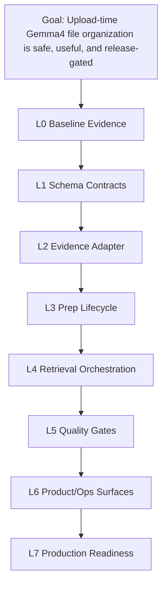

# Gemma4 Hardening Continuation TUW Pyramid

Status: active continuation plan
Date: 2026-06-15
Baseline worktree: `/Users/jws/Projects/amic-vault-lai-02`
Baseline branch before continuation: `codex/prod-patch-42e7b29`
Continuation branch: `feat/pack-lai-13-hardening-plan`
Baseline HEAD: `87c65c0f7af27d161e24ed0a3d2f0f67c9cb2c72`

## Goal

Gemma4 local AI must be useful immediately after upload by organizing file
information, while staying local-only, permission-scoped, citation-grounded,
audited, and production-disabled until a separate operator approval.

This continuation does not reopen the earlier PACK-LAI-01 through PACK-LAI-12
work. It hardens the gaps found after the latest delivery-package review,
Agbrowse ChatGPT Pro review, and read-only repo exploration.

## Hard Product Contract

Gemma4 upload prep is a file-organization worker. It may produce only:

- document profile
- key fields
- date facts
- people and organizations
- keyword tags
- filing suggestions
- source outline
- retrieval hints

Gemma4 upload prep must not produce legal issue extraction, legal risk
analysis, clause analysis, legal conclusions, liability views, strategy
recommendations, permission decisions, external sharing, or production
authorization.

If a prompt, schema, migration, UI, report, test, or eval implies legal
analysis for upload prep, the relevant TUW stops and records escalation.

## Current Baseline

Already implemented and evidenced:

- `local_gemma` remains the only product AI route.
- Upload -> indexing -> async `ai.prep` path exists.
- AI prep artifacts are file-organization scoped and source-ref bounded.
- Invalid Gemma output is discarded and deterministic fallback is persisted.
- `pnpm eval:local-ai` passes on current synthetic evidence with fallbackRate
  4.0%.
- `pnpm ai-prep:scan` passes with raw/leakage/legal/source/external counts 0.
- Production migrations `0064` through `0068` are applied, but production task
  env keeps `LOCAL_GEMMA_ENABLED=false`, `AI_PREP_ENABLED=false`,
  `AI_PREP_QUEUE_WORKER_ENABLED=false`, and `AI_SUMMARY_GEMMA_ENABLED=false`.

Known gaps to close:

- Prep status vocabulary has no explicit `rejected` terminal state, so blocked
  policy and rejected model output are not distinct enough.
- Prep output schema and Evidence Pack schema use different source-ref shapes
  and naming conventions; the adapter contract is implicit.
- EvidencePack v2 is not versioned as a stable builder/adapter contract.
- Stale/rebuild semantics exist but are not yet covered as a broader
  permission/policy/metadata change contract.
- Eval corpus is still technical and small; quality gate is safety-oriented,
  not operational-quality oriented.
- Production readiness is documented as disabled, but the technical readiness
  checklist and governance approval checklist are not separated cleanly.

## Pyramid



Execution order is fixed unless an escalation row records a human-approved
change:

1. PACK-LAI-13: L0 baseline, evidence register, and no-legal-analysis contract
2. PACK-LAI-14: L1 prep status/output schema decision and migration contract
3. PACK-LAI-15: L2 EvidencePack v2 adapter and source-ref compatibility
4. PACK-LAI-16: L3 stale/rebuild lifecycle hardening
5. PACK-LAI-17: L4 retrieval orchestration and deterministic relation handling
6. PACK-LAI-18: L5 eval/quality corpus expansion
7. PACK-LAI-19: L6 UI/ops feedback and runbook polish
8. PACK-LAI-20: L7 technical readiness and governance enablement split

## PACK-LAI-13 L0 Baseline And Contract

Branch: `feat/pack-lai-13-hardening-plan`
Risk: H
Type: verify-only + docs contract

Purpose: freeze the real baseline, record review inputs, and make
file-organization-only upload prep a hard continuation contract.

### AI-HARDEN-BASELINE-TUW-001

- Title: Current-state evidence register
- Objective: Record current branch, HEAD, gate reports, production-disabled
  flags, and known gaps before further Gemma4 work.
- Files create: `docs/reports/gemma4_hardening_l0_evidence.md`
- Files modify: `docs/ledger/execution.md`
- NOT-modify: `docs/package/**`, runtime source files, migrations.
- Verification: evidence references current reports and ledger entries; no code
  diff; `git diff --check`.
- Stop condition: baseline branch or production flag evidence conflicts with
  live repo state.

### AI-HARDEN-NOLEGAL-TUW-002

- Title: Upload prep no-legal-analysis contract
- Objective: State that upload prep may organize file information only and must
  reject risk/issue/clause/legal-conclusion shaped output.
- Files create: this plan.
- Files modify: `docs/execution/PACKS_R4_R14.md` to register the continuation
  family.
- NOT-modify: `packages/shared/src/ai/prep.ts`, `db/migrations/**`.
- Verification: plan includes explicit allowed and forbidden output lists.
- Stop condition: any requested prep artifact requires legal analysis.

### AI-HARDEN-REVIEW-TUW-003

- Title: Review input reconciliation
- Objective: Convert Agbrowse ChatGPT Pro and read-only reviewer findings into
  accepted/rejected continuation actions.
- Files create/modify: L0 evidence report and this plan.
- Verification: every material finding maps to PACK-LAI-14 through
  PACK-LAI-20 or is explicitly marked not in scope.
- Stop condition: reviewer finding implies production enablement or external AI.

## PACK-LAI-14 L1 Prep Schema Decision

Branch: `feat/pack-lai-14-prep-schema-decision`
Risk: C
Type: implementation

Purpose: make prep output and terminal states unambiguous before changing
retrieval, UI, or production gates.

### AI-HARDEN-SCHEMADEC-TUW-001

- Title: Prep status and rejection ADR
- Objective: Decide whether `rejected` is a first-class prep status or a
  `blocked/failed` reason code, and document migration compatibility.
- Files create: `docs/adr/ADR-GEMMA4-PREP-STATUS.md`
- Files modify: `docs/reports/gemma4_hardening_l0_evidence.md`
- Verification: ADR includes current DB/shared statuses and exact migration
  path.
- Stop condition: decision cannot preserve existing completed/stale artifacts.

### AI-HARDEN-STATUS-TUW-002

- Title: Rejected output state or reason-code implementation
- Objective: Distinguish policy-blocked, runtime-failed, and model-output
  rejected prep outcomes in shared schema, DB constraints, repository logic,
  audits, scan, and eval.
- Files modify: `packages/shared/src/ai/prep.ts`,
  `apps/api/src/modules/ai/prep/*`, `tools/ai/scan-ai-prep-storage.ts`,
  `tools/evalset/local-ai-eval.ts`.
- Files create: `db/migrations/0069_*_ai_prep_rejection_state.sql` if the ADR
  chooses a DB status change.
- NOT-modify: `docs/package/**`, `packages/shared/src/types/ai-policy.ts`.
- Verification: invalid Gemma output is reported as rejected without raw
  response persistence; migration roundtrip; unit, integration, scan, eval.
- Stop condition: any path exposes prompt/source/response text or weakens
  fail-closed behavior.

### AI-HARDEN-CLAIMVOCAB-TUW-003

- Title: Prep claim vocabulary freeze
- Objective: Freeze upload-prep claim kinds to non-legal file-organization
  kinds and remove stale legal/workflow names from tests, docs, and negative
  fixtures.
- Files modify: shared prep schemas, prompt compiler tests, negative matrix,
  eval tests.
- Verification: `risk`, `issue`, `clause`, and legal conclusion markers reject
  at shared/API/DB/scan layers.
- Stop condition: a workflow still asks upload prep to infer legal issues.

### AI-HARDEN-PREPSUMMARY-TUW-004

- Title: Prep vs non-prep output split
- Objective: Separate upload-prep output contracts from matter summary/Q&A
  contracts so later lawyer-facing summaries cannot loosen prep storage rules.
- Files create/modify: shared DTO tests and API guard tests.
- Verification: prep artifacts cannot use summary/Q&A-only fields; summary/Q&A
  cannot be stored as prep artifacts.
- Stop condition: shared schema coupling forces prep to accept legal analysis
  fields.

## PACK-LAI-15 L2 EvidencePack v2 Adapter

Branch: `feat/pack-lai-15-evidencepack-v2-adapter`
Risk: C
Type: implementation

Purpose: formalize the boundary between Evidence Pack retrieval output and
upload-prep artifact input without rewriting retrieval unnecessarily.

### AI-HARDEN-EVIDENCEV2-TUW-001

- Title: EvidencePack v2 contract wrapper
- Objective: Add a versioned adapter DTO around the existing Evidence Pack
  shape and mark current builder output as v1-compatible/v2-adapted.
- Files create/modify: `packages/shared/src/ai/evidence-pack*.ts`,
  `apps/api/src/modules/ai/context/evidence-pack.builder.*`.
- Verification: v2 validates `retrievedChunks`, `citationRequirements.sourceRefs`,
  chunk refs, hashes, and permission scope without allowing raw body storage.
- Stop condition: v2 requires changing query-stage permission filtering.

### AI-HARDEN-SOURCEREF-TUW-002

- Title: Source-ref mapping adapter
- Objective: Convert Evidence Pack camelCase source refs to prep snake_case
  `source_refs` deterministically and verify one-to-one membership.
- Files create/modify: prep builder/processor adapter tests.
- Verification: unknown refs, duplicate refs, mismatched refs, and empty refs
  fail closed.
- Stop condition: model output can invent refs that are normalized into valid
  refs.

### AI-HARDEN-EVIDSCAN-TUW-003

- Title: Evidence adapter scan gate
- Objective: Extend `pnpm ai-prep:scan` or a sibling scan to assert every
  completed prep source ref maps back to an Evidence Pack citation ref/hash.
- Files modify/create: `tools/ai/*`, reports.
- Verification: scan fails on orphan refs and legal-analysis claim leakage.
- Stop condition: scan needs raw source text from artifact storage.

## PACK-LAI-16 L3 Prep Lifecycle Hardening

Branch: `feat/pack-lai-16-prep-lifecycle`
Risk: C
Type: implementation

Purpose: make stale/rebuild behavior explicit across version, permission,
policy, metadata, and source-chunk changes.

### AI-HARDEN-STALECONTRACT-TUW-001

- Title: Stale reason contract
- Objective: Define allow-listed stale reasons and when display must hide or
  label artifacts.
- Files modify: shared prep types, repository/status service tests.
- Verification: stale artifact never displays as ready; stale reason is bounded
  and audited by reference only.
- Stop condition: stale reason needs free-form text.

### AI-HARDEN-PERMINVAL-TUW-002

- Title: Permission and policy invalidation hooks
- Objective: Mark or rebuild prep artifacts when `ai_allowed`, policy, wall,
  membership, or document permissions change.
- Files modify: permission/policy mutation paths and prep invalidation service.
- Verification: negative tests for permission downgrade, wall add, AI flag
  false, policy parse failure.
- Stop condition: hooks bypass existing PermissionService or audit service.

### AI-HARDEN-METAINVAL-TUW-003

- Title: Metadata and chunk invalidation hooks
- Objective: Mark artifacts stale when current version, extracted text chunks,
  document metadata, or source hashes change.
- Files modify: indexing/extraction/prep service tests.
- Verification: old version artifacts are hidden; current version rebuild is
  idempotent.
- Stop condition: immutable original/version policy would be weakened.

### AI-HARDEN-REBUILD-TUW-004

- Title: Safe rebuild command and queue path
- Objective: Rebuild stale/rejected/fallback artifacts through the normal
  `AiPrepProcessor` path only.
- Files modify: `apps/api/src/tools/reprocess-ai-prep-fallbacks.ts` or new
  scoped rebuild tool, runbook.
- Verification: dry-run, bounded audit, singleton jobs, no direct SQL payload
  mutation.
- Stop condition: rebuild path stores raw model output or skips policy guard.

## PACK-LAI-17 L4 Retrieval Orchestration

Branch: `feat/pack-lai-17-retrieval-orchestration`
Risk: C
Type: implementation

Purpose: improve prep usefulness by deterministic orchestration before any
stronger graph or model behavior.

### AI-HARDEN-RETRIEVEPLAN-TUW-001

- Title: Prep retrieval plan
- Objective: Define per-artifact retrieval windows, metadata filters, and
  chunk budgets for file organization artifacts.
- Files modify/create: prep retrieval planner and tests.
- Verification: aiAllowed/wall/permission filtering remains query-stage.
- Stop condition: planner wants post-filtering of unauthorized chunks.

### AI-HARDEN-CANONICAL-TUW-002

- Title: Canonical metadata normalizer
- Objective: Normalize safe metadata fields used for key fields, dates,
  people/organizations, and filing suggestions.
- Files modify/create: metadata helper tests.
- Verification: no raw body, no legal conclusions, source hashes retained.
- Stop condition: normalization needs sensitive plaintext logging.

### AI-HARDEN-GRAPHSAFE-TUW-003

- Title: Deterministic relation-only graph inputs
- Objective: Use graph facts only as deterministic metadata relations after
  retrieval and never as a source of legal inference.
- Files modify: Evidence Pack adapter and prep builder tests.
- Verification: graph facts without source refs or hashes are excluded.
- Stop condition: graph relation requires legal issue/risk node inference.

### AI-HARDEN-PLAYBOOKBOUND-TUW-004

- Title: Rule/playbook bounded inputs
- Objective: Keep deterministic rule findings out of upload prep unless they
  are safe filing/classification metadata.
- Files modify: prep prompt compiler tests.
- Verification: contract risk/clause rules never enter upload-prep artifacts.
- Stop condition: rule output is required to generate legal analysis.

## PACK-LAI-18 L5 Quality And Eval Expansion

Branch: `feat/pack-lai-18-quality-eval`
Risk: H
Type: implementation + evidence

Purpose: move from technical safety smoke to broader quality evidence without
claiming production customer-data readiness.

### AI-HARDEN-EVAL100-TUW-001

- Title: 100-case deidentified prep eval corpus
- Objective: Expand local AI eval fixtures from technical subset to at least
  100 deidentified upload-prep cases.
- Files create/modify: `tests/fixtures`, `tools/evalset`, reports.
- Verification: source-ref, no-legal-analysis, fallback, Korean heuristic, and
  latency metrics per artifact kind.
- Stop condition: corpus cannot be deidentified.

### AI-HARDEN-NEGATIVE100-TUW-002

- Title: Negative case matrix expansion
- Objective: Expand negative cases for raw leakage, source-ref mismatch,
  unsupported claim kinds, stale display, rejected state, and external route
  regression.
- Files modify: `docs/reports/local_ai_negative_case_matrix.md`, tests.
- Verification: all negative cases map to executable suites.
- Stop condition: negative case can only be checked manually.

### AI-HARDEN-LATENCY-TUW-003

- Title: Latency and queue quality gate
- Objective: Add queue age, generation latency, fallback rate, rejected rate,
  and per-artifact completion thresholds.
- Files modify: eval/ops tools and reports.
- Verification: threshold failures produce technicalPass=false.
- Stop condition: thresholds require production customer data.

### AI-HARDEN-BENCHSAFE-TUW-004

- Title: Bench-only candidate refresh
- Objective: Refresh local model candidate catalog and benchmark harness with
  current local candidates without adding product routes.
- Files modify: bench catalog/report only.
- Verification: harness default-off, hash-only output, local/private endpoints,
  no tenant DB writes.
- Stop condition: candidate route requires product enablement.

## PACK-LAI-19 L6 Product And Ops Surfaces

Branch: `feat/pack-lai-19-product-ops`
Risk: H
Type: implementation

Purpose: make status, rejection/fallback, retry, and feedback clear to users
and admins without implying legal analysis.

### AI-HARDEN-UISTATE-TUW-001

- Title: Prep UI terminal state clarity
- Objective: Show ready, pending, stale, blocked, failed, and rejected/fallback
  states with concise file-organization language.
- Files modify: web AI prep components and tests.
- Verification: no in-app text claims legal analysis; stale/rejected artifacts
  are not displayed as ready.
- Stop condition: UI needs free-form model error text.

### AI-HARDEN-ADMINOPS-TUW-002

- Title: Admin ops breakdown
- Objective: Expose aggregate rejected/fallback/stale counts and retry actions
  to admins only.
- Files modify: ops API/UI tests.
- Verification: endpoint URL, prompt, source, response, secret, and raw text
  are not exposed.
- Stop condition: non-admin can view aggregate ops state.

### AI-HARDEN-FEEDBACKLOOP-TUW-003

- Title: Structured feedback loop
- Objective: Add reason codes for incorrect field/tag/filing suggestion,
  missing source ref, stale artifact, and rejected output.
- Files modify: shared prep feedback types, DB constraints if needed, web/API
  tests.
- Verification: no free-form comment column; feedback is tenant-scoped and
  audited.
- Stop condition: feedback needs raw document excerpt.

### AI-HARDEN-RUNBOOK-TUW-004

- Title: Operator runbook update
- Objective: Document safe reprocess, degraded mode, eval, scan, and enablement
  procedures with production-disabled defaults.
- Files modify: `docs/release/local-ai-ops-runbook.md`.
- Verification: runbook does not include secrets, endpoints, or production
  approval claims.
- Stop condition: runbook asks operator to bypass gates.

## PACK-LAI-20 L7 Production Readiness Split

Branch: `feat/pack-lai-20-production-readiness`
Risk: C
Type: gate/evidence

Purpose: separate "technically ready to enable" from "authorized to enable in
production".

### AI-HARDEN-TECHREADY-TUW-001

- Title: Technical readiness checklist
- Objective: Define exact commands and required outputs before production flags
  may be considered for enablement.
- Files create/modify: `docs/ledger/gates/LOCAL_AI_PROD_READY_gate.md`,
  release validators if needed.
- Verification: lint/typecheck/test/build/integration/eval/scan/bench smoke all
  green; external model attempts 0; production flags still false.
- Stop condition: checklist tries to enable flags.

### AI-HARDEN-GOVREADY-TUW-002

- Title: Governance approval checklist
- Objective: Define separate operator/legal/security approval evidence required
  to turn production Gemma flags on.
- Files modify: release blocker/evidence documents.
- Verification: no approval invented; all fields are evidence-ref required.
- Stop condition: approval is inferred from technical pass.

### AI-HARDEN-ENABLEPLAN-TUW-003

- Title: Production enablement and rollback plan
- Objective: Document flag order, canary scope, monitoring, smoke, rollback,
  and emergency disable procedure.
- Files modify/create: release runbook.
- Verification: flags remain false in repo/deploy evidence until operator
  explicitly approves.
- Stop condition: any automated deploy turns flags on.

### AI-HARDEN-CLOSEOUT-TUW-004

- Title: Independent review and closeout
- Objective: Capture one valid independent review receipt and close the
  continuation gate without self-merging.
- Files modify: execution ledger and gate report.
- Verification: valid review finding receipt exists; all material findings
  resolved or escalated; Codex does not merge itself.
- Stop condition: review is unavailable or malformed.

## Verification Ladder

Minimum checks for PACK-LAI-13:

```bash
git diff --check
PATH=/opt/homebrew/opt/node@22/bin:$PATH pnpm docs:frozen
PATH=/opt/homebrew/opt/node@22/bin:$PATH pnpm backlog:validate
```

Minimum checks for implementation packs:

```bash
PATH=/opt/homebrew/opt/node@22/bin:$PATH pnpm lint
PATH=/opt/homebrew/opt/node@22/bin:$PATH pnpm typecheck
PATH=/opt/homebrew/opt/node@22/bin:$PATH pnpm test
PATH=/opt/homebrew/opt/node@22/bin:$PATH pnpm build
docker compose -f infra/docker-compose.dev.yml up -d --wait
PATH=/opt/homebrew/opt/node@22/bin:$PATH pnpm db:migrate
PATH=/opt/homebrew/opt/node@22/bin:$PATH pnpm db:seed
PATH=/opt/homebrew/opt/node@22/bin:$PATH pnpm test:integration
PATH=/opt/homebrew/opt/node@22/bin:$PATH pnpm eval:local-ai -- --tenant-id 11111111-1111-4111-8111-111111111111
PATH=/opt/homebrew/opt/node@22/bin:$PATH pnpm eval:ai-gate -- --tenant-id 11111111-1111-4111-8111-111111111111
PATH=/opt/homebrew/opt/node@22/bin:$PATH pnpm ai-prep:scan -- --tenant-id 11111111-1111-4111-8111-111111111111
PATH=/opt/homebrew/opt/node@22/bin:$PATH pnpm docs:frozen
PATH=/opt/homebrew/opt/node@22/bin:$PATH pnpm backlog:validate
git diff --check
```

Migration packs also require targeted down/up roundtrip for new migrations. Full
`pnpm db:rollback` remains a separate clean-DB evidence item because the dirty
development database contains append-only AI prep audit rows.

## Review Findings Applied

Accepted from Agbrowse ChatGPT Pro review:

- Treat contract drift as the main risk.
- Move EvidencePack v2 immediately after schema decision.
- Move graph/relation enrichment after retrieval orchestration.
- Put UI/ops after quality/evidence gates.
- Split production readiness into technical readiness and governance
  authorization.

Accepted from GPT-5.5/read-only repo reviews:

- Make no-legal-analysis a hard product contract.
- Add L0 baseline verification before implementation.
- Make schema decision the first implementation gate.
- Split prep and non-prep output contracts.
- Prefer EvidencePack v2 adapter/builder over broad rewrite.
- Defer graph work unless relation facts are deterministic and source-bound.
- Expand eval before production readiness.
- Keep production flags disabled until explicit operator approval.

Rejected or deferred:

- Non-Gemma production route changes are deferred. Bench-only candidate
  comparison remains default-off and cannot write tenant output.
- Legal analysis in upload prep is rejected. Lawyer-facing summaries/Q&A remain
  separate non-prep workflows and must still be citation-grounded.
