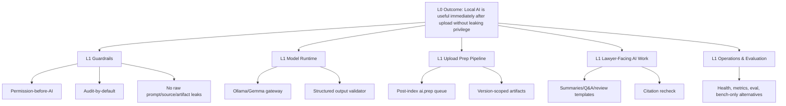

# Local AI Operating Layer TUW Pyramid Plan

Status: reviewed plan, Claude findings reflected
Date: 2026-06-15
Scope: post-R14 extension plan for making the existing `local_gemma` AI layer perform all local AI work expected after upload and during lawyer workflows.

Source constraints:

- `docs/package/codex/00_Master_Brief.md`: Permission-before-AI, Audit-by-default, fail-closed, sensitive-data logging ban, DEC-11 Gemma local only.
- `docs/execution/PACKS_R4_R14.md`: frozen package extension pattern; `docs/package/` remains read-only.
- `docs/ledger/gates/R6_gate.md`: R6 AI MVP technical pass, local-only model route, external model attempts 0.
- Current implementation baseline: AI policy, retrieval, Evidence Pack, citations, sessions, AI audit, local route health, graph facts, rule findings, feedback, eval, deterministic summary rendering.

## Pyramid



## Current Gap Summary

Already implemented:

- `local_gemma` is the only enabled route in shared schemas, AI sessions, model routing, and search embeddings.
- Upload creates document versions and enqueues extraction.
- Extraction completion enqueues search indexing.
- Search indexing builds chunks and deterministic local embeddings.
- AI retrieval builds permission-scoped Evidence Packs with citations, graph facts, and rule findings.
- AI summary endpoints create cited deterministic summaries and record AI audit/session rows.

Not yet implemented:

- Real Gemma/Ollama generation calls in `packages/ai`.
- Post-upload `ai.prep` queue, status, and stored artifacts.
- Version-scoped AI prep invalidation/rebuild semantics.
- User-visible AI prep status.
- Citation-grounded LLM output parsing with full-response rejection on unsupported claims.
- Local model runtime observability, timeout, concurrency, and degraded mode.
- Bench-only comparison lane for non-Gemma local candidates.

## Operating Rule

Local AI may prepare, summarize, classify, suggest, and retrieve only from data that passed Permission-before-AI. Local AI must not decide permissions, override ethical walls, auto-approve legal conclusions, create external sharing, store raw prompt/source/response in audit metadata or AI prep artifact JSON, or become merge/production authority.

## Global Boundaries For All PACK-LAI Work

- `docs/package/**` is read-only.
- `packages/shared/src/types/ai-policy.ts` is NOT-modify for `aiModelRouteKeys`; it must remain `['local_gemma']` unless a later approved DEC-11 gate explicitly changes it.
- `packages/ai/src/index.ts` may add local generation wrappers, but `isR6EnabledModelRoute()` must remain `local_gemma` only during this plan.
- AI prep artifact JSON is a persistence surface and must use per-`artifact_kind` allow-listed keys. It must not contain top-level keys matching `body|content|text|snippet|raw|prompt|response`.
- Hashes are deterministic SHA-256 with no salt unless a later TUW gives a specific reason and verification path.

## PACK-LAI-00 Plan, Review, And Gate Contract

Branch: `feat/pack-lai-00-local-ai-plan`

Purpose: Turn this plan into a reviewable execution contract before implementation.

### AI-LOCALPLAN-SCOPE-TUW-001

- Title: Local AI scope and non-goal contract
- Risk: H
- Objective: Define every local AI responsibility and explicitly exclude permissions, final legal approval, external sharing, and external model calls.
- Files create: `docs/execution/TUW_LOCAL_AI_OPERATING_LAYER.md`
- Files modify: `docs/execution/PACKS_R4_R14.md` to append an unconditional `PACK-LAI-*` family section with pack order, branch names, trigger conditions, and dependency on post-R14 adoption.
- NOT-modify: `docs/package/**`
- Verification: plan references Master Brief and R6/R14 boundaries; external model allowance remains false.
- Stop condition: any requirement implies external AI, permission bypass, or raw body audit storage.

### AI-LOCALPLAN-REVIEW-TUW-002

- Title: Independent Claude review of local AI plan
- Risk: H
- Objective: Capture Claude review findings and update the plan before implementation.
- Files modify: `docs/execution/TUW_LOCAL_AI_OPERATING_LAYER.md`
- Verification: review command/output recorded in the Review Record section; material findings either accepted or explicitly rejected with reason.
- Stop condition: Claude review unavailable and operator requires independent review before implementation.

## PACK-LAI-01 Local Gemma Runtime Gateway

Branch: `feat/pack-lai-01-gemma-runtime`

Purpose: Convert `packages/ai` from health-only into a safe local generation gateway.

### AI-GEMMAGATE-HEALTH-TUW-001

- Title: Ollama/Gemma runtime health contract
- Risk: H
- Objective: Detect local Gemma readiness, model name, capabilities, context length, and local endpoint safety without external calls.
- Files modify: `packages/ai/src/index.ts`, `packages/ai/src/index.spec.ts`, `apps/api/src/modules/ai/routing/*`
- Files NOT-modify: `packages/shared/src/types/ai-policy.ts`
- Verification: local/private endpoint allow-list, non-local endpoint rejection, unhealthy route degraded but upload unaffected; stale pre-R6 placeholder comment in `packages/ai/src/index.ts` is rewritten to describe the post-R6 local gateway scope.

### AI-GEMMAGATE-GENERATE-TUW-002

- Title: Local Gemma structured generation API
- Risk: C
- Objective: Add `generateJson` and `generateText` wrappers for Ollama `/api/generate` or `/api/chat` with `stream=false`, bounded timeout, token budget, and schema validation.
- Files modify: `packages/ai/src/index.ts`, `packages/ai/src/index.spec.ts`
- Files create: `apps/api/src/modules/ai/generation/local-gemma-generation.service.ts`, tests.
- Files NOT-modify: `packages/shared/src/types/ai-policy.ts`
- Verification: JSON schema rejection, timeout path, max output length, local endpoint only, no external SDK/API key.

### AI-GEMMAGATE-PROMPTSAFE-TUW-003

- Title: Evidence Pack prompt compiler
- Risk: C
- Objective: Compile prompts from Evidence Pack redacted chunks, graph facts, and rule findings only, with citation requirements embedded.
- Files create: `apps/api/src/modules/ai/generation/evidence-prompt.compiler.ts`, tests.
- Verification: prompt excludes denied source titles/snippets/body and includes citation refs for all source facts.

### AI-GEMMAGATE-OUTPUTGUARD-TUW-004

- Title: Citation-grounded output guard
- Risk: C
- Objective: Parse Gemma output into shared DTOs; reject the full response and fall back to deterministic Evidence Pack summary with a structured warning code if any claim lacks `source_refs` or fails schema validation. Lossless JSON normalization is permitted, but claim-content rewriting is forbidden.
- Files create: `apps/api/src/modules/ai/generation/grounded-output.guard.ts`, tests.
- Verification: unsupported claim triggers full-response rejection; partial responses are never persisted; every claim has source refs; legal conclusion auto approval remains false.

### AI-GEMMAGATE-DEGRADE-TUW-005

- Title: Runtime degraded mode
- Risk: H
- Objective: If Gemma is unavailable or output invalid, fall back to deterministic Evidence Pack summary with explicit warning and audit status.
- Files modify: `apps/api/src/modules/ai/features/ai-summary.service.ts`, shared warning codes.
- Verification: Gemma down does not fail upload or indexing; user-facing AI status explains degraded mode.

### AI-GEMMAGATE-CITESCHEMA-TUW-006

- Title: Citation-grounded structured-output contract
- Risk: C
- Objective: Define shared DTOs for Gemma structured output where every claim has `kind`, bounded `text`, and required `source_refs` pointing to Evidence Pack citation refs or chunk IDs.
- Files create: `packages/shared/src/ai/generation.ts`, `packages/shared/src/ai/generation.spec.ts`
- Files modify: `apps/api/src/modules/ai/citation/citation-verifier.ts` only if needed to reuse the new DTO.
- Files NOT-modify: `packages/shared/src/types/ai-policy.ts`
- Verification: zod schema rejects claims without `source_refs`, oversized text, unknown source refs, and legal conclusion auto approval.

## PACK-LAI-02 Post-Upload AI Prep Pipeline

Branch: `feat/pack-lai-02-post-upload-ai-prep`

Purpose: Start useful AI work as soon as upload-derived text and chunks are ready.

### AI-PREP-SCHEMA-TUW-001

- Title: Version-scoped AI prep artifact schema
- Risk: C
- Objective: Store document-version AI prep status and allow-listed artifacts with tenant RLS, source hashes, model route, prompt hash, response hash, and no raw prompt/source/response in audit metadata or artifact JSON.
- Files create: `db/migrations/0064_create_ai_prep_artifacts.sql`
- Files modify: shared DTOs/types as needed.
- Verification: tenant_id NOT NULL, FORCE RLS, rollback roundtrip, composite UNIQUE `(tenant_id, document_version_id, artifact_kind)`, soft stale via `is_stale boolean`, tenant_id first on every index, no destructive grants, artifact JSON top-level keys constrained by `packages/shared/src/ai/prep.ts`, SHA-256 hashes with no salt.

### AI-PREP-AUDIT-TUW-002

- Title: AI prep audit actions
- Risk: H
- Objective: Add reference-only audit actions for requested, completed, blocked, failed, and stale prep lifecycle.
- Files modify: `packages/shared/src/audit/audit-event-types.ts` to add `AI_PREP_REQUESTED`, `AI_PREP_COMPLETED`, `AI_PREP_BLOCKED`, `AI_PREP_FAILED`, `AI_PREP_STALE`.
- Files modify: `packages/shared/src/audit/audit-metadata-keys.ts` to add `ai_prep_artifact_id`, `ai_prep_status`, `ai_prep_kind`, `source_chunk_count`, `prompt_hash`, `response_hash`, `stale_reason`, `dead_letter_id`.
- Files create: `db/migrations/0065_extend_ai_prep_audit_actions.sql`.
- Verification: metadata allows IDs/hashes/counts/status only; no prompt/source/response text; R6 audit leak tests extended for `prompt|response|body|content|text|snippet|raw`.

### AI-PREP-QUEUE-TUW-003

- Title: pg-boss ai.prep queue
- Risk: H
- Objective: Add `ai.prep` and `ai.prep.dead` queues with singleton key per version/artifact kind and retry/backoff/dead-letter handling.
- Files create: `apps/api/src/modules/ai/prep/ai-prep-queue.service.ts`, tests.
- Verification: queue disabled by default; worker gated by `AI_PREP_QUEUE_WORKER_ENABLED`; retry and dead-letter covered; per-tenant max concurrency prevents one tenant from starving another.

### AI-PREP-ENQUEUE-TUW-004

- Title: Enqueue AI prep after search indexing
- Risk: C
- Objective: Enqueue prep only after search indexing succeeds for the current version and `documents.ai_allowed=true`.
- Files modify: `apps/api/src/modules/search/index/indexing.processor.ts`, `apps/api/src/modules/search/search.module.ts`
- Verification: upload transaction does not call Gemma; `ai_allowed=false` never enqueues; old versions are marked stale.

### AI-PREP-POLICY-TUW-005

- Title: Prep-time policy and permission precheck
- Risk: C
- Objective: Ensure prep worker runs only after matter policy, model route, document AI flag, wall, and tenant checks pass through the same decision path as retrieval.
- Files create: `apps/api/src/modules/ai/prep/ai-prep-policy.guard.ts`, tests.
- Verification: default deny, policy parse failure deny, wall deny, non-current deny, tenant mismatch deny; decision path reuses `SearchPermissionScopeProvider` and `DocumentPermissionService` with shared fixtures from `AiRetrievalOrchestratorService`.

### AI-PREP-BUILDER-TUW-006

- Title: Artifact builder from Evidence Pack
- Risk: C
- Objective: Build document brief, key terms, issue/risk candidates, timeline candidates, clause pointers, and suggested questions from authorized Evidence Pack only.
- Files create: `apps/api/src/modules/ai/prep/ai-prep.processor.ts`, `apps/api/src/modules/ai/prep/ai-prep-artifact.builder.ts`, tests.
- Verification: every artifact stores source refs/hashes; no uncited generated fact persists; invalid Gemma output blocked; artifact JSON uses per-kind key allow-list and never stores raw source/prompt/response text.

### AI-PREP-INVALIDATE-TUW-007

- Title: Prep invalidation on version, metadata, permission, and policy changes
- Risk: C
- Objective: Mark artifacts stale when document version changes, AI flag changes, matter policy changes, permission/wall changes, graph/rule facts refresh, or source chunks stale.
- Files create/modify: prep invalidation service and hook tests.
- Verification: stale artifacts are not displayed; rebuild jobs are idempotent.

## PACK-LAI-03 Lawyer-Facing Local AI Workflows

Branch: `feat/pack-lai-03-local-ai-workflows`

Purpose: Make local AI useful in matter/document/email/contract/litigation workflows while keeping evidence and review constraints.

### AI-WORK-DOCSUMMARY-TUW-001

- Title: Gemma-backed document summary
- Risk: C
- Objective: Replace deterministic-only document summary with Gemma-backed cited output and deterministic fallback.
- Files modify: `apps/api/src/modules/ai/features/ai-summary.service.ts`, shared summary schemas/tests.
- Verification: citations required, permission recheck before response, hallucination guard rejects unsupported claims.

### AI-WORK-MATTERBRIEF-TUW-002

- Title: Gemma-backed matter brief
- Risk: C
- Objective: Produce cited matter-level briefs from authorized chunks, graph facts, rule findings, DD facts, litigation facts, and records metadata where available.
- Verification: no cross-matter leakage; graph/rule facts are ID-backed only; all claims cite chunks or safe references.

### AI-WORK-EMAILTHREAD-TUW-003

- Title: Email thread summary and filing suggestions
- Risk: C
- Objective: Summarize filed email threads and suggest filing context without exposing attachments or messages outside permission scope.
- Verification: email and attachment permissions both enforced; external participant data redacted per policy.

### AI-WORK-CONTRACT-TUW-004

- Title: Contract review assistant
- Risk: C
- Objective: Use R8 rule findings, clause refs, and chunk evidence to generate cited clause/risk explanations and question prompts.
- Verification: rule findings are deterministic inputs; Gemma cannot invent playbook rules; legal conclusion auto approval false.

### AI-WORK-LITIGATION-TUW-005

- Title: Litigation fact and issue assistant
- Risk: C
- Objective: Generate cited fact chronologies, issue prompts, and pleading prep summaries from litigation vault references.
- Verification: every fact has source refs; privileged/legal conclusion outputs require escalation.

### AI-WORK-QA-TUW-006

- Title: General matter Q&A over Evidence Pack
- Risk: C
- Objective: Provide interactive Q&A with query-stage permission scope, cited claims, and blocked-source non-disclosure.
- Verification: denied sources absent from answers, citations, snippets, warnings, and audit metadata.

## PACK-LAI-04 UI, API, And User Feedback

Branch: `feat/pack-lai-04-ai-prep-ui`

Purpose: Surface AI readiness without exposing stale or unauthorized artifacts.

### AI-UI-STATUS-TUW-001

- Title: Document AI prep status API
- Risk: H
- Objective: Add protected API for document/version prep status and artifact availability.
- Verification: display-time PermissionService recheck; stale/blocked/failed states explicit.

### AI-UI-DOCDETAIL-TUW-002

- Title: Document detail AI panel
- Risk: M
- Objective: Show prepared summary, key terms, suggested questions, and citation refs when authorized.
- Verification: no raw prompt/source text in UI state; empty/degraded states professional and clear.

### AI-UI-MATTERDASH-TUW-003

- Title: Matter AI readiness dashboard
- Risk: M
- Objective: Show matter-level AI coverage, pending jobs, blocked docs, stale artifacts, and retry controls for firm/security admins.
- Verification: route protected; retry action audited; tenant scope enforced.

### AI-UI-FEEDBACK-TUW-004

- Title: Prep artifact feedback loop
- Risk: H
- Objective: Let authorized users mark AI prep useful/incorrect/stale without storing free-text sensitive comments by default.
- Verification: structured feedback only; optional comment disabled or separately governed.

## PACK-LAI-05 Operations, Observability, And Evaluation

Branch: `feat/pack-lai-05-ai-ops-eval`

Purpose: Make local AI operable and measurable before broader production use.

### AI-OPS-HEALTH-TUW-001

- Title: Local AI runtime health surface
- Risk: H
- Objective: Expose admin-only local runtime status, model tag, endpoint class, queue backlog, p95 latency, blocked counts, and degraded mode state.
- Verification: no endpoint secrets; non-admin blocked; no external call.

### AI-OPS-METRICS-TUW-002

- Title: AI prep and generation metrics
- Risk: H
- Objective: Record aggregate counts for prep completion, invalid output, citation rejection, latency, and stale rebuilds.
- Verification: aggregates only; no prompt/response/source text.

### AI-OPS-EVAL-TUW-003

- Title: Local Gemma eval suite
- Risk: C
- Objective: Evaluate Gemma-backed outputs against permission leakage, citation accuracy, unsupported claim rate, Korean legal language quality, and latency.
- Verification: eval gate fails on leakage; sample set uses deidentified fixtures only; reuse R3 Korean eval fixtures and `evaluation_cases` rather than building a parallel set.

### AI-OPS-RUNBOOK-TUW-004

- Title: Local AI operations runbook
- Risk: M
- Objective: Document how to run Ollama/Gemma, queue workers, env flags, health checks, degradation, and recovery.
- Verification: commands tested locally; secrets absent.

### AI-OPS-GATE-TUW-005

- Title: Local AI operating gate report
- Risk: C
- Objective: Record final evidence that upload prep, generation, citations, audit, and eval pass.
- Files create: `docs/ledger/gates/LOCAL_AI_gate.md`, `docs/reports/local_ai_operating_layer.md`
- Verification: full standard validation, targeted integration, eval suite, release-boundary grep, and artifact leakage scan proving `ai_prep_artifacts` JSON has no `body|content|text|snippet|raw|prompt|response` top-level keys and stays below the configured size ceiling.

## PACK-LAI-06 Bench-Only Local Model Candidate Lane

Branch: `feat/pack-lai-06-local-model-bench`

Purpose: Evaluate newer local LLMs without changing Vault product route.

### AI-BENCH-CATALOG-TUW-001

- Title: Local candidate model catalog
- Risk: M
- Objective: Record Gemma 4 12B baseline and bench-only candidates such as Qwen, DeepSeek, Llama, and embedding models with license/resource notes.
- Verification: catalog is documentation/data only; no product route added.

### AI-BENCH-HARNESS-TUW-002

- Title: Offline model benchmark harness
- Risk: H
- Objective: Run candidate models against the same deidentified prompt/evidence packs and collect aggregate metrics.
- Files NOT-modify: `packages/shared/src/types/ai-policy.ts`
- Verification: no production data; no external endpoints; outputs not user-visible; endpoints use the same local/private allow-list as `LocalGemmaGateway`; `AI_BENCH_HARNESS_ENABLED=false` by default; bench outputs go to `tools/bench/output/`, never tenant tables.

### AI-BENCH-DECISION-TUW-003

- Title: Advanced AI route decision proposal
- Risk: C
- Objective: Produce ADR/decision proposal if a candidate beats Gemma and meets local-only/security criteria.
- Verification: product schema still rejects non-`local_gemma` unless a later approved gate changes DEC-11.

## Verification Spine

Implementation packs must run:

```bash
pnpm install
pnpm lint
pnpm typecheck
pnpm test
pnpm build
docker compose -f infra/docker-compose.dev.yml up -d --wait
pnpm db:migrate
pnpm db:rollback
pnpm db:migrate
pnpm db:seed
pnpm test:integration
pnpm eval:ai-gate -- --tenant-id 11111111-1111-4111-8111-111111111111
pnpm backlog:validate
pnpm docs:frozen
```

Additional local AI validation:

```bash
ollama list
curl -s http://127.0.0.1:11434/api/tags
curl -s http://127.0.0.1:11434/api/generate \
  -H 'Content-Type: application/json' \
  -d '{"model":"gemma4:12b","prompt":"health check","stream":false}'
```

## Review Record

Claude review status: completed 2026-06-15 via `claude --model opus --effort max --permission-mode plan -p ...`.

Requested reviewer: Claude Code Opus with maximum effort where available.

Accepted review changes:

- C1: made audit event/key expansion concrete and removed vague audit-migration wording.
- C2: extended raw-text ban to AI prep artifact JSON and added artifact key allow-list/leakage scan.
- C3: removed claim "repair"; unsupported claims now require full-response rejection and deterministic fallback.
- H1: replaced placeholder migration numbering with `0064` and `0065` plan entries.
- H2: added global and per-runtime NOT-modify guard for `aiModelRouteKeys`.
- H3: added `AI-GEMMAGATE-CITESCHEMA-TUW-006`.
- H4: required reuse of `SearchPermissionScopeProvider` and `DocumentPermissionService`.
- H5: tightened bench lane isolation, default-off env, loopback/private endpoint allow-list, and output path.
- H6: registered `PACK-LAI-*` as an unconditional pack family in `PACKS_R4_R14.md`.
- M1-M5/L2-L3: reused existing eval fixtures, specified schema uniqueness/stale/hash/concurrency, added artifact leak scan, raised email risk to C, and assigned stale gateway comment cleanup to PACK-LAI-01.

Rejected review changes: none.
