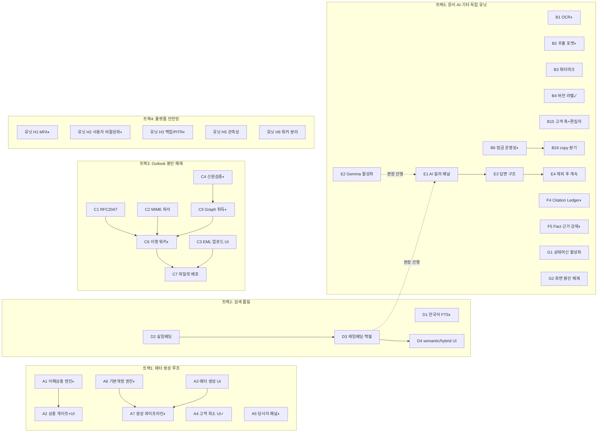

# 06. 실행 가이드 — 순서, 마일스톤, 검증 계약, Definition of Done

> 현재 실행 기준(2026-07-06): 이 문서는 2026-07-03 발주 패키지의 117유닛 실행 가이드다. strict-completion 진행 상태는 `docs/execution/TUW_INTERNAL_DMS_UPLIFT_110_STATUS_LEDGER.md` / `.json`(생성 시각 `2026-07-05T09:03:31.603Z`)을 기준으로 읽는다. 현재 장부는 110행 중 `COMPLETE_CANDIDATE` 19, `LOCAL_IMPLEMENTED_NEEDS_EVIDENCE` 80, `EXTERNAL_BLOCKED` 11이며, 남은 manual/staging/external 증거가 닫히기 전에는 제품 완료나 고객 전체 go-live로 해석하지 않는다.

## 1. 전체 규모

작업계획(`03_workplan-TUW-snapshot.md`) 총 **117 유닛**:

| Horizon | 유닛 수 | 크기 분포 | 기간 목표 |
|---|---|---|---|
| H1 — 신뢰 임계 결손 제거 + 봉인 해제 | 38 (36 + B15·B16) | L7 M25 S6 | ~3개월 |
| H2 — DMS 완성 (편집·이메일·통제 심화) | 61 (57 + B17·C16·B18·B19) | L22 M30 S9 | 3~9개월 |
| H3 — 지식·AI 계층 | 18 (17 + B20 조건부) | L8 M10 | 9~18개월 |

크기 기준: S=1~2일, M=3~5일, L=1~2주 (1인 개발자 + AI 코딩 에이전트). **조건부 유닛은 {D9, B20, H14} — 이 목록이 단일 원장이며** 트리거 조건(07 §3) 발생 시에만 착수, 미발생 시 발주자 서면 확인으로 "100% 완료" 판정에서 제외(§4). B14(Word Add-in)는 07 §2 예정 결정 D-06에 따라 착수/제외 확정.

**주의 — 상당수 유닛이 이미 구현되어 있다**: 마이그레이션 0098~0120이 H1 유닛 다수의 산출물과 일치한다(`01_context-and-goals.md` §2.3 증거표). 배정 전 **W0(117유닛 전수 초기 상태 감사)** 를 반드시 수행하라 — 실제 신규 개발량은 표의 명목치보다 상당히 작을 수 있다.

### 1.5 인력·일정 전제

명목 규모 산정: H1 38유닛 ≈ 150~165인일(L7×7.5 + M25×4 + S6×1.5). W0 감사로 기구현분을 제하면 실개발량은 이보다 작다. 3개월 목표 기준 권장 구성: **개발 2~3인(AI 코딩 에이전트 병행) + 리뷰·검수 1인**(리뷰 병목이 실제 제약 — 07 R-10). 킥오프에서 확정할 것: 프로젝트 시작일, 트랙(§2)별 담당자, 시작일 기준 M1~M6 목표일(아래 표에 기입).

| 마일스톤 | 목표일(킥오프 기입) | 담당 |
|---|---|---|
| M1 | ____ | |
| M2 (H1 완료) | ____ | |
| M3 | ____ | |
| M4 | ____ | |
| M5 (H2 완료) | ____ | |
| M6 (H3 완료) | ____ | |

발주자 측 외부 의존(M365 관리자 승인, Contract Desk git 접근, AT 픽스처)은 07 §5 발주자 제공 의무의 기한을 따른다.

## 2. H1 실행 트랙 (병렬 4+1트랙)

트랙 내부는 순차, 트랙 간은 병렬 가능. 담당자 배정 단위로 사용하라.



✓ = 워킹트리에 이미 구현 확인(acceptance 확인 후 닫기). ◐ = 대응 마이그레이션/파일 실재 — 구현 범위를 W0 감사에서 확정(01 §2.3 증거표).

**H2 핵심 체인**:
- 편집: B6 → B12(Word 핸드오프) → B17(버전 선택 다이얼로그)
- redline: B18(엔진 이식) → B19(PDF 서비스+UI), B10 → B11(조항 비교 탭, B18 엔진 재사용)
- 이메일: C7 → C15(전 인원), C9·C12 → C13(추천 스코어링), C5·C6·C7 → C16(발신 이행)
- 지식: F1 → F3/F2/F7 → F8(지식 탭)·F9(리뷰 큐), G13 → F9·G6·G8·G12
- 매터: A9 → A10(대시보드)·A11 → A12(Closing Binder)

## 3. 마일스톤 (데모 가능한 중간 인수점)

| 마일스톤 | 내용 | 포함 유닛 | 인수 방법 |
|---|---|---|---|
| **M1** (H1 중간) | 매터 생성 루프 + 검색 품질 | A1~A7, D1~D4 | 매터 생성→상충 검사→문서 업로드→한국어 본문 검색 시연 |
| **M2** (H1 완료) | R1·R2·R4의 H1 범위(AT-1·AT-3 통과 수준 — R1의 Word 열기 경험은 B12/H2, R2의 검색 카드 보강은 D5/H2) + AI 첫 노출 + 수신 메일 파일럿 | H1 전체 38유닛 | AT-1, AT-3, AT-6(파일럿 계정) 사전 리허설 통과 + E1 AI 질의 시연 |
| **M3** (H2 전반) | Word 편집 루프 + 발신 메일 완결 | B12, B17, C15, C16 | AT-4, AT-7 통과 |
| **M4** (H2 중반) | Redline 내장 | B18, B19 | AT-8 통과 |
| **M5** (H2 완료) | DMS 완성 — 대시보드·바인더·지식 탭·워크플로 | H2 전체 | AT-1~AT-8 전건 재수행 + 매터 대시보드·Closing Binder 시연 |
| **M6** (H3 완료) | 지식·AI 계층 | H3 전체 | 유사조항 검색·LLM Wiki export·Drafting 보조 시연 |

Baseline-8 최우선 발주 시 M2→M3→M4를 최단 경로로 당길 수 있다(`04_baseline8-requirements.md` §2의 최단 경로 참조).

## 4. Definition of Done

### 유닛 DoD (모든 유닛 공통)
1. 유닛 명세의 acceptance tests 전건 통과 — 자동 테스트는 CI green, 수동 절차는 PR 본문에 수행 기록(스크린샷/출력).
2. §5 Verification Contract 통과.
3. 신규 마이그레이션은 리포 규약 준수: tenant RLS FORCE, 컬럼 GRANT, 롤백 스크립트, `pnpm db:migrate`/`db:rollback` 왕복 검증.
4. 모든 신규 변이 경로에 감사 이벤트 + 권한 검사(fail-closed) — 예외 없음.
5. 기존 통합테스트 회귀 없음.
6. 라이브 작업계획 문서에 상태 갱신(done + PR#).

### 프로젝트 DoD ("100% 개발 완료")
1. 조건부 유닛 **{D9, B20, H14}** (이 목록이 단일 원장 — 07 §3의 트리거 정의 참조)를 제외한 전 유닛 DoD 충족. 조건부 유닛은 트리거 미발생 시 발주자 서면 확인으로 제외 처리. B14(Word Add-in)는 예정 결정 D-06 확정 결과에 따라 포함/제외.
2. `04_baseline8-requirements.md` §3 AT-1~AT-8 발주자 실수행 전건 통과 + 서명. **수행 시점: 프로젝트 완료 판정 직전, DMS 표면에 영향을 주는 마지막 머지 이후 4주 이내의 재수행이어야 유효**(중간 마일스톤 기록으로 갈음 불가).
3. H1 종료 시점과 프로젝트 종료 시점에 각각 백업 복구 리허설 1회 성공 기록(유닛 H3: 백업/PITR의 리허설 절차).
4. 운영 문서 갱신: `docs/current-code-state.md`, 신규 기능 런북(Outlook 배포, redline 워커, 데스크톱 브리지).

## 5. Verification Contract (모든 PR 공통 게이트)

Node 22 + pnpm 9가 활성화된 셸에서 아래 8개 명령 전건 통과 (macOS Homebrew 환경이면 `PATH=/opt/homebrew/opt/node@22/bin:$PATH` prefix — 예시일 뿐 필수 아님. Linux/CI는 해당 환경의 Node 22 활성화 방식을 따른다):

```bash
pnpm lint
pnpm typecheck
pnpm test
pnpm build
pnpm docs:frozen
pnpm check:production-ui-literals
pnpm ui:production-smoke
pnpm check:ui-pr-checklist
```

Outlook 관련 유닛은 추가로 `pnpm outlook:deployment:check` / `outlook:operational:check`, 데스크톱 관련 유닛은 `pnpm desktop:release-gate`, DMS 표면 변경은 `pnpm release:dms-smoke -- --check-env --json`.

## 6. 리포 규약 요점 (위반 시 PR 반려)

- `docs/package/**`는 읽기 전용 — 절대 수정 금지.
- 모든 테이블은 tenant RLS FORCE + `app.current_tenant_id` GUC 경유 쿼리(`tenantQuery`/`withTenantClient`).
- 권한 평가는 반드시 FailClosedPermissionWrapper 계열 경유 — 직접 SQL로 권한 우회 금지.
- 프로덕션 UI 문자열은 literal 게이트(`check:production-ui-literals`) 준수.
- 봉인 해제(G2 등)는 hidden-routes 테스트를 함께 갱신 — 몰래 라우트만 여는 것 금지.
- 커밋·PR 컨벤션과 상세 규약은 리포 루트 `AGENTS.md`를 따른다.

## 7. 환경·인프라 전제

- 로컬: Node 22 + pnpm 9, `infra/docker-compose.dev.yml`(Postgres 16 + MinIO), `pnpm db:migrate && pnpm db:seed`.
- 스테이징/프로덕션: AWS Seoul, ECS Fargate + RDS + ALB + S3(기 운영 중, 실문서 22,286건 적재). 배포는 현재 수동 out-of-band — H4(IaC-lite) 완료 전까지 배포 절차는 `docs/release/` 런북 준수.
- 신규 런타임 의존: Ollama(로컬 Gemma — E계열, 기존 연동), bge-m3 임베딩 서빙(D2), Playwright chromium + 한글 폰트(B19), tesseract 한국어 데이터(B1·redline OCR), LibreOffice headless(B20 조건부).
- M365: add-in 배포는 테넌트 관리자 승인 필요(C7·C15) — 외부 변수이므로 일정에 버퍼를 둘 것.
