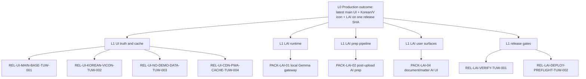

# Production LAI UI Release Plan

Status: in progress  
Date: 2026-06-15  
Branch: `codex/prod-lai-ui-release`

## Why The Previous UI Was Not A Complete Production Truth

The Korean UI/V icon hotfix was first prepared on `codex/prod-ui-korean-v-icon`, which diverged from the later `origin/main` dashboard redesign. The temporary production target could serve the hotfix login shell and static assets, but the official mainline release path did not yet contain that hotfix and PR #91 remained draft/open with merge conflicts. For this release, the integration branch starts from current `origin/main` and reapplies the Korean-only UI changes before adding LAI.

## Pyramid

## TUW Scope

| TUW | Purpose | Exit evidence |
| --- | --- | --- |
| REL-UI-MAIN-BASE-TUW-001 | Start from current `origin/main`, not the divergent hotfix branch. | `codex/prod-lai-ui-release` branch created from `origin/main`. |
| REL-UI-KOREAN-VICON-TUW-002 | Apply Korean-only language shell and V app icon in the mainline UI. | Login/app shell tests and smoke require Korean labels and icon assets. |
| REL-UI-NO-DEMO-DATA-TUW-003 | Remove seeded customer-looking dashboard data. | Dashboard renders empty states and negative tests reject demo names, times, counts, and document names. |
| REL-UI-CDN-PWA-CACHE-TUW-004 | Treat visible stale UI as URL/cache/release-SHA evidence, not assumption. | Production deploy must include CloudFront invalidation or equivalent cache rotation plus `/sw.js` no-store check. |
| REL-LAI-RUNTIME-TUW-001 | Include PACK-LAI-01 local/private Gemma gateway. | Local/private endpoint guard, timeout, structured output, and degraded mode tests. |
| REL-LAI-PREP-TUW-002 | Include PACK-LAI-02 prep schema, queue, audit, and artifact lifecycle. | Migrations 0064-0066, rollback/reapply, RLS, no raw prompt/source/response leakage. |
| REL-LAI-WORKFLOW-TUW-003 | Include PACK-LAI-03 document summary workflow. | Grounded output guard rejects unsupported claims and preserves deterministic fallback. |
| REL-LAI-UI-TUW-004 | Include PACK-LAI-04 document and matter AI readiness UI. | Document/matter UI tests show Korean LAI labels and no raw prompt/source text. |
| REL-LAI-OPS-TUW-005 | Include PACK-LAI-05 ops/eval gate. | `LOCAL_AI_gate.md`, `pnpm eval:local-ai`, admin-only ops API, and leakage scan. |
| REL-LAI-BENCH-EXCLUDE-TUW-006 | Keep PACK-LAI-06 bench lane out of customer runtime. | No bench routes, no tenant table output, no `AI_BENCH_HARNESS_ENABLED` requirement for production. |

## Deploy Checklist

- [ ] PR branch is based on current `origin/main`.
- [ ] CI is green on the final release SHA.
- [ ] Human/independent review is complete before merge because LAI includes Risk=C TUWs.
- [ ] Database migrations 0064-0066 are tested on a clean database with rollback/reapply.
- [ ] Production API task receives private/local Gemma endpoint configuration or LAI runs in degraded mode by design.
- [ ] API and web images are deployed together; web-only deploy is insufficient for LAI.
- [ ] Production smoke covers SMOKE-001 through SMOKE-015 plus Korean UI assertions and LAI health/readiness checks.
- [ ] CloudFront/PWA cache rotation is confirmed so users do not see the previous app shell.

## Rollback Triggers

- Login or dashboard renders English customer-facing labels.
- Fake/demo customer, document, timestamp, or count appears in the dashboard.
- LAI endpoint accepts a public model endpoint.
- AI prep artifact or audit metadata contains raw prompt/source/response text.
- Permission-before-AI or stale-artifact display-time checks fail.
- Production API health, web health, or authenticated dashboard smoke fails after deploy.
