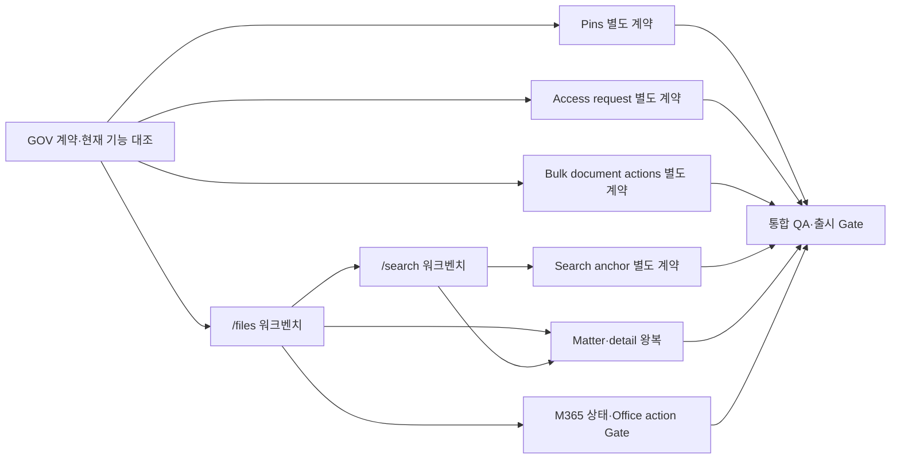

# AMIC Vault 오픈소스 DMS형 워크벤치 UI/UX TUW 계획

> 상태: **ACTIVE INTERNAL EXECUTION — external 연결 제외**
> 기준일: 2026-07-28 (Asia/Seoul)  
> 기준 소스: `origin/main@328ecbc9928bd52be1b9ab33b90405e1c7352523`  
> 계획 브랜치: `codex/dms-oss-ui-ux-tuw-plan-20260728`  
> 디자인 근거: [Lazyweb DMS UI/UX 비교 리포트](https://www.lazyweb.com/report/lazyweb/dc71cdd4-43a2-4ec9-880b-5b0c6b21fbc9/?source=create)

## 0. 문서 효력과 실행 경계

이 문서는 AMIC Vault의 `/files`와 `/search`를 오픈소스 DMS에서 검증된 문서 중심 워크벤치 패턴으로 개편하기 위한 **provisional Testable Units of Work(TUW)** 전체 계획이다.

- 아래 `DMS-WB-*` ID는 기존 `docs/package/codex/40~43_TUW_Backlog_*.md` 또는 `60_Execution_Packs.md`에 등록된 canonical ID가 아니다.
- `docs/package/**`는 읽기 전용이다. 이 계획 작업에서는 변경하지 않는다.
- 2026-07-28 운영자 지시에 따라 외부 연결을 제외한 내부 범위는 canonical TUW/PACK 등록 후 구현한다. 다만 material product choice가 없는 기존 계약을 재사용하며, 새 data/API 계약은 fail-closed로 별도 decision record를 먼저 만든다.
- 이미 `main`에 병합된 기능은 다시 구현하지 않는다. UI가 그 계약을 소비하고 회귀 검증하는 범위만 계획한다.
- 별도 데이터/API/운영/상용 계약이 필요한 항목은 명시된 계약 Gate 이전에 코드 작업을 시작하지 않는다.
- 각 구현 PACK은 별도 깨끗한 브랜치에서 수행한다. 이 계획 브랜치는 구현 브랜치가 아니다.

### 0.2 활성 실행 범위와 제외 범위

이번 실행 goal은 `G`, `F`, `S`, `X`, `P`, `B`, `O`, 그리고 repository-local `Q`만 포함한다.

- 제외: `M365-001~008`, `QA-004`의 authenticated external runtime smoke, `QA-005`의 production rollout/owner sign-off, OneDrive/Office/WOPI, 외부 tenant·vendor·credential·staging mutation.
- 검색 anchor는 DMS-GA-3B의 현재 구현을 소비·회귀 검증한다. 새로운 indexing/preview backend TUW를 만들지 않는다.
- 일반 self-service access request는 DMS-GA-405의 break-glass policy에 의해 현재 범위 밖이다. 접근 요청 UI를 새로 구현하지 않는다.
- Pins와 다중 문서 작업은 새 persistence/API가 필요한 내부 계약이므로 해당 decision record가 canonical TUW에서 먼저 확정될 때만 구현한다.

### 0.1 변하지 않는 보안·제품 원칙

모든 TUW는 다음 원칙을 동시에 만족해야 한다.

1. 검색·목록·핀·일괄 작업은 쿼리 단계에서 `PermissionService` 범위를 주입한다. 사후 필터링은 금지한다.
2. 권한 판단 오류, 미해석 정책, 타임아웃은 `PERMISSION_DENIED`로 fail-closed 처리한다.
3. 사용자에게 문서 존재 여부, 거부 사유, ethical wall 유무를 추론시킬 정보를 표시하지 않는다.
4. 문서·권한·외부 공유·미리보기·일괄 변경 행위는 승인된 audit event와 같은 트랜잭션 또는 실패 결합 경로를 사용한다.
5. 원본은 덮어쓰지 않는다. 버전·편집·폐기 기능은 현재 승인된 서비스로만 연결한다.
6. 목록 선택만으로 다운로드·미리보기 세션·본문 조회·외부 호출을 시작하지 않는다.
7. URL, 로그, analytics, audit metadata에 본문·검색 snippet·파일명 전체·토큰을 넣지 않는다.
8. 외부 공유와 records disposal은 기존 전용 흐름으로만 연결한다. 목록에서 직접 공유·삭제하는 바로가기는 만들지 않는다.
9. 새 테이블은 `tenant_id NOT NULL`, RLS와 `FORCE ROW LEVEL SECURITY`, rollback을 같은 migration 단위로 제공한다.
10. 새 의존성, 범용 워크스페이스 추상화, 외부 API는 승인된 TUW에 명시되지 않는 한 추가하지 않는다.

## 1. `main` 기준 기능 재분류

841개로 보였던 변경은 현재 `main`에 이미 병합되어 있다. 따라서 과거 계획이나 route inventory의 “미구현” 표시는 현재 소스와 다를 수 있다.

| 기능                                          | 현재 근거                                                                                            | 이번 계획의 처리                                                        |
| --------------------------------------------- | ---------------------------------------------------------------------------------------------------- | ----------------------------------------------------------------------- |
| Matter 폴더·태그                              | `db/migrations/0140_create_document_folders_and_tags.sql`, document folder API, `MatterDocumentList` | 재구현 금지. `/files` rail과 filter에서 기존 계약 재사용                |
| 대량 업로드                                   | `db/migrations/0138_create_bulk_upload_batches.sql`, stage API와 통합 테스트                         | 재구현 금지. 문맥형 업로드 UI만 재배치                                  |
| 조직 사용자·그룹 선택                         | `org-directory` API, `OrgSubjectPicker`                                                              | 재구현 금지. 기존 선택기를 권한/리뷰 UI에서 재사용                      |
| 개인·Matter team·admin 공유 검색              | saved-search scope와 `/search/folders`                                                               | 재구현 금지. rail/drawer IA로 재배치                                    |
| 문서 check-out, heartbeat, check-in, reviewer | document editing API와 action center                                                                 | 재구현 금지. inspector는 요약과 detail 진입점만 제공                    |
| persisted work items·notifications            | work/notifications API와 `/work`, `/notifications`                                                   | 재구현 금지. 상태 요약과 기존 route 연결만 허용                         |
| 외부 workspace·secure link                    | external module과 Matter sharing route                                                               | 기존 role/policy gate 뒤에서만 연결. 일반 row action 금지               |
| legal hold·disposal·certificate               | records service/worker/console                                                                       | 기존 records workflow로만 연결. hard delete 버튼 금지                   |
| preview access session                        | preview module, preview session tests                                                                | 명시적 preview action에서 재사용. 선택 시 자동 생성 금지                |
| OneDrive migration·Office closeout            | `docs/release/onedrive-*` 계획과 gate                                                                | 기존 Gate receipt를 소비하며, UI에서 성공을 선행 주장하지 않음          |
| 즐겨찾기/고정                                 | i18n label 외 persistence/API 근거 없음                                                              | **별도 제품·데이터 계약 필요**                                          |
| 접근 요청                                     | `break-glass` API와 `docs/security/access-request-workflow.md`                                       | self-service UI 재구현 금지. 기존 break-glass 경계 회귀만 수행          |
| 다중 문서 변경                                | bulk upload 외 move/tag/status batch 계약 근거 없음                                                  | **별도 원자성·권한·receipt 계약 필요**                                  |
| 검색 hit→preview anchor                       | DMS-GA-3B `anchorId`, detail preview anchor contract                                                 | 재구현 금지. search inspector가 기존 bounded anchor를 보존하는지만 검증 |

### 1.1 current-main correction (supersedes obsolete proposed tracks)

`DMS-WB-ACCESS-TUW-001~006`과 `DMS-WB-ANCHOR-TUW-001~005`는 최초 조사 시점의 gap 가설이다. 기준 SHA 재대조 결과 각각 DMS-GA-405 break-glass boundary와 DMS-GA-3B preview anchor contract가 이미 이를 대체한다. 이 ID들은 새 backend/schema/API 작업으로 실행하지 않으며, `SEARCH-006`, `SEARCH-008`, `QA-002`의 소비·negative regression으로 흡수한다.

## 2. 목표 UX 계약

### 2.1 정보 구조

데스크톱은 세 영역으로 구성한다.

| 영역            | semantic token          |            기본 크기 | 책임                                                              |
| --------------- | ----------------------- | -------------------: | ----------------------------------------------------------------- |
| 탐색 rail       | `--dms-rail-width`      |              `232px` | 전체 문서, 최근 항목, 저장 검색, Matter, Matter 선택 후 실제 폴더 |
| 목록 작업면     | `--dms-list-min-width`  | `minmax(520px, 1fr)` | query, filter chips, table/list, pagination, selection            |
| quick inspector | `--dms-inspector-width` |              `360px` | 안전한 metadata, 명시적 preview/detail/action 진입                |

- `>=1280px`: 세 영역을 동시에 표시한다.
- `768px~1279px`: rail은 접을 수 있고 inspector는 우측 drawer로 연다.
- `<768px`: 목록을 우선 표시하고 rail과 inspector는 각각 modal/drawer로 연다.
- 영역 구분은 기존 border와 surface token을 사용한다. 중첩 카드, 균일한 큰 radius, 장식용 gradient/glow를 추가하지 않는다.
- `/files`에서 패턴과 상태 계약을 검증한 뒤 `/search`에 적용한다. 검증 전 `DmsWorkspace` 같은 범용 abstraction은 만들지 않는다.

### 2.2 핵심 상호작용

1. 첫 진입은 목록이 주인공이며 필터 form이 화면을 지배하지 않는다.
2. Matter를 선택하기 전에는 Matter 폴더 tree를 표시하지 않는다.
3. row는 클릭과 `Enter`/`Space`로 선택한다. 링크와 버튼 조작은 row selection과 충돌하지 않는다.
4. 선택은 안전한 list DTO만 inspector에 전달한다.
5. 미리보기는 별도 버튼으로 시작한다. preview session 생성 실패 시 이전 문서가 남지 않는다.
6. 상세 화면은 version, audit, edit, review, sharing, records의 canonical 작업면이다.
7. 업로드는 선택한 Matter 문맥을 유지하는 drawer/panel에서 기존 upload component를 사용한다.
8. 검색의 고급 필터와 저장 검색 생성은 필요할 때 펼치는 progressive disclosure로 바꾼다.
9. 전역 검색은 `/search`로 query를 전달하지만 검색 결과·필터 상태의 canonical owner는 `/search`다.

### 2.3 상태와 접근성

- 상태: loading, empty, partial data, permission denied, recoverable error, offline shell, stale selection, preview expired를 모두 별도로 정의한다.
- `0건`은 실제 성공 응답일 때만 표시한다. 권한/부분 실패는 `권한 없음` 또는 `일부 데이터`로 구분한다.
- focus order는 rail → query/filter → list → inspector 순이다.
- drawer는 focus trap, `Escape` 닫기, 닫은 뒤 trigger로 focus 복귀를 보장한다.
- selection은 색상 하나에만 의존하지 않고 `aria-selected`와 focus indicator를 제공한다.
- 한국어 긴 Matter명·파일명은 한 줄 ellipsis와 전체 이름 확인 수단을 제공한다.
- motion은 drawer와 selection 피드백에만 사용하고 `prefers-reduced-motion`을 존중한다.

### 2.4 AI slop 방지 기준

- 필터를 카드 여러 개로 쪼개지 않는다.
- 동일한 둥근 카드 grid, 장식용 아이콘, 의미 없는 badge·metric row를 만들지 않는다.
- 막연한 효율·편리 표현 대신 실제 작업명과 상태를 쓴다.
- 화면마다 같은 Lucide 아이콘을 장식으로 반복하지 않는다. 아이콘은 텍스트를 보조할 때만 쓴다.
- 장식성 색상 전환, 발광 효과, 떠다니는 도형, 일괄 등장 애니메이션을 추가하지 않는다.
- 구현 PR마다 실제 화면을 검사하고 `sloplint --changed`를 실행한다.

## 3. 의존성 지도



핵심 출시와 선택 기능을 분리한다.

- Core release candidate: `GOV → FILES → SEARCH → FLOW → QA`
- Optional contract tracks: Pins, Access request, Bulk actions, Search anchor
- External contract track: M365 connected state, Office open/save, WOPI
- Optional track 실패는 core의 이미 통과한 Gate를 무효화하지 않는다. 공통 계약이 바뀐 경우에만 upstream을 다시 연다.

## 4. 공통 TUW 규약

### 4.1 크기와 위험

- `S`: 0.5일 이하
- `M`: 1일 이하
- `L`: 2일 이하
- `C` 위험 TUW는 `needs-human-review`와 독립 검토 AI 증빙이 필요하다.
- 2일을 넘을 것으로 보이면 구현 전에 TUW를 더 분해한다.

### 4.2 검증 프로필

각 TUW의 `Verification`은 아래 프로필과 해당 행의 assertions를 **AND**로 실행한다.

**V-UI**

```bash
pnpm --filter @amic-vault/web lint
pnpm --filter @amic-vault/web typecheck
pnpm --filter @amic-vault/web test
pnpm --filter @amic-vault/web build
pnpm check:production-ui-literals
pnpm check:ui-pr-checklist
git diff --check
```

**V-ROOT**

```bash
pnpm lint
pnpm typecheck
pnpm test
pnpm build
pnpm docs:frozen
pnpm backlog:validate
```

**V-DB**

```bash
docker compose -f infra/docker-compose.dev.yml up -d
pnpm db:migrate
pnpm db:rollback
pnpm db:migrate
pnpm db:seed
```

**V-SEC**

```bash
pnpm test:integration
```

해당 변경과 직접 관련된 canonical suite를 먼저 실행하고 전체 integration을 뒤따라 실행한다. 최소 회귀 대상은 다음과 같다.

- `tests/integration/document-access/document-permission.spec.ts`
- `tests/integration/document-access/safe-denied-message.spec.ts`
- `tests/integration/metadata-leakage/search-metadata-leakage.spec.ts`
- `tests/integration/metadata-leakage/preview-session-token.spec.ts`
- `tests/integration/audit-coverage/document-audit.spec.ts`
- `tests/integration/audit-coverage/search-audit.spec.ts`
- `tests/integration/cross-tenant/**`

**V-VISUAL**

```bash
python3 /Users/jws/Applications/ai-slop-taxonomy/scripts/sloplint.py --repo "$PWD" --changed
pnpm ui:production-smoke
```

그리고 실제 화면을 `1440×900`, `1024×768`, `768×1024`, `390×844`에서 검사한다. 자동 검사만으로 visual QA를 대체하지 않는다.

**V-EXTERNAL**

```bash
pnpm release:dms-smoke -- --check-env --json
pnpm release:dms-smoke -- --json
```

첫 명령은 환경 준비 확인일 뿐이며 제품 성공 증빙이 아니다. 두 번째 명령의 외부 runtime receipt와 독립 검토를 분리 보관한다.

### 4.3 공통 금지 파일·행위

각 행에서 달리 명시하지 않는 한 다음은 `Files NOT-modify`에 포함된다.

- `docs/package/**`
- `packages/ai/**`
- 기존 permission decision semantics
- 기존 audit event 불변성
- external sharing, records disposal, document editing의 domain service
- migration history 재번호 매기기 또는 기존 migration 수정
- 새 npm/pnpm dependency

### 4.4 공통 Stop/Escalation

- DTO가 필요한 안전한 metadata를 제공하지 않으면 UI에서 추측하거나 추가 API를 몰래 만들지 않는다.
- 기존 계약과 계획 문서가 충돌하면 구현을 중단하고 capability inventory와 ledger에 차이를 기록한다.
- 동일 실패 3회면 중단하고 escalation한다.
- 권한·audit·tenant isolation fixture가 없으면 기능을 약화하거나 mock-only green으로 만들지 않는다.
- 별도 계약 TUW는 승인 receipt가 없으면 첫 구현 TUW에서 중단한다.

## 5. Lane G — 현재 기능 고정과 canonical 등록

Release: `UI modernization preflight`  
Module: `docs / product contract`  
Lane 공통 edge: stale inventory, merged-after-baseline commit, feature flag가 코드 존재와 제품 enablement를 혼동하는 경우.

### DMS-WB-GOV-TUW-001 — exact-main capability inventory

- **Risk / Size / Depends_on:** `M / M / none`
- **Objective:** 기준 SHA에서 routes, API, migrations, tests, feature gates를 대조하여 `implemented / gated / missing / uncertain`로 분류한다.
- **Files create:** `docs/ui/dms-oss-workbench-capability-inventory.md`
- **Files modify:** 없음
- **Files NOT-modify:** product source, `docs/package/**`
- **Verification:** `V-ROOT` 중 `docs:frozen`, `backlog:validate`, `git diff --check` AND 모든 “implemented” 항목에 source+test 경로가 각각 하나 이상 있음.
- **Edge cases:** 코드만 있고 runtime Gate가 닫힌 기능은 `gated`로 표시한다.
- **Stop / Escalation:** 기준 SHA가 바뀌면 inventory를 rebase하지 말고 새 SHA diff를 먼저 승인받는다.

### DMS-WB-GOV-TUW-002 — workbench design contract acceptance

- **Risk / Size / Depends_on:** `M / M / GOV-001`
- **Objective:** 3-pane 구조, selection/preview 분리, responsive 동작, empty/error/partial 상태와 copy를 제품 책임자가 승인 가능한 handoff로 고정한다.
- **Files create:** `docs/ui/dms-oss-workbench-handoff.md`
- **Files modify:** 없음
- **Files NOT-modify:** product source, design tokens
- **Verification:** acceptance checklist AND keyboard flow diagram AND 4 viewport wireframe/state matrix가 존재함.
- **Edge cases:** Matter 미선택, 0건, 10,000건, 긴 한국어명, preview 만료.
- **Stop / Escalation:** rail과 inspector의 책임 또는 `/files`와 `/search` query owner가 합의되지 않으면 중단한다.

### DMS-WB-GOV-TUW-003 — action/permission/audit matrix

- **Risk / Size / Depends_on:** `H / M / GOV-001, GOV-002`
- **Objective:** select, preview, download, edit, share, dispose, bulk action별 permission method, audit event, safe denied copy를 매핑한다.
- **Files create:** `docs/ui/dms-oss-workbench-action-matrix.md`
- **Files modify:** 없음
- **Files NOT-modify:** permission/audit implementation
- **Verification:** 각 UI action에 permission owner, audit owner, negative test, URL/log data classification이 모두 있음.
- **Edge cases:** 권한이 selection 후 철회됨, Matter wall 변경, preview token 만료.
- **Stop / Escalation:** 승인된 permission/audit owner가 없는 action은 UI 계획에서 제거한다.

### DMS-WB-GOV-TUW-004 — canonical backlog/PACK mapping gate

- **Risk / Size / Depends_on:** `H / S / GOV-001..003`
- **Objective:** provisional ID를 사람 승인 하에 canonical TUW와 PACK에 매핑하고 실행 순서·release Gate를 고정한다.
- **Files create:** 사람 승인 범위에서 결정되는 canonical 기록
- **Files modify:** 이 계획 작업에서는 없음
- **Files NOT-modify:** `docs/package/**`를 Codex가 임의 수정하는 행위
- **Verification:** 모든 실행 TUW가 canonical ID, PACK, branch, predecessor, verification sequence를 가짐.
- **Edge cases:** 기존 PACK과 범위 중복, Critical review 요구.
- **Stop / Escalation:** mapping receipt가 없으면 Lane F 이후 어떤 코드도 시작하지 않는다.

## 6. Lane F — `/files` 문서 워크벤치

Release: `Core UI candidate 1`  
Module: `apps/web files`  
Lane 공통 NOT-modify: API/DB/domain, folder/editing/external/records service.  
Lane 공통 edge: Matter 미선택, stale row selection, pagination 전환, 권한 철회, 긴 파일명, 모바일 keyboard.

### DMS-WB-FILES-TUW-001 — three-pane page shell

- **Risk / Size / Depends_on:** `M / M / GOV-004`
- **Objective:** `/files`를 flat rail/list/inspector grid로 전환하되 기존 두 탭과 데이터 fetch의 의미를 바꾸지 않는다.
- **Files create:** `apps/web/src/components/document/document-workbench-shell.tsx`와 test
- **Files modify:** `apps/web/src/app/(app)/files/page.tsx`, page test, scoped CSS/token file
- **Verification:** `V-UI` AND desktop에서 232px/flex/360px grid, 1024px에서 horizontal overflow 0.
- **Edge cases:** inspector 없음, rail 접힘, browser zoom 200%.
- **Stop / Escalation:** 기존 AppShell width contract와 충돌하면 새 global layout 수정 대신 중단한다.

### DMS-WB-FILES-TUW-002 — authorized navigation rail

- **Risk / Size / Depends_on:** `M / L / FILES-001`
- **Objective:** 전체 문서, 최근 항목, 저장 검색, Matter를 rail에 표시하고 실제 폴더는 Matter 선택 후 기존 folder API로만 로드한다.
- **Files create:** `document-workbench-rail.tsx`와 test
- **Files modify:** files page, existing Matter/folder API client 사용부
- **Verification:** `V-UI` AND Matter 미선택 시 folder fetch 0회 AND unauthorized Matter/폴더 미노출 test.
- **Edge cases:** 폴더 없음, 100개 폴더, nested path, 일부 데이터.
- **Stop / Escalation:** 최근 항목의 authorized source가 없으면 fake recents를 만들지 않고 FLOW-002 계약으로 넘긴다.

### DMS-WB-FILES-TUW-003 — compact filters and real folder picker

- **Risk / Size / Depends_on:** `M / M / FILES-001, FILES-002`
- **Objective:** 상시 노출된 filter form을 핵심 control+active chips로 축소하고 raw `폴더 ID` 입력을 기존 Matter folder 선택기로 대체한다.
- **Files create:** 필요한 경우 `document-filter-summary.tsx`와 test
- **Files modify:** `document-vault-list.tsx`, 관련 test
- **Verification:** `V-UI` AND URL filter round-trip AND raw UUID input이 rendered UI에 없음.
- **Edge cases:** 삭제된 folder query, 잘못된 URL value, 필터 6개 이상.
- **Stop / Escalation:** server filter contract를 바꿔야 하면 UI TUW를 중단하고 별도 API TUW로 재분류한다.

### DMS-WB-FILES-TUW-004 — row selection and keyboard contract

- **Risk / Size / Depends_on:** `M / M / FILES-001`
- **Objective:** 기존 `DataTableRow`의 `selected`, `onSelect`, `aria-selected`, Enter/Space 동작을 사용해 single selection을 구현한다.
- **Files create:** 없음
- **Files modify:** `document-vault-list.tsx`와 test; 필요한 최소 범위의 `data-table` test
- **Verification:** `V-UI` AND mouse/Enter/Space selection AND 내부 link/button 클릭이 중복 action을 발생시키지 않음.
- **Edge cases:** 선택 row가 다음 page/filter에서 사라짐, disabled status control.
- **Stop / Escalation:** selection 때문에 기존 row action의 keyboard semantics가 깨지면 먼저 충돌을 해결한다.

### DMS-WB-FILES-TUW-005 — safe metadata inspector

- **Risk / Size / Depends_on:** `H / L / FILES-004, GOV-003`
- **Objective:** 기존 `DetailInspector`를 재사용하여 list DTO의 title, Matter, folder path, type, status, updated time, tags만 표시한다.
- **Files create:** `document-quick-inspector.tsx`와 test
- **Files modify:** workbench shell/list selection wiring
- **Verification:** `V-UI` AND selection만으로 detail/preview/download API 호출 0회 AND stale data clear test.
- **Edge cases:** 값 없음, permission revoked, title truncation, partial DTO.
- **Stop / Escalation:** list DTO에 없는 필드를 추측하거나 N+1 detail fetch가 필요하면 해당 필드를 제외한다.

### DMS-WB-FILES-TUW-006 — explicit preview action

- **Risk / Size / Depends_on:** `H / L / FILES-005`
- **Objective:** inspector의 명시적 action으로 기존 preview session을 생성하고 loading/error/expired/close 상태를 제공한다.
- **Files create:** 필요한 경우 `document-preview-drawer.tsx`와 test
- **Files modify:** inspector, 기존 preview API client 사용부
- **Files NOT-modify:** preview session service/controller/token contract
- **Verification:** `V-UI + V-SEC`의 preview 관련 suites AND 선택/hover 시 session 0회 AND 문서 전환 실패 시 이전 iframe/source 제거.
- **Edge cases:** 401/403, conversion pending, unsupported type, token expiry, rapid A→B selection.
- **Stop / Escalation:** token이 URL/history/log에 잔존하거나 preview가 permission check를 우회하면 즉시 중단한다.

### DMS-WB-FILES-TUW-007 — contextual upload drawer

- **Risk / Size / Depends_on:** `M / M / FILES-002`
- **Objective:** 기존 upload/email/bulk upload component를 Matter 문맥 drawer로 이동하고 Matter·folder context를 유지한다.
- **Files create:** `document-upload-drawer.tsx`와 test
- **Files modify:** files page, existing upload component composition
- **Files NOT-modify:** upload/bulk-upload API와 ingestion contracts
- **Verification:** `V-UI` AND Matter 미선택 시 업로드 차단 AND close/reopen context test AND success receipt에서 list refresh.
- **Edge cases:** upload 진행 중 닫기, duplicate decision, bulk batch partial result.
- **Stop / Escalation:** 기존 component를 복제해야 하면 composition 경계를 먼저 재검토한다.

### DMS-WB-FILES-TUW-008 — responsive rail and inspector drawers

- **Risk / Size / Depends_on:** `M / L / FILES-002, FILES-005, FILES-007`
- **Objective:** tablet/mobile에서 rail·inspector·upload를 접근 가능한 drawer로 전환한다.
- **Files create:** 없음 또는 기존 drawer wrapper test
- **Files modify:** workbench shell/rail/inspector/upload styles and tests
- **Verification:** `V-UI + V-VISUAL` AND 4 viewport, focus trap, Escape, trigger focus return, reduced motion.
- **Edge cases:** iOS viewport height, software keyboard, 200% zoom, landscape tablet.
- **Stop / Escalation:** content가 DOM에 중복되어 screen reader가 두 pane을 읽으면 중단한다.

### DMS-WB-FILES-TUW-009 — files closeout regression

- **Risk / Size / Depends_on:** `H / M / FILES-001..008`
- **Objective:** filters, pagination, selection, preview, upload, status/detail 진입의 end-to-end contract를 고정한다.
- **Files create:** files workbench integration/component test
- **Files modify:** existing page/list tests와 smoke manifest
- **Verification:** `V-UI + V-ROOT + V-VISUAL` AND unauthorized fixture AND no false-zero/deny-reason assertions.
- **Edge cases:** page refresh, back/forward, stale query, API partial failure.
- **Stop / Escalation:** 기존 files 기능 회귀가 하나라도 남으면 Lane S를 시작하지 않는다.

## 7. Lane S — `/search` 검색 워크벤치

Release: `Core UI candidate 2`  
Module: `apps/web search`  
Lane 공통 NOT-modify: search permission filters, indexing semantics, saved-search schema, AI policy.  
Lane 공통 edge: query 없음, 0건, partial facet, permission change, long Korean query, stale result, browser history.

### DMS-WB-SEARCH-TUW-001 — single query ownership

- **Risk / Size / Depends_on:** `M / M / FILES-009`
- **Objective:** AppShell 검색은 `/search`로 안전하게 query를 전달하고 `/search`가 query/filter/result state의 canonical owner가 되게 한다.
- **Files create:** 없음
- **Files modify:** `app-shell.tsx`, `/search/page.tsx`, tests
- **Verification:** `V-UI` AND submit 1회당 navigation 1회 AND query가 analytics/log에 중복 기록되지 않음.
- **Edge cases:** 빈 query, 이미 `/search`에 있음, IME composition, back/forward.
- **Stop / Escalation:** query normalization이 server search semantics를 바꾸면 중단한다.

### DMS-WB-SEARCH-TUW-002 — progressive advanced filters

- **Risk / Size / Depends_on:** `M / M / SEARCH-001`
- **Objective:** `SearchAdvancedControls`를 기본 접힘으로 바꾸고 active filter chips와 reset을 결과 header 가까이에 둔다.
- **Files create:** 필요한 경우 `search-filter-summary.tsx`와 test
- **Files modify:** `search-advanced-controls.tsx`, page, tests
- **Verification:** `V-UI` AND URL round-trip AND 접힘 상태에서도 active filter와 결과 범위가 인지됨.
- **Edge cases:** 잘못된 enum/query, 8개 이상 chips, reset 후 pagination.
- **Stop / Escalation:** hidden control이 실제 active filter를 숨기면 release blocker로 처리한다.

### DMS-WB-SEARCH-TUW-003 — saved search rail/drawer

- **Risk / Size / Depends_on:** `M / L / SEARCH-002`
- **Objective:** 기존 personal/matter-team/admin-shared 계약과 `/search/folders`를 rail/drawer에 배치하고 생성 form은 명시적 action으로 연다.
- **Files create:** `search-workbench-rail.tsx`와 test
- **Files modify:** `search-save-panel.tsx`, search page composition
- **Files NOT-modify:** saved search API/schema/scope permission
- **Verification:** `V-UI + V-SEC` saved-search regression AND scope별 authorized item만 표시.
- **Edge cases:** 공유 검색이 revoke됨, 빈 folder, renamed Matter.
- **Stop / Escalation:** scope 이름과 권한 의미가 current API와 다르면 UI copy를 임의 정의하지 않는다.

### DMS-WB-SEARCH-TUW-004 — selectable search results

- **Risk / Size / Depends_on:** `M / M / SEARCH-002`
- **Objective:** search result를 single-select 가능하게 만들고 link/action과 keyboard 충돌을 방지한다.
- **Files create:** 없음
- **Files modify:** `search-results.tsx`와 test, search page
- **Verification:** `V-UI` AND mouse/keyboard selection AND pagination/query change 시 stale selection clear.
- **Edge cases:** 중복 document hit, snippet click, result가 permission change로 사라짐.
- **Stop / Escalation:** result DTO에 안정적인 document key가 없으면 selection을 구현하지 않는다.

### DMS-WB-SEARCH-TUW-005 — safe search inspector

- **Risk / Size / Depends_on:** `H / L / SEARCH-004, GOV-003`
- **Objective:** result DTO에 이미 있는 안전한 metadata와 snippet만 inspector에 표시하고 version/audit/edit는 detail route로 연결한다.
- **Files create:** `search-result-inspector.tsx`와 test
- **Files modify:** search page/shell wiring
- **Verification:** `V-UI + V-SEC` metadata leakage tests AND selection-only 추가 API 호출 0회.
- **Edge cases:** snippet 없음, redacted snippet, partial facet, denied after result load.
- **Stop / Escalation:** inspector가 raw body 또는 권한 밖 field를 요구하면 해당 field를 제외하고 existing detail route로만 연결한다.

### DMS-WB-SEARCH-TUW-006 — explicit result preview with existing bounded anchors

- **Risk / Size / Depends_on:** `H / L / SEARCH-005`
- **Objective:** 현재 preview session과 DMS-GA-3B의 bounded `anchorId`를 명시적 preview action에서 보존하고, anchor가 없거나 무효이면 일반 문서 열기로 안전하게 fallback한다.
- **Files create:** 없음 또는 search preview adapter test
- **Files modify:** search inspector와 preview drawer composition
- **Files NOT-modify:** indexing/snippet/preview backend
- **Verification:** `V-UI + V-SEC` preview/metadata suites AND query/snippet/token이 URL history에 없음.
- **Edge cases:** preview unsupported, session expiry, result revoke.
- **Stop / Escalation:** existing bounded anchor contract 밖의 page/highlight 좌표가 필요하면 새 backend를 추측하지 않고 detail route fallback으로 제한한다.

### DMS-WB-SEARCH-TUW-007 — AI surface containment

- **Risk / Size / Depends_on:** `H / M / SEARCH-001, SEARCH-005`
- **Objective:** AI tab을 일반 검색의 보조 surface로 유지하고 기존 Matter scope, `aiAllowed`, ethics, citation contract를 변경하지 않는다.
- **Files create:** 없음
- **Files modify:** search surface tabs/page tests의 UI composition만
- **Files NOT-modify:** `packages/ai/**`, AI retrieval/policy/routing
- **Verification:** `V-UI + V-SEC` AI policy negative tests AND AI tab 전환이 일반 결과 query/filter를 보존.
- **Edge cases:** AI disabled, Matter 없음, blocked citation, partial result.
- **Stop / Escalation:** UI 요구가 AI 권한·모델 호출·semantic search contract 변경을 필요로 하면 별도 release로 분리한다.

### DMS-WB-SEARCH-TUW-008 — search closeout regression

- **Risk / Size / Depends_on:** `C / M / SEARCH-001..007`
- **Objective:** query, filter, saved search, selection, preview, AI containment의 permission-before-search 회귀를 고정한다.
- **Files create:** search workbench integration/component test
- **Files modify:** existing search tests와 smoke manifest
- **Verification:** `V-UI + V-ROOT + V-SEC + V-VISUAL` AND independent Critical review.
- **Edge cases:** cross-tenant result, wall deny, malformed filter, stale preview token.
- **Stop / Escalation:** 검색 권한 negative test 하나라도 실패하면 FLOW/출시 lane을 진행하지 않는다.

## 8. Lane X — Matter·문서 상세 왕복

Release: `Core workflow completion`  
Module: `web route state`  
Lane 공통 NOT-modify: Matter/document domain API와 permissions.

### DMS-WB-FLOW-TUW-001 — Matter-to-files context

- **Risk / Size / Depends_on:** `M / M / FILES-009`
- **Objective:** Matter 화면에서 `/files`로 이동할 때 Matter filter와 선택된 folder context를 안전한 query state로 전달한다.
- **Files create:** route-state helper와 test가 기존에 없을 때만
- **Files modify:** Matter document list와 files route entry
- **Verification:** `V-UI` AND Matter ID만 URL에 있고 title/snippet/token 없음 AND invalid Matter는 fail-safe reset.
- **Edge cases:** Matter archive, membership revoke, copied URL.
- **Stop / Escalation:** 권한 없는 Matter 존재를 URL error copy가 드러내면 중단한다.

### DMS-WB-FLOW-TUW-002 — real recent documents and Matters

- **Risk / Size / Depends_on:** `H / L / GOV-003, FILES-002`
- **Objective:** 이미 승인된 recent/activity source가 있으면 permission-scoped recent 항목을 rail에 연결한다.
- **Files create:** UI adapter/test만
- **Files modify:** rail과 existing recent API client
- **Files NOT-modify:** 새 recent DB/API
- **Verification:** `V-UI + V-SEC` AND unauthorized/stale targets 미노출 AND false zero 없음.
- **Edge cases:** source 부분 실패, deleted/archived target, empty legitimate history.
- **Stop / Escalation:** 승인된 source가 없으면 이 TUW를 `BLOCKED—NEW CONTRACT`로 닫고 fake data를 넣지 않는다.

### DMS-WB-FLOW-TUW-003 — detail return state

- **Risk / Size / Depends_on:** `M / M / FILES-005, SEARCH-005`
- **Objective:** detail route에서 돌아올 때 source, query, page, selected row를 복원하되 민감 metadata를 URL에 넣지 않는다.
- **Files create:** 없음 또는 scoped return-state helper/test
- **Files modify:** files/search inspector links와 detail back action
- **Verification:** `V-UI` AND browser back/forward/refresh scenarios AND expired selection fallback.
- **Edge cases:** 새 탭, deep link, deleted document, changed query.
- **Stop / Escalation:** sessionStorage/localStorage에 문서 본문·token 저장이 필요하면 중단한다.

### DMS-WB-FLOW-TUW-004 — core workflow E2E

- **Risk / Size / Depends_on:** `H / M / FLOW-001..003, SEARCH-008`
- **Objective:** Matter→files→select→preview/detail→return과 search→select→detail→return 시나리오를 고정한다.
- **Files create:** production-smoke scenario/receipt schema 또는 기존 fixture 확장
- **Files modify:** smoke manifest/tests
- **Verification:** `V-UI + V-ROOT + V-VISUAL`; authorized, denied, partial, mobile scenario 모두 PASS.
- **Edge cases:** route refresh, token expiry, viewport switch.
- **Stop / Escalation:** E2E green을 위해 permission fixture를 약화하거나 test를 skip하지 않는다.

## 9. Lane P — 즐겨찾기/고정 별도 계약

Release: `Optional contract track`  
Module: `user saved items`  
Gate: 개인/팀 범위, 대상 종류, audit 의미, 정렬 정책의 서면 승인.  
명칭은 UI에서 `즐겨찾기` 또는 `고정` 중 하나만 사용한다.

### DMS-WB-PINS-TUW-001 — product/privacy contract

- **Risk / Size / Depends_on:** `H / M / GOV-003`
- **Objective:** personal-only 여부, matter/document/saved-search 대상, 순서, 최대 수량, stale target 처리와 audit event를 결정한다.
- **Files create:** ADR 또는 decision record
- **Files modify:** capability/action matrix
- **Files NOT-modify:** product source
- **Verification:** decision table에 owner, visibility, permission check, retention, event, limits가 모두 있음.
- **Edge cases:** 권한 철회, target 삭제, Matter wall 생성, 같은 target 중복.
- **Stop / Escalation:** team-shared pin 또는 admin-curated pin 요구가 나오면 별도 scope로 분리한다.

### DMS-WB-PINS-TUW-002 — saved-item persistence

- **Risk / Size / Depends_on:** `C / L / PINS-001, canonical registration`
- **Objective:** 승인된 최소 target만 저장하는 tenant-scoped persistence와 rollback을 만든다.
- **Files create:** 다음 번호 migration/rollback 및 DB integration test
- **Files modify:** migration registry/package script가 요구하는 최소 범위
- **Files NOT-modify:** 기존 migrations
- **Verification:** `V-DB + V-SEC` AND RLS/FORCE RLS/cross-tenant/duplicate/stale target tests.
- **Edge cases:** target 권한 철회, concurrent insert/reorder.
- **Stop / Escalation:** polymorphic FK 무결성 또는 audit event가 합의되지 않으면 migration을 만들지 않는다.

### DMS-WB-PINS-TUW-003 — permission-scoped API

- **Risk / Size / Depends_on:** `C / L / PINS-002`
- **Objective:** list/create/remove/reorder API를 구현하고 list 쿼리에 permission scope를 주입한다.
- **Files create:** shared DTO, API module/controller/service/spec
- **Files modify:** API module registration, approved audit types
- **Verification:** `V-ROOT + V-SEC` AND unauthorized target create/list/remove, cross-tenant, stale target negative tests.
- **Edge cases:** idempotent create/remove, reorder conflict, 100개 제한.
- **Stop / Escalation:** 사후 filtering 또는 resource existence leak이 생기면 중단한다.

### DMS-WB-PINS-TUW-004 — rail and item actions

- **Risk / Size / Depends_on:** `H / L / PINS-003, FILES-009, SEARCH-008`
- **Objective:** rail의 즐겨찾기 section과 row/detail의 명시적 toggle을 제공한다.
- **Files create:** saved-items API client/component/tests
- **Files modify:** files/search rail과 inspector
- **Verification:** `V-UI + V-VISUAL` AND optimistic state rollback AND stale/denied item 미노출.
- **Edge cases:** offline click, rapid toggle, long list, empty.
- **Stop / Escalation:** backend Gate 전에 inert checkbox/가짜 item을 표시하지 않는다.

### DMS-WB-PINS-TUW-005 — contract closeout

- **Risk / Size / Depends_on:** `C / M / PINS-002..004`
- **Objective:** persistence/API/UI/audit/permission을 하나의 receipt로 닫는다.
- **Files create:** canonical integration and audit coverage tests
- **Files modify:** release checklist
- **Verification:** `V-UI + V-ROOT + V-DB + V-SEC + V-VISUAL` AND independent review.
- **Edge cases:** tenant switch, user offboarding, target disposal.
- **Stop / Escalation:** audit 또는 RLS negative test 실패 시 optional feature flag를 닫고 core release와 분리한다.

## 10. Lane A — 접근 요청 별도 계약

Release: `Optional high-risk contract track`  
Module: `access requests`  
Gate: 존재 여부를 노출하지 않는 requester UX와 승인 권한의 위협모델 승인.

### DMS-WB-ACCESS-TUW-001 — threat model and safe UX contract

- **Risk / Size / Depends_on:** `C / L / GOV-003`
- **Objective:** 요청 가능한 known context, generic acknowledgment, reviewer role, TTL, rate limit, deny copy와 ethical wall 금지 조건을 결정한다.
- **Files create:** access-request ADR/threat model
- **Files modify:** action matrix
- **Files NOT-modify:** product source
- **Verification:** abuse cases(resource enumeration, spam, wall inference, self-approval, cross-tenant)에 모두 control과 test owner가 있음.
- **Edge cases:** 존재하지 않는 ID와 denied ID가 동일 응답, requester 권한 철회.
- **Stop / Escalation:** ethical wall 대상 접근 요청을 허용하거나 resource existence를 확인해 주는 설계면 거부한다.

### DMS-WB-ACCESS-TUW-002 — request persistence and RLS

- **Risk / Size / Depends_on:** `C / L / ACCESS-001, canonical registration`
- **Objective:** request, status, requester, known context hash/reference, expiry를 최소 저장하고 rollback을 제공한다.
- **Files create:** next migration/rollback, DB integration tests
- **Files modify:** approved audit event registry
- **Verification:** `V-DB + V-SEC` AND tenant RLS, immutable decision history, expiry, duplicate/rate limit tests.
- **Edge cases:** concurrent duplicate, reviewer offboarding, target disposal.
- **Stop / Escalation:** deny reason 원문 또는 문서 metadata 저장 요구가 나오면 중단한다.

### DMS-WB-ACCESS-TUW-003 — requester API

- **Risk / Size / Depends_on:** `C / L / ACCESS-002`
- **Objective:** already-known context에서 request create/list/cancel을 제공하고 동일한 generic response를 반환한다.
- **Files create:** shared DTO, API controller/service/spec
- **Files modify:** module registration
- **Verification:** `V-ROOT + V-SEC` AND existent/nonexistent/denied target response shape·timing class가 동일함.
- **Edge cases:** replay/idempotency, rate limit, expired request.
- **Stop / Escalation:** `PermissionService`와 wall policy가 요청 가능 여부를 평가할 계약이 없으면 중단한다.

### DMS-WB-ACCESS-TUW-004 — reviewer decision and work item

- **Risk / Size / Depends_on:** `C / L / ACCESS-003`
- **Objective:** 기존 work item/notification contract를 재사용해 authorized reviewer의 approve/deny/expire를 처리한다.
- **Files create:** reviewer service/controller specs와 필요한 UI adapter
- **Files modify:** work item kind/event registry, work queue 최소 확장
- **Verification:** `V-ROOT + V-SEC` AND self-approval/cross-tenant/wall/expired/replay negative tests AND audit transaction.
- **Edge cases:** 2인 승인 요구, reviewer 변경, decision race.
- **Stop / Escalation:** 승인 결과가 기존 ACL/permission model을 우회해 직접 권한을 쓰면 중단한다.

### DMS-WB-ACCESS-TUW-005 — requester and reviewer UI

- **Risk / Size / Depends_on:** `H / L / ACCESS-003, ACCESS-004`
- **Objective:** known Matter/document context의 generic 요청 CTA와 `/work` reviewer queue를 제공한다.
- **Files create:** access-request components/API client/tests
- **Files modify:** safe denied surface, work queue
- **Verification:** `V-UI + V-VISUAL` AND 동일 generic copy AND screen reader status announcement.
- **Edge cases:** 이미 pending, rate limited, expired, decision 직후 revoke.
- **Stop / Escalation:** 검색 0건/403 화면에 임의 resource access CTA를 붙이지 않는다.

### DMS-WB-ACCESS-TUW-006 — security closeout

- **Risk / Size / Depends_on:** `C / M / ACCESS-002..005`
- **Objective:** enumeration·metadata leakage·audit·tenant isolation을 외부 attacker 관점에서 검증한다.
- **Files create:** canonical cross-tenant/metadata-leakage/audit integration tests
- **Files modify:** release gate evidence
- **Verification:** `V-UI + V-ROOT + V-DB + V-SEC` AND independent security review.
- **Edge cases:** timing, batch request, guessed UUID, revoked Matter.
- **Stop / Escalation:** indistinguishability 또는 wall negative test 실패 시 feature를 enable하지 않는다.

## 11. Lane B — 다중 문서 작업 별도 계약

Release: `Optional high-risk contract track`  
Module: `document bulk actions`  
허용 후보: folder move, tag add/remove, 승인된 status transition.  
금지: hard delete, disposal 우회, 외부 공유, Office write, 원본 overwrite.

### DMS-WB-BULK-TUW-001 — action/atomicity contract

- **Risk / Size / Depends_on:** `C / L / GOV-003`
- **Objective:** action별 최대 건수, per-item permission, all-or-nothing/partial 정책, idempotency, retry, receipt와 audit를 결정한다.
- **Files create:** bulk-action ADR/action matrix
- **Files modify:** workbench action matrix
- **Files NOT-modify:** product source
- **Verification:** 각 action에 validation, permission, audit, partial failure UX, retry owner가 있음.
- **Edge cases:** 1/100건 deny, status transition conflict, legal hold, archived document.
- **Stop / Escalation:** “성공한 것만 조용히 적용”하는 silent partial 정책은 승인하지 않는다.

### DMS-WB-BULK-TUW-002 — batch and item receipt persistence

- **Risk / Size / Depends_on:** `C / L / BULK-001, canonical registration`
- **Objective:** content를 저장하지 않는 batch/item status와 idempotency hash, receipt reference를 tenant-scoped로 저장한다.
- **Files create:** next migration/rollback, DB tests
- **Files modify:** approved audit type registry
- **Verification:** `V-DB + V-SEC` AND RLS, replay, retention, rollback, no-sensitive-metadata assertions.
- **Edge cases:** worker crash, duplicate request, expired batch.
- **Stop / Escalation:** document title/body가 receipt에 필요하다는 요구가 나오면 ID/hash로 재설계한다.

### DMS-WB-BULK-TUW-003 — permission-first orchestration API

- **Risk / Size / Depends_on:** `C / L / BULK-002`
- **Objective:** batch create/status/retry API와 action adapter를 구현하고 각 item을 기존 PermissionService/domain service로 평가한다.
- **Files create:** shared DTO, API module/controller/service/worker/spec
- **Files modify:** module/worker registration
- **Verification:** `V-ROOT + V-SEC` AND 0/1/100/max+1, one-denied, cross-tenant, idempotent replay, audit failure tests.
- **Edge cases:** action 도중 권한 철회, domain transition conflict, worker retry.
- **Stop / Escalation:** raw SQL로 permission/domain transition을 우회하면 중단한다.

### DMS-WB-BULK-TUW-004 — multi-select action bar

- **Risk / Size / Depends_on:** `H / L / BULK-003, FILES-009`
- **Objective:** backend Gate 후에만 checkboxes, select-page, count, confirm, progress, receipt/partial result UI를 표시한다.
- **Files create:** bulk action bar/dialog/receipt components와 tests
- **Files modify:** document list/workbench inspector
- **Verification:** `V-UI + V-VISUAL` AND keyboard multi-select, page boundary semantics, destructive confirmation, partial result.
- **Edge cases:** filter change, select-all ambiguity, job running 중 navigation, retry.
- **Stop / Escalation:** “전체 검색 결과 선택”의 서버 snapshot 계약이 없으면 page selection만 제공한다.

### DMS-WB-BULK-TUW-005 — bulk security closeout

- **Risk / Size / Depends_on:** `C / M / BULK-002..004`
- **Objective:** permission, audit, idempotency, partial failure, DLP/monitoring 상호작용을 통합 검증한다.
- **Files create:** canonical document-access/audit integration tests
- **Files modify:** DMS smoke manifest와 release checklist
- **Verification:** `V-UI + V-ROOT + V-DB + V-SEC + V-EXTERNAL` relevant receipts AND independent review.
- **Edge cases:** mixed Matter, wall change, legal hold, batch retry after deployment.
- **Stop / Escalation:** 기존 DLP bulk-download monitor를 bulk mutation 성공 근거로 오인하지 않는다.

## 12. Lane H — 검색 hit→preview anchor 별도 계약

Release: `Optional search precision track`  
Module: `search indexing / preview`  
Gate: index coordinate와 rendered preview 좌표의 안정적 mapping 및 leakage review.

### DMS-WB-ANCHOR-TUW-001 — anchor identity contract

- **Risk / Size / Depends_on:** `C / L / SEARCH-008`
- **Objective:** page/paragraph/box 중 지원 가능한 anchor type, version binding, OCR/native source, stale behavior를 결정한다.
- **Files create:** search-preview anchor ADR
- **Files modify:** action/capability matrix
- **Files NOT-modify:** product source
- **Verification:** source type별 coordinate producer/consumer/version mismatch fallback이 명시됨.
- **Edge cases:** OCR 재처리, 새 version, rotated PDF, Office conversion, unsupported type.
- **Stop / Escalation:** snippet offset을 PDF 좌표로 추측하는 설계는 거부한다.

### DMS-WB-ANCHOR-TUW-002 — index/preview representation

- **Risk / Size / Depends_on:** `C / L / ANCHOR-001, canonical registration`
- **Objective:** 승인된 opaque anchor ID와 version/derivative binding을 indexing/preview pipeline에 생성한다.
- **Files create:** 필요한 migration 또는 derivative manifest contract와 tests
- **Files modify:** search indexing, preview conversion의 승인된 최소 범위
- **Verification:** `V-ROOT + V-DB + V-SEC` relevant indexing/preview suites AND deterministic mapping fixtures.
- **Edge cases:** reindex, conversion retry, old derivative, zero-text page.
- **Stop / Escalation:** raw text/body를 anchor payload나 log에 넣어야 하면 중단한다.

### DMS-WB-ANCHOR-TUW-003 — session-bound anchor API

- **Risk / Size / Depends_on:** `C / L / ANCHOR-002`
- **Objective:** authorized search hit의 opaque anchor를 특정 preview session·document version에만 교환한다.
- **Files create:** shared DTO, search/preview adapter specs
- **Files modify:** search response와 preview session service/controller의 승인된 범위
- **Verification:** `V-ROOT + V-SEC` AND token/anchor swap, guessed anchor, version mismatch, cross-tenant tests.
- **Edge cases:** expired session, revoked access, stale index.
- **Stop / Escalation:** anchor만으로 document 존재나 page count를 추론할 수 있으면 중단한다.

### DMS-WB-ANCHOR-TUW-004 — hit navigation UI

- **Risk / Size / Depends_on:** `H / L / ANCHOR-003, SEARCH-006`
- **Objective:** preview가 준비된 뒤에만 hit 위치로 이동하고 실패 시 문서 첫 페이지/일반 preview로 안전하게 fallback한다.
- **Files create:** anchor navigation adapter/component tests
- **Files modify:** search inspector/preview drawer
- **Verification:** `V-UI + V-VISUAL` AND loading/stale/fallback/screen reader announcement.
- **Edge cases:** multiple hits, zoom/rotation, mobile preview.
- **Stop / Escalation:** unsupported 문서에 거짓 highlight를 표시하지 않는다.

### DMS-WB-ANCHOR-TUW-005 — anchor leakage closeout

- **Risk / Size / Depends_on:** `C / M / ANCHOR-002..004`
- **Objective:** anchor, snippet, token, version binding의 metadata leakage와 audit coverage를 통합 검증한다.
- **Files create:** metadata-leakage/preview-session/search integration tests
- **Files modify:** release evidence
- **Verification:** `V-UI + V-ROOT + V-DB + V-SEC` AND independent security review.
- **Edge cases:** copied URL, browser history, log capture, reindex race.
- **Stop / Escalation:** 권한 철회 후 기존 anchor/session이 동작하면 release를 중단한다.

## 13. Lane M — M365·Office·상용 계약 경계

Release: `External gated track`  
Module: `integrations / document editing`  
이 Lane은 기존 OneDrive closeout 계획을 대체하지 않는다.

### DMS-WB-M365-TUW-001 — product claim and receipt matrix

- **Risk / Size / Depends_on:** `H / M / GOV-001`
- **Objective:** “연결됨”, “Office에서 열기”, “저장·동기화”, “공동 편집” 문구마다 필요한 gate/receipt/rollback을 매핑한다.
- **Files create:** M365 UI claim matrix
- **Files modify:** workbench handoff
- **Files NOT-modify:** integration code
- **Verification:** 각 claim에 source receipt, freshness, owner, negative state, hide/disable 정책이 있음.
- **Edge cases:** repo green이나 tenant 연결 실패, stale receipt, partial tenant rollout.
- **Stop / Escalation:** `LC-ONEDRIVE-CLOSEOUT-09/10` 등 현재 canonical gate를 확인하지 못하면 후속 UI를 시작하지 않는다.

### DMS-WB-M365-TUW-002 — connected-state UI

- **Risk / Size / Depends_on:** `H / M / M365-001, connected-state gate PASS`
- **Objective:** 기존 integration status API로 현재 tenant의 실제 연결 상태만 inspector/settings에 표시한다.
- **Files create:** 필요한 status adapter/component tests
- **Files modify:** inspector와 existing integrations route
- **Verification:** `V-UI + V-EXTERNAL` AND connected/disconnected/partial/stale receipt states.
- **Edge cases:** admin만 상세 오류 확인, 일반 사용자는 safe copy.
- **Stop / Escalation:** 환경변수 존재나 repo test를 tenant 연결 성공으로 표시하지 않는다.

### DMS-WB-M365-TUW-003 — Office open/save action

- **Risk / Size / Depends_on:** `C / L / M365-001, Office open/save/sync gate PASS`
- **Objective:** 기존 editing session/action center가 승인한 Office handoff를 inspector/detail의 명시적 action으로 노출한다.
- **Files create:** Office action adapter/component tests
- **Files modify:** inspector/detail action composition
- **Files NOT-modify:** editing lifecycle/domain service
- **Verification:** `V-UI + V-ROOT + V-SEC + V-EXTERNAL` AND checkout conflict, session expiry, save failure, cancel/rollback.
- **Edge cases:** desktop app 없음, tenant disconnected, lock owner 다름.
- **Stop / Escalation:** browser-only mock 또는 local code evidence를 Office save 성공으로 보고하지 않는다.

### DMS-WB-M365-TUW-004 — vendor/commercial/security contract packet

- **Risk / Size / Depends_on:** `C / L / M365-001`
- **Objective:** 추가 Microsoft licensing, tenant consent, app registration, DPA/DPIA, support/SLA, incident/exit plan의 책임자를 정한다.
- **Files create:** 비밀 없는 contract checklist와 architecture decision input
- **Files modify:** 없음
- **Files NOT-modify:** credentials, production tenant state, integration code
- **Verification:** legal/security/IT/finance owner sign-off와 계약/consent receipt locator가 있음.
- **Edge cases:** multi-tenant consent, regional data, token revocation, vendor outage.
- **Stop / Escalation:** 계약·consent 전 secret 생성, production app registration, 외부 호출 금지.

### DMS-WB-M365-TUW-005 — WOPI/coauthoring ADR gate

- **Risk / Size / Depends_on:** `C / L / M365-004`
- **Objective:** 현재 WOPI deferred 결정을 유지할지, 승인된 상용·보안 계약 뒤 별도 release로 열지 결정한다.
- **Files create:** ADR supersession proposal와 certification plan
- **Files modify:** 사람 승인 전 없음
- **Files NOT-modify:** WOPI implementation
- **Verification:** host URL/token proof, file lock/version semantics, CSP/CORS, audit, DLP, certification, rollback이 모두 결정됨.
- **Edge cases:** concurrent edit, tenant isolation, token replay, autosave conflict.
- **Stop / Escalation:** 승인된 ADR와 signed contract가 없으면 `M365-006..008`은 `NOT STARTABLE`.

### DMS-WB-M365-TUW-006 — WOPI host adapter envelope

- **Risk / Size / Depends_on:** `C / L / M365-005 PASS, new canonical release`
- **Objective:** 승인된 경우에만 WOPI host adapter를 2일 이하 backend TUW들로 재분해하는 implementation plan을 확정한다.
- **Files create:** 별도 release TUW/PACK 계획
- **Files modify:** 없음
- **Files NOT-modify:** 실제 WOPI 코드
- **Verification:** CheckFileInfo/GetFile/PutFile/lock/token/audit 각각 독립 TUW와 negative test를 가짐.
- **Edge cases:** save conflict, lock expiry, retry, large file.
- **Stop / Escalation:** 이 문서만으로 구현하지 않는다. 별도 canonical plan 없이는 종료한다.

### DMS-WB-M365-TUW-007 — embedded Office UI envelope

- **Risk / Size / Depends_on:** `C / L / M365-006 plan approved`
- **Objective:** 승인된 WOPI host가 있을 때만 embedded Office surface의 CSP, focus, exit, error, save-state TUW를 확정한다.
- **Files create:** 별도 UI handoff/TUW plan
- **Files modify:** 없음
- **Files NOT-modify:** product UI
- **Verification:** keyboard/accessibility, save status, disconnect, permission revoke, no silent external sharing scenarios가 계획됨.
- **Edge cases:** iframe failure, third-party cookie restriction, mobile unsupported.
- **Stop / Escalation:** certification/runtime fixture가 없으면 UI shell도 만들지 않는다.

### DMS-WB-M365-TUW-008 — external certification closeout envelope

- **Risk / Size / Depends_on:** `C / L / M365-006, M365-007 implemented in separate release`
- **Objective:** 실제 Microsoft tenant에서 open/edit/save/conflict/revoke/rollback receipt와 certification sign-off를 수집한다.
- **Files create:** immutable receipt bundle과 sign-off index
- **Files modify:** release ledger append-only
- **Files NOT-modify:** receipts 원문 수정, production mutation without approval
- **Verification:** `V-EXTERNAL` plus vendor certification and independent security review.
- **Edge cases:** tenant policy 차이, outage, expired consent.
- **Stop / Escalation:** external receipt가 없으면 “공동 편집 지원”을 출시 문구로 사용하지 않는다.

## 14. Lane O — 웹 오프라인 경계

Release: `Deferred security decision`  
Module: `PWA / cache policy`

### DMS-WB-OFFLINE-TUW-001 — offline data threat decision

- **Risk / Size / Depends_on:** `C / M / GOV-003`
- **Objective:** PWA shell offline과 고객 문서 offline cache를 분리하고 현재 “문서 cache 없음” 정책 유지 여부를 결정한다.
- **Files create:** offline threat decision
- **Files modify:** capability matrix
- **Files NOT-modify:** service worker/cache implementation
- **Verification:** device loss, shared device, logout, tenant switch, key revocation, retention/hold 시나리오가 결정됨.
- **Edge cases:** 브라우저 cache, preview iframe, downloaded file, desktop cache와 혼동.
- **Stop / Escalation:** encryption/key custody/remote revoke 계약 없이 문서 cache를 승인하지 않는다.

### DMS-WB-OFFLINE-TUW-002 — no-document-cache regression

- **Risk / Size / Depends_on:** `C / M / OFFLINE-001 = retain no-cache`
- **Objective:** service worker/PWA가 document, preview, token, search snippet을 저장하지 않음을 회귀 테스트한다.
- **Files create:** web offline cache policy test
- **Files modify:** service worker manifest가 필요한 최소 범위
- **Verification:** `V-UI + V-SEC` AND logout/tenant switch/cache inspection tests.
- **Edge cases:** failed network, back-forward cache, preview opened before disconnect.
- **Stop / Escalation:** approved offline document feature가 필요하면 이 TUW를 변경하지 말고 별도 security release를 만든다.

## 15. Lane Q — 통합 QA, 출시, 모니터링

Release: `Release candidate / operational gate`  
Module: `cross-cutting evidence`

### DMS-WB-QA-TUW-001 — component and route regression pack

- **Risk / Size / Depends_on:** `H / L / FILES-009, SEARCH-008, FLOW-004`
- **Objective:** core workbench의 component, URL state, back/forward, empty/error/partial behavior를 하나의 deterministic pack으로 고정한다.
- **Files create:** scoped test manifest/receipt
- **Files modify:** existing web tests
- **Verification:** `V-UI + V-ROOT`, flaky/skip 0.
- **Edge cases:** IME, long text, 200% zoom, route refresh.
- **Stop / Escalation:** test-only selector를 위해 제품 semantics를 왜곡하지 않는다.

### DMS-WB-QA-TUW-002 — permission/audit/tenant isolation pack

- **Risk / Size / Depends_on:** `C / L / QA-001, enabled optional tracks`
- **Objective:** core와 enable된 optional feature를 동일한 security fixture로 검증한다.
- **Files create:** 필요한 canonical integration tests
- **Files modify:** relevant suites only
- **Verification:** `V-DB` when migrations exist, `V-SEC`, independent review; safe denied/metadata leakage/audit/cross-tenant 모두 green.
- **Edge cases:** mid-session revoke, wall creation, stale token, tenant switch.
- **Stop / Escalation:** core UI green이 security 실패를 덮지 못한다.

### DMS-WB-QA-TUW-003 — visual, accessibility, slop review

- **Risk / Size / Depends_on:** `H / L / QA-001`
- **Objective:** 4 viewport와 주요 state를 실제 렌더링하여 hierarchy, contrast, keyboard, Korean copy, dead interaction, AI slop을 검사한다.
- **Files create:** screenshot/QA receipt index
- **Files modify:** 발견된 결함의 원 TUW 파일만
- **Verification:** `V-VISUAL` AND axe/keyboard/manual checklist AND AI slop review pass 또는 승인된 escape.
- **Edge cases:** reduced motion, dark/light system state, slow network.
- **Stop / Escalation:** 자동 lint만으로 실제 화면 검사를 대체하지 않는다.

### DMS-WB-QA-TUW-004 — external runtime smoke

- **Risk / Size / Depends_on:** `C / M / QA-002, QA-003`
- **Objective:** 승인된 환경에서 login, Matter, files, search, preview, upload와 enable된 integration의 실제 receipt를 수집한다.
- **Files create:** immutable JSON receipt locator/index
- **Files modify:** ledger append-only
- **Verification:** `V-EXTERNAL` AND receipt SHA/time/environment/actor scope 확인.
- **Edge cases:** environment unavailable, stale credentials, partial integration.
- **Stop / Escalation:** `--check-env`, HTTP 200 또는 CI green을 user-visible success로 보고하지 않는다.

### DMS-WB-QA-TUW-005 — rollout/rollback/monitor/sign-off

- **Risk / Size / Depends_on:** `C / L / QA-002..004`
- **Objective:** feature flag, canary cohort, rollback trigger, owner, observability, 24h/72h review와 독립 sign-off를 고정한다.
- **Files create:** rollout checklist와 monitoring receipt
- **Files modify:** approved release config/ledger append-only
- **Verification:** rollback rehearsal AND zero unauthorized-result incident AND error/preview/upload/search metrics threshold 확인.
- **Edge cases:** optional track만 rollback, external vendor outage, stale browser bundle.
- **Stop / Escalation:** release·merge·production enable은 각각 별도 승인으로 유지한다.

## 16. 실행 묶음과 예상 규모

아래는 staffing estimate이며 승인이나 납기를 의미하지 않는다. 각 숫자는 개발자 1명 기준 engineering day이며 외부 계약·tenant consent·법무 검토 대기시간은 제외한다.

| 실행 묶음                      | 포함 Lane |   예상 | 착수 조건                 | 종료 조건                                     |
| ------------------------------ | --------- | -----: | ------------------------- | --------------------------------------------- |
| B0 계약·등록                   | G         |  2~4일 | clean exact-main          | canonical mapping receipt                     |
| B1 Files workbench             | F         | 8~12일 | B0                        | FILES-009 green                               |
| B2 Search workbench            | S         | 7~11일 | B1                        | SEARCH-008 Critical review                    |
| B3 Matter/detail flow          | X         |  4~6일 | B1+B2                     | FLOW-004 green                                |
| B4 Core QA/repository evidence | Q-001~003 |  5~8일 | B1~B3                     | local technical evidence + independent review |
| O1 Pins                        | P         |  5~8일 | product/privacy contract  | PINS-005                                      |
| O2 Bulk actions                | B         | 7~10일 | action/atomicity approval | BULK-005                                      |
| D1 No-offline guard            | O         |  1~2일 | no-cache decision         | security regression                           |

- **Core only:** 약 `26~41일`
- **Core + Pins·Bulk internal contract tracks:** 약 `38~59일`
- **Access, search anchor, M365/WOPI, external runtime release는 이번 실행 goal에서 제외**

병렬화는 계약과 소유 파일이 분리된 경우에만 허용한다. `/files`와 `/search`는 동일 interaction contract를 사용하므로 순차 수행한다. Pins와 Bulk는 각 internal contract Gate 이후 별도 브랜치에서 병렬 가능하다.

## 17. 출시에 포함하지 않는 것

다음은 이 계획의 core release에 포함하지 않는다.

- 폴더, 태그, bulk upload, org picker, saved-search scope, editing, external sharing, records disposal의 재구현
- selection/hover만으로 preview 또는 download 실행
- raw folder UUID 입력
- 일반 사용자에게 deny reason, wall, resource existence 노출
- direct hard delete 또는 records workflow 우회
- 일반 row에서 external sharing 실행
- 전역 “모든 검색 결과 선택” (server snapshot 계약 전)
- WOPI/coauthoring (signed contract, ADR, 별도 canonical release 전)
- 고객 문서의 웹 offline cache
- 새 외부 AI/벡터/그래프/검색 provider 도입
- Lazyweb/오픈소스 스크린샷 복제 또는 OSS 제품 UI의 픽셀 단위 카피

## 18. 최종 Definition of Done

Core UI는 다음이 모두 참일 때만 완료다.

1. exact-main capability inventory와 canonical TUW/PACK mapping이 승인됨.
2. `/files`와 `/search`가 지정 viewport에서 horizontal overflow 없이 동작함.
3. row selection이 permission-bearing fetch나 preview를 자동 발생시키지 않음.
4. folder, saved search, upload, editing, sharing, disposal이 기존 승인 계약을 그대로 사용함.
5. permission-before-search, fail-closed, audit, tenant isolation negative tests가 green임.
6. denied/partial/error가 거짓 0건이나 존재 여부를 노출하지 않음.
7. keyboard, focus, screen reader, Korean long-text, reduced-motion QA가 통과함.
8. AI slop review가 pass이거나 남은 항목의 명시적 승인 사유가 있음.
9. CI, external runtime receipt, independent review, merge, production enable이 각각 별도 Gate로 기록됨.
10. optional/contract feature 실패가 core의 이미 통과한 Gate와 receipt를 덮어쓰지 않음.

## 19. 2026-07-29 한국형 SaaS 문구 감사 후속

기준 `origin/main@8dd29e6e1983b46ab367d9c5567bfb3f51b5f457`의
`apps/web/src` 프로덕션 TypeScript/TSX 193개를 전수 추출하고 `/files`,
`/search` 실제 화면을 대조한 결과를 `PACK-DMS-WB-07`로 등록한다.

### DMS-WB-COPY-TUW-001~007

1. 한국어 기본 용어는 `Matter`, `Matter 코드`, `정보 차단`, `긴급 접근`,
   `문서`, `문서함`, `검색 폴더`로 통일한다.
2. `매터`, 제품 객체를 뜻하는 단독 `사건`, `정보 장벽`, `Ethical wall`,
   `Wall`, `break-glass`를 한국어 화면의 기본 라벨로 사용하지 않는다.
3. UUID, hash, 내부 user/document/version/request reference를 일반 입력이나
   기본 표시값으로 노출하지 않는다.
4. 기존 permission-scoped Matter/document/org-directory API와 picker를
   재사용한다. API/schema/database 계약을 바꾸지 않는다.
5. 원시 enum은 저장값을 바꾸지 않고 표시 매핑만 적용한다.
6. `/walls`는 전역 메뉴에서 제거한다. direct route의 admin guard와 정보
   차단 정책 집행은 유지한다.
7. `권한이 확인된`, `운영 노출 차단`, `명시적 작업`, `안전한 요약 정보`,
   `동기화 헬스` 같은 사양 문체를 사용자 행동과 결과 중심 문구로 바꾼다.

상세 Files/Verification/Edge/Stop 계약은
`docs/execution/TUW_DMS_OSS_WORKBENCH.md`의 `PACK-DMS-WB-07`이 규범이다.
구현 및 실제 화면 검증 결과는
`docs/ui/dms-oss-workbench-korean-copy-closeout.md`에 기록한다.
